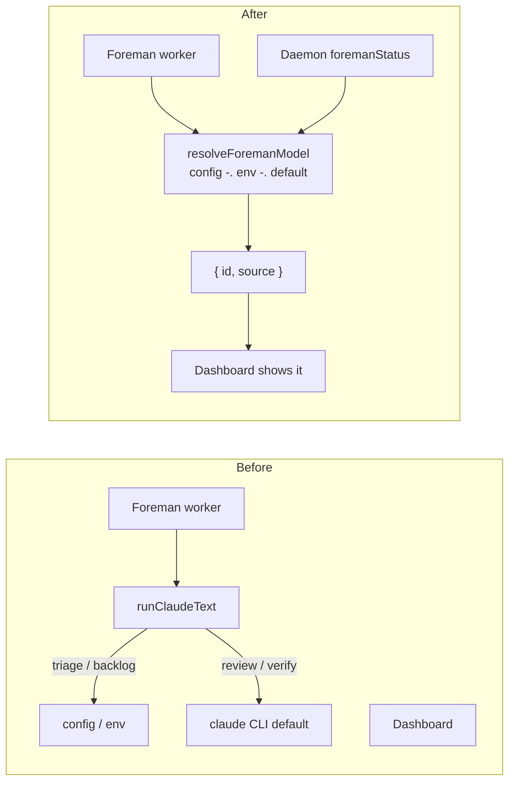

# Foreman models: name what it runs as, and let the operator change it

Give each of Foreman's four `claude -p` calls an explicit, configurable model, and show in
**Settings → Foreman → Models** what each one is actually running as - including when an
environment variable is quietly outranking the box.

> **Decided:** four separate knobs (Review / Verify / Triage / Backlog) rather than one
> shared "Foreman model" (Decision 1); Review and Verify default to **named models**
> rather than continuing to inherit the CLI's default (Decision 2). The current shipped
> defaults live in [`FOREMAN_MODEL_SPECS`](../../../src/shared/foreman-models.ts) and are
> documented in the [README](../../foreman.md#which-model-foreman-runs-as).

## Why

Asked "which model does the Foreman run as?", the codebase had no answer.

1. **Two of the four calls named no model at all.** `reviewSession` (`review.ts:26`) and
   `verifyItem` (`queue-verify.ts:156`) called `runStructured` with no `model` option, and
   `runClaudeText` only passes `--model` when it is given one. Both therefore inherited
   whatever the local `claude` CLI happened to be logged in as - which
   `claude-cli.ts:199` already flags in a comment as *"the most expensive and least
   predictable choice - every cheap caller should name a model."* The reviewer prompt's own
   comments call it "an Opus call", but nothing made that true.
2. **The two knobs that did exist were invisible.** `triageModel` and `backlogModel` were
   config fields with env fallbacks and no UI anywhere - `ForemanSettingsPanel` never
   mentioned them. Setting them meant editing `app_config` or exporting a shell variable.
3. **Every other headless caller in the repo already names its model.** `task-title.ts`,
   `goal/refiner.ts`, and `away/digest.ts` each declare one, with a comment explaining why.
   Foreman - by far the biggest spender - was the exception.

## The four calls

| Role | Default | Config key | Env var | What it does |
|---|---|---|---|---|
| Review | [current default](../../foreman.md#which-model-foreman-runs-as) | `reviewModel` | `FOREMAN_REVIEW_MODEL` | Judges a stuck session's pending question |
| Verify | [current default](../../foreman.md#which-model-foreman-runs-as) | `verifyModel` | `FOREMAN_VERIFY_MODEL` | Reads the diff, decides if a queued item is done |
| Triage | `claude-haiku-4-5` | `triageModel` | `FOREMAN_TRIAGE_MODEL` | The cheap Tier 1 router in front of Review |
| Backlog | `claude-sonnet-5` | `backlogModel` | `FOREMAN_BACKLOG_MODEL` | Orders the backlog by what depends on what |

Four and not one: the cost profiles genuinely differ, and the existing code argues the
split at length. Triage exists precisely to keep a per-prompt bucketing off the reviewer's
model; the backlog planner is a rare prose judgment. Collapsing them into one setting would
have made Triage expensive to make Review configurable. Verify is split from Review despite
sharing a default because it runs once per queued item on a repo diff - it is the one most
worth stepping down when a queue is long, and doing that must not cheapen the reviewer too.

## One ladder, resolved once

`@shared/foreman-models.ts` owns the roles, their specs, and the resolution:

```
config value  →  env var  →  shipped default
```

`||` and not `??` at every rung: these are optional free-text fields, and an empty string
is a human who cleared the box, never a request to spawn the CLI with no `--model`. That
rule was previously stated in a comment on `backlogModel` and enforced only there; it now
holds for all four by construction.

The module is **pure** and takes `env` as a parameter rather than reading `process.env`,
because the web bundle imports it and there is no `process` in the browser.

### Who decides the model

Before, two of the four calls fell through `runClaudeText` with no `--model` and the local
CLI's own default decided - and nothing could report what that was. After, one resolver
answers for both the worker's spawn and the daemon's readout.



In the before graph `UI1` is deliberately unconnected: there was no path from any of it to
the dashboard.

### Why the daemon reports the resolution

The panel cannot resolve this itself. It can see the config, but the **env layer is
invisible to the browser** - so a panel rendering `config || default` would confidently
print `claude-haiku-4-5 (default)` while a `FOREMAN_TRIAGE_MODEL` in the daemon's shell
ran something else. That is the same class of wrong answer this feature exists to remove.

So `foremanStatus` resolves all four server-side and serves them on
`ForemanStatus.models`, each carrying its `source` (`config` / `env` / `default`). The
panel renders the resolved id as the field's placeholder and explains the source underneath.

Caveat, recorded honestly: the daemon resolves from its **own** env, which is the worker's
env in every supported way of running the stack (`make start` puts both under one
`concurrently` shell). Hand-starting the worker with a different environment is the one
case this readout cannot see.

## The panel

Each row is label, free-text input, a one-line blurb about what the call does, and - only
when the value did *not* come from the box - a line naming its source.

- **Placeholder is the resolved id, not the shipped fallback.** An empty box under a set
  env var must not advertise a default that env var is overriding.
- **The source line never repeats the id.** It is already in the input directly above;
  printing it twice within 60px reads as two facts when it is one. The line answers the one
  question an empty greyed box genuinely cannot: *default, or env var?*
- **Free text, no picker.** Common ids are named in prose. A native `<datalist>` is browser
  chrome this theme cannot touch (which is why `RepoCombobox` exists), and a combobox is a
  lot of widget for three suggestions. Any id the CLI accepts must keep working.

### Draft handling

`useForeman` re-polls every 4s, so a field bound straight to config would drop a character
whenever a poll landed mid-word. Each row keeps a local draft, re-syncs from config only
while unfocused, and commits on blur or Enter. Escape abandons the edit, matching every
other compose box in the app.

A `dirty` ref gates the commit: blurring a box you only clicked into must not write its
stale draft back. Because a focused field cannot be refreshed by the poll, a value changed
elsewhere would otherwise be silently reverted by a click-in-click-out that typed nothing.

## Surfaces touched

| File | Change |
|---|---|
| `src/shared/foreman-models.ts` | **New.** Roles, specs, `resolveForemanModel(s)`, suggestions. |
| `src/shared/protocol.ts` | `reviewModel` + `verifyModel` on `ForemanConfigSchema`. |
| `src/shared/types.ts` | `ForemanStatus.models`. |
| `src/server/foreman/config.ts` | `foremanStatus` resolves from `process.env`. |
| `src/server/foreman/review.ts` | `reviewSession(input, model)`; `reviewModel(cfg)`. |
| `src/server/foreman/queue-verify.ts` | `verifyItem(input, model)`; `verifyModel(cfg)`. |
| `src/server/foreman/triage.ts` | `triageModel` delegates; `DEFAULT_TRIAGE_MODEL` re-exports the spec. |
| `src/server/foreman/backlog-plan.ts` | Same, for backlog. |
| `src/server/foreman/worker.ts` | Threads `cfg` into `fullReview`; passes models at all three call sites. |
| `src/web/components/ForemanSettingsPanel.tsx` | The Models group + `ModelField` + `modelSourceNote`. |
| `src/web/styles.css` | `.foreman-models*` / `.foreman-model-*` in the Foreman settings section. |
| `README.md` | "Which model Foreman runs as" + two env-var rows. |
| `test/foreman-models.test.ts` | **New.** The ladder, the no-second-default rule, the panel copy. |

`model` is a **required** parameter on `reviewSession` and `verifyItem`, not optional with
a default. Optional is how they acquired the CLI-inherited default in the first place;
making it required is what stops a future call site quietly re-acquiring it.

## Behaviour change

Review and Verify now pin to named models instead of following the CLI. The current values
are owned by [`FOREMAN_MODEL_SPECS`](../../../src/shared/foreman-models.ts) and documented
in the [README](../../foreman.md#which-model-foreman-runs-as). The two calls therefore
stop drifting with an unrelated CLI setting, and the fields are there to override them.

## Verified

Against an isolated daemon + Vite from this worktree (`MISSION_HOME` / `MISSION_PORT`),
not the `:5173` main checkout:

- `/api/foreman/status` reports all four roles with sources.
- Writing `reviewModel` → `source: "config"`; clearing it to `""` → falls back to
  `default`, never an empty `--model`.
- Restarting with `FOREMAN_TRIAGE_MODEL` set → that row reports `source: "env"` and the
  panel names the variable.
- Typing into Review and blurring persists, and the value survives a poll cycle.
