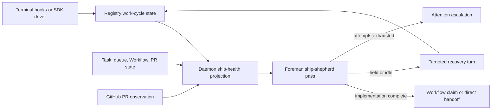

# Foreman ship shepherd

Status: approved on 2026-08-21

## Goal

Keep task-owned `ship` sessions moving from implementation through the first task-owned pull
request without relying on a human to notice that an idle session has stopped progressing.

Foreman should distinguish a healthy pause from a stranded handoff, explain what it believes is
missing, and re-engage the session with one bounded next action. It must never interrupt active
work, race a Workflow, create duplicate pull requests, or turn an uninvited personal session into
managed work.

## Problem

The current lifecycle has two independent protections that combine into a deadlock:

1. Every dispatched `ship` task receives a completion handoff that tells the implementation agent
   to stop before commit, push, pull request, and CI. Mission Control owns those later steps.
2. Prompted completion asks a generic verifier whether the full durable objective is complete. The
   durable objective can still say "open a reviewable pull request." A non-complete verdict becomes
   a hold, and the hold consumes the completed work-cycle generation without sending feedback.

The Phase 3 incident demonstrated the result. No-Mistakes Review was correctly bound, Foreman ran
its verifier, generation 2 was consumed, no Workflow run was created, and every later tick skipped
the generation as already handled.

A periodic generic "continue working" message would not fix that state. It would create a later
work cycle that could be rejected for the same missing pull request. The feature needs both a
correct completion boundary and a durable recovery loop.

## Existing capabilities to reuse

- `session_work_cycles` already provides a durable logical key, active bit, completed generation,
  and completion time across terminal and SDK runtimes.
- `detectStall` already defines the useful silence shape: an instrumented session that is idle
  while a task remains open. Its default unfinished-work threshold is 20 minutes.
- Foreman already runs fleet-level passes outside its per-session queue loop. PR follow-through is
  the closest precedent: pure candidate policy, fresh-state recheck, one pane claim per pass, and
  conservative delivery semantics.
- `foreman_queues` already owns prompted-completion projection and consumed-generation state.
- `foreman_episodes` already records what Foreman concluded and what text reached a session.
- Workflow bindings and runs already identify when the Workflow engine owns the session. GitHub
  observation already identifies task-owned open pull requests.

The implementation should extract or reuse these predicates. It must not add another raw hook
interpreter, session-eviction path, PR poller, or database-writing Foreman process.

## Proposed behavior

### 1. Define the task completion boundary explicitly

Add a trusted `TaskCompletionContract` projection for dispatched task sessions. For `ship`, the
initial implementation boundary is:

- requested implementation and repository documentation are complete;
- required focused tests and evidence registration are complete;
- commit, push, pull-request creation, PR review, and CI follow-through are deferred to the
  post-completion owner.

Pass that contract to the prompted verifier as trusted policy beside the durable objective. Do not
rewrite the objective and do not rely on transcript evidence to teach the verifier about the
handoff. The same contract applies whether the next owner is a Workflow or Straight-to-PR. The
binding decides what happens after completion, not what implementation-complete means.

This directly closes the observed false hold: an objective that says "open a PR" is complete at
the initial handoff when the implementation and verification are done, because the PR clause is
explicitly deferred.

### 2. Persist the reason a prompted completion stopped

Extend the daemon-owned prompted projection with the latest decision for the current generation:

- generation and logical key;
- outcome: `held`, `workflow_claimed`, `asked`, `direct_handoff`, `retired`, or `empty`;
- verifier summary and bounded gaps for a hold;
- decision time;
- recovery marker, attempt count, and next eligible time.

Store and validate the verifier record in the same consume operation that retires the generation.
The Foreman worker remains HTTP-only. Missing or malformed state fails closed.

The current projection and the `foreman_episodes` audit ledger serve different purposes. The queue
row answers what recovery may do now; the episode says what Foreman did historically.

### 3. Add a fleet-level pre-PR shepherd pass

Run a new `runShipShepherd` pass beside backlog autopilot and PR follow-through. Its pure decision
core receives a fresh session, full queue projection, task summary, Workflow runs, completion
decision, and current time.

A session is eligible only when all of these are true:

- Foreman is enabled, invited, Live, and the repository is allowlisted;
- the linked task is kind `ship` and status `running` or `dispatching`;
- the session is live, hook-instrumented, settled idle, and has a reachable delivery channel;
- the silence exceeds the chosen pre-PR threshold;
- no task-owned open pull request exists in the primary or attached repository summaries;
- no queue item, pending turn, input review, human escalation, or active work cycle owns the pane;
- no non-terminal Workflow run currently owns the session;
- the recovery marker is due and has not exhausted its attempt budget.

Re-read all action gates immediately before claiming a recovery attempt and again before typing.
The daemon claims the attempt before injection with a compare-and-set on task id, logical key,
work-cycle generation, and expected recovery marker. A confirmed non-delivery may release the
claim; an unknown delivery result remains claimed so a lost response cannot double-send.

### 4. Send a state-specific next action

The shepherd does not use one generic prompt for every stall.

| Observed state | Action |
|---|---|
| Latest completion was held with blocking gaps | Send the bounded verifier gaps back as the next implementation turn. A later completed generation re-arms ordinary completion. |
| Idle implementation has a non-empty diff but no completion decision | Use one tool-less recovery review to choose between a bounded implementation continuation and human escalation. The model may draft the next step but may not authorize push, merge, deletion, or a new task. |
| Idle implementation has no diff | Tell the session to re-read the durable objective and begin or resume implementation. |
| Direct-shipping handoff was recorded, but no PR appeared | Re-send an idempotent shipping continuation that first checks for an existing PR and stays on the same branch. |
| A completion claim is unconsumed or capture is retryable | Do not type. Existing Foreman or Workflow retry machinery owns it. |
| A Workflow run is active or parked | Do not type. Workflow resumption, parked-run alerts, and PR follow-through own those states. |
| The session is waiting on a human decision | Escalate or preserve the existing ask. Never answer it as a stall recovery. |

The recovery reviewer is not the completion verifier. It answers only "what is the safest next
turn for this already-eligible managed ship session?" Structural states bypass it for zero-token
recovery.

### 5. Bound repetition and make failure visible

Each attempt is keyed by task id, logical session key, work-cycle generation, recovery reason, and
attempt number. New activity cancels the current quiet period. A later completed generation resets
the reason-specific attempt sequence.

After the selected attempt budget is exhausted, Foreman stops typing and records an escalated
episode with the last verifier summary, last delivered recovery, idle age, and direct link to the
session. This becomes an attention item rather than an invisible permanent hold.

Every recovery writes a `foreman_episodes` row with a stable marker, situation, purpose, reason,
attempt number, drafted text, and delivery outcome. The session drawer and Settings ledger can
therefore answer why Foreman intervened and whether anything reached the agent.

## Data and request flow

The daemon remains the only SQLite writer. Foreman reads state and requests guarded mutations over
loopback HTTP. GitHub state continues to come from the existing poller.

## Configuration and UI

Add two Foreman settings:

- `keepShipTasksMoving`: master permission for pre-PR recovery;
- `shipRecoveryMinutes`: silence before the first recovery attempt.

The retry budget and backoff shape should be a fixed safety policy unless operations show a real
need for more knobs.

Place the master toggle in the Foreman popover near completion and pull-request follow-through:
"Keep pre-PR ship tasks moving." Put the numeric threshold and explanatory copy in Settings >
Foreman. The copy must say that Foreman acts only for invited `ship` tasks in Live, trusted
repositories, and stops once a task-owned PR exists.

Show the last recovery state on the session's Foreman drawer and in the existing fleet ledger. Do
not add a second recovery dashboard.

## Persistence and compatibility

- Add columns through both the fresh schema and migration path beside existing prompted queue
  upgrades.
- Retain append-only persisted ids and accept old rows with no recovery state.
- Existing consumed generations remain consumed. They become recovery candidates only after the
  configured silence and only if every current-state gate still passes.
- A daemon restart restores the current recovery marker and next-at time. A Foreman restart must
  not resend a claimed or uncertain attempt.
- A context clear or driver rebind rotates the logical key and cannot carry recovery state into the
  new conversation.
- Archiving, completing, cancelling, or removing the task makes every prior recovery claim inert.

## Safety invariants

- Never type into an uninvited session.
- Never type outside Live mode or the repository allowlist.
- Never interrupt a working, starting, awaiting-input, or human-owned session.
- Never act while a Workflow or queue item owns the pane.
- Never infer PR absence from one scalar in a multi-repository task. Check the task-owned PR set.
- Never create a second PR poller or shell out to GitHub from Foreman.
- Never retry an injection whose delivery outcome is unknown.
- Never let a recovery model authorize commit, push, merge, destructive cleanup, or cross-repo
  work. Those actions remain in existing guarded continuations.
- At most one Foreman-originated instruction reaches a session per worker pass.

## Verification strategy

### Pure policy tests

Add a table-driven `foreman-ship-shepherd.test.ts` covering every eligibility gate, reason
precedence, threshold boundary, multi-repository PR presence, active Workflow ownership, attempt
budget, and action mapping.

### Persistence and route tests

Cover fresh schema and migration, malformed JSON fail-closed behavior, compare-and-set recovery
claims, restart restoration, context-key rotation, task terminalization, confirmed non-delivery,
and uncertain delivery.

### Worker integration tests

Use the fake runner and fake daemon to prove:

- the regression objective may require a PR while the ship completion contract defers it;
  implementation-complete produces exactly one Workflow claim;
- a held verifier record survives restart and produces one targeted recovery after the threshold;
- session activity during recovery invalidates the action;
- a later completed work cycle resets recovery and re-enters ordinary verification;
- a direct handoff with no observed PR is retried idempotently;
- active Workflow, open PR, pending human ask, queue ownership, and exhausted budget all suppress
  delivery;
- one pass never sends both ship recovery and PR follow-through.

### UI and end-to-end coverage

Because this adds visible Foreman controls and status, extend an existing Foreman configuration E2E
spec rather than creating a parallel settings-only spec. Drive a fake ship session through idle,
recovery, work pickup, and open-PR suppression. Select controls by role and label, never by test id.

Run focused tests, the full unit suite, typecheck, lint, build, smoke, and Playwright. The worker,
protocol, persistence, and UI all change, so diff-only verification is insufficient.

## Documentation

Update:

- `docs/foreman.md` for authority, settings, recovery states, and ledger entries;
- `docs/work-queues.md` for the boundary between completion, pre-PR shepherding, Workflow
  ownership, and PR follow-through;
- `docs/attention-and-alerts.md` for exhausted recovery escalation;
- `docs/agent-guides/architecture.md` for the completion contract and durable recovery projection;
- `docs/agent-guides/change-contracts.md` for one-instruction-per-pass and recovery idempotency.

## Non-goals

- General supervision of `scout`, `plan`, `pipeline`, or `chat` sessions.
- Acting on hand-started personal sessions with no task-owned Foreman invite.
- Replacing Workflow resumption, parked-run alerts, PR review follow-through, or backlog autopilot.
- Automatically merging pull requests.
- Proving which attached repositories need a PR after the first task-owned PR exists. Existing
  Workflow and multi-repository completion policy continue to own that question.
- Replacing normalized work-cycle state with transcript polling.

## Approved decisions

### Initial scope

Cover every invited, task-owned `ship` session before its first task-owned PR, regardless of whether
completion routes to a Workflow or Straight-to-PR. Other task kinds remain outside v1.

### Recovery reasoning

Use structural action where state is explicit, with one tool-less model call only for an idle
implementation whose next step cannot be derived.

### Timing

Use a dedicated 20-minute Foreman threshold, independent from Away-mode alert settings.

### Retry and escalation

Use three attempts with increasing 20, 40, and 80 minute delays, then create a human escalation.

### Implementation follow-up

Create a merge-aware phased implementation plan and dependency-linked Mission Control tasks.

These selections were submitted through Mission Control review
`2535938c-6519-4bfc-9051-3080328e1f7e`.
