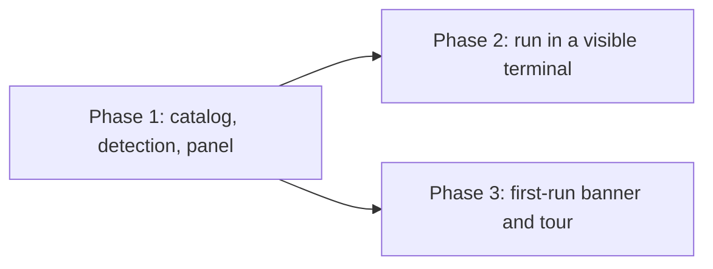

# Guided setup - phased implementation

Source plan: [`plan.md`](plan.md) (rendered: `plan.html`). That file is the approved goal; this
one is how the work is split, and each `phase-*.md` beside it is one merge unit's route.

## Incorporated decisions

Submitted in plan review `df3523c8`, already written into `plan.md`, and treated here as
requirements rather than open questions:

| Decision | Adopted | Consequence for the split |
| --- | --- | --- |
| Registry shape | A new setup catalog that **reads** the existing environment checks | Phase 1 owns `src/shared/setup-catalog.ts` and `src/server/setup/`. `ENVIRONMENT_CHECK_IDS` is not renamed or extended by any phase. |
| Remedy depth | Links, copyable commands, and run-in-a-visible-terminal | Phase 1 renders every remedy as link/copy; Phase 2 adds the execution path. The remedy union is defined once, in Phase 1. |
| Guided surface | Settings panel, first-run banner, one tour | Phase 1 ships the panel; Phase 3 ships the banner and the tour. No first-run wizard in any phase. |
| v1 families | Terminals, GitHub CLI and its auth, agent CLIs, Claude Code plugins and skills, ai-conductor | Phase 1 ships all five. The git/Node baseline is out; `SETUP_DEPENDENCY_IDS` stays appendable for it. |

## Repository findings

Investigated against this checkout before the boundaries were drawn. Two of these changed the
design; all of them belong to a phase.

1. **Every probe the catalog needs already exists**, and each is the function the refusing path
   itself calls: `agentBinPresent` (`src/server/dispatcher.ts:2243`), `binPresent` +
   `TMUX_BIN` / `CMUX_BIN` / `WEZTERM_BIN` / `GHOSTTY_BIN` (`src/server/terminal/bin.ts`),
   `terminalTargetViews` (`src/server/terminal/targets.ts`), `resolveBinPath` and `onPath`
   (`src/server/util/exec.ts`), `ghBin()` (`src/server/config.ts:236`), `installedPlugins()`
   (`src/server/plugins/installed-plugins.ts`), and `PIPELINE_PROVIDERS.conductor`'s
   `binForPresence()` / `probe()`. Phase 1 writes no new detection mechanism.

2. **Detection must resolve through the env-override chain, not by probing a bare name.**
   `resolveBinSpec` reads `MISSION_` then `FLEET_` then `HARNESS_`; `resolveBin` reads a
   backend's own `spec.env`; `ghBin()` reads `MISSION_GH_BIN`; the conductor provider reads its
   own override. A probe that asked `onPath("gh")` directly would report the operator's real
   machine while dispatch used the override - and would make the e2e spec in finding 4
   impossible. **This is a hard contract on Phase 1.**

3. **The install path already exists and is the model to copy, not to invent.**
   `POST /api/pipelines/install` (`src/server/routes.ts:5627`) takes provider + checkout +
   backend from the browser, resolves argv through the provider, wraps it in a hold-open shell
   that prints the exit code and waits for a keypress, and hands it to `terminalLauncher`.
   `GET /api/terminal-targets` (`routes.ts:2791`) already answers which backends can open a
   window, pair-aware. Phase 2 reuses both; ai-conductor's remedy delegates to
   `pipelineInstallerLaunch` rather than getting a second installer.

4. **The e2e harness can already arrange installed-versus-missing for four of the five
   families.** `e2e/fixtures/daemon.ts:285-325` redirects `MISSION_CLAUDE_BIN`,
   `MISSION_CODEX_BIN`, `MISSION_PI_BIN`, `CMUX_BIN`, `MISSION_GH_BIN`, and
   `MISSION_CONDUCTOR_BIN` - and it already has a `startsMissing` mode that points the
   conductor override at a not-yet-installed path, which is exactly the missing-row case.
   `dispatch-environment-warning.spec.ts` is the precedent for driving a check through an
   isolated `HOME`.

   **But `WEZTERM_BIN` and `GHOSTTY_BIN` are not overridden**, so those two rows would read
   "installed" on a developer's laptop and "missing" on CI. Phase 1 adds both overrides to the
   e2e daemon fixture, pointed at a nonexistent path, so the suite is deterministic. A spec that
   asserted on an un-overridden backend's status would be flaky by construction.

5. **The tour is a bigger artifact than it looks, and part of it is generated.**
   `src/web/tour/content.generated.ts` carries the banner "GENERATED FILE - do not edit by
   hand", is written by `scripts/tour-content.ts` from `tours/*.md`, and is regenerated with
   `npm run tours`. A tour also needs a `TourId` union member (`tour/contracts.ts:10`), a stage
   file (`tour/tours/*.ts`, 335 and 415 lines for the two shipped tours), a `TourEntry`
   (`tour/entries.ts`), a `TOUR_TARGET_NAMESPACES` block (`tour/target-registry.ts`), and target
   refs registered by the components it spotlights. This is most of why the banner and tour are
   their own phase rather than a tail on the panel.

6. **The settings surfaces a new category has to satisfy are already pinned by tests.**
   `SETTINGS_CATEGORIES` (`src/web/lib/settings-registry.ts`) is read by the router, the page,
   the search index (`lib/settings-search.ts`), the dots (`lib/settings-dots.ts`), and
   `settings-sidebar-render.test.ts`, which fails on a duplicate `data-anchor` or an anchor whose
   prefix is not a category. Phase 1 owns the category entry and its anchors.

7. **`SettingsStatus` is not the channel for this.** It is a fixed struct of the daemon's own
   config, emitted on config writes and folded into `registry.snapshot()`. Setup detection is a
   per-request read of somebody else's install, and `settings-dots.ts` derives every dot from
   `SettingsStatus`. So the Setup category ships **without** a rail dot in v1; the first-run
   banner in Phase 3 is the attention surface instead. Adding a dot later would mean putting a
   machine probe on the snapshot path, which is a separate decision.

## Sizing

Gross non-test implementation lines expected to be added or materially changed, excluding
tests and excluding the generated tour content:

| Phase | Estimate | Assumptions |
| --- | --- | --- |
| 1 | 750 - 950 | Shared catalog ~180 (13 entries with prose), `src/server/setup/` ~330 (probes plus the dep bag and the throw containment), route + protocol + api client ~70, `SetupPanel.tsx` ~300 in the shape of `SkillsPanel` (210) rather than `ConductorPanel` (1079), registry/renderCategory ~20, e2e fixture overrides ~15. |
| 2 | 250 - 350 | Install route ~90, argv guard ~50, catalog argv data ~40, panel remedy controls and backend picker ~120. |
| 3 | 400 - 550 | Banner ~120 in `UpdateBanner`'s shape (114), config entry + route wiring ~60, tour stage file ~300, entry + namespace + target refs ~60, authored `tours/setup.md` prose. |
| **Total** | **1400 - 1850** | |

**Why three phases.** The estimate is far above the 200-line one-phase threshold, so the
question is only where the boundaries fall. Each additional boundary is justified against
combining it with its neighbour:

- **Phase 1 alone is already a complete, useful feature**: an operator sees every dependency,
  its status, what it unlocks, and a link or copyable command for each. Nothing in it is a dead
  surface awaiting a later phase.
- **Phase 2 must not be folded into Phase 1.** It is the only phase that makes Mission Control
  execute anything on the operator's machine, and it is the one place a mistake is a remote code
  execution rather than a wrong label. Merged into a ~900-line panel-and-catalog diff, the argv
  ownership rule and its guard test would be reviewed as a detail of a UI change. On its own it
  is a ~300-line diff whose entire subject is that boundary. Splitting it also keeps Phase 1
  landable if the execution path needs another round of review.
- **Phase 3 must not be folded into either.** It is ~500 lines of onboarding surface with a
  generated artifact and a five-file tour registration in it, sharing nothing with the install
  path but the panel it points at. Combined with Phase 2 it would be one task mixing a
  security-critical route with tour copy, which is the least reviewable pairing available here.

Nothing is a preparation, test-only, or docs-only phase: each phase carries its own tests,
its own docs updates, and its own e2e spec.

## Phases

| # | Phase | File | Direct prerequisites | Delivers |
| --- | --- | --- | --- | --- |
| 1 | Setup catalog, detection, and the Setup panel | [`phase-1-setup-catalog-and-panel.md`](phase-1-setup-catalog-and-panel.md) | none | The catalog, every probe, `GET /api/setup/checks`, the `setup` Settings category rendering all five families with link and copy remedies. |
| 2 | Run a remedy in a visible terminal | [`phase-2-terminal-install-remedies.md`](phase-2-terminal-install-remedies.md) | Phase 1 | `POST /api/setup/install`, the daemon-owned argv guard, the backend picker, ai-conductor delegating to the existing installer. |
| 3 | First-run banner and the guided tour | [`phase-3-first-run-banner-and-tour.md`](phase-3-first-run-banner-and-tour.md) | Phase 1 | The dismissible banner with its durable flag, and the `setup` tour in the Settings rail and command palette. |

### Dependency graph

```
Phase 1 ──┬── Phase 2
          └── Phase 3
```



**Concurrency.** Phases 2 and 3 may run and merge in either order. Neither reads a file, route,
schema, or decision the other introduces: Phase 2 adds one route and fills a remedy slot Phase 1
defined; Phase 3 adds an App-level banner, a config entry, and tour registration, and attaches
target refs to section elements Phase 1 defined. Their one shared file is `SetupPanel.tsx`, and
the seam is stated in both phase files - Phase 1 ships the panel with a per-row remedy action
slot and per-family section elements carrying stable ids, so Phase 2 edits inside the row action
and Phase 3 attaches refs to the section wrappers. Those are disjoint regions; whichever merges
second rebases without a semantic conflict.

**Merge order.** Phase 1, then Phase 2 and Phase 3 in any order.

## Cross-phase contracts

Owned by Phase 1, relied on by the others, and not to be changed by them:

1. `SETUP_DEPENDENCY_IDS` is append-only, and ids are the natural key. Phase 2 and Phase 3 may
   read an id; neither renames, reorders, or removes one.
2. The **full** `SetupRemedy` union - `link`, `command`, `provider-installer`, `skill` - is
   defined in Phase 1, including the `command` variant's argv, even though Phase 1 only renders
   it as copyable text. Phase 2 therefore adds a route and a control, and changes no shared
   contract.
3. `SetupStatus` has exactly four states (`satisfied`, `missing`, `needs-setup`, `unknown`).
   A phase that needs a fifth states the case in its audit record rather than overloading
   `unknown`.
4. Every probe resolves its binary through the same override chain the launcher uses
   (finding 2). No phase adds a bare-name probe.
5. `GET /api/setup/checks` computes per request and caches nothing durable. No phase puts setup
   detection on a poll tick, in `SettingsStatus`, or in the registry snapshot (finding 7).
6. Panel structure: one section per family with a stable element id, one row per dependency
   carrying `data-anchor="setup/<slug>"`, an accessible name, and a remedy action slot.
7. The daemon never installs anything in-process. Phase 2 is the only phase that may cause
   execution, and only by handing vetted argv to a visible terminal.

## Final verification

After Phase 3 merges:

- `npm run typecheck`, `npm run lint`, `npm test` clean.
- `npm run build` and `npm run smoke`, since routes and browser surfaces changed.
- `npm run test:e2e` with the three specs the phases add, plus `dispatch-environment-warning`
  still green - the environment check keeps its own registry and dispatch-form note.
- A manual pass on a real machine: open Settings → Setup, confirm the statuses match what the
  machine actually has, follow one `link`, copy one `command`, and run one remedy in a terminal.
- Docs read back correctly: `docs/setup.md`, `docs/ui.md`, `docs/skills-and-settings.md`,
  `docs/harnesses-and-terminals.md`.
