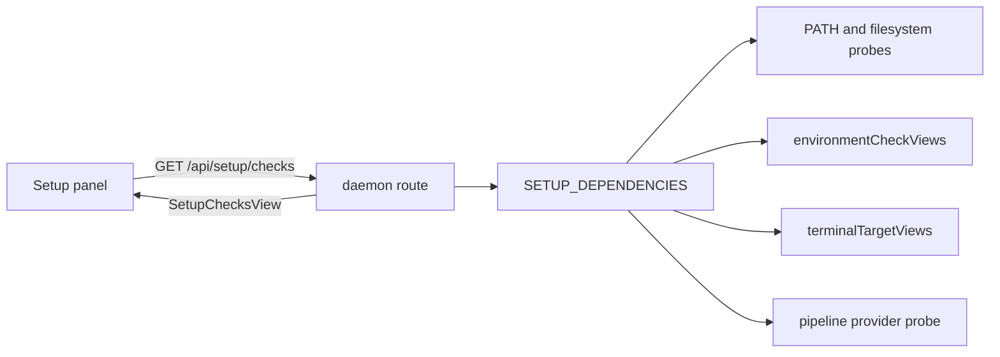
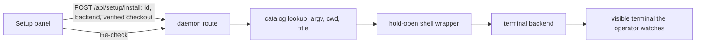

# Guided setup: detect every external dependency, then help install it

## The problem

Mission Control is a control plane for tooling it does not ship. A working install
depends on a terminal emulator, a multiplexer, one or more agent CLIs, `gh`, `git`,
Claude Code plugins and skills, and - for pipelines - ai-conductor. Today each of those
facts is discovered somewhere different, and almost always at the moment it fails:

- A terminal backend that is not installed is silently skipped by `enumerateTerminals`
  (`src/server/terminal/enumerate.ts`), so its sessions simply never appear.
- A missing agent binary is refused at dispatch by `agentBinPresent`
  (`src/server/dispatcher.ts:2243`), or per ensemble member at roster creation.
- `gh` is resolved per call by `ghBin()` (`src/server/config.ts:236`) and fails at the
  first push or PR.
- ai-conductor presence is a single boolean folded into `SettingsStatus.pipelines.present`
  (`pipelinesPresent`, `src/server/pipelines/index.ts:174`).
- The only surface that proactively tells an operator to go fix their machine is the
  dispatch form's environment checks, and that registry holds exactly one entry
  (`ENVIRONMENT_CHECK_IDS = ["upstartclaw-core-setup"]`).

Nowhere answers the question a new operator actually has: **what does this machine have,
what is it missing, what does each missing thing cost me, and how do I get it?**

## What we are building

One catalog of external dependencies, one daemon-side detector per entry, one Settings
surface that renders all of them with a remedy, and a first-run entry point that sends a
new operator there. The catalog is the only place a dependency's name is spelled, which is
the rule the existing registries (`OPEN_TARGET_INFO`, `ENVIRONMENT_CHECK_INFO`,
`TASK_SOURCE_KINDS`, `PIPELINE_PROVIDERS`) already hold to.

### Decisions taken

Submitted in the plan review, and now the plan's premises rather than open questions:

| Decision | Adopted |
| --- | --- |
| Where the catalog lives | A new setup catalog that **reads** the existing environment checks. `src/shared/setup-catalog.ts` plus `src/server/setup/`; `ENVIRONMENT_CHECK_IDS` is neither renamed nor extended, and no detection is copied. |
| How far a remedy goes | Links, copyable commands, and run-in-a-visible-terminal. The daemon owns argv; the browser sends an id, plus a server-verified checkout selection for a provider installer. No daemon-side package-manager install. |
| The guided surface | Settings panel, first-run banner, and one tour. No separate first-run wizard, and not dispatch-form warnings alone. |
| v1 families | Terminals and multiplexers, GitHub CLI presence and authentication, agent CLIs, Claude Code plugins and skills, ai-conductor. **The git and Node baseline is out of v1.** |

The baseline being out is a scope decision with one consequence worth stating: a checkout that
got far enough to run this dashboard already has `git` and a Node new enough to start the
daemon, so those rows would be satisfied on every machine that can see them. The ids stay
appendable - the tuple is append-only, so adding `git` and `node` later costs an append and
two probes, and nothing in this design has to move to accommodate them.

### Non-goals

- **The daemon never installs anything itself.** No package manager invoked in-process, no
  `curl | sh`, no privilege escalation, no network fetch of an install script. Every remedy
  is a link the operator opens, a command they copy, or a command that runs in a *visible*
  terminal they watch - which is exactly the shape `/api/pipelines/install` already has.
- **Not a health monitor.** Nothing here polls on a tick. Detection is computed per request,
  for `environmentCheckViews`' stated reason: an operator who installs something must see the
  answer change without restarting the daemon, and a boot snapshot is a claim about a machine
  that has since changed.
- **Not a second source of truth for capability.** The dispatch form keeps refusing a missing
  agent binary, `enumerateTerminals` keeps skipping absent backends. Guided setup explains
  those facts; it does not gate on them.

## The catalog

`src/shared/setup-catalog.ts` holds the pure half - what a dependency IS, readable in the
browser, no `node:` imports. `src/server/setup/` holds the impure half - one probe per
entry, plus the dependency bag that makes it testable against an arranged home rather than
the developer's own.

This is the `EnvironmentCheckInfo` / `EnvironmentCheckImpl` split, reused verbatim:

```ts
// src/shared/setup-catalog.ts - append-only, ids are the natural key
export const SETUP_DEPENDENCY_IDS = [
  "claude-cli", "codex-cli", "pi-cli",
  "tmux", "cmux", "wezterm", "ghostty",
  "gh-cli", "gh-auth", "claude-plugins", "claude-skills", "ai-conductor",
] as const;

export interface SetupDependencyInfo {
  id: SetupDependencyId;
  label: string;                    // "GitHub CLI"
  family: SetupFamilyId;            // grouping in the panel
  requirement: "required" | "recommended" | "optional";
  /** What Mission Control cannot do without it. One sentence, in the product's terms. */
  enables: string;
  /** How an operator gets it. Rendered as the row's control; see Remedies. */
  remedy: SetupRemedy;
}
```

Families, in panel order: **Agent CLIs** (claude, codex, pi), **Terminals** (emulators and
multiplexers, reported as a pair - see below), **GitHub** (`gh` presence, `gh`
authentication), **Claude Code extensions** (installed plugins and the skills Mission Control
reconciles), **Pipelines** (ai-conductor).

`requirement` is what keeps the page honest about scale. Every agent CLI missing means
nothing can be dispatched at all; Ghostty missing is a preference. A page that draws a dozen
equally red rows has told the operator nothing.

### Status is four answers, not two

```ts
export type SetupStatus =
  | { state: "satisfied"; evidence: string }        // "/opt/homebrew/bin/gh"
  | { state: "missing" }
  // installed, not usable yet. `why` is the sentence; `evidence` is where to look.
  | { state: "needs-setup"; why: string; evidence: string | null }
  | { state: "unknown"; why: string; evidence: string | null };   // we could not look
```

`needs-setup` and `unknown` are the two a boolean cannot express, and both already exist in
this codebase's reasoning. `gh` on PATH but unauthenticated is `needs-setup`; so is the
UpstartClaw plugin installed with its setup state file absent, which
`src/server/environment/upstartclaw.ts` already distinguishes at length. `unknown` is
`FileRead`'s "there is a file I could not read" case: collapsing it into `missing` either
silences a real problem or warns every operator on earth.

**Two fields, because a problem row answers two questions.** `why` is the sentence a person
reads; `evidence` is where they look if they disagree with it - the file that was read and what
it said, the resolved path, the command whose output was parsed. `satisfied` carries only
`evidence` (there is no complaint to make) and `missing` carries neither (nothing was found, so
there is nothing to cite).

This is the split `EnvironmentCheckView` already makes - `warning` plus `detail`, where that
`detail` exists so "an operator who disagrees with the note knows where to look rather than
having to guess which of their files the daemon means". A folded check therefore maps
`warning -> why` and `detail -> evidence` with nothing discarded, which is what makes the
folding lossless rather than a summary. A status shape that carried only `why` would have thrown
that evidence away at the boundary and left the page unable to say which file it read.

### Detection reuses the probes that already exist

No new mechanism. Each catalog entry points at the function the daemon already trusts:

| Family | Probe | Source |
| --- | --- | --- |
| Agent CLIs | `agentBinPresent(agent)` | `src/server/dispatcher.ts` |
| Terminals | `binPresent(spec)` over `TMUX_BIN`, `CMUX_BIN`, `WEZTERM_BIN`, `GHOSTTY_BIN` | `src/server/terminal/bin.ts` |
| Terminals, usable | `terminalTargetViews(...)` | `src/server/terminal/targets.ts` |
| `gh` presence | `resolveBinPath(ghBin())` | `src/server/util/exec.ts`, `src/server/config.ts` |
| `gh` auth | `gh auth status`, output-parsed, never exit-code alone | new, in `src/server/setup/` |
| Claude Code plugins | `installedPlugins()` | `src/server/plugins/installed-plugins.ts` |
| Skills | the existing skills reconcile / drift read | `src/server/skills/reconcile.ts` |
| ai-conductor | `binForPresence()` then `probe()` | `src/server/pipelines/conductor/` |

Two probe rules the existing code already states, and this catalog inherits:

- **Presence is answered from the filesystem where it can be.** `onPath` walks `PATH` with
  `existsSync` and costs microseconds; a doomed `fork` + `execve` costs milliseconds. Use
  `resolveBinPath` (which spawns `which`) only where the very next thing we do is spawn the
  binary, per the note in `src/server/util/exec.ts`.
- **A probe never throws.** `environmentCheckViews` maps a thrown implementation into that
  check's own warning so one bad probe cannot take the page down or fail the route. The setup
  registry does the same, and names itself as the fault rather than the operator's machine.

### The terminal row is about a pair, not a binary

`src/server/terminal/targets.ts` exists because "is tmux available" is not a question about
tmux: a detached tmux session with no emulator to raise it is a button that reports success
and puts nothing on screen. Guided setup must not reintroduce that. The Terminals family
therefore draws per-backend presence rows **plus** one derived row - "Mission Control can
open a terminal window on a checkout" - computed from `terminalTargetViews`, naming the
emulator that would do the raising. Restating that pair logic inside the setup registry is
the one duplication this plan explicitly forbids.

**That derived row carries the family's `required` level**, and the individual backends are each
`optional`: which terminal you use is a preference, having none that can open a window is not.
The derived row is an ordinary member of the same row list as the rest - not a separate view
type - so anything asking "what is required and not satisfied on this machine" gets a complete
answer from one list, which is what keeps the first-run banner from missing the very operator it
exists for.

That works because **`requirement` is declared per source and projected onto the row**: a
dependency declares its own level, the environment metadata declares one per check, the derived
row declares its own, and the view composer copies whichever applies onto the row it builds.
Consumers read `row.requirement` and nothing else. So the family being `required` through a
derived row while its members stay `optional` is not an override or a precedence rule - they are
simply different rows, each with one declared level.

### The existing environment checks are folded in, not forked

`ENVIRONMENT_CHECK_IDS` is append-only and its entries answer a narrower question: would a
dispatch launched right now stall on somebody else's unfinished setup. That check keeps its
registry, its route, and its place in the dispatch form. The setup view *reads*
`environmentCheckViews()` and renders each non-null warning as a `needs-setup` row in the
family it belongs to. One detector, two surfaces; no id renamed, no detection copied.

**A folded row needs metadata the check does not carry**, and inventing it at the render site is
how a panel grows per-id branching. An `EnvironmentCheckView` has a label, a warning, and a
detail; it has no family, no requirement, and no remedy. So the catalog owns that mapping,
exactly as it owns a dependency's:

```ts
/** What a folded environment warning is, beyond what the check itself says. */
export const ENVIRONMENT_ROW_METADATA: Record<
  EnvironmentCheckId,
  { family: SetupFamilyId; requirement: SetupRequirement; remedy: SetupRemedy }
> = {
  "upstartclaw-core-setup": {
    family: "extensions",
    requirement: "optional",
    remedy: { kind: "skill", command: "/upstartclaw-core:setup" },
  },
};
```

`Record<EnvironmentCheckId, ...>` is again the enforcement: a check appended to that tuple does
not compile until it has said where its row belongs and what fixes it. The row's identity is
discriminated rather than pooled into one id space, so nothing can mistake a check for a
dependency:

```ts
export type SetupDerivedRowId = "terminal-pair";

export type SetupRowId =
  | { source: "dependency"; id: SetupDependencyId }
  | { source: "environment-check"; id: EnvironmentCheckId }
  | { source: "derived"; id: SetupDerivedRowId };
```

**Three sources, one row shape.** The third exists because the terminal pair row is not a
dependency - no binary is called `terminal-pair` - and yet it is the `required` row in the
Terminals family while each backend stays `optional`. Giving it a view type of its own instead
would put a `required` row outside the list every consumer iterates, which is exactly how the
first-run banner comes to miss the operator it exists for.

Every row - dependency, folded check, derived - lives in one `SetupChecksView.rows` list, so the
panel renders a list and never branches on an id, and "what is required and not satisfied here"
is answerable in one pass. Two properties of the folded row are deliberate and easy to get
wrong:

- **It exists only while the warning does.** A null warning is silence, and silence covers both
  "installed and set up" and "never heard of this tooling" - which the environment check
  deliberately refuses to distinguish. So the row is absent rather than `satisfied`; it is the one
  row in the panel that can vanish entirely.
- **Its status is always `needs-setup`**, carrying the check's own warning as `why` and its
  `detail` as the evidence. A check that fired has, by construction, found something installed
  and unfinished.

## Remedies

Three kinds plus a printed one, and the boundary between them is the security spine of this
feature.

```ts
export type SetupRemedy =
  | { kind: "link"; url: string; label: string }
  | { kind: "command"; argv: readonly string[]; note: string }
  | { kind: "provider-installer"; provider: PipelineProviderId }
  | { kind: "skill"; command: string };     // "/upstartclaw-core:setup"
```

- **`link`** opens documentation or a download page through the existing browser open target
  (`src/server/open-targets/browser.ts`). Always available, always the fallback.
- **`command`** is shown as copyable text, with an optional "Run in a terminal" button. The
  button posts an entry **id** and a chosen terminal backend - never argv. The daemon looks
  the argv up in its own catalog and wraps it in the same hold-open shell the pipelines
  installer route already uses, so the operator watches the install and reads its exit code
  rather than trusting a spinner:

  ```sh
  <argv>
  status=$?
  printf '\n[installer exited %s] press enter to close ' "$status"
  read -r _
  ```

  The browser supplies the backend and the id; the daemon owns argv, cwd, and title. That is
  the property `/api/pipelines/install` documents, restated here because it is the whole
  reason this is safe.
- **`provider-installer`** delegates to the flow that already exists:
  `pipelineInstallerCandidates` finds verified local checkouts in the workspace catalog,
  `pipelineInstallerLaunch` reverifies at click time, and the terminal opens the provider's
  own `bin/install`. ai-conductor uses this and gains nothing new.

  This is the one remedy whose request carries a second value: **which** verified checkout to
  install from, because candidates are local checkouts and there is no "the" checkout to assume.
  It does not weaken the rule above. A checkout is a *selection among candidates the server
  enumerated* - the provider re-derives the verified set, refuses anything outside it, and
  cross-checks its own confirmation of the checkout and cwd - so the browser cannot name an
  arbitrary directory, and argv still comes from the provider. The panel offers no control at all
  when there is no candidate, one click when there is exactly one, and a select defaulting to none
  when there are several.
- **`skill`** is a slash command the operator runs inside a Claude session - the shape
  `upstartclaw.ts` already prescribes with `/upstartclaw-core:setup`. Mission Control prints
  it; it does not run it. Claw owns its own setup, and a daemon that repaired another tool's
  state would be a second owner of it.

**What a `command` remedy may contain.** A package-manager invocation with a fixed package
name (`brew install gh`, `npm install -g @openai/codex`), and nothing else. A dependency that
cannot be installed that way carries a `link` instead.

That is enforced as a **closed grammar of whole invocations**, not an allowlist of programs.
Allowlisting `argv[0]` would admit `npm uninstall`, `npm publish`, `npm run <script>`,
`npm exec` / `npx`, `brew uninstall`, and `brew services stop` - all of which start with an
approved program, and several of which execute arbitrary code. So each entry fixes an **ordered**
shape, `[program, subcommand, ...flags, operand]`: the program, the **literal** subcommand (no
aliases), which flags may appear - each at most once, and only before the operand - and exactly
one operand, last, matching a package-name pattern. The pattern is also what rejects a path or
remote spec dressed as a package name (`/tmp/evil.tgz`, `../x`, `git+ssh://host/repo`).

Order and uniqueness are part of the boundary rather than tidiness: a rule that merely permits
"flags and one operand in any arrangement" accepts `npm install pkg -g` and `npm install -g -g
pkg`. Shell metacharacters, `sudo`, and `://` remain refused outright as a second layer.
Widening the grammar is a plan decision, not a catalog edit.

The guard bounds what Mission Control will *ask* a terminal to do. It cannot bound what an
accepted `npm install -g <pkg>` then runs from the registry, and does not claim to - that is
covered by the operator watching a visible terminal, and is why no remedy ever executes inside
the daemon. The grammar is committed, reviewed, and pinned by a test organised by attack.

## Flows

Detection, on request:



Install, on click:



Nothing else changes. There is no new poller, no new persisted table, and no new writer: the
daemon remains the only database writer, and this feature writes nothing to it beyond the one
dismissal flag below.

## Surfaces

**A new Settings category, `setup`.** Appended to `SETTINGS_CATEGORIES`
(`src/web/lib/settings-registry.ts`) in the `sessions` group, first within it, because it is
what a new operator needs before any other row means anything. Its scope badge is `home`,
not `machine`: a remedy can launch an installer that writes outside this app, and the scope
badges are not allowed to be softer than the truth.

The panel draws one card per family and one row per dependency: status chip, the `enables`
sentence, the evidence string (the resolved path, the file that was read), and the remedy
control. Rows carry `data-anchor="setup/<slug>"` so the settings search index can point at
them, per that registry's anchor contract. A single "Re-check" button refetches; there is no
auto-refresh, because a page that silently rewrites itself while an operator reads it is
worse than one they refresh.

**A first-run entry point.** The dashboard shows a dismissible banner when either some `required`
**row** is unsatisfied and unacknowledged, or the operator has never dismissed it (so a
fully-provisioned machine still gets told the page exists once). It links to the Setup category
and says how many rows need attention. Dismissal is durable (one `app_config` entry), and the
banner returns if a *required* row later stops being satisfied - that is a machine that broke, not
a preference the operator already expressed.

Those are two independent clauses over a record with two parts - a first-launch marker and the set
of rows acknowledged while broken - so **one dismiss writes both**: the marker, and the currently
unsatisfied required row ids, in a single write. Writing only the row ids leaves the first-launch
clause true and the banner re-renders immediately; writing only the marker leaves every broken row
unacknowledged, with the same result.

That return needs one rule to actually hold: **a satisfied observation retires that row's
dismissal.** A record of "ids the operator dismissed" is not enough, because it cannot tell a row
that stayed broken from one that was repaired and broke again - dismiss the terminal-pair row,
install an emulator, then lose it, and the same id is still recorded while the machine is broken
again. So the record means "acknowledged *while broken*": a row observed satisfied, or gone, drops
out of it, and a later unsatisfied row is therefore unacknowledged and raises the banner again.
The daemon prunes when it composes the banner state and writes only when the set actually
shrinks.

Rows rather than dependencies, because the two levels that matter most here do not sit on a
dependency. The **derived terminal pair row** is the `required` one in the Terminals family while
every individual backend is `optional`, so a machine with tmux and no emulator cannot open a
terminal window and a condition written over required dependencies would find nothing wrong with
it. And `needs-setup` counts as well as `missing`: a required-but-unauthenticated `gh` is the case
that breaks an operator's first push, and it is never `missing`. `unknown` does not raise the
banner - "we could not look" is not evidence of breakage, and nagging about it is unactionable.

**A tour.** One `TourEntry` (`src/web/tour/entries.ts`) walking the Setup panel, so it appears
in the Settings rail's Help and tours row and in the command palette beside the existing
tours. This is the guided part of guided setup: the tour narrates, the panel is the surface,
and there is no third wizard implementation to keep in step.

## Verification

- **`test/`** - the catalog and every probe, driven through a `SetupDeps` bag in
  `EnvironmentDeps`' shape. A test must never read the developer's real `~/.claude` or their
  real `PATH`; the bag is what makes an arranged home possible. Cases: each status state per
  family, a throwing probe contained to its own row, `unknown` distinguished from `missing`,
  the terminal pair row disagreeing with per-backend presence, and the argv shape test that
  rejects a command remedy containing a pipe, a redirect, `sudo`, or a URL.
- **`e2e/`** - required, per `CLAUDE.md`: this is a new UI surface. A spec that opens the Setup
  category with fake backends and asserts a satisfied row, a missing row with its remedy
  control, the first-run banner and its dismissal, and that "Run in a terminal" reaches the
  install route and reports its refusal. It installs nothing and spends no model tokens; agent
  binaries stay redirected by `e2e/fixtures/fake-agents.ts`. Selectors by role and label only,
  no `data-testid`.
- **`renderToStaticMarkup`** alongside, for the settings sidebar tests that already walk
  `SETTINGS_CATEGORIES` and pin anchor uniqueness and category reachability.
- Docs in the same change: `docs/setup.md` gains the in-app path beside its command-line
  prerequisites, `docs/ui.md` and `docs/skills-and-settings.md` gain the category, and
  `docs/harnesses-and-terminals.md` points at it for backend presence.

## Risks and how each is contained

| Risk | Containment |
| --- | --- |
| A remedy runs something destructive | The daemon owns argv; the browser sends an id, and for a provider installer a checkout the daemon re-verifies against its own enumerated candidates. Argv shape pinned by test. Visible terminal, hold-open, exit code shown. |
| The page becomes an install manager for the whole machine | `requirement` levels plus a committed catalog. A dependency Mission Control does not use does not get a row. |
| Detection drifts from the code that actually refuses | Every probe is the function the refusing path calls. The one place that could drift - the terminal pair - reuses `terminalTargetViews` rather than restating it. |
| A slow probe stalls the page | Probes run concurrently, so the route costs the slowest one rather than their sum, and the two subprocess probes (`gh auth status`, the conductor probe) are bounded by `run`'s own `timeoutMs` (`src/server/util/exec.ts`, 4s by default). A probe that times out renders `unknown` with a reason rather than blocking the page. **No cache**, per the no-tick rule above: an operator who just installed something must see the change on the next read. |
| Rows of chrome for an operator who is already set up | The banner appears only for `required` rows that are missing or need setup, and satisfied rows collapse to a one-line chip. |
