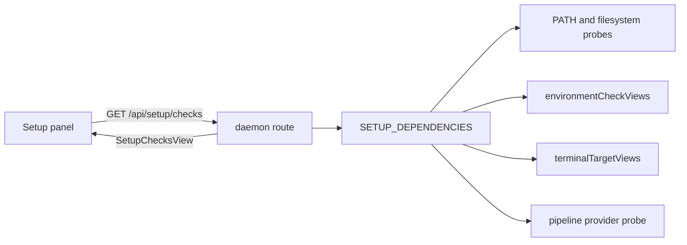
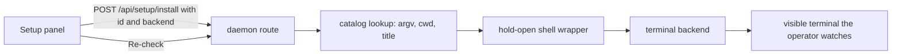

# Guided setup: detect every external dependency, then help install it

## The problem

Mission Control is a control plane for tooling it does not ship. A working install
depends on a terminal emulator, a multiplexer, one or more agent CLIs, `gh`, `git`,
Claude Code plugins and skills, and - for pipelines - ai-conductor. Today each of those
facts is discovered somewhere different, and almost always at the moment it fails:

- A terminal backend that is not installed is silently skipped by `enumerateTerminals`
  (`src/server/terminal/enumerate.ts`), so its sessions simply never appear.
- A missing agent binary is refused at dispatch by `agentBinPresent`
  (`src/server/dispatcher.ts:2243`), or per ensemble member at roster creation.
- `gh` is resolved per call by `ghBin()` (`src/server/config.ts:236`) and fails at the
  first push or PR.
- ai-conductor presence is a single boolean folded into `SettingsStatus.pipelines.present`
  (`pipelinesPresent`, `src/server/pipelines/index.ts:174`).
- The only surface that proactively tells an operator to go fix their machine is the
  dispatch form's environment checks, and that registry holds exactly one entry
  (`ENVIRONMENT_CHECK_IDS = ["upstartclaw-core-setup"]`).

Nowhere answers the question a new operator actually has: **what does this machine have,
what is it missing, what does each missing thing cost me, and how do I get it?**

## What we are building

One catalog of external dependencies, one daemon-side detector per entry, one Settings
surface that renders all of them with a remedy, and a first-run entry point that sends a
new operator there. The catalog is the only place a dependency's name is spelled, which is
the rule the existing registries (`OPEN_TARGET_INFO`, `ENVIRONMENT_CHECK_INFO`,
`TASK_SOURCE_KINDS`, `PIPELINE_PROVIDERS`) already hold to.

### Decisions taken

Submitted in the plan review, and now the plan's premises rather than open questions:

| Decision | Adopted |
| --- | --- |
| Where the catalog lives | A new setup catalog that **reads** the existing environment checks. `src/shared/setup-catalog.ts` plus `src/server/setup/`; `ENVIRONMENT_CHECK_IDS` is neither renamed nor extended, and no detection is copied. |
| How far a remedy goes | Links, copyable commands, and run-in-a-visible-terminal. The daemon owns argv; the browser sends an id. No daemon-side package-manager install. |
| The guided surface | Settings panel, first-run banner, and one tour. No separate first-run wizard, and not dispatch-form warnings alone. |
| v1 families | Terminals and multiplexers, GitHub CLI presence and authentication, agent CLIs, Claude Code plugins and skills, ai-conductor. **The git and Node baseline is out of v1.** |

The baseline being out is a scope decision with one consequence worth stating: a checkout that
got far enough to run this dashboard already has `git` and a Node new enough to start the
daemon, so those rows would be satisfied on every machine that can see them. The ids stay
appendable - the tuple is append-only, so adding `git` and `node` later costs an append and
two probes, and nothing in this design has to move to accommodate them.

### Non-goals

- **The daemon never installs anything itself.** No package manager invoked in-process, no
  `curl | sh`, no privilege escalation, no network fetch of an install script. Every remedy
  is a link the operator opens, a command they copy, or a command that runs in a *visible*
  terminal they watch - which is exactly the shape `/api/pipelines/install` already has.
- **Not a health monitor.** Nothing here polls on a tick. Detection is computed per request,
  for `environmentCheckViews`' stated reason: an operator who installs something must see the
  answer change without restarting the daemon, and a boot snapshot is a claim about a machine
  that has since changed.
- **Not a second source of truth for capability.** The dispatch form keeps refusing a missing
  agent binary, `enumerateTerminals` keeps skipping absent backends. Guided setup explains
  those facts; it does not gate on them.

## The catalog

`src/shared/setup-catalog.ts` holds the pure half - what a dependency IS, readable in the
browser, no `node:` imports. `src/server/setup/` holds the impure half - one probe per
entry, plus the dependency bag that makes it testable against an arranged home rather than
the developer's own.

This is the `EnvironmentCheckInfo` / `EnvironmentCheckImpl` split, reused verbatim:

```ts
// src/shared/setup-catalog.ts - append-only, ids are the natural key
export const SETUP_DEPENDENCY_IDS = [
  "claude-cli", "codex-cli", "pi-cli",
  "tmux", "cmux", "wezterm", "ghostty",
  "gh-cli", "gh-auth", "claude-plugins", "claude-skills", "ai-conductor",
] as const;

export interface SetupDependencyInfo {
  id: SetupDependencyId;
  label: string;                    // "GitHub CLI"
  family: SetupFamilyId;            // grouping in the panel
  requirement: "required" | "recommended" | "optional";
  /** What Mission Control cannot do without it. One sentence, in the product's terms. */
  enables: string;
  /** How an operator gets it. Rendered as the row's control; see Remedies. */
  remedy: SetupRemedy;
}
```

Families, in panel order: **Agent CLIs** (claude, codex, pi), **Terminals** (emulators and
multiplexers, reported as a pair - see below), **GitHub** (`gh` presence, `gh`
authentication), **Claude Code extensions** (installed plugins and the skills Mission Control
reconciles), **Pipelines** (ai-conductor).

`requirement` is what keeps the page honest about scale. Every agent CLI missing means
nothing can be dispatched at all; Ghostty missing is a preference. A page that draws a dozen
equally red rows has told the operator nothing.

### Status is four answers, not two

```ts
export type SetupStatus =
  | { state: "satisfied"; evidence: string }        // "/opt/homebrew/bin/gh"
  | { state: "missing" }
  | { state: "needs-setup"; why: string }           // installed, not usable yet
  | { state: "unknown"; why: string };              // we could not look
```

`needs-setup` and `unknown` are the two a boolean cannot express, and both already exist in
this codebase's reasoning. `gh` on PATH but unauthenticated is `needs-setup`; so is the
UpstartClaw plugin installed with its setup state file absent, which
`src/server/environment/upstartclaw.ts` already distinguishes at length. `unknown` is
`FileRead`'s "there is a file I could not read" case: collapsing it into `missing` either
silences a real problem or warns every operator on earth.

### Detection reuses the probes that already exist

No new mechanism. Each catalog entry points at the function the daemon already trusts:

| Family | Probe | Source |
| --- | --- | --- |
| Agent CLIs | `agentBinPresent(agent)` | `src/server/dispatcher.ts` |
| Terminals | `binPresent(spec)` over `TMUX_BIN`, `CMUX_BIN`, `WEZTERM_BIN`, `GHOSTTY_BIN` | `src/server/terminal/bin.ts` |
| Terminals, usable | `terminalTargetViews(...)` | `src/server/terminal/targets.ts` |
| `gh` presence | `resolveBinPath(ghBin())` | `src/server/util/exec.ts`, `src/server/config.ts` |
| `gh` auth | `gh auth status`, output-parsed, never exit-code alone | new, in `src/server/setup/` |
| Claude Code plugins | `installedPlugins()` | `src/server/plugins/installed-plugins.ts` |
| Skills | the existing skills reconcile / drift read | `src/server/skills/reconcile.ts` |
| ai-conductor | `binForPresence()` then `probe()` | `src/server/pipelines/conductor/` |

Two probe rules the existing code already states, and this catalog inherits:

- **Presence is answered from the filesystem where it can be.** `onPath` walks `PATH` with
  `existsSync` and costs microseconds; a doomed `fork` + `execve` costs milliseconds. Use
  `resolveBinPath` (which spawns `which`) only where the very next thing we do is spawn the
  binary, per the note in `src/server/util/exec.ts`.
- **A probe never throws.** `environmentCheckViews` maps a thrown implementation into that
  check's own warning so one bad probe cannot take the page down or fail the route. The setup
  registry does the same, and names itself as the fault rather than the operator's machine.

### The terminal row is about a pair, not a binary

`src/server/terminal/targets.ts` exists because "is tmux available" is not a question about
tmux: a detached tmux session with no emulator to raise it is a button that reports success
and puts nothing on screen. Guided setup must not reintroduce that. The Terminals family
therefore draws per-backend presence rows **plus** one derived row - "Mission Control can
open a terminal window on a checkout" - computed from `terminalTargetViews`, naming the
emulator that would do the raising. Restating that pair logic inside the setup registry is
the one duplication this plan explicitly forbids.

### The existing environment checks are folded in, not forked

`ENVIRONMENT_CHECK_IDS` is append-only and its entries answer a narrower question: would a
dispatch launched right now stall on somebody else's unfinished setup. That check keeps its
registry, its route, and its place in the dispatch form. The setup view *reads*
`environmentCheckViews()` and renders each non-null warning as a `needs-setup` row in the
family it belongs to. One detector, two surfaces; no id renamed, no detection copied.

## Remedies

Three kinds plus a printed one, and the boundary between them is the security spine of this
feature.

```ts
export type SetupRemedy =
  | { kind: "link"; url: string; label: string }
  | { kind: "command"; argv: readonly string[]; note: string }
  | { kind: "provider-installer"; provider: PipelineProviderId }
  | { kind: "skill"; command: string };     // "/upstartclaw-core:setup"
```

- **`link`** opens documentation or a download page through the existing browser open target
  (`src/server/open-targets/browser.ts`). Always available, always the fallback.
- **`command`** is shown as copyable text, with an optional "Run in a terminal" button. The
  button posts an entry **id** and a chosen terminal backend - never argv. The daemon looks
  the argv up in its own catalog and wraps it in the same hold-open shell the pipelines
  installer route already uses, so the operator watches the install and reads its exit code
  rather than trusting a spinner:

  ```sh
  <argv>
  status=$?
  printf '\n[installer exited %s] press enter to close ' "$status"
  read -r _
  ```

  The browser supplies the backend and the id; the daemon owns argv, cwd, and title. That is
  the property `/api/pipelines/install` documents, restated here because it is the whole
  reason this is safe.
- **`provider-installer`** delegates to the flow that already exists:
  `pipelineInstallerCandidates` finds verified local checkouts in the workspace catalog,
  `pipelineInstallerLaunch` reverifies at click time, and the terminal opens the provider's
  own `bin/install`. ai-conductor uses this and gains nothing new.
- **`skill`** is a slash command the operator runs inside a Claude session - the shape
  `upstartclaw.ts` already prescribes with `/upstartclaw-core:setup`. Mission Control prints
  it; it does not run it. Claw owns its own setup, and a daemon that repaired another tool's
  state would be a second owner of it.

**What a `command` remedy may contain.** A package-manager invocation with a fixed package
name (`brew install gh`, `npm install -g @openai/codex`), and nothing else. No shell
metacharacters, no pipes, no redirects, no `sudo`, no URL fetched and executed. A dependency
that cannot be installed that way carries a `link` instead. The list is committed, reviewed,
and pinned by a test that rejects any argv outside that shape.

## Flows

Detection, on request:



Install, on click:



Nothing else changes. There is no new poller, no new persisted table, and no new writer: the
daemon remains the only database writer, and this feature writes nothing to it beyond the one
dismissal flag below.

## Surfaces

**A new Settings category, `setup`.** Appended to `SETTINGS_CATEGORIES`
(`src/web/lib/settings-registry.ts`) in the `sessions` group, first within it, because it is
what a new operator needs before any other row means anything. Its scope badge is `home`,
not `machine`: a remedy can launch an installer that writes outside this app, and the scope
badges are not allowed to be softer than the truth.

The panel draws one card per family and one row per dependency: status chip, the `enables`
sentence, the evidence string (the resolved path, the file that was read), and the remedy
control. Rows carry `data-anchor="setup/<slug>"` so the settings search index can point at
them, per that registry's anchor contract. A single "Re-check" button refetches; there is no
auto-refresh, because a page that silently rewrites itself while an operator reads it is
worse than one they refresh.

**A first-run entry point.** The dashboard shows a dismissible banner when any `required`
dependency is `missing`, or on first launch with no dismissal recorded. It links to the Setup
category and says how many rows need attention. Dismissal is durable (one `app_config` flag),
and the banner returns if a *required* row later goes missing - that is a machine that broke,
not a preference the operator already expressed.

**A tour.** One `TourEntry` (`src/web/tour/entries.ts`) walking the Setup panel, so it appears
in the Settings rail's Help and tours row and in the command palette beside the existing
tours. This is the guided part of guided setup: the tour narrates, the panel is the surface,
and there is no third wizard implementation to keep in step.

## Verification

- **`test/`** - the catalog and every probe, driven through a `SetupDeps` bag in
  `EnvironmentDeps`' shape. A test must never read the developer's real `~/.claude` or their
  real `PATH`; the bag is what makes an arranged home possible. Cases: each status state per
  family, a throwing probe contained to its own row, `unknown` distinguished from `missing`,
  the terminal pair row disagreeing with per-backend presence, and the argv shape test that
  rejects a command remedy containing a pipe, a redirect, `sudo`, or a URL.
- **`e2e/`** - required, per `CLAUDE.md`: this is a new UI surface. A spec that opens the Setup
  category with fake backends and asserts a satisfied row, a missing row with its remedy
  control, the first-run banner and its dismissal, and that "Run in a terminal" reaches the
  install route and reports its refusal. It installs nothing and spends no model tokens; agent
  binaries stay redirected by `e2e/fixtures/fake-agents.ts`. Selectors by role and label only,
  no `data-testid`.
- **`renderToStaticMarkup`** alongside, for the settings sidebar tests that already walk
  `SETTINGS_CATEGORIES` and pin anchor uniqueness and category reachability.
- Docs in the same change: `docs/setup.md` gains the in-app path beside its command-line
  prerequisites, `docs/ui.md` and `docs/skills-and-settings.md` gain the category, and
  `docs/harnesses-and-terminals.md` points at it for backend presence.

## Risks and how each is contained

| Risk | Containment |
| --- | --- |
| A remedy runs something destructive | The daemon owns argv; the browser sends an id. Argv shape pinned by test. Visible terminal, hold-open, exit code shown. |
| The page becomes an install manager for the whole machine | `requirement` levels plus a committed catalog. A dependency Mission Control does not use does not get a row. |
| Detection drifts from the code that actually refuses | Every probe is the function the refusing path calls. The one place that could drift - the terminal pair - reuses `terminalTargetViews` rather than restating it. |
| A slow probe stalls the page | Probes run concurrently, so the route costs the slowest one rather than their sum, and the two subprocess probes (`gh auth status`, the conductor probe) are bounded by `run`'s own `timeoutMs` (`src/server/util/exec.ts`, 4s by default). A probe that times out renders `unknown` with a reason rather than blocking the page. **No cache**, per the no-tick rule above: an operator who just installed something must see the change on the next read. |
| Rows of chrome for an operator who is already set up | The banner appears only for missing `required` rows, and satisfied rows collapse to a one-line chip. |
