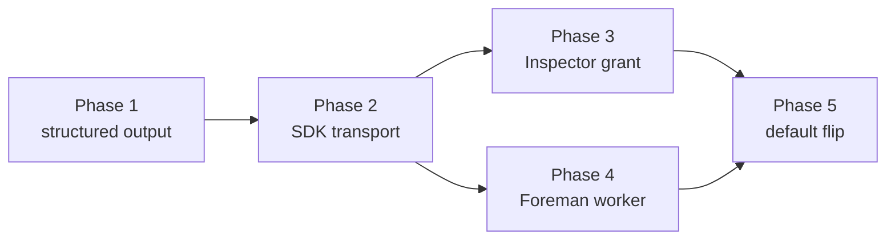

# Headless calls on the Agent SDK - phased implementation

Implementation index for [`plan.md`](./plan.md), which remains the source of truth for *what* is
being built and *why*. This document owns *how it is split*, and the phase files own the detail.

## Incorporated decisions

Resolved by the operator on review of the source plan. These are requirements here, not open
questions.

| Decision | Choice | Where it is owned |
|---|---|---|
| How far to move | **Transport swap behind `claudeRunner`** - `outputFormat`, `abortController`, `maxBudgetUsd`, `stderr`, `settingSources: []`. One transport for one binary. Not a third `LlmRunnerId`. Not a live-progress UI. | Phases 1-5 |
| Headless transcripts | **Keep them, keep the pruner.** `persistSession` stays on. | Phase 2 makes transcript continuity an exit criterion; no phase retires `goal/prune.ts` |
| The latent driver bug | **Fix now, in its own PR.** | No phase - excluded deliberately |
| After this plan | **Phase it and schedule the work.** | This document |

## What investigation changed

Three assumptions in the source plan did not survive contact with the repository. Each is
recorded in the affected phase file rather than silently dropped.

1. **"The bundling phase" is not one.** There is no `build:foreman`; the worker runs from
   TypeScript source under `tsx` (`package.json:34`) and resolves `node_modules` directly. The
   daemon bundle already carries the SDK as a lazy dynamic-import specifier, proven in production
   by the interactive driver. Phase 4's risk profile was rewritten from the code.
2. **`--json-schema` does not delete the retry ladder globally.** `zodToJsonSchema` silently drops
   `.refine`, `.preprocess` and `.transform`, so a schema-valid reply can still fail `safeParse` -
   and callers consume the Zod *output* type, which only `safeParse` produces. Five of twelve
   schemas render cleanly, three are lossy-but-safe, and three are excluded. Phase 1 is scoped to
   the first eight and says so.
3. **`zod-to-json-schema` is a phantom dependency.** It resolves only transitively through
   `@modelcontextprotocol/sdk`. Phase 1 must declare it before importing it, or the daemon bundle
   inlines a package nothing owns.

## Phases

| # | Phase | File | Depends on | Delivers |
|---|---|---|---|---|
| 1 | Provider-validated structured output | [`phase-1-provider-validated-structured-output.md`](./phase-1-provider-validated-structured-output.md) | - | `LlmRunOptions.schema`, `--json-schema`, a trimmable ladder |
| 2 | SDK one-shot transport, off by default | [`phase-2-sdk-one-shot-transport.md`](./phase-2-sdk-one-shot-transport.md) | 1 | `runClaudeSdkOneShot`, `ClaudeTransport`, the 8 tool-less daemon sites |
| 3 | The Inspector's grant on SDK | [`phase-3-inspector-grant-on-sdk.md`](./phase-3-inspector-grant-on-sdk.md) | 2 | tool grants enforced identically |
| 4 | The Foreman worker on SDK | [`phase-4-foreman-worker-on-sdk.md`](./phase-4-foreman-worker-on-sdk.md) | 2 | the 4 worker sites, spend through the outbox |
| 5 | Make SDK the default | [`phase-5-default-transport-flip.md`](./phase-5-default-transport-flip.md) | 3, 4 | the migration actually delivered |

### Dependency graph

Edges are direct prerequisites only; transitive ones are implied.

### Concurrency groups

| Group | Phases | Why they can overlap |
|---|---|---|
| A | 1 | Root. Nothing else can start. |
| B | 2 | Sole consumer of Phase 1's option. |
| C | **3 and 4, concurrently** | Both depend only on Phase 2 and share no files. Phase 3 owns `src/server/inspector/` and the grant branch of `claude-sdk.ts`; Phase 4 owns `src/server/foreman/` and possibly `LlmStatus`. Phase 4 adds no branch to `runClaudeSdkOneShot`, so they merge in either order. |
| D | 5 | The join. Needs both of group C. |

Merge order: 1, then 2, then 3 and 4 in either order, then 5.

## Cross-phase contracts

These are the interfaces one phase creates and another consumes. Breaking one is a cross-phase
regression, not a local refactor.

| Contract | Created by | Consumed by | Rule |
|---|---|---|---|
| `LlmRunOptions.schema: Record<string, unknown>` | 1 | 2 | A **rendered** JSON Schema, not a Zod schema, so the SDK path needs no conversion of its own |
| `shapeGuaranteed` | 1 | 2, 5 | Means "the provider validated the input shape". Never "skip `safeParse`". Set per call site, never globally |
| `parseModelJson`'s `safeParse` | existing | all | Stays on every path. Callers consume the Zod output type, which transforms produce and no provider can |
| `ClaudeTransport` + `claudeTransportChoice()` | 2 | 3, 4, 5 | The single selector. No phase introduces a second switch |
| `runClaudeSdkOneShot` refusing grants | 2 | 3 | Phase 3 is the only phase permitted to replace that refusal |
| `cwd: HEADLESS_CWD` for tool-less runs | 2 | 3, 5 | A phase that changes it owes the pruner an answer. Phase 3 does, for granted runs, and documents the inherited gap |
| No `resume`/`sessionId`/`forkSession` | 2 | all | Context isolation is a correctness property, not a default |
| `claudeGrantSettings` as the single deny renderer | existing | 3 | One derivation for both transports |
| How the worker learns the transport | 4 | 5 | Phase 4 records `envVar`-only or `LlmStatus`; Phase 5 documents whichever it chose rather than assuming |
| Daemon-side pricing, worker-side reporting | existing | 4 | The worker never prices and never opens the database |

## Final verification strategy

Each phase runs `npm run typecheck`, `npm run lint`, `npm test`, `npm run build` and
`npm run smoke` - build and smoke are required throughout because Phase 1 adds a dependency that
lands in `dist/server/index.mjs` and every later phase changes what that bundle does at runtime.
No phase requires `npm run test:e2e`: nothing here has a UI surface, which is also why no phase
carries a Playwright spec.

Two things the suite structurally cannot prove, assigned rather than assumed:

- **Grant enforcement** (Phase 3) - rendering the right deny string is what the existing
  byte-equality test proves. That the rules *bind* is a separate assertion, and if the seam cannot
  express it, Phase 3 must say so in its PR rather than claim coverage it does not have.
- **The `settingSources: []` behaviour change** (Phase 5) - a before/after on real prompts,
  because a systematic shift in reviewer strictness is invisible to every unit test.

The end state matches `plan.md` with no undocumented cleanup: `print` remains supported rather
than vestigial, `goal/prune.ts` remains load-bearing, the three excluded schemas remain on the
retry ladder, and the latent driver bug ships on its own.
</content>
