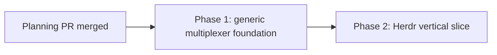

# Herdr multiplexer implementation phases

This index turns the approved [Herdr multiplexer plan](plan.md) into two merge units. The first
strengthens the backend-neutral contracts that Herdr needs without exposing an incomplete Herdr
surface. The second ships Herdr support as one complete vertical slice through discovery, pane I/O,
lifecycle, focus, terminal launch, browser-visible availability, tests, and documentation.

## Source of truth and approved decisions

- Source plan: `docs/plans/herdr-multiplexer/plan.md`
- Rendered source: `docs/plans/herdr-multiplexer/plan.html`
- Repository: this Mission Control checkout only
- Approved integration: socket-backed Herdr adapter behind the existing `Multiplexer` registry
- Approved namespace: Herdr's default local server session only
- Approved outward focus: select inside Herdr, declare `clients: null`, and use the existing
  new-client fallback without direct-attach takeover
- Approved follow-up: write these merge-aware phase plans and schedule dependency-linked tasks

These are requirements. The implementation agents may adapt the proposed route when current code
or better evidence demands it, but they must preserve the selected behavior and explain any route
change in the pull request.

## Repository findings that shape the split

1. `src/shared/terminal.ts` is already the only terminal-backend vocabulary. Its ordered
   `MULTIPLEXER_IDS` tuple drives wire enums, naming priority, terminal-target ordering, setup
   choices, and exhaustive server records. Adding `herdr` there will deliberately fail typecheck
   until every registry and fake record is complete.
2. `src/server/terminal/types.ts` already models Herdr's important differences. `MuxPane` carries a
   nullable `panePid`, stable session address and display name are separate, and `Multiplexer`
   represents optional capture, paste, pane mode, client enumeration, selection, and session
   lifecycle as capabilities. No vendor-specific caller branch is needed.
3. `src/server/discovery/correlate.ts` currently indexes multiplexer panes only by tty. Its second
   weak key is intentionally emulator-only and based on host process plus uniqueness. Herdr's shell
   PID fallback must be a separate exact ancestry join, not an extension of that heuristic.
4. `DetachedSessionSpec` has no selection intent. `homeBackends` creates background dispatch homes,
   `launchTerminal` creates an operator-requested visible terminal, tmux can ignore the distinction,
   and cmux currently hardcodes `--focus false` for both. The contract should state the distinction
   once before Herdr consumes it.
5. The browser is already registry-driven. `LaunchMenu`, Pipeline controls, Worktree settings, Setup,
   HTTP request schemas, and `NameSource` derive from shared terminal IDs or daemon target views.
   Herdr should appear through those generic paths after registration, with no Herdr branch in React.
6. The E2E daemon currently installs only its fake cmux and points WezTerm and Ghostty at known
   missing paths. A registered `HERDR_BIN` must also be explicit in that fixture or developer-machine
   installation state will reorder homes and make unrelated tests nondeterministic.
7. Adding `herdr` widens several Zod request enums, but it adds no SQLite field or migration. Terminal
   handles and `nameSource` already persist or travel as the registry-derived string union. The
   implementation must still test parse and serialization paths so the widened value is not accepted
   by one boundary and rejected by another.
8. The stable Herdr API supplies workspace, tab, pane, shell PID, pane I/O, agent focus, and session
   lifecycle operations, but no attached-client terminal list. That confirms the approved
   `clients: null` declaration and rules out direct terminal takeover as a focus substitute.

## Design clarifications from the investigation

- The Herdr socket transport is server-side mechanism and stays under
  `src/server/terminal/herdr*.ts`. Shared modules receive only the `herdr` identifier and generic
  handles.
- PID ancestry is evaluated from the same `Proc[]` snapshot used for discovery. It never shells out,
  never guesses from PID proximity or cwd, never competes with a backend's non-null tty, and declines
  an ambiguous same-backend result.
- Server auto-start is workspace-creation-only. Passive enumeration and operations aimed at existing
  targets return an empty result or refusal when Herdr is stopped and never launch a background
  process.
- Compatibility is decided by validated `herdr status server --json` output and the supported stable
  protocol contract. Mission Control never stops, replaces, or silently speaks to an incompatible
  Herdr server.
- The full `herdr` client is the attach target. Because the current attach contract carries argv but
  not environment, the adapter returns a portable `env -u ...` wrapper that clears every Herdr
  namespace selector before executing the resolved binary. The adapter first selects the target
  inside Herdr, then generic focus opens that wrapper through an installed emulator when no host can
  be found because `clients` is unavailable.
- No phase adds named Herdr server discovery, client-tty inference, an undocumented pane-focus call,
  direct-attach takeover, a Herdr database table, or a second terminal registry.

## Resolved discrepancies from the root draft

1. The draft originally described `attachArgv` as returning only the resolved Herdr binary. Current
   code proves that `attachArgv` carries no environment and every emulator runs the supplied argv in
   an inherited environment. The approved default-session guarantee therefore requires the Herdr
   adapter to return an `env -u ...` wrapper for every namespace selector before the binary. This is
   owned by Phase 2 and is now reflected in the root plan.
2. The draft originally allowed a stopped server to be started before any mutation. Reads and
   mutations such as write, focus, rename, and close address state that cannot be live when the
   server is stopped, while auto-starting can restore or create state the operator did not request.
   Server auto-start is therefore limited to workspace creation. All other operations return their
   bounded empty result or refusal without starting Herdr. This is owned by Phase 2 and is now
   reflected in the root plan.

## Sizing estimate and phase-count rationale

Expected non-test production change: **700 to 950 lines**.

Assumptions behind the range:

- 100 to 170 lines for exact ancestry correlation, selection intent, existing adapter changes, and
  updated contract comments;
- 350 to 500 lines for bounded socket framing, response validation, compatibility checks, error
  classification, and server-readiness coordination;
- 230 to 300 lines for the Herdr adapter, registration, environment isolation, lifecycle mapping,
  and small generic-surface adjustments.

Tests, E2E fixtures, E2E specs, and documentation are excluded from the production-line estimate.

Two phases are warranted. Combining them would put changes to shipped tmux/cmux behavior, process
correlation safety, a new socket protocol client, daemon-start races, a new backend, and all UI/E2E
coverage in one 700-plus-line production review. Isolating the generic contract first materially
reduces misdirected-terminal and background-focus risk, and it has independent value by fixing
operator-created cmux workspaces to request focus. A third phase is not warranted: splitting the
Herdr transport, adapter, registry, UI, or docs would create dead code or a publicly visible partial
backend that a later merge must repair.

## Phase table

| Phase | Outcome | Direct dependency | Expected production lines |
|---|---|---|---:|
| [1 - Generic multiplexer foundation](phase-1-generic-multiplexer-foundation.md) | Exact PID-ancestry correlation and an explicit background-versus-visible session creation contract, with existing tmux/cmux behavior pinned | Planning PR only | 100 to 170 |
| [2 - Herdr vertical slice](phase-2-herdr-multiplexer-vertical-slice.md) | Complete default-session Herdr support through the existing registry, including socket transport, lifecycle, focus fallback, UI availability, E2E coverage, and docs | Phase 1 | 600 to 780 |

## Dependency graph

Every scheduled phase task also depends directly on this planning session. Phase 2 depends directly
on the Phase 1 task. There is no concurrent implementation group because Phase 2 consumes both
contracts Phase 1 owns.

## Merge order and operable states

1. Merge the planning PR so every task path exists on the default branch.
2. Merge Phase 1. The repository remains fully operable with tmux and cmux, correlation becomes more
   exact for tty-less multiplexer panes, and operator-created cmux workspaces request focus. No Herdr
   ID or partial Herdr UI is exposed.
3. Merge Phase 2. Herdr is added to the ordered registry only when discovery, I/O, lifecycle, focus,
   launch, tests, and documentation are complete together.

Phase 2 must rebase after Phase 1 rather than copying the contract changes. No implementation task
may merge a temporary Herdr-specific correlation or creation branch.

## Cross-phase contracts

### Process correlation

- TTY remains the strongest match.
- PID fallback applies only to a multiplexer pane whose tty is null and whose non-null shell PID is
  on the actual parent chain of the representative agent process in the same snapshot.
- The closest same-backend ancestor wins only when unique. An unresolved tie produces no handle.
- Registry order still decides naming across backends, so inner tmux keeps precedence over Herdr and
  Herdr keeps precedence over cmux.

### Session creation intent

- `DetachedSessionSpec.select` means select the newly created multiplexer surface internally.
- Background dispatch passes `false`.
- An operator-requested terminal passes `true`.
- The flag does not promise to raise an operating-system window.
- tmux may ignore it, cmux and Herdr must map it to their native focus flag.

### Herdr adapter boundary

- Default server namespace only, enforced by clearing ambient Herdr session, socket, workspace, tab,
  and pane selectors from adapter-owned subprocesses.
- One bounded newline-delimited JSON socket connection per logical batch, unique request IDs, narrow
  Zod validation, response and line-size bounds, and explicit read-versus-mutation timeout behavior.
- Read failures degrade only Herdr for the current tick. Mutation disconnects after delivery preserve
  `outcomeUnknown` so callers do not replay an operation that may have landed.
- `clients: null` and `paneMode: null` are honest capability declarations, not missing work.
- Full-client attach clears Herdr namespace selectors in argv and never uses direct-attach takeover.

### Compatibility and ownership

- No SQLite schema change.
- No React branch on `herdr`; UI consumes `TerminalTargetView` and existing session handles.
- No real Herdr server or agent process in automated tests.
- No generated files or `CHANGELOG.md` edits.

## Final verification strategy

Each phase runs its focused tests plus repository-wide typecheck, lint, and unit gates. Because both
phases change user-visible terminal behavior, they also build the application and run Playwright.
Phase 2 additionally runs smoke and a disposable live Herdr verification that proves create,
discovery, safe multiline paste, capture, internal focus, rename, detach/reattach, and close while
leaving evidence outside git.

The final Phase 2 review must confirm:

- adding `herdr` produces no vendor branch outside its adapter;
- every widened shared enum parses and renders consistently;
- discovery never starts Herdr and missing Herdr costs no subprocess;
- background dispatch does not steal focus while operator launch asks for it;
- repeated Focus may open another normal Herdr client but never evicts an attachment;
- named Herdr sessions remain deliberately out of scope;
- all automated fakes prove no real agent binary or Herdr server was launched.

## Complete cross-phase audit

- Every root-plan requirement is owned exactly once: Phase 1 owns correlation and selection intent;
  Phase 2 owns the Herdr transport, adapter, registration, lifecycle, UI/E2E surface, and docs.
- Phase 2 consumes the exact `panePid` and `select` semantics defined by Phase 1 and does not redefine
  them.
- There are no concurrent phases, duplicate file owners, temporary registries, migrations, generated
  outputs, or cleanup-only follow-ups.
- Both intermediate and final states are buildable, testable, and honest to the operator.
