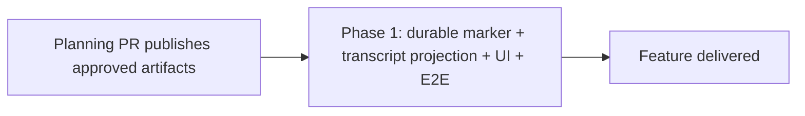

# Phased implementation: Hide launch instructions from conversations

Status: **ready to publish and schedule.**

## Source of truth

- Approved product plan: `docs/plans/hidden-launch-instructions/plan.md`
- Submitted product decision: **show only the human task request** in the dashboard while
  preserving the complete composed launch prompt for the agent and every server-side evidence
  consumer.
- Submitted follow-up decision: **create phased implementation plans and schedule the tasks.**

The approved plan is authoritative for behavior. This index and the phase file describe a proposed
implementation route verified against the current repository.

## Investigated repository findings

1. **There is one normalized transcript contract across all harnesses.** Claude, Codex, and Pi
   produce `TranscriptMessage` values through their harness transcript adapters. The dashboard then
   receives them through the transcript stream and backward-page routes. Provider-native transcript
   mutation is neither necessary nor compatible with the current ownership boundary.
2. **Launch composition and launch delivery are separate facts.** `dispatcher.ts` constructs the
   agent-facing prompt from `Task.intent`, repository context, shared execution authorization, and
   task-kind contracts. It still has the original `Task.intent`, which is the approved display
   projection. Pi adds a repository-memory pointer to its positional turn, so marker matching must
   use the actual delivered prompt rather than the pre-Pi composition.
3. **Terminal and SDK launches have different timing.** Terminal Claude and Codex can record the
   marker immediately before prompt injection and discard it if delivery fails. Pi receives turn
   one during process launch and can be marked as soon as its launched native identity is bound.
   SDK turn one is accepted inside `SdkSupervisor.start`, before the session is registered or its
   event pump begins, so its marker must travel through `start`/`adopt` and be durable before the
   session becomes streamable.
4. **Logical conversation identity already has a lifecycle.** `noteKeyFor(session)` begins as the
   stable Mission Control session id and prefers the native agent session id once one binds.
   Registry-owned Goal and Foreman-invite state demonstrate persistence, initial-key movement, and
   pruning. A launch marker must move only on the initial provisional-to-native bind. A `/clear`
   starts a new conversation and must not inherit it.
5. **Attribution is the existing normalization overlay.** `transcript-attribution.ts` currently adds
   non-human origin metadata without changing the native files. Launch presentation belongs at this
   same server-side overlay boundary, but its durable source should be Registry-owned rather than the
   in-memory injection fingerprint map.
6. **The browser has more than one transcript-derived surface.** `TranscriptPanel` feeds the same
   messages into Chat and Native renderers, find-in-conversation, and the Activity/Yours rail. The
   display projection must happen once before all those consumers. Altering only the turn component
   would leave hidden instructions searchable and visible in Yours.
7. **Paging is byte-based.** Transcript SSE resume positions and older-page anchors refer to native
   file bytes. The browser must retain the unprojected cache and offsets while deriving a projected
   message list for display, or reconnect and pagination correctness would be coupled to visible row
   counts.
8. **A true browser regression belongs in the existing dispatch path.**
   `e2e/specs/dispatch-and-converse.spec.ts` already launches a fake SDK agent through the real
   dashboard, daemon, driver, native transcript, SSE stream, and conversation UI without spending
   model tokens. It is the closest end-user reproduction and already records the fake provider's
   accepted launch payload.

## Design reconciliation

The approved plan proposed a semantic marker keyed to the logical conversation. Repository
inspection confirms that direction, with two refinements:

- store a fingerprint of the complete normalized launch text plus the human display projection,
  rather than duplicating the full composed prompt in SQLite;
- preserve the native message id, role, timestamp, and tools when substituting display text, so
  ordering, jump targets, review interleaving, and both renderers continue to address the same turn.

Do not use `origin: "harness"` for this purpose. Origin answers who typed a user-role turn, while
launch presentation answers which portion of one accepted turn the dashboard should display.
Conflating them would mislabel the human request and force unrelated authorship code to become a
visibility switch.

## Sizing and phase count

Estimated non-test production change: **190-270 lines**.

Assumptions:

- one small durable marker table and Registry lifecycle methods;
- additive normalized-message metadata;
- marker capture at the existing terminal, Pi, pipeline SDK, and ordinary SDK launch seams;
- one pure browser projection helper and a narrow `TranscriptPanel` wiring change;
- documentation is excluded from the implementation-line estimate;
- tests are excluded from the estimate and are expected to be substantial because the change spans
  persistence, identity rotation, transcript delivery, and two UI renderings.

Create **one phase and one one-shot implementation task**. The estimate straddles 200 lines, but the
feature is one coherent vertical slice. Splitting persistence from the browser would merge dead
metadata with no user value; splitting the browser first would define a wire contract with no
producer and could hide real turns through test fixtures rather than launch evidence. One phase is
reviewable, leaves the repository operable, and is a better execution fit than coordinating a
temporary contract across two pull requests.

## Phase table

| Phase | Outcome | Direct prerequisites | Task shape |
|---|---|---|---|
| [Phase 1: Durable launch presentation](phase-1-durable-launch-presentation.md) | A managed launch shows only the human task request in Chat, Native, find, and Yours while the complete prompt remains available to the agent and server consumers | Planning session and its plan-artifact pull request | One-shot ship task |

## Dependency graph

## Concurrency and merge order

There is one implementation phase, so there are no concurrent groups or inter-phase merge edges.
The Phase 1 task depends directly on this planning session. It remains backlogged until the plan
artifact pull request merges to the default branch, making all referenced paths resolvable.

## Cross-phase contracts

With one phase, these are implementation-wide invariants rather than handoffs:

- native transcripts and agent delivery remain byte-for-byte unchanged;
- only fresh Mission Control-managed launches receive presentation metadata;
- the marker is durable across restart and initial identity binding but does not cross `/clear`;
- server-side Goal, Foreman, Workflow, Scout archive, review, and retro readers retain full text;
- the visible projection preserves the native message identity and applies consistently to Chat,
  Native, find, and Yours;
- messages without the additive field retain current behavior;
- transcript byte anchors and reconnect state remain based on the full native transcript.

## Final verification strategy

Phase 1 owns every verification layer needed for its behavior:

- a failing-first Playwright reproduction through real dashboard dispatch and the fake SDK agent;
- focused persistence, key-movement, dispatcher, SDK supervisor, attribution, projection, find, and
  Yours tests;
- compatibility tests proving unmarked, manual, assigned, resumed, and cleared conversations keep
  real human turns;
- agent-boundary evidence proving the full composed prompt was accepted;
- typecheck, lint, focused Node tests, build, smoke, and the relevant Playwright spec, followed by
  the full suites required by repository policy.

## Final cross-phase audit

- Every approved product requirement is owned by Phase 1.
- No rejected presentation option remains in the implementation scope.
- There is no second source of transcript truth and no provider-specific UI branch.
- No later cleanup or documentation phase is required to make Phase 1 operable.
- The dependency graph contains only the required planning-session publication edge.
