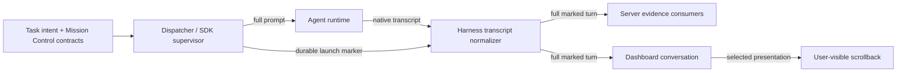

# Plan: Hide launch instructions from conversations

Status: **approved for phased implementation planning.**

## Decision

Mark every non-empty prompt used to start a fresh Mission Control-managed agent conversation as
`launch` metadata. Retain its complete text in the agent's native transcript and every server-side
evidence path, but render only the original human-authored `Task.intent` as the first user turn in
the dashboard conversation.

This keeps the natural request-response shape while removing repository manifests, execution
authorization, task-kind contracts, and other platform-owned launch instructions from visible
scrollback. The displayed task request is an explicit projection of the full native turn, not a
replacement for or rewrite of the transcript.

## Problem

Mission Control composes a launch prompt from the task intent plus platform-owned context such as
repository manifests, execution authorization, and task-kind contracts. That entire payload is
important to the agent and is intentionally preserved in the native Claude, Codex, or Pi
conversation transcript. Today the conversation window normalizes that transcript and renders the
launch prompt as an ordinary message from the user. For plan, scout, and other managed tasks, the
result is a large and confusing first turn that dominates scrollback.

The change is presentational, not destructive:

- the exact prompt must still reach the agent;
- the native transcript must remain unchanged;
- server-side Goal, workflow, Foreman, archive, and review consumers must retain the full turn;
- only the dashboard's visible conversation, including find-in-conversation results, should treat
  the turn differently.

## Current and proposed flow

Today, the same normalized turn feeds both internal evidence consumers and the visible conversation.
The proposed flow adds a durable launch classification at the delivery boundary, carries that
classification on the normalized message, and applies the selected presentation only in the web
conversation layer.

The launch marker is metadata. It never replaces, truncates, or removes the prompt text.

## Chosen presentation: show the human task request

The launch marker also carries a safe display projection. The agent receives the composed prompt,
but the conversation renders only the original `Task.intent` as the first user turn. Repository
manifests, authorization text, and task-kind contracts stay hidden.

Benefits:

- preserves a natural "request, then response" conversation shape;
- removes the parts most likely to confuse a user;
- makes the first visible turn agree with the human-authored task record.

Trade-offs:

- the dashboard displays text that is not byte-for-byte the native transcript turn;
- launch sources that do not have a distinct human intent need an explicit fallback;
- future launch composition must keep the visible and hidden segments structurally separate, or
  the projection can drift from what the agent actually received.

## Shared technical design

The approved presentation uses one control-plane foundation across every supported harness.

### 1. Classify at the delivery boundary

At each fresh-launch seam, record that the exact non-empty prompt is a launch turn before or as it
crosses into the runtime. Cover terminal task dispatch, Pi's positional launch prompt, ordinary
embedded SDK dispatch, and pipeline tasks that directly launch an SDK agent conversation. The
terminal Conductor pipeline host is not itself a streamable agent conversation, so it has no
conversation turn to classify and remains unchanged. Do not classify:

- a task assigned into an already-running conversation;
- a human follow-up;
- a Foreman or Workflow instruction;
- an empty resume prompt;
- a manually discovered session that Mission Control did not launch.

Persist the marker against the same logical conversation identity used by session Goal and note
state, and move it when the provisional session key rotates to the harness-native conversation key.
This keeps presentation stable across daemon restarts, transcript paging, SDK restoration, and
late hook binding.

### 2. Attach semantic metadata during normalization

Extend the shared normalized message contract with a semantic presentation classification, using an
extensible value such as `presentation: "launch"` rather than a one-off `hidden: true` boolean. The
transcript attribution layer should attach it only to the matching initial user turn. Matching must
use the recorded launch identity and prompt fingerprint, not "hide the first user message" as a
global heuristic, so resumed and manually discovered conversations cannot lose a real human turn.

The full `text`, tools, timestamp, role, and native message id remain intact. Existing internal
consumers continue reading the same normalized turn and may ignore the optional presentation field.

### 3. Apply presentation in one browser selector

Derive visible conversation messages in one shared web selector before `transcriptRows`, conversation
merge, find indexing, empty-state calculation, and both Chat and Native renderings. This prevents a
hidden turn from disappearing visually while remaining searchable or reappearing in the alternate
conversation view.

Keep the unfiltered message collection in transcript history and reconnect logic. Paging and SSE
offsets describe native transcript bytes, not visible row counts, so hiding a row must not change
resume anchors or cause duplicate reads.

The selector substitutes the recorded human-intent projection for the full launch text. If a launch
source has no distinct human-authored projection, it omits the marked launch turn rather than
showing platform instructions or inventing user-authored text.

## Compatibility and lifecycle rules

- Existing transcripts with no durable launch marker render exactly as they do today. There is no
  heuristic backfill.
- A context clear creates a new logical conversation. It must not inherit an earlier launch marker.
- Transcript exports, Scout captures, Workflow evidence, Goal refinement, Foreman triage, and retro
  worthiness continue to receive the full prompt.
- The marker is additive on the wire. Older dashboard code ignores it and continues rendering the
  launch turn; newer dashboard code handles messages without it as ordinary turns.
- Clearing, evicting, or aging session-scoped metadata must include the launch marker through the
  existing logical-key lifecycle, without adding a second session cleanup path.

## Verification

The implementation must start with a browser-level reproduction that launches a real built
dashboard session against the fake agent fixture and proves the long launch contract is visible
before the change. The final end-to-end spec must then verify:

- the selected presentation in both Chat and Native conversation views;
- the hidden text is absent from find-in-conversation results;
- the agent fixture received the complete composed launch prompt;
- a human follow-up with identical or similar text still renders;
- a manually discovered or resumed session does not lose its first human turn;
- reload and transcript pagination do not make the launch turn reappear;
- an empty visible log shows the correct loading or empty state until the agent replies.

Focused unit and HTTP coverage should pin marker persistence and key rotation, cross-harness
normalization, additive wire compatibility, selector behavior, and unchanged internal evidence
windows. Run typecheck, lint, the focused Node tests, build, smoke, and the Playwright suite required
for the UI change.

## Documentation

Update the session and conversation documentation to explain that Mission Control-managed launch
prompts remain part of the agent transcript and evidence history but may have a different dashboard
presentation. Document the exact scope so users do not assume follow-ups or workflow instructions
are being deleted.

## Non-goals

- deleting or rewriting agent-native transcript files;
- withholding any launch contract from the agent;
- hiding ordinary user messages, task assignments into live conversations, Foreman turns, or
  Workflow repair prompts;
- changing Goal derivation or evidence retention;
- retroactively guessing which turn was a launch instruction in existing unmarked sessions.

## Approved decisions

- **Conversation presentation:** show only the human task request. Keep the complete composed
  launch prompt in the native transcript and every server-side evidence path.
- **Implementation follow-up:** create a repository-verified phased implementation plan and
  schedule its dependency-linked Mission Control tasks.
