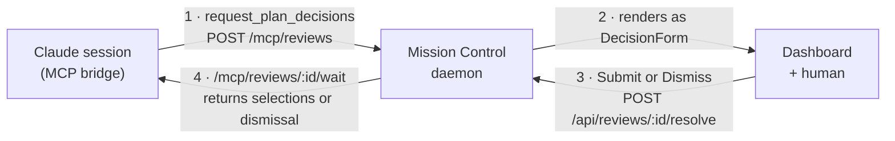

# Plan: Interactive plans (option-select decisions, answered from the dashboard)

Status: **implemented.**

## Goal

Two changes, driven by the `html-plans` skill:

1. **Every plan is rendered as HTML.** The skill always emits a self-contained
   `docs/plans/<name>/plan.html` beside the markdown, not only when someone asks to
   "share" it.
2. **A plan that needs a decision presents its options as selectable controls with
   Submit and Dismiss buttons.** The agent presents the choices and blocks; submitting
   returns the selections, while dismissing releases the wait without fabricating an
   answer - no copy-paste or free-text round-trip.

## Approach (decided): reuse the MCP review channel

The dashboard already has a blocking request/response path an agent can drive:
`src/mcp/server.ts` exposes `request_input`/`request_review`, which create a *review*,
block on `/mcp/reviews/:id/wait`, and return the human's resolution as the tool result.
The daemon binds the call to the right session from its terminal env
(`registry.findSessionByEnv`), so **the agent never needs to know its own session id**,
and there is **no token or CORS surface** because the resolving UI is the same-origin,
loopback-guarded dashboard.

Interactive plans are one more review *kind* on that exact path. A submission returns
selections to the blocked agent, while a dismissal returns an explicit no-response result.
This was chosen over a standalone file that
POSTs into the pane, which would have to bake the daemon token and a churn-prone
`session.id` into a file on disk, clear CORS from a `file://` origin, and time its pane
inject against the agent's prompt - every hazard the env-join path already avoids.

The static `plan.html` is still always written (goal 1); it is the skimmable copy. The
*interactive* surface is the dashboard's render of the review.

The request flow of one decision round-trip, across the three major components:



## Data model

New review kind `plan-decisions`. The plan body stays markdown in `body`; the decision
points ride alongside as structured data.

`src/shared/types.ts`:

```ts
export type ReviewKind = "plan" | "diff" | "input" | "plan-decisions";

export interface PlanDecisionOption {
  id: string;            // stable; echoed back in the selection
  label: string;         // what the human reads
  detail?: string;       // optional one-line elaboration
  recommended?: boolean; // renders a "recommended" hint
}
export interface PlanDecision {
  id: string;                     // stable id for this question
  question: string;
  options: PlanDecisionOption[];
  multiSelect?: boolean;          // checkboxes vs radios
  allowOther?: boolean;           // adds a free-text "Other" field
}

export interface ReviewItem {
  // ...existing fields...
  decisions?: PlanDecision[] | null;
}
```

`src/shared/types.ts` owns the current review-kind and status unions.

## Backend

- **`src/server/db.ts`** - add a nullable `decisions TEXT` column via the existing
  idempotent `addColumn(d, "reviews", "decisions", "TEXT")` in `migrate()` (no table
  rebuild). `insertReview` serializes `decisions` to JSON or null; `rowToReview` parses
  it back. This keeps `body` pure plan markdown, which both the dashboard render and the
  static-file generator consume unchanged.
- **`src/shared/protocol.ts`** - add `PlanDecisionSchema` (+ option schema). Extend
  `CreateReviewSchema.kind` to include `"plan-decisions"` and add an optional
  `decisions` field. `ResolveReviewSchema` accepts `action: "dismiss"` and normalizes
  its `response` to null so a supplied value can never masquerade as a selection.
- **`src/server/reviews.ts`** - `create(...)` takes an optional `decisions` and stores it
  on the item. `resolve(...)` limits dismissal to option-bearing reviews, persists the
  `dismissed` status with no response, and wakes only that review's waiters.
- **`src/server/routes.ts`** - `/mcp/reviews` forwards `decisions` into `reviews.create`.
  `/api/reviews/:id/resolve` returns a client error when dismissal is not available for
  that review.

## MCP tool

**`src/mcp/server.ts`** - new tool `request_plan_decisions({ title, plan, decisions })`.
It creates a `plan-decisions` review, blocks via `waitForResolution`, and returns either
`review.response` - the formatted selections - or an explicit dismissal result without
selections. `createReview` is generalized to carry an optional `decisions` payload on the
POST.

## Frontend

- **`src/web/components/PlanDecisions.tsx`** (new) - a `DecisionForm` that renders each
  decision as a radio group (single) or checkbox group (multi), an optional "Other" text
  field, a **Submit** button disabled until every decision is answered, and an optional
  **Dismiss** button. Submit formats a readable, deterministic response string (one line
  per question with the chosen label(s), plus any free text); Dismiss resolves the review
  without formatting or sending the form state.
- **`src/web/components/ReviewModal.tsx`** - `ReviewCard` gains a `plan-decisions` branch:
  render the plan with the existing `PlanView`, then the `DecisionForm`, whose Submit
  resolves with `action: "answer"` and whose Dismiss resolves with `action: "dismiss"`.
- **`src/web/styles.css`** - `.decision` / `.decision-option` styling, derived from the
  existing review controls.

## The skill (`skills/html-plans/SKILL.md`)

- Broaden the trigger: **every** plan is rendered to `plan.html` (goal 1), not only when
  asked to share.
- Add the interactive path (goal 2): when a plan has open decisions, call
  `request_plan_decisions` with the plan markdown and the decision points, then proceed
  on the returned selections. Keep the static-file discipline (self-contained, offline,
  light/dark).

## Tests

- **db round-trip** - a `plan-decisions` review with decisions survives
  insert -> `loadPendingReviews`, and a null-decisions review stays null.
- **protocol** - `CreateReviewSchema` accepts the new kind + decisions and rejects a
  malformed decision.
- **render** - `react-dom/server` render of `ReviewModal` with a `plan-decisions` review
  shows the questions, options, and a disabled-until-answered Submit (matching the
  existing `*-render.test.ts` convention; the SSE stream blocks browser automation here).
- **http** - the full round-trip over the real daemon: `POST /mcp/reviews` creates the
  review, `POST /api/reviews/:id/resolve` submits or dismisses it, and the blocked
  `/mcp/reviews/:id/wait` returns that resolution to the caller. Independent pending sets
  keep the session under Needs you until each has been submitted or dismissed.

## Out of scope

- Standalone `file://` page POSTing selections (the rejected Option 2/3); revisit only if
  a plan must be answerable with the dashboard closed.
- Server-side validation of selections against the decision set (the resolver is
  same-origin and loopback-guarded).
