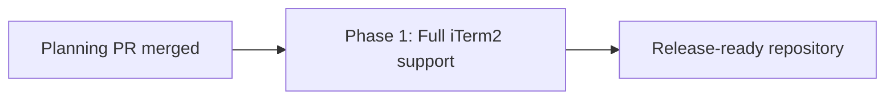

# Full iTerm Support: Phased Implementation Plan

Source plan: [plan.md](plan.md)

Status: Ready to schedule after this planning branch is committed and pushed

## Incorporated Human Decisions

On 2026-09-03, the operator approved the root plan as written and selected phased implementation planning. The approved choices require:

- backend ID `iterm` with display label `iTerm2`;
- the built-in AppleScript interface behind the existing terminal adapter contract;
- the complete iTerm2-supported capability set, including capture and retitle;
- stable session unique IDs, TTY correlation, and best-effort working directory;
- new-window spawn behavior;
- existing automatic emulator precedence, with iTerm2 appended after WezTerm and Ghostty;
- hook identity propagation and environment scrubbing;
- one compatible feature delivery with no persisted-data migration.

No product or architecture choice remains open.

## Repository Findings

- `EMULATOR_IDS` and `SETUP_DEPENDENCY_IDS` are append-only shared contracts. Their exhaustive records make an omitted adapter or setup probe fail typecheck.
- `TerminalEmulator` already expresses the full required surface. `TerminalExec` accepts standard input, so iTerm2 scripts and prompt bodies can avoid process argument limits.
- `enumerateTerminals` already checks a declared host process before calling an emulator list function. iTerm2 needs that gate because AppleScript application addressing can launch a closed app.
- `bindPane`, terminal actions, terminal targets, session naming, and tmux host correlation are vendor-neutral. They need fixtures and acceptance coverage for iTerm2, not new vendor branches.
- Hook binding is not yet vendor-neutral at the environment edge. `captureTerminalEnv`, the optional protocol environment schema, and `overlayKeyFromEnv` explicitly know tmux and WezTerm. iTerm2 must add `ITERM_SESSION_ID` to that narrow edge.
- Claude SDK sessions, Codex SDK sessions, and one-shot headless runners already remove inherited terminal pane identity so hooks cannot bind them to the daemon's terminal. The same boundary must remove iTerm2 identity.
- Setup rows are projected by family at render time, but one catalog test currently assumes dependency IDs are physically grouped by family. Appending iTerm2 must preserve the stable tuple and replace that obsolete ordering assertion with a projection assertion.
- Settings and launch controls derive from terminal registries and routes. No iTerm-specific React branch is expected, but the newly visible row and launch choice still require Playwright coverage.
- General browser fixtures pin installed emulator binaries to absent paths to avoid machine-dependent results. They need the same pin for `ITERM_BIN`.
- No database schema, migration, generated protocol artifact, release workflow, or background helper is required.

## Sizing and Phase Count

Estimated non-test implementation size: **420 to 650 lines**.

Assumptions behind the range:

- 280 to 420 lines for the iTerm2 adapter, delimiter-safe parsing, AppleScript execution, binary specification, and a small neutral quoting helper;
- 80 to 130 lines for shared IDs, exhaustive registries, host-gate documentation, hook schema and matching, and environment scrubbing;
- 60 to 100 lines for setup metadata, probe wiring, and fixture integration;
- no database migration and no new React component or route are expected;
- tests and documentation are excluded from this estimate.

There is exactly one implementation phase. Although the estimate exceeds 200 lines, every concern participates in one vertical terminal capability slice. Registering the adapter before hook identity and browser evidence would expose incomplete iTerm2 support. Landing hook or setup contracts before the adapter would publish a selectable backend that cannot work. Keeping the adapter unregistered would leave dead production code. One phase is therefore safer and more reviewable than an artificial foundation-and-activation split.

## Phase Topology

| Phase | Outcome | Direct dependencies | Concurrency group |
| --- | --- | --- | --- |
| [1. Full iTerm2 support](phase-1-full-iterm-support.md) | Complete, tested iTerm2 terminal behavior from discovery and hooks through setup and launch UI | Planning PR merged | A |

## Dependency Graph

## Merge Order

1. Merge this planning pull request so every referenced plan path exists on the default branch.
2. Release the single Phase 1 task from its planning-session dependency.
3. Merge the Phase 1 implementation only after its complete automated and live macOS exit gate passes.

The Phase 1 task must depend directly on the current planning session. There are no implementation-phase dependency edges because there is only one phase.

## Cross-Phase Contracts

There is no implementation-to-implementation handoff, but the phase must preserve these existing boundaries:

- `iterm` is appended to stable ID tuples; existing IDs and precedence never move.
- Browser code sends backend and dependency IDs only. The daemon owns commands, AppleScript, target resolution, and install remedies.
- iTerm2 uses the existing `TerminalEmulator` capability model, `EmulatorPane` projection, `bindPane` selection, TTY correlation, and terminal target routes.
- Session unique ID is the durable iTerm2 action key. Mutable tab index is descriptive only.
- Passive enumeration uses the shared host-process gate and never launches iTerm2.
- `ITERM_SESSION_ID` is optional on the wire, preferred only after tmux and WezTerm pane identities, and removed from daemon-owned agent children.
- AppleScript and prompt content use subprocess standard input. Shell argv and working directories retain existing quoting helpers and boundaries.
- Automation denial, stale sessions, malformed output, and timeouts fail within the iTerm2 backend and do not disable other terminal discovery.
- A visible UI change is complete only with Playwright evidence against fake agents and no `data-testid` selectors.
- No SQLite writer, migration, new session-eviction path, or release configuration enters this scope.

## Final Verification Strategy

Phase 1 owns the full release bar:

- adapter, parser, target, correlation, hook, environment, setup, and route unit contracts;
- browser coverage for setup and launch behavior using deterministic fixtures;
- typecheck, lint, full unit suite, build, bundle smoke, and full Playwright suite;
- live iTerm2 validation for stable identity, exact PTY bytes, capture, focus, retitle, spawn, tmux composition, no-auto-launch behavior, and Automation permission recovery;
- packaged Electron validation for macOS Automation behavior;
- documentation and configuration review against the shipped capability set.

## Cross-Phase Compatibility Audit

Final audit completed on 2026-09-03:

- Every capability in the source plan is owned by Phase 1 exactly once.
- The human-approved ID, label, transport, precedence, spawn behavior, hook boundary, and no-migration decisions are reproduced without reopening them.
- There is no concurrent implementation work and no undocumented merge ordering.
- Existing shared registry and route ownership remains authoritative; no second source of truth is introduced.
- The only wire change is an optional environment field, so older hook payloads remain valid.
- The only stable-ID changes are append-only, so existing persisted selections remain readable.
- Tests and documentation ship with the behavior they validate rather than in a later cleanup phase.
- The repository is expected to be operable before and after the single implementation merge.

## Scheduling Record

Schedule exactly one implementation task after all plan artifacts are committed and pushed. The task points to `plan.md`, this index, and `phase-1-full-iterm-support.md`, depends on the current planning session, and remains backlogged until this planning pull request merges.

The task ID and planning-session dependency will be recorded in the pull request description. No repository attachment is needed because implementation and plan artifacts are both in this Mission Control repository.
