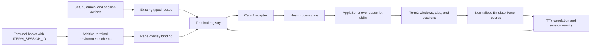

# Full iTerm Support

## Outcome

Mission Control will treat iTerm2 as a first-class terminal emulator under the existing terminal registry. An operator using iTerm2 will be able to discover and name sessions, send prompts and key input, capture visible terminal content, focus an existing pane, open a worktree in a new iTerm2 window, rename the containing tab, and compose those behaviors with tmux. Setup and launch surfaces will expose iTerm2 without adding vendor branches to shared routes or React components.

The stable backend ID will be `iterm`, while user-facing copy will use the product name `iTerm2`.

## Capability Contract

| Capability | Required iTerm2 behavior | Acceptance boundary |
| --- | --- | --- |
| Availability | Detect `/Applications/iTerm.app` or `ITERM_BIN`; do not start iTerm2 during discovery | A closed iTerm2 remains closed after setup checks and session enumeration |
| Discovery | Enumerate windows, tabs, and sessions with stable session identity, TTY, titles, active state, and best-effort working directory | Multiple windows, tabs, and split sessions remain distinct and correlate by TTY |
| Naming | Use the tab title as the emulator-provided session name | A rename is visible in iTerm2 and in the next Mission Control enumeration |
| Text and keys | Send literal text, Enter, Escape, arrows, Tab, Shift-Tab, and control sequences through the shared write contract | PTY-level tests and a live shell receive the intended bytes |
| Prompt paste | Deliver multi-line prompts using bracketed paste semantics | Prompt injection does not degrade to unsafe per-line command execution |
| Capture | Return the visible session contents when iTerm2 makes them available | Capture failures are local to the capability and do not break discovery |
| Focus | Select the exact session, tab, and window, then activate iTerm2 | Focus never relies on a mutable tab index as the durable target |
| Spawn | Open a new iTerm2 window in the requested worktree and run the requested argv | Working directory, command argv, returned target, and title are correct |
| tmux composition | Join iTerm2 sessions to tmux clients by TTY and raise the existing outer session | Existing tmux-in-iTerm2 sessions focus correctly; fallback attach opens a new iTerm2 window |
| Hook binding | Capture `ITERM_SESSION_ID` and bind hook events to the matching iTerm2 session | Terminal hooks update the intended Mission Control session without identity leakage into SDK or headless children |
| Setup and launch UI | Show iTerm2 status, remedy, and launch target through registry-driven surfaces | Browser tests cover the visible setup row and launch action |

## Evidence and Constraints

- The current emulator boundary in `src/server/terminal/types.ts` already models list, write, capture, focus, spawn, and retitle capabilities. WezTerm and Ghostty implement that contract, and shared routes, actions, and UI derive from the registry.
- iTerm2 3.6.11 is installed in the investigation environment. Its bundled scripting dictionary exposes windows, tabs, sessions, stable session unique IDs, TTYs, visible contents, writable tab titles, session selection, text input, and creation of a window with a command.
- iTerm2's official scripting documentation confirms the same AppleScript object hierarchy and operations. AppleScript is in maintenance mode in favor of the Python API, but it remains built in. The Python API would add a Python package, WebSocket connection, and separate API-permission lifecycle. This plan uses AppleScript behind the adapter boundary so the transport can be replaced later without changing the terminal contract.
- AppleScript `tell application` can launch an application. The adapter must declare the `iTerm2` host process and rely on the existing host-process gate before enumeration so passive discovery cannot start it.
- iTerm2 exports `ITERM_SESSION_ID` to terminal children. Mission Control currently captures only tmux and WezTerm identities, so full support requires an additive hook protocol field and matching overlay-key logic.
- Terminal backend and setup dependency IDs are persisted append-only contracts. `iterm` must be appended to both ID lists. Setup grouping is a presentation projection and must not be enforced by reordering the persisted tuple.
- The browser must continue to send only a dependency ID and terminal backend ID. The daemon owns the fixed installation command and terminal action details.

Primary references:

- [iTerm2 scripting documentation](https://iterm2.com/documentation-scripting.html)
- [iTerm2 session title documentation](https://iterm2.com/documentation-session-title.html)
- [Homebrew iTerm2 cask](https://formulae.brew.sh/cask/iterm2)

## Adopted Design

### Registry and availability

Append `iterm` to `EMULATOR_IDS` in `src/shared/terminal.ts` and register one `TerminalEmulator` implementation in `src/server/terminal/registry.ts`. Add `ITERM_BIN` resolution in `src/server/terminal/bin.ts`, preferring an explicit override and then the standard application bundle path. The adapter will invoke the system `osascript` binary and declare `hostProcess.commands = ["iTerm2"]` so enumeration is gated on a live host process.

This preserves the existing preference order: WezTerm, then Ghostty, then iTerm2. Operators who explicitly select iTerm2 can always launch it; automatic fallback behavior does not change for existing users.

### Adapter and stable targeting

Add `src/server/terminal/iterm.ts` and a neutral AppleScript quoting/execution helper in `src/server/terminal/applescript.ts`. Ghostty will reuse only the proven quoting helper, with no transport or behavioral rewrite.

One AppleScript enumeration call will traverse every window, tab, and session and emit a delimiter-safe representation. Each normalized pane will use the iTerm2 session `unique ID` as `paneId`, the session TTY for strong correlation, the tab title for naming, and active state derived from the current tab and current session. Working directory is best effort through iTerm2's session variable support and may be absent when shell integration does not provide it.

All mutations will locate the target by session unique ID. Tab index may be returned as descriptive metadata, but it will not be used as the durable action key. Scripts and payloads will be passed to `osascript` through standard input so long prompts do not consume process argument space. All commands will retain the existing timeout and null-on-capability-failure behavior.

The adapter will implement:

1. Literal text with `write text ... newline no` and explicit newline handling.
2. The shared key vocabulary using terminal control sequences, including bracketed paste wrappers for prompt delivery.
3. Visible-content capture from the selected session.
4. Exact session, tab, and window selection followed by application activation.
5. New-window creation using a safely quoted shell command that changes to the requested working directory and then executes the requested argv.
6. Tab retitling through the tab containing the selected session.

### Hook identity and environment hygiene

Extend the additive terminal environment schema with `itermSession`, populate it from `ITERM_SESSION_ID`, and map it to the `iterm` overlay key after the existing tmux and WezTerm checks. A focused live validation will confirm that the environment value and AppleScript session unique ID match exactly; if the installed version decorates either value, one shared normalization function will own that conversion and reject ambiguous values.

Remove `ITERM_SESSION_ID` from daemon-owned SDK, one-shot, and headless child environments wherever `TMUX_PANE` and `WEZTERM_PANE` are already scrubbed. Extend fake-agent fixtures to record the variable and prove it is absent. This prevents an agent process from impersonating the daemon's own iTerm2 session.

### Setup and user surfaces

Append an `iterm` dependency record to `src/shared/setup-catalog.ts`, add its setup probe, and use the fixed remedy `brew install --cask iterm2`. Update the setup-catalog contract so append-only identity order remains authoritative while family grouping is verified at the rendered projection.

The existing settings, terminal target, launch, and focus surfaces should consume the new registry entry without iTerm-specific React branches. Add browser coverage for the visible iTerm2 setup row and a launch-target selection that posts backend `iterm`. Pin `ITERM_BIN` to an absent fixture path in general end-to-end tests so a developer's local installation cannot alter unrelated snapshots or target lists.

### Runtime flow

## Implementation Work

### 1. Extend stable contracts and registries

- Append the `iterm` emulator and setup IDs without renaming or reordering existing IDs.
- Register availability, setup metadata, and the emulator implementation through the existing exhaustive records.
- Expand the host-process documentation to cover both TTY fallback and no-auto-launch discovery gating.
- Update terminal fakes and registry contract tests so exhaustive typing remains useful.

### 2. Implement and harden the iTerm2 adapter

- Add binary resolution, AppleScript helpers, delimiter-safe enumeration parsing, and stable session targeting.
- Implement the complete capability set described above.
- Keep failures scoped: a denied Automation permission, stale target, malformed response, or timed-out script returns the established null or failed result without breaking other backends or global enumeration.
- Verify that prompt content and generated scripts travel over standard input, not process argv.

### 3. Complete session binding

- Add `ITERM_SESSION_ID` capture to the harness runtime and optional protocol schema.
- Map hook events to the `iterm` pane token with existing tmux precedence intact.
- Scrub inherited identity from all daemon-owned agent launch modes and cover the boundary in unit and browser fixtures.

### 4. Expose setup and launch behavior

- Add the optional iTerm2 setup check and Homebrew cask remedy.
- Preserve registry-derived settings and launch menus.
- Add Playwright coverage for setup visibility, remedy copy, target selection, route payload, and success feedback.

### 5. Document support and permissions

- Update terminal support, session behavior, and configuration documentation with `ITERM_BIN`, supported capabilities, and the macOS Automation permission lifecycle.
- Explain how to allow, deny, and later revoke iTerm2 automation, and distinguish passive discovery from an explicit launch.
- Do not rewrite archived mockups or historical plans that correctly describe the state at their time.

## Failure and Compatibility Behavior

| Condition | Required behavior |
| --- | --- |
| iTerm2 not installed | Setup reports Missing; the backend is absent from available launch targets |
| iTerm2 installed but closed | Passive checks do not launch it; explicit launch may start it |
| Automation permission denied | iTerm2 actions fail locally with actionable diagnostics; WezTerm, Ghostty, and tmux continue working |
| Session closed between list and action | The action returns a stale-target failure and does not fall back to another session |
| Shell integration lacks working directory | Discovery keeps the pane with `cwd: null`; TTY correlation and actions remain available |
| Malformed or partial AppleScript output | Invalid records are rejected; one backend failure does not erase other terminal discovery |
| Existing persisted configuration | No migration is needed; existing backend IDs and preference order remain unchanged |

## Verification

Automated verification:

1. Add focused adapter tests for parsing, quoting, stable target traversal, every key sequence, bracketed paste, capture, focus, spawn argv and working directory, retitle, timeout, stale targets, and nonzero AppleScript exits.
2. Add enumeration and correlation tests for the non-running host gate, exact TTY joins, active pane selection, and failure isolation.
3. Add hook protocol and overlay tests for `ITERM_SESSION_ID`, precedence inside tmux, normalization, and SDK/headless environment scrubbing.
4. Add setup catalog, setup probe, terminal target, launch route, and registry tests.
5. Add Playwright coverage for the iTerm2 setup row and selecting iTerm2 as a launch target. Inspect the built UI for layout, focus, and feedback quality.
6. Run focused tests with the repository preload, then `npm run typecheck`, `npm run lint`, `npm test`, `npm run build`, `npm run smoke`, and `npm run test:e2e`.

Live macOS acceptance uses a disposable shell and test worktree:

1. Confirm passive discovery does not launch a closed iTerm2.
2. Exercise first-use Automation approval, denial, retry, and revoked-permission behavior.
3. Enumerate multiple windows, tabs, and split sessions and verify unique IDs, titles, TTYs, active state, and best-effort working directories.
4. Verify literal input, every supported key, long and multi-line bracketed paste, and exact PTY bytes.
5. Capture a shell and full-screen terminal UI, focus each split precisely, rename its tab and read the title back, and spawn a titled window in the requested worktree.
6. Run tmux inside iTerm2 and verify both raising an attached client and opening a fallback attach window.
7. Repeat the critical flows from the packaged Electron application to detect any macOS permission or packaging difference. No entitlement or release configuration changes are expected unless this validation proves they are required.

## Scope Boundaries

Included:

- iTerm2 discovery, actuation, capture, naming, launch, hook binding, setup, documentation, automated coverage, and packaged-app validation.
- Small shared refactors required to keep AppleScript quoting and setup grouping single-sourced.

Excluded:

- Replacing the terminal emulator abstraction.
- Adding iTerm2 profile management, badges, proprietary triggers, or Python API plugins.
- Changing the default terminal preference for existing users.
- Adding a database migration, feature flag, background helper service, or new browser-side vendor branch.
- Editing release, signing, deployment, or CI configuration unless packaged acceptance demonstrates a concrete requirement and that expansion is reviewed separately.

## Decisions Recorded

- Use backend ID `iterm` and display label `iTerm2`.
- Use the built-in AppleScript interface behind the existing adapter contract, not the Python API.
- Implement the full capability set exposed by iTerm2, including capture and retitle even though individual existing emulators have capability gaps.
- Address sessions by unique ID, correlate them by TTY, and treat working directory as best effort.
- Open a new iTerm2 window for the existing emulator spawn contract.
- Preserve current automatic emulator priority by appending iTerm2 after WezTerm and Ghostty.
- Add hook identity propagation and environment scrubbing as part of full support.
- Land this as one compatible feature change with no persisted-data migration.
- Human review on 2026-09-03 approved this root plan as written and selected phased implementation planning.

## Open Decisions

There are no unresolved product or architecture choices in the root plan. Human review confirmed the scope and acceptance bar and selected phased implementation planning.
