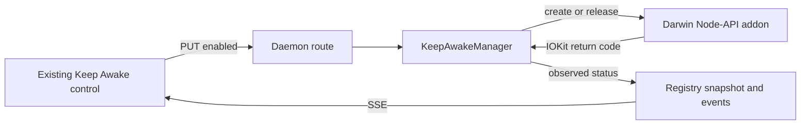

# Native Keep Awake provider

## Outcome

Replace Mission Control's macOS `/usr/bin/caffeinate` child with a daemon-owned, in-process
IOKit power assertion. Keep Awake must continue to let the display dim, turn off, and lock on
the normal schedule while preventing only user-idle system sleep so local agents and recurring
work can continue.

The user selected option 1 from the 2026-08-18 Scout report: **in-process IOKit through a small
Node-API addon**. This plan records that selection as the approved direction. It is a provider
replacement, not a redesign of the Keep Awake control.

## Why change the provider

The current manager starts `/usr/bin/caffeinate -i -w <daemon PID>`. On the checked managed Mac,
the child started and was then terminated with `SIGKILL`, leaving Mission Control in
`live · awake failed`. The evidence did not identify which process or policy sent the signal.

Apple exposes the same narrow behavior directly through
`kIOPMAssertionTypePreventUserIdleSystemSleep`: idle user activity does not put the system to
sleep, but the display may dim and sleep, and lid close, manual Sleep, low battery, thermal
protection, shutdown, and power loss still win. An in-process call removes the specifically
observed executable and child-process surface without simulating activity or keeping the display
awake.

This is not authorization to evade an intentional endpoint control. Live verification must stop
and surface the result if the native assertion is also denied or if the endpoint-management owner
states that all local sleep inhibition is prohibited.

## Approved decisions

- The macOS production provider is a small raw Node-API addon that calls IOKit in the daemon
  process.
- The assertion type is `kIOPMAssertionTypePreventUserIdleSystemSleep`, with a bounded,
  human-readable Mission Control reason.
- Electron `powerSaveBlocker` is not the primary provider. It exists only in Electron's main
  process and cannot serve browser, adopted-daemon, `npm start`, or LaunchAgent modes uniformly.
- The existing `MISSION_KEEP_AWAKE_BIN` command-provider override remains as a test seam so Linux
  CI can drive the built daemon and browser without changing host power settings. It is not the
  macOS production default or a fallback after a native denial.
- Keep Awake remains transient, off on every daemon start, explicitly enabled by a person, and
  released on disable, orderly shutdown, daemon crash, or restart.
- No display-sleep assertion, user-activity declaration, automatic retry, persistence, or
  coupling to Away mode or schedules is added.

## Current contracts that stay intact

The current vertical slice already owns the right product behavior:

- `KeepAwakeManager` in `src/server/keep-awake.ts` serializes transitions and publishes observed
  state rather than echoing a request.
- `GET /api/keep-awake` and `PUT /api/keep-awake` in `src/server/routes.ts` are the only control
  path.
- Registry snapshot plus `keep_awake_status` SSE are the browser's only state source.
- `KeepAwakeControl.tsx` keeps reconnecting precedence, disables stale input, and promises that
  the screen can lock normally.
- The mode has no database row, config key, startup restore, or automatic reacquisition.
- The Electron shell may supervise or adopt a daemon, and the same daemon implementation also
  runs through `npm start` and the LaunchAgent.

Those contracts remain. The change is below the manager's public API and should not create a
second source of truth in Electron or React.

## Runtime design

### Native assertion handle

Add a Darwin-only addon under `native/keep-awake/`, built with raw Node-API and Objective-C++.
The addon exports a side-effect-free module with two operations:

1. Create one idle-system-sleep assertion and return an opaque handle only after IOKit returns
   `kIOReturnSuccess`.
2. Release that exact handle and report any I/O return failure.

The handle finalizer releases an assertion that JavaScript accidentally abandons, but normal
ownership is deterministic: `KeepAwakeManager.stop()` and the disable path call release directly.
The operating system removes process-owned assertions if the daemon dies before either path runs,
which replaces `caffeinate -w <daemon PID>` as the crash backstop.

The addon must make no power assertion while it is imported. This lets build, smoke, and packaged
startup checks load it without changing host power state.

### Provider boundary

Refactor `KeepAwakeManager` around one injected provider contract rather than around one child
process. The production resolver selects:

1. the existing command provider when `MISSION_KEEP_AWAKE_BIN` is explicitly set, for tests;
2. the native IOKit provider on Darwin; or
3. no provider on unsupported platforms.

The manager keeps its transition mutex, idempotence, bounded error strings, and observed-state
publication. Native enable reaches `on` only after IOKit success. Native disable reaches `off`
only after release succeeds. A failure reaches `error`, does not silently start `caffeinate`, and
does not retry automatically.

Append `"iokit"` to `KeepAwakeStatus.provider` while retaining `"caffeinate"` for the explicit
command fixture. The value is live wire state, not persisted data, so no migration is required.

### Request and status flow

No request crosses into Electron. The daemon remains the single owner in every launch mode.

## Build and package design

- Add `node-gyp` as a direct development dependency rather than relying on electron-builder's
  transitive copy.
- Add a small build script that does nothing on non-Darwin hosts, compiles the addon on Darwin,
  and copies the `.node` artifact to `dist/native/keep-awake.node`.
- Run that build before the daemon starts in development and before the normal production build.
  Vite clears only `dist/web`, so it must not erase `dist/native`.
- Load the addon from one path derived from `import.meta.url` that resolves correctly from both
  `src/server/` under `tsx` and the bundled `dist/server/index.mjs`.
- Keep the addon external to esbuild. `electron-builder.yml` already includes `dist/**/*`, but its
  comments and package verification must acknowledge that one native artifact now ships beside
  the bundled JavaScript.
- Use a stable Node-API version supported by Node 24 and Electron 43's Node 24 utility process.
  Do not bind directly to V8 or Electron's module ABI.
- The current desktop target is macOS arm64. The build must fail clearly on a requested Darwin
  architecture it did not produce rather than copying a host binary under a misleading name.

## Failure and compatibility behavior

| Condition | Required result |
|---|---|
| Native addon absent or cannot load on macOS | Keep Awake reports unavailable with a bounded reason; no command fallback |
| IOKit create returns failure | Transition reports error and the UI never claims awake |
| IOKit release returns failure | Transition reports error; the manager retains the handle so a later disable may retry |
| Daemon exits or crashes | The process-owned assertion disappears; the next daemon starts off |
| Explicit test command exits | Existing visible error and bounded stop behavior remain for the fixture provider |
| Unsupported platform without override | Keep Awake remains unavailable and spawns nothing |
| Older browser sees provider `iokit` | Browser behavior is unchanged because it does not branch on the provider string |

There is no database, configuration, or downgrade migration. A downgrade returns to the older
`caffeinate` implementation; it cannot inherit an assertion from a prior daemon because that
assertion dies with the prior process.

## Repository work

| Area | Planned change |
|---|---|
| `native/keep-awake/` | Objective-C++ Node-API source and `binding.gyp` for the IOKit assertion |
| `scripts/` and `package.json` | Conditional native build, direct `node-gyp` dependency, and dev/build integration |
| `src/server/keep-awake.ts` | Provider abstraction, native default on Darwin, retained command test provider |
| `src/server/keep-awake-native.ts` | Typed, side-effect-free addon loader and IOKit provider adapter |
| `src/shared/types.ts` | Append `iokit` to the live provider union and update observation comments |
| `test/keep-awake.test.ts` | Provider-selection, native success/failure/release, serialization, and command-fixture coverage |
| `scripts/smoke-bundles.mjs` | Verify the Darwin native artifact exists and loads without asserting power |
| `e2e/` | Retain the fake command provider and update assertions/comments that over-specify production `caffeinate` |
| `docs/sessions.md` and `docs/runbooks/keep-awake.md` | Describe the native assertion, its owner, and the revised real-Mac receipt |
| `electron-builder.yml` | Document and verify the native artifact already captured by `dist/**/*` |

Exact filenames are the proposed route. The implementation agent may adapt them when the current
repository shows a simpler compatible owner, but the daemon ownership and product behavior above
are fixed.

## Verification

### Automated

- Unit tests use injected fake providers and never call real IOKit or alter host power settings.
- Provider tests cover macOS native selection, explicit command override precedence, unsupported
  platforms, create failure, release failure and retry, double enable/disable, opposite concurrent
  requests, bounded errors, and shutdown.
- Existing HTTP, Registry/SSE, render, and browser reducer tests continue to pass.
- The built Playwright spec continues through the fake command provider on Linux, proving the
  click-to-route-to-provider-to-SSE flow without model tokens or host power changes.
- `npm run build` produces the native artifact on Darwin and skips it deliberately on Linux.
- `npm run smoke` proves the daemon bundle resolves and loads the artifact on Darwin without
  creating an assertion.
- `npm run package` proves the packaged Electron utility process can load the signed/ad-hoc-signed
  addon from the application bundle.

### Real macOS receipt

After endpoint-policy alignment, test a real packaged build and a standalone daemon:

1. Confirm no `caffeinate -i -w` process appears when Keep Awake is enabled.
2. Confirm `pmset -g assertions` names the Mission Control daemon as owner of a
   `PreventUserIdleSystemSleep` assertion and shows no Mission Control display-sleep assertion.
3. Lock the screen and wait past the display-sleep interval. Confirm authentication is required
   and a non-destructive Mission Control job continues to make progress.
4. Disable Keep Awake and confirm the assertion disappears.
5. Enable it again, kill the daemon, and confirm the assertion disappears without cleanup code.
6. Restart and confirm the mode is off. Repeat through packaged Electron, an adopted daemon, and
   the LaunchAgent path.

If the native assertion is terminated, denied, or contradicted by endpoint policy, stop. Record
the exact return, process, and policy evidence rather than adding an evasive fallback.

## Non-goals

- Keeping the display awake or simulating user input.
- Overriding lid close, manual Sleep, shutdown, low-battery, or thermal behavior.
- Persisting or automatically reacquiring Keep Awake.
- Moving ownership into Electron or adding daemon-to-Electron IPC.
- Shipping Windows or Linux production inhibitors.
- Building remote execution infrastructure.
- Changing Keep Awake UI layout, copy, routes, SSE event names, or database state.

## Sources and evidence boundaries

- Current implementation: `src/server/keep-awake.ts`, `src/shared/types.ts`,
  `src/server/routes.ts`, `e2e/specs/keep-awake.spec.ts`.
- Existing product contract: `docs/sessions.md` and `docs/runbooks/keep-awake.md`.
- Historical design: `docs/plans/keep-awake/plan.md` and its Phase 1 plan.
- Apple assertion semantics and APIs:
  <https://developer.apple.com/documentation/iokit/kiopmassertiontypepreventuseridlesystemsleep>,
  <https://developer.apple.com/documentation/iokit/1557134-iopmassertioncreatewithname>, and
  <https://developer.apple.com/documentation/iokit/1557090-iopmassertionrelease>.
- Node-API ABI boundary: <https://nodejs.org/api/n-api.html>.
- Scout evidence established a `SIGKILL` of `caffeinate`, not its sender or policy rationale. The
  native provider remains a hypothesis until controlled live verification succeeds.
