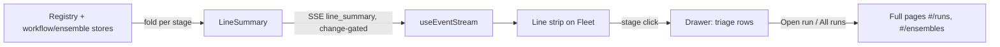

# The Library and the Line

Adopted direction from the automation-prominence explorations. One product with two homes,
organized by the split the current UI blurs: **what you author** versus **what is happening**.

- The **Library** is the only home for authored, reusable assets: workflows, Personas, actions,
  ensemble strategy launchers, and intake (missions and sources).
- The **Fleet, wearing the Line**, is the only home for live execution: sessions, tasks, workflow
  runs, and ensembles. The Line is a permanent pipeline strip - intake, backlog, working, review,
  decide, shipped - with per-stage drawers for triage.
- The cost bar's second topbar row is retired for a compact cost chip and a spend popover.

Mockups (the visual source for every surface named here):

- Round 2 (this direction): `docs/archive/mockups/automation-prominence-2/` - `index.html`,
  `1-library-line.html` (the adopted concept), `2-standing-orders.html`, `3-threads.html`
  (explored alternatives, not adopted).
- Round 1 (lineage): `docs/archive/mockups/automation-prominence/` - the original Library (2), Line (3),
  and Palette (4) concepts this direction merges.

## Problem

1. **Five tabs, two natures.** `#/workflows` holds workflows / personas / actions / runs /
   ensembles as sibling tabs. Three are authoring surfaces, two are execution monitors; the tab
   strip says nothing about which is which (`src/web/workflows/WorkflowPage.tsx`,
   `src/web/workflows/useWorkflowRoute.ts`).
2. **Purpose is untaught.** No surface explains what a workflow, Persona, action, or ensemble is
   for; the `w` chord and one topbar button are the entire front door.
3. **Launch here, watch there.** Ensembles launch from the Dispatch modal but are watched on the
   Workflows page's fifth tab; a decided ensemble can hand off into a workflow run
   (`triggerSource: "ensemble"`) across two tabs that never point at each other.
4. **Cost chrome overspends.** The foldable UsageBar row (`App.tsx` `UsageBar`,
   `src/web/components/FleetStrip.tsx`) devotes permanent topbar space to stats consulted
   occasionally, not every glance.

## Decisions (submitted by the operator, 2026-08-01)

These are requirements, not open questions.

1. **Merge Library and Line into one shipped product.** Round 1's concepts 2 and 3, unified; round
   1's concept 4 (the everything-palette) ships as the final phase; round 1's concept 1 (rail) is
   subsumed by the Library topbar segment.
2. **Authoring vs execution is the IA.** Runs and Ensembles are not Library shelves; they surface
   on the Line, with full views re-homed to top-level routes. One authoring-shaped exception:
   ensemble strategy launchers shelve in the Library (the strategy catalog is reusable know-how);
   watching and deciding happen on the Line.
3. **Session cards are untouchable.** No data changes, no layout changes, no resizing in any
   drawer state. The board renders today's cards at full size always.
4. **Cost rework is in scope.** Retire the UsageBar second row. A topbar cost chip
   (`≈$12.40 · $3.1/hr`, machinery-purple tone) opens a spend popover carrying everything the
   FleetStrip showed: today's estimate, rate, tokens, per-PR cost, the automation line, and
   rate-limit runway meters. Per-PR cost also surfaces on the Line's Shipped stage.
5. **Drawer mechanics.** A stage click opens its drawer in place, pushing the board down; a second
   click on the same stage, `esc`, or a close button collapses it and the board returns; clicking
   a different stage swaps content. The drawer is hard-capped at three rows (~38vh) and scrolls
   internally beyond that - it never fills the viewport. Escalation is deliberate: strip glance,
   capped drawer, full page (`All runs`, `Open run`).
6. **Implementation follow-up: phased plan.** The operator directed: phase the work, schedule the
   phases into the Mission Control backlog, open a PR with the plan files, and merge when CI is
   green. See `phased-plan.md`.

## Design by surface

### Topbar

- Segmented page nav: `▦ Fleet` / `⌗ Library`, with the existing Workflows toggle chord retargeted
  to toggle Fleet and Library (`workflowsToggleRoute` in `useWorkflowRoute.ts` reworked).
- Cost chip replaces the UsageBar row; click opens the spend popover (dialog). Purple machinery
  tone, consistent with Foreman/cost precedent.
- Pulse, dispatch button, settings and report buttons unchanged.

### The Library (`#/library`)

Shelves, each headed by the question it answers, with the system noun as a mono eyebrow and a live
"on the Line →" cross-link instead of any embedded live state:

| Shelf | Question | Contents |
| --- | --- | --- |
| Workflows | What counts as done? | Workflow cards (version, bindings, last verdict, draft errors); builder one level deeper, unchanged |
| Personas | Who does the reviewing? | Persona cards with cross-engine usage (workflow gates + ensemble judge lenses) |
| Actions | What can a run tell the session to do? | Action cards (completion kind, used-by); editor one level deeper, unchanged |
| Ensembles | Not sure of the best approach? | Strategy launcher cards (Best of N, Panel vote, Consensus) deep-linking into Dispatch with the strategy preselected |
| Missions · Sources | Where does work come from? | Cards linking to the existing schedule and task-source surfaces; ownership migration out of Settings is deferred |

The Library renders no live execution state beyond the per-shelf cross-links.

### The Line (on the Fleet)

Permanent ~90px strip above the session layouts: **intake → backlog → working → review → decide →
shipped**, each stage carrying a glyph, count, and one summary sentence, amber when it needs the
operator. Stage folds are computed server-side and delivered as one SSE event; the strip never
recomputes fleet state in the browser.

Drawers per decision 5: Review shows run ladders (pipeline chips per run, action waits called out,
ensemble-handoff provenance); Decide shows the condensed decision dossier reusing the strategy
result renderers; Intake shows missions and sources. Full readers stay one click deeper.

### Route re-homing

| Today | After |
| --- | --- |
| `#/workflows` (builder tab) | `#/library` Workflows shelf; builder one level deeper |
| `#/workflows/personas` | `#/library` Personas shelf |
| `#/workflows/actions` | `#/library` Actions shelf |
| `#/workflows/runs[/:id]` | `#/runs[/:id]` (full reader unchanged) |
| `#/workflows/ensembles[/:id]` | `#/ensembles[/:id]` (detail unchanged) |

Old routes redirect permanently. The five-tab Workflows page retires once both homes exist.

### The everything-palette

`⌘K` grows from settings-only search to the app-wide palette over Library assets, live runs and
ensembles, missions, sources, and settings - each row carrying kind and live state, grouped as
Jump to / Do / Settings (`src/web/lib/settings-search.ts` grows a provider registry).

## What does not change

- Session cards and all data on them (`SessionCard.tsx`, `session-bits.tsx`).
- The Dispatch modal, including its single/ensemble launch toggle.
- The workflow builder, Persona editor, and Action editor internals; the run reader
  (`WorkflowRuns.tsx` reader half) and ensemble detail (`EnsembleDetail.tsx`) internals.
- Server ownership rules: eviction via `Registry.beginEviction`, daemon as sole DB writer.
- The `FleetCost` wire contract; the spend popover consumes it as-is.

## Phasing

Implementation is decomposed in `phased-plan.md` (five phases: cost chip; Library page; Line strip
and fold event; drawers and re-homing; everything-palette), with one backlog task per phase gated
on this plan's PR merging. Every phase carries its own e2e Playwright coverage per repository rule.
