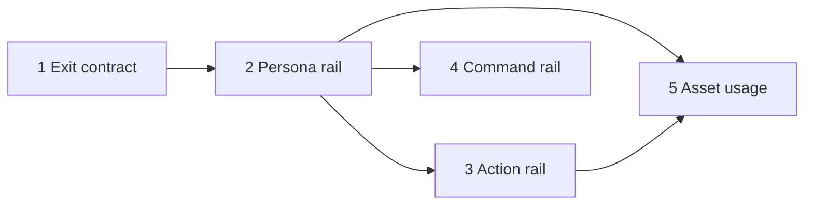

# Library detail screens: phased implementation

Source plan: [`plan.md`](plan.md) ([rendered](plan.html)). The approved direction is **Rail**, for
all three screens, chosen from nine mockups at [`mockups/index.html`](mockups/index.html).

Each phase file beside this index is the authoritative brief for one merge unit. The route and the
component names in them are implementation guidance, not a specification: re-read the adjacent
repository patterns before editing, and record any deviation in the phase's pull request.

## Incorporated decisions

| Decision | Selection | Consequence |
| --- | --- | --- |
| Detail-screen shape | **Rail** | Keep the two-pane workbench on all three screens and fix its grammar; Focus and Sheet were reviewed and rejected |
| Exit affordance | Persistent rail row + Escape | A `← Library` row above the asset list carrying `esc`, plus a page-level Escape ladder |
| Escape semantics | Editor first, page second | Inside the guidance or prompt editor Escape leaves the editor; outside it, Escape leaves the page |
| Header actions | One promoted verb + overflow | Save, or Duplicate on a built-in; everything else behind a menu |
| Metadata | Property chips | Quiet when inherited, solid when overridden |
| Dependants | "Used by" footer | Sequenced last, as its own phase - see the finding below |
| Scope of the screens | Browser only | Phases 1 to 4 add no server, schema, route or migration change |

## Repository findings that shaped the phases

- **Escape is unhandled on these routes, not swallowed.** `App.tsx` returns for any page that is not
  the fleet before reaching its Escape ladder, and no Library component registers one. The comment
  above that guard states the architecture - every non-fleet page owns its own keys - so the ladder
  belongs to the Library surfaces, as `SettingsPage`'s does to Settings.
- **The obvious fix is dead where it matters.** `SettingsPage`'s handler bails on a
  `contenteditable` target, which is exactly CodeMirror's content host. Phase 1 detects the editor
  from the focused element instead.
- **No CodeMirror extension is needed.** `basicSetup`'s three Escape bindings declare neither
  `preventDefault` nor `stopPropagation`, and CodeMirror prevents the default only when a bound
  command returns `true`. A plain Escape with a collapsed cursor bubbles cleanly. There is no
  `Prec.high` or `EditorView.domEventHandlers` anywhere in `src/web`, and this work does not
  introduce the first one.
- **The overlay stand-down channel already reaches the Library** as an `isOverlayOpen` getter prop
  on `PersonaLibrary` and `SessionActionLibrary`. `CommandLibrary` does not receive it; Phase 1
  threads it.
- **"Used by" is not client-derivable.** Persona and action ids live only inside workflow graphs, and
  `WorkflowSummary` - which documents itself as carrying the bounded catalog while graphs stay on
  HTTP - exposes only a scalar `personaCount`. The live half is derivable today, by **name** rather
  than id. This disproved a source-plan assumption; `plan.md` was corrected and the work became
  Phase 5.
- **`test/overlay-registry.test.ts` walks every `.tsx` under `src/web`** and allows `modal-backdrop`
  only in `Overlay.tsx`, checking `role="dialog"` against an allowlist. The overflow menu and chip
  popovers must use `ContextMenu`, a plain `role="menu"`, or `Overlay`.
- **Two unrelated test files import helpers directly out of `PersonaLibrary.tsx`**
  (`filterPersonas`, `readPersonaImport`). Its export surface is load-bearing beyond this redesign.
- **`RepoCombobox` swallows Escape when its list is open** and reports it through an `onEscape` the
  Command screen does not pass. Harmless today; a live conflict once Phase 1 lands, so Phase 4 owns
  it.
- **The Library index's "nothing runs from here" contract is pinned by tests.** It governs the index,
  not the detail screen you opened deliberately - Phase 5 makes that distinction explicitly and
  leaves the index's tests untouched.

## Phases

| # | Phase | File | Depends on | Surface |
| --- | --- | --- | --- | --- |
| 1 | The Library exit contract | [`phase-1-library-exit-contract.md`](phase-1-library-exit-contract.md) | - | browser |
| 2 | The Persona screen, and the rail grammar the others inherit | [`phase-2-persona-rail.md`](phase-2-persona-rail.md) | 1 | browser |
| 3 | The Action screen and its contract line | [`phase-3-action-rail.md`](phase-3-action-rail.md) | 2 | browser |
| 4 | The Command screen as a resolution table | [`phase-4-command-rail.md`](phase-4-command-rail.md) | 2 | browser |
| 5 | What is using this asset | [`phase-5-asset-usage.md`](phase-5-asset-usage.md) | 2, 3 | daemon + shared + browser |

## Dependency graph

```
        ┌── 3 ──┐
1 ── 2 ─┤       ├── 5
        └── 4   ┘
```



Direct prerequisites only. Phase 5 depends on 2 and 3 because it fills the footer slot both leave;
it does not depend on 4, which touches no shared file with it.

## Concurrency groups

| Group | Phases | Note |
| --- | --- | --- |
| A | 1 | Alone. Everything else inherits its exit contract. |
| B | 2 | Alone. It lands the primitives 3, 4 and 5 consume. |
| C | 3, 4 | Concurrent. Disjoint components, disjoint CSS rules, safe to merge in either order. |
| D | 5 | Concurrent with 4. Needs 3 merged. |

## Merge order

1 → 2 → then 3 and 4 in either order, with 5 following 3. The only serialisation that matters is
1 before 2 before everything else; the tail is free.

## Cross-phase contracts

- **`LibraryBackRow` and `useLibraryEscape`** (Phase 1). Later phases restyle around the row and must
  not move it below the rail heading, change its accessible name, alter the ladder's decision order,
  or bypass the dirty gate. Any new dismissible surface must avoid a second `window` Escape listener.
- **The four shared primitives** (Phase 2): rail group head, rail row, property chip, workspace
  header, under `src/web/library/`. Phases 3 and 4 extend them with props; they do not fork or
  restyle them locally. A change to a primitive's signature belongs in Phase 2's files and must be
  reconciled with the other concurrent phase before merging.
- **The footer slot** (Phases 2 and 3 leave it empty; Phase 5 fills it). No phase ships a partial
  answer in it.
- **Commands has no footer**, recorded in both Phase 4 and Phase 5 so the omission reads as a
  decision.
- **No phase renames a persisted identifier**, changes a slot value, or edits the route codec.

## Final verification strategy

Every phase runs `npm run typecheck`, `npm run lint`, `npm test`, and `npm run build` plus
`npm run test:e2e`. Phase 5 adds `npm run smoke`, being the only phase that changes a runtime
surface.

Every phase ships a Playwright spec, because every phase is a UI change and `e2e/` is the only layer
that connects a click to a route to a server event and back to the DOM. Each phase's spec must fail
against the branch point and pass after, and every earlier phase's spec must keep passing unedited -
a spec that needed editing is the signal that a cross-phase contract moved.

After Phase 5, the three screens match the approved mockups, the dead end is gone, and no phase left
a surface that only works because a later one is coming.
