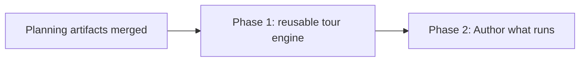

# Phased implementation: Library and workflow-runs tour

## Outcome

Ship Mission Control's second user-started product tour. The new **Author what runs** tour
teaches Personas, Session actions, Commands, Workflows, No-Mistakes Review, and the way a
finished workflow run appears in Runs and in a session's Workflows tab. It remains read-only,
spends no model tokens, and is discoverable beside **See the work** in Settings and the command
palette.

The approved product requirements live in [plan.md](plan.md). This document turns them into
two merge-aware implementation units and records where the current repository changed the
proposed route without changing the goal.

## Source and incorporated decisions

- Source: `docs/plans/library-tour/plan.md`.
- Chapter order stays Personas, Actions, Commands, Workflows.
- The tour reads a prior finished built-in No-Mistakes Review run when one still has a live
  session. It creates no run and spends no tokens.
- The existing Driver.js controller is fully extracted into a reusable engine. The existing
  tour remains the regression baseline.
- Editing is demonstrated only on built-in assets. The tour never types or writes.
- The second tour remains one 15-stop sequence with at most two beats per stop.
- On 23 August 2026 the operator explicitly replaced the earlier stop-after-plan follow-up
  with a request to phase and schedule implementation.

## Repository findings

The investigation was performed against `main` at `e2179530`.

1. **The tour remains singular and tightly coupled.**
   `src/web/tour/SeeWorkTourController.tsx` is 756 lines and owns its 14 steps, runtime,
   navigation contract, Driver.js lifecycle, fallback behavior, focus containment, progress,
   and cleanup UI. `src/web/App.tsx` owns roughly 330 additional lines of See-work-specific
   state and navigation. Settings, the palette, the overlay registry, API client, HTTP routes,
   target ids, and CSS each expose only that tour.
2. **The source plan's route line numbers have drifted.**
   The three tour routes are now at `src/server/routes.ts:5657-5770`, not around line 4965.
   Their safety contract is unchanged: the browser chooses only a repository, while the
   server fixes the task identity and cleanup refuses unrelated tasks.
3. **A `MissionRoute` already preserves Library selection.**
   The `library` arm in `src/web/workflows/useWorkflowRoute.ts` carries `shelf`, `assetId`,
   and `creating`. The generalized snapshot needs to retain the existing route value; it does
   not need a second selected-asset field that could drift from the hash.
4. **App already owns the needed workflow-run summaries.**
   `useEventStream` hydrates `workflowRunSummaries`, `Registry.snapshot()` includes the
   manager's complete run summary collection, and `WorkflowRunSummary` already carries
   `workflowId`, `status`, `sessionId`, and durable `sessionName`. The tour should select from
   App's current SSE-backed collection. A second `/api/workflow-runs` fetch would add an
   unnecessary async owner and contradict the plan's no-second-request requirement.
5. **Almost every planned spotlight has a real owner; one needs a semantic region.**
   The existing DOM already contains the Library page, asset rails, property rows, promoted
   actions, Command rules, workflow toolbar, pipeline strip, bind action, run pipeline,
   review worklist, and session ladder. `LibraryPropertyChips`, `LibraryWorkspaceHeader`,
   `PipelineFrame`, `WorkflowRuns`, and `WorkflowLadder` need narrowly scoped ref plumbing so
   their owners can register those existing nodes. The Action contract is the exception:
   its chips and explanatory sentence are siblings with no common semantic owner. Phase 2
   groups them in a labelled **Session action contract** section so one spotlight can truthfully
   cover both. That region is product semantics, not an unnamed tour-only wrapper.
6. **Dirty-route refusal already has one authority.**
   `useWorkflowRoute.navigate()` returns `false` and raises the existing unsaved-changes
   request when a draft blocks navigation. Tour startup must preflight its first navigation
   before activating the controller, so it never mounts behind that dialog. It must not add
   another dirty-state check.
7. **The proposed run and session navigation already exist.**
   `WorkflowRuns` accepts a selected run id. App's `requestWorkflowsTab` opens a session's
   existing Workflows tab, and `SessionWorkflowsPane` mounts `WorkflowLadderPanel`. The tour
   should call these owners instead of simulating clicks.
8. **No persistence or wire migration is required.**
   Tour progress remains ephemeral. The second tour creates no task, binding, run, or
   database row. The only server work is the approved generalization of the existing
   See-work route registry and path handling.
9. **Geometry proof belongs in Playwright.**
   The current tour's overlap and viewport checks live in `e2e/specs/see-work-tour.spec.ts`.
   The new Library tour should extend that browser-level pattern. Electron geometry tests are
   reserved for shell layout behavior and are not a substitute for the required E2E spec.
10. **One adjacent documentation defect is confirmed.**
    `docs/workflow-system.md` still calls No-Mistakes Review version 9 while the current
    append-only built-in is version 10.

## Size estimate and phase count

Estimated production implementation: **2,300 to 3,100 materially added or changed non-test
lines**.

Assumptions behind the range:

- 1,200 to 1,650 lines to extract and adapt the 756-line controller, generalize App state,
  routes, registries, entry points, target ids, overlay ownership, and styling.
- 1,100 to 1,450 lines for the Library definition, navigation/runtime adapter, 19 target
  registrations and ref seams, run selection/fallback handling, and tour-specific styling.
- Tests, E2E fixtures, and documentation are excluded from the estimate as required, though
  they remain substantial implementation work.

Two phases are the smallest reliable split for a mid-tier implementing model:

- Combining both phases would require changing the controller's most fragile lifecycle code
  while simultaneously instrumenting six major UI surfaces and authoring twenty Driver.js
  screens. Review would have no stable boundary between regression and new behavior.
- Phase 1 is independently operable: it leaves one visible tour with exactly its current
  behavior, but on the general engine and registry that Phase 2 consumes.
- Phase 2 keeps the definition, target instrumentation, navigation, run fallback, docs, and
  E2E coverage together. Splitting those would either merge dead target plumbing or expose an
  incomplete tour, so no third phase is justified.

## Phases

| Phase | Merge unit | Direct prerequisite | Result |
| --- | --- | --- | --- |
| 1 | [Reusable tour engine and See-work migration](phase-1-reusable-tour-engine.md) | Planning artifacts merged | One registry-driven engine runs the unchanged existing tour; entry points and server support are plural-ready. |
| 2 | [Author-what-runs Library tour](phase-2-author-what-runs-tour.md) | Phase 1 merged | The second 15-stop tour is visible, read-only, restores state, and handles live-run and fallback cases. |

## Dependency graph

The HTML rendering shows the same graph as inline SVG. There is no concurrency group: Phase 2
consumes the types, registry, controller, target namespace, active-run state, entry-point
derivation, and server route contract established by Phase 1.

## Merge order and publication

1. Merge this planning pull request so every task can resolve its plan paths on `main`.
2. Merge Phase 1 after its unchanged See-work E2E regression and focused gates pass.
3. Rebase Phase 2 on the merged Phase 1 contract, complete its audit, and merge it after the
   new Library-tour E2E matrix and repository gates pass.

Each phase produces one pull request in this repository. There is no multi-repository phase.

## Cross-phase contracts

Phase 1 owns the contracts Phase 2 must consume:

- stable `TourId`, namespaced `TourTargetId`, `TourDefinition`, stop id, and ordered beat model;
- a single `GuidedTourController` with stop-based progress and beat-based Driver movement;
- one active-tour owner in App with first-navigation preflight, focus capture, route snapshot,
  restore, and per-tour cleanup;
- one registry-derived list for Settings and palette entries;
- one overlay id and generalized `.mc-tour` skin;
- a server-side tour registry and generalized See-work routes that preserve the strict task
  identity guard;
- unchanged user-visible See-work behavior and an unchanged E2E spec as the compatibility gate.

Phase 2 may extend those registries and runtime adapters, but it must not fork them. It owns:

- the `library` tour definition and its exact 15-stop, 19-target-beat sequence;
- Library/workflow/run/session target registration and any narrowly typed ref plumbing;
- selection of a qualifying run from the SSE-backed summaries and the two fallback states;
- read-only startup, navigation, restore, focus return, and documentation for both tours.

## Final verification strategy

Phase-level focused commands are specified in each phase file. The final feature is complete
only when all of the following are true on the Phase 2 head:

- focused unit and HTTP tests for tour definitions, target namespaces, entry derivation, route
  identity, run selection, and fallback behavior pass;
- `e2e/specs/see-work-tour.spec.ts` passes without weakening its assertions;
- `e2e/specs/library-tour.spec.ts` walks all stops and beats, proves live-run and fallback
  states, proves no authoring writes, verifies focus/route restoration and dirty-draft
  refusal, and checks coachmark geometry at desktop and narrow viewport sizes;
- `npm run typecheck`, `npm run lint`, `npm test`, `npm run build`, `npm run smoke`, and
  `npm run test:e2e` pass in the required order;
- README and the linked UI, Library, workflow, and architecture documentation describe the
  two-tour system and No-Mistakes Review v10 accurately;
- no evidence artifact is committed.

## Complete cross-phase audit

- Every approved source-plan requirement is owned by exactly one phase.
- Phase 1 leaves the repository operable and needs no Phase 2 repair.
- Phase 2 has one direct prerequisite and no hidden dependency on unmerged files.
- No phase introduces a second navigation guard, run-history owner, overlay owner, target
  registry, or cleanup path.
- The current route, run-summary, Action-contract DOM, and geometry contracts replace four stale assumptions in
  the source plan without changing the user-visible outcome.
- The final state is one engine, two definitions, two discovery rows, no automatic trigger,
  no progress persistence, no new top-bar control, no created demo run, and no model spend.
