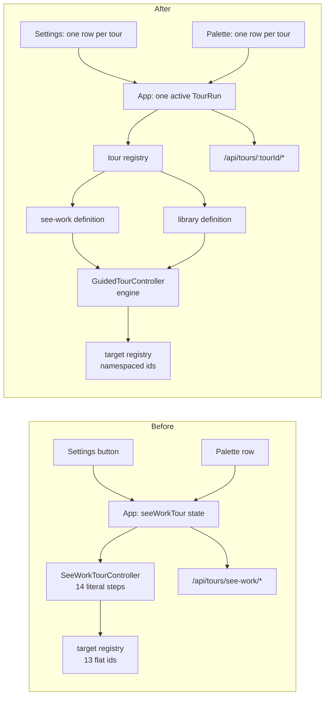
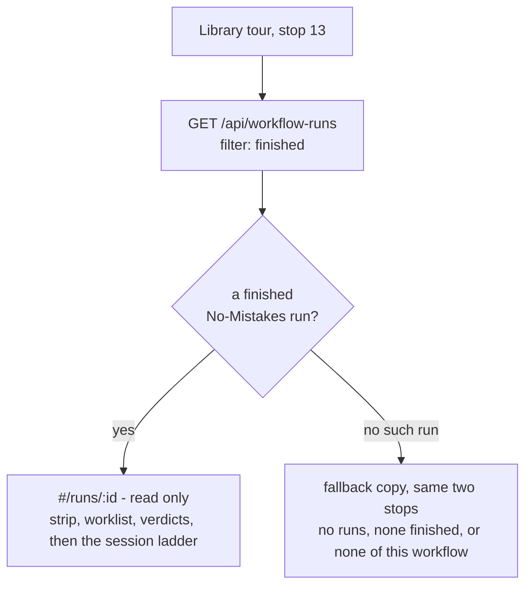

# A second tour: the Library, and what runs after the work

## What this is

Mission Control ships one guided tour. It teaches the operational half of the product - the
Line, the Board, a session desk, Dispatch, a review, completion - and it stops there. The
authoring half is untaught: the six Library shelves, the four assets a person edits, and the
workflow that turns "the agent finished" into "the change was reviewed and shipped".

This plan adds a second tour covering **Personas, Actions, Commands, and Workflows**, ending
on **No-Mistakes Review** and a demo of a workflow run. To add a second tour at all, the
first one's machinery has to stop being the first one's machinery - so this plan is two
pieces of work that must land together: a tour *engine*, and a tour *written on it*.

## What exists today

`docs/ui.md` calls the current tour a "comparison spike" for `driver.js@1.8.0`, and the code
matches that framing exactly. Every part of it is singular:

| Layer | File | How it is coupled |
| --- | --- | --- |
| Steps | `src/web/tour/SeeWorkTourController.tsx` | 14 literal `STEPS`, a `STEP_INDEX` map, and five `switch` statements keyed on those indices |
| Navigation | `src/web/App.tsx:904-996` | `SeeWorkTourNavigation`, a fixed 13-method interface named for this tour's stops |
| Run state | `src/web/App.tsx` | ~330 lines: one `seeWorkTour` run, one snapshot shape, one re-entrancy guard, one controller mount |
| Targets | `src/web/tour/target-registry.ts` | `TOUR_TARGET_IDS` is a flat 13-member union that *is* this tour's step list |
| Overlay | `src/web/components/Overlay.tsx:62` | one id, `seeWorkTour: "see-work-tour"` |
| Entry | `SettingsPage.tsx:663-690`, `palette-index.ts:496-503` | one `onStartSeeWorkTour` prop, one palette row, one `start-see-work-tour` target kind |
| Server | `src/server/routes.ts:4965-5081` | three routes literally pathed `/api/tours/see-work/*`, with titles, labels, model and intent-prefix identity checks hardcoded |
| Skin | `src/web/styles.css:106-400` | scoped to `.mc-see-work-tour`, plus three `data-mc-tour-*` flags encoding this tour's specific stops |

Two things are already general, and they are the seams to build on. The **target registry**
(`target-registry.ts`, `target-context.tsx`) is tour-agnostic in mechanism - identity-token
safe against StrictMode and remount races - and only its id union is coupled. And the
**Settings rail footer** is already a `role="group"` labelled **Help & tours**, plural, sized
to hold a list.

The Library it needs to teach is equally well-shaped for this. Every authoring surface is
already deep-linkable, so a tour navigates by publishing a hash rather than by driving
clicks:

| Hash | Surface |
| --- | --- |
| `#/library` | The six shelves |
| `#/library/personas[/:id]`, `/new` | Persona library and editor, or a blank draft |
| `#/library/actions[/:id]`, `/new` | Action library and editor, or a blank draft |
| `#/library/commands/:slot` | The Command editor on `test`, `lint`, `typecheck` or `build` |
| `#/library/workflows[/:id]`, `/new` | The workflow builder |
| `#/runs/:runId` | One workflow run's evidence and timeline |

## The shape of the work

### Part 1 - from one tour to many

Extract a **tour engine** from the existing controller and re-express "See the work" as the
first definition written on it. This is a refactor whose success criterion is that
`e2e/specs/see-work-tour.spec.ts` passes unchanged: the existing tour must keep its exact
14 stops, copy, labels, fallbacks, cleanup and restore behaviour.

A `TourDefinition` carries what the controller currently hardcodes:

```ts
interface TourDefinition {
  id: TourId;                       // "see-work" | "library"
  kicker: string;                   // popover header text, today "See the work"
  title: string;                    // "See the work", "Author what runs"
  detail: string;                   // palette and Settings sub-copy
  keywords: readonly string[];      // palette matching
  steps: readonly TourStep[];
}

interface TourStep {
  id: string;                       // stable, replaces STEP_INDEX
  /**
   * The surfaces this stop spotlights, in order - its "beats". One for most stops; two
   * where a stop genuinely has to point at a second thing to make its point, such as a
   * Persona's config chips and then its guidance. Never more than two.
   */
  targets: readonly TourTargetId[];
  title: string;
  description: string;
  details?: readonly { label: string; description: string }[];
  side?: "top" | "bottom" | "left" | "right";
  nextLabel?: string;               // today's next-button ladder, per step
  /** Put the app where this step can be seen. Today's `prepare()` switch. */
  prepare(nav: TourNavigator): boolean;
  /** Is the target mounted and meaningful yet? Today's `targetReady()` switch. */
  ready?(runtime: TourRuntime, registry: TourTargetRegistry): boolean;
  /** What to say while it is not. Today's `fallbackDescription()` switch. */
  fallback?(runtime: TourRuntime): string | null;
  /**
   * Runtime moved under this step - advance, retreat, or stay. Today's `refresh()`.
   * Returns the step id to move to, or null to stay put.
   */
  reconcile?(runtime: TourRuntime): string | null;
}
```

The five index-keyed switches become per-step methods; `intendedIndex` becomes an
intended **step id**, which removes the class of bug the current controller carries comments
about (Driver's active index lagging a committed transition). The Driver.js adapter, focus
containment, progress rail, fallback rendering, cleanup-error dialog and overlay
registration are unchanged in behaviour and move wholesale into the engine.

**Beats, and why a step needs more than one target.** The current controller assumes one
target per step, which is true of all fourteen of its own. It is not true of the Library's
authoring screens: a stop that teaches what configures a Persona has to point at the property
chips *and* the guidance below them, and a stop about a run has to point at the pipeline strip
*and* the worklist under it. Splitting each of those into its own step is the alternative, and
it is what pushed the first draft of this tour to twenty-five.

So a step declares an ordered `targets` array instead of a single `target`. **Driver drives
beats; the progress rail counts stops.** Next advances to the next beat within a stop and then
to the next stop, so the popover keeps its title and its rail segment while the spotlight
moves. The rail therefore reads *Step 3 of 15* across both beats of stop 3, which is the count
the tour actually has. The cost is stated rather than hidden: fifteen stops are nineteen beats
plus a targetless close card - twenty screens in all, so a full run is twenty Next presses
rather than fifteen.

Every step in the existing tour becomes a one-element `targets` array, which is why its spec
does not change. Two is the ceiling, and a stop reaching for a third is a stop that should
have been two stops.

Around it:

- **Target ids get namespaced.** `TOUR_TARGET_IDS` becomes per-tour groups so a Library
  target cannot collide with a fleet one - the existing thirteen stay as the `see-work` group,
  and the Library tour adds nineteen of its own, listed per stop in Part 2.
  `useTourTaskTargetRef`'s hardcoded `Extract<>` allow-list becomes a declared scoping.
- **`App.tsx` holds one active tour, not one named tour.** `SeeWorkTourRun` generalizes to
  `TourRun` with the same snapshot fields; the re-entrancy guard becomes "a tour is running"
  rather than "this tour is running". A tour still owns temporary resources, so the run
  carries a per-tour cleanup handle rather than two hardcoded task ids.
- **Entry points become a list.** The Settings **Help & tours** footer renders one row per
  registered tour, and the palette contributes one **Do** row per tour from the same
  registry - `{ kind: "start-tour", tourId }` replacing `{ kind: "start-see-work-tour" }`.
  Adding a third tour then costs a definition and nothing else.
- **One overlay id** (`tour`) serves whichever tour is active.
- **The skin generalizes.** `.mc-see-work-tour` becomes `.mc-tour`; the three
  `data-mc-tour-*` documentElement flags stay, because they describe *surfaces* (a modal is
  live, a tile is spotlit) rather than steps.



### Part 2 - the Library tour

**Order.** The tour teaches Personas → Actions → Commands → Workflows. The Library renders
its shelves in a different order - Missions, **Workflows, Commands, Personas, Actions**,
Ensembles - so the tour deliberately walks the page bottom-up. The reason is that this is the
*dependency* order: a workflow is built out of Persona nodes, Action nodes and Command nodes,
so the tour teaches the parts before the thing that composes them, and stop 9 can say that the
builder's node palette is exactly the three assets just covered. The shelves themselves are
left as they are; reordering a shipped page to match a tour would be the tour dictating the
product.

The stops. Fifteen, not the full sweep of every surface: each chapter shows what the asset
is, what configures it, and how it is edited, then moves on.

**Opening**

1. **The Library** - `#/library`. Spotlight `<main class="lib-page">`. Everything you author
   once and reuse; nothing runs from here. Name the six shelves and the question each one
   heads, because the shelves are titled by their question rather than their noun.

**Personas - who does the reviewing**

2. **The Persona library** - `#/library/personas/<built-in id>`, spotlight the
   `complementary "Persona library"` rail. **System**, **Built-in** and **Yours** groups with
   their own counts; each row's sub-label is the resolved runner and model, which is what
   tells two reviewers apart.
3. **What a Persona is, and what configures it** - spotlight `section "Persona guidance"` and
   the property chips together. The Markdown *is* the asset; everything above it is metadata
   about how that Markdown gets run. `provider` and `model` open the control that set them, and
   a chip inherited from the app defaults draws quiet where one this Persona overrides draws
   solid.
4. **Editing one** - spotlight the promoted verb. On a built-in it reads **Duplicate to
   edit**, and that is the whole ownership rule: shipped roles are read-only, and a customized
   copy is one gesture with an honest name. On your own it reads **Save**. Import `.md`,
   Import from path and Check upstream sit in the rail footer.

**Actions - what a run can tell the session to do**

5. **The Action library** - `#/library/actions/<built-in id>`, spotlight the
   `complementary "Session action library"` rail. The same rail and workspace grammar as
   Personas, because an operator moving between them is moving through one surface with
   different contents; each row's sub-label is its contract, not its description.
6. **The contract, and the instruction** - two beats. First the `requires skill` and
   `completes when` chips and the sentence they form: this is the one Library asset carrying a
   machine-checked contract, where something observable has to happen before a stage may call
   it done. Then the instruction editor, whose Markdown reaches the session byte for byte.
   Editing is the same promoted verb stop 4 already showed - this screen shares the Persona
   screen's rail and workspace - so the copy says so rather than spending a third beat on it.

**Commands - what each standard gate runs here**

7. **A Command slot** - `#/library/commands/test`. Four fixed slots, no **＋ New** card and no
   cross-link, because the slots ship with the product. A workflow's Command node names a
   portable slot and never an argv, so the same workflow runs against any repository; this
   screen is where *this machine* says what the slot runs. Spotlight **Default command**.
8. **Overrides, and saving one** - two beats. First the **Repository path** / **Override
   command** / **Add override** row and the rules table it writes. Then **Save Command**, where
   the point is that saving executes nothing: a workflow reaching that slot, later, in a
   repository granted the Workflows cell in Trust, is what runs it - and **Settings → Workflows
   → Allow workflow Commands** is the machine-wide switch above that.

**Workflows - what counts as done**

9. **The builder** - `#/library/workflows/<a workflow>`, spotlight the
   `complementary "Workflow library and node palette"` rail: Persona, Command, Session action,
   all-pass Join and End are exactly the assets the last three chapters covered.
10. **Creating one** - two beats. First the `group "Editing surface"` Pipeline/Graph toggle,
    reached from the **New** button the copy names but does not spend a beat on. Then
    **Publish**: a draft follows Library edits, while a published version freezes its Persona
    snapshots, and publishing cannot change a binding that already exists.
11. **No-Mistakes Review** - `#/library/workflows/builtin-workflow:no-mistakes-review`,
    spotlight `.wf-pipeline-strip`. Five stages, walked in order: typecheck and test together;
    Intent Conformance alone as a cheap gate; Code Risk and Code Quality in parallel; Test
    Evidence and Documentation in parallel; then the verified Pull Request action before End.
    Every failure returns to the session for a repair round, up to five. It is a built-in, so
    its versions stay addressable exactly as shipped and your changes live in a **Duplicate**.
12. **Binding it** - spotlight **Bind to a session…**, and name the trigger and delivery
    postures v10 ships with: Foreman-complete, live delivery, five repair rounds.

**A run**

13. **A run, moving** - the Runs page for a No-Mistakes run, in two beats. First the pipeline
    strip, which is the same five stages stop 11 just walked, now carrying real state. Then the
    review worklist's **Blocking** / **Passed** segments, where an individual verdict is read
    inside that same beat rather than claiming a third.
14. **Where a run is watched** - the same run drawn as the vertical stage ladder in a
    session's **Workflows** tab, which is where the work is actually followed.
15. **Close** - what the tour left behind, and the offer to run the other tour.

Which run stops 13 and 14 look at is settled in Part 3: an existing finished run, never one
the tour starts.

**Every stop's targets, named.** The engine refuses to render a step whose target is absent -
that is what the fallback copy is for - so a plan that leaves them implied is a plan that
cannot be checked against the DOM. Fifteen stops, nineteen beats:

| # | Stop | Beats (`targets`, in order) |
| --- | --- | --- |
| 1 | The Library | `library-page` |
| 2 | The Persona library | `persona-rail` |
| 3 | What a Persona is | `persona-chips` → `persona-guidance` |
| 4 | Editing one | `persona-primary-action` |
| 5 | The Action library | `action-rail` |
| 6 | The contract, and the instruction | `action-contract` → `action-instruction` |
| 7 | A Command slot | `command-default` |
| 8 | Overrides, and saving one | `command-overrides` → `command-save` |
| 9 | The builder | `workflow-palette` |
| 10 | Creating one | `workflow-surface-toggle` → `workflow-publish` |
| 11 | No-Mistakes Review | `workflow-pipeline-strip` |
| 12 | Binding it | `workflow-bind` |
| 13 | A run, moving | `run-pipeline-strip` → `run-worklist` |
| 14 | Where a run is watched | `session-workflow-ladder` |
| 15 | Close | none - a centred card, like the current tour's terminal states |

Nineteen new target ids, each registered by the component that already owns that element
through `useTourTargetRef`, exactly as the existing thirteen are. None of them is a new
wrapper element added for the tour's benefit: every one is a node the Library already renders
and already gives an accessible name.


### Part 3 - the demo run

The current tour spends real model tokens by design, and `docs/ui.md` says so plainly. A
No-Mistakes run is a different order of magnitude: five reviewer Personas, a typecheck, a
test, a real pull request, and minutes to tens of minutes of wall clock. Running the real
flagship inside a tour is not on the table.

Nothing in `src/` calls a model API directly - every model interaction is a spawned CLI
resolved by `MISSION_<AGENT>_BIN`. That resolution is process-wide, so the trick both the
e2e suite and `npm run demo` use (point the binary at a scripted player) cannot be scoped to
one task inside an operator's own daemon. The engine does, however, already write **synthetic
verdicts** without a model call in two cases: an unconfigured check slot skips and passes,
and a node the operator disabled gets a `disabled` verdict. Those are the only free paths.

**Adopted: the tour reads a run that already happened.** Stop 13 opens `#/runs/<id>` on the
operator's most recent finished No-Mistakes run and walks its real pipeline strip, review
worklist and verdicts; stop 14 follows the same run into its session's **Workflows** tab.
This costs no tokens, adds no server surface, leaves nothing to clean up, and the artifact it
teaches is genuinely the operator's own rather than a demo built to be taught.

The tour picks that run with a single filtered read of the existing paged runs route: the
newest finished run whose `workflowId` is the built-in No-Mistakes Review, and nothing else.
`WorkflowRunSummary` already carries `workflowId` and `status`, so that is an exact match on
data the dashboard holds, with no second request and nothing created - so there is nothing
to remove on exit.

**A run of some other workflow is not a substitute, and the tour does not take one.** Stops
13 and 14 arrive straight out of stop 11, and their copy names the five stages the operator
has just been shown - typecheck and test, Intent Conformance, the two parallel review stages,
the verified Pull Request action. An arbitrary workflow need not have any of that: a
checks-only workflow reaches the worklist with no reviewer verdict to spotlight, and one with
a different graph contradicts the stop that introduced it. `WorkflowRunSummary` carries no
reviewer-verdict count either, so "a run with something in its worklist" is not a filter this
read can even express without fetching a detail per candidate. Selecting the newest finished
run of any workflow would have been a wider net catching mostly wrong fish.

So there are exactly **two** states, and the second covers everything that is not the first:

| The fleet has | Stops 13-14 show |
| --- | --- |
| A finished built-in No-Mistakes Review run | That run - `#/runs/<id>`, then its session's **Workflows** tab |
| Anything else - no runs, only unfinished runs, or finished runs of other workflows only | Fallback copy on the read-only built-in graph |

**The fallback is a real stop, not a gap.** Both stops keep their titles and explain the same
two surfaces - what a pipeline strip, a review worklist and a stage ladder are for - against
the read-only built-in graph already on screen from stop 11, using the existing tour fallback
mechanism: the same labelled dialog the current tour shows when a target has not mounted, with
Back, Next and Exit still available. This is the one part of the tour whose content depends on
the operator's own history, which is why that copy is written rather than apologized for.

One consequence worth stating: an operator who reviews only with their **own duplicate** of
No-Mistakes gets the fallback, because a duplicate is a different workflow with a different
id. Matching on shape rather than id would fix that and reintroduce exactly the fuzziness
above, so the exact match stands.

Two alternatives were considered and set aside. Launching a small real run would be the only
way to show a run actually *moving*, but it spends model tokens on every start of a tour
whose whole subject is authoring. Submitting a run with its Persona nodes pre-disabled would
be free, live and always available, but every verdict would read `disabled` - a truthful
picture of a mechanism nobody uses, and a synthetic run left sitting in the operator's real
run history.



## Server support

Whatever stop 13 does, the existing tour routes get generalized alongside the engine:
`/api/tours/see-work/*` becomes `/api/tours/:tourId/*` with the per-tour brief, labels,
titles and identity checks moving into a server-side tour registry beside the existing
intent constants in `src/shared/protocol.ts`. The identity check that refuses to complete a
task which does not belong to the tour is kept exactly as strict - title, labels and intent
prefix - because it is what stops the cleanup doorway from being a general "close any task"
route.

**The Library tour needs no temporary session, task, workflow or binding of its own.** Every
one of its fifteen stops is a hash and a spotlight on a surface that renders from the SSE
stores the dashboard already holds, plus one filtered read of the runs route. It creates
nothing, so its cleanup is the snapshot restore below and nothing more - which is why the
generalized routes above are a refactor in service of the engine rather than a new surface
this tour consumes.

## Safety and cleanup

The Library tour edits nothing. It navigates to real assets and spotlights real controls,
and every stop that shows an editing affordance shows it on a **built-in** asset, where the
promoted verb is **Duplicate to edit** and no Save exists to press. That is not a special
read-only mode; it is the ownership rule the product already enforces, which makes it the
safest thing to point at.

Two guards follow from that, both of which the engine must carry:

- The tour never types into an editor, so it can never raise the
  **Leave with unsaved changes** dialog. If the operator is *already* holding a dirty draft
  when they start the tour, the tour's first navigation will hit that gate - so starting a
  tour has to be refused, or the gate has to be answered, rather than the tour half-starting
  behind a modal it did not open.
- The snapshot restored on exit gains the Library route and selected asset alongside the
  existing route, layout, selection, expansion, drill-in, filter and Line drawer.

## Testing

- **`test/`** - the tour registry and its definitions are pure data, so the step list, ids,
  targets, per-step prepare/ready contracts, and the palette and Settings rows derived from
  the registry are all unit-testable without a browser. Extend `test/tour-target-registry.test.ts`
  for namespaced ids, `test/palette-index.test.ts` for one row per tour, and
  `test/settings-sidebar-render.test.ts` for the Help & tours list. The generalized
  `/api/tours/:tourId/*` routes keep their coverage in `test/see-work-tour-http.test.ts`,
  including the identity check that still refuses a task which does not belong to the tour.
- **`e2e/`** - a new `e2e/specs/library-tour.spec.ts` walks the tour by popover title,
  asserts each stop's hash and spotlight, asserts no asset was written (`GET /api/personas`
  and friends unchanged across the run), and asserts the snapshot restore and focus return.
  `e2e/specs/see-work-tour.spec.ts` must pass **unchanged** - it is the regression gate on
  Part 1. The run stops need **both** states covered, and the suite can already produce the
  first without a model: a Persona whose guidance carries `E2E_PASS_VERDICT` is answered by
  `e2e/fixtures/fake-claude.mjs` with a schema-valid pass, which is how the existing workflow
  specs drive a real run to completion. So one spec seeds a finished run and asserts the tour
  reads it, and one runs the tour on a fleet whose only finished run belongs to a *different*
  workflow and asserts the fallback copy - which is the case the two-state rule exists for, and
  the one a spec asserting merely "no runs" would miss.
- **Electron geometry** - the coachmark is a positioned popover over real surfaces; the
  existing tour's spec already measures that it never overlaps the control it is asking the
  operator to click, and the Library stops that spotlight a rail row or a chip need the same
  treatment.

## Documentation

- `docs/ui.md` - the "Comparison spike: See the work" section becomes a **Tours** section
  describing the engine, the registry, and both tours. The driver.js comparison finding is
  history worth keeping and stays.
- `docs/library-and-line.md` - a pointer from the Library page to its tour.
- `docs/workflows.md` - a pointer from No-Mistakes Review to the tour that walks it.
- `README.md` - the "See the work" paragraph becomes a two-tour paragraph.
- `docs/workflow-system.md:17` says the built-in No-Mistakes Review is version 9; the code
  ships version 10. The tour teaches this workflow, so the stale sentence is fixed here.

## Out of scope

- First-run or automatic triggering. Both tours stay user-started, as the current one is.
- Progress persistence, resumption, or a "you have not finished this tour" nudge.
- A new top-bar control. The Settings footer and the palette are the two doors.
- Tours for the Missions, Sources or Ensembles shelves, and for Foreman, Scouts and
  Pipelines. The engine makes them cheap; this plan does not write them.
- Any change to what No-Mistakes Review *is*. The tour explains version 10 as shipped.

## Risks

- **The refactor is the risk, not the tour.** The existing controller carries hard-won
  behaviour in comments - Driver's lagging active index, the review modal becoming the top
  registered layer, `onDestroyed` being skipped on an immediate exit, cleanup refusal
  retry. Every one of those has to survive the extraction, and `see-work-tour.spec.ts`
  passing unchanged is the only proof that counts.
- **Fifteen stops, twenty screens, is close to the ceiling.** The current tour is fourteen
  single-beat steps and already asks a lot. The list above is cut to what each chapter needs
  to teach - what the asset is, what configures it, how it is edited - and anything further
  added should displace a stop rather than extend the run. Beats are the pressure valve that
  keeps the stop count at fifteen, and they are capped at two precisely so they cannot become
  a way of hiding a twenty-five stop tour inside a fifteen-stop rail. If the review wants it
  shorter still, the chapters split into separately-startable tours sharing one engine, which
  the registry makes free.
- **Built-in assets must exist.** Stops 2, 5 and 11 point at shipped built-ins, which are
  app data and always present. Stop 9 points at *a* workflow; on an install with none
  authored, it points at the built-in too.
- **The last two stops depend on the operator's own history.** With the run stops reading a
  real finished run, a fleet that has never run No-Mistakes sees fallback copy instead of a
  run. That fallback is written as a real stop rather than an apology, and it is the one part
  of the tour whose test needs both states covered: a seeded finished No-Mistakes run, and a
  fleet without one.

## Decisions taken

Reviewed and submitted before implementation began. Each is recorded here so a later reader
sees what was chosen rather than the choice:

| Decision | Taken |
| --- | --- |
| Chapter order | **Personas → Actions → Commands → Workflows** - dependency order, walking the shelves bottom-up. The Library's shelf order is left alone. |
| The demo run | **Read a run that already happened.** No tokens, no created state, with a written fallback for an install that has no run yet. |
| Engine scope | **Full extraction now.** One engine plus two definitions, with the existing tour's spec unchanged as the gate. |
| How editing is shown | **Spotlight built-ins only, never type.** The tour writes nothing, so it can never raise the unsaved-changes gate. |
| Tour shape | **One 15-stop tour**, cut to what each chapter needs to teach. |
| Follow-up | **Stop after this plan.** No implementation phases or scheduled tasks are created from it. |
