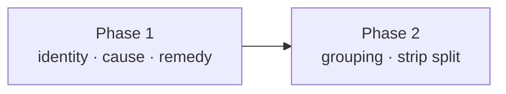

# Phased implementation - the Line's Review drawer

Source plan: [`plan.md`](plan.md) ([rendered](plan.html)) · mockups:
[`../../mockups/line-review-drawer/index.html`](../../mockups/line-review-drawer/index.html)

## Incorporated human decisions

Submitted through the dashboard's plan review. These are requirements, not open questions.

| Decision | Answer | Owned by |
| --- | --- | --- |
| Which remedies the drawer offers inline | **All argument-free remedies** - `Dismiss` (cancel), `Restart` (restart-full), `Retry`, `Resubmit`. Every route that needs nothing but a run id. `Reattach` stays out because it needs a session picker. | Phase 1 |
| When blocked runs fold into a group bar | **3 or more sharing a phase.** A pair renders as two ordinary rows. | Phase 2 |
| After the plan | Create the phased implementation plan and schedule dependency-linked tasks. | this document |

## What the repository confirmed

Read against the working tree before the phases were drawn.

- **The two complaints are one bug.** All 31 blocked runs in the live database carry
  `phase = "session_disappeared"`. `ReviewDrawer.tsx:154` resolves a name only from live
  sessions, so a run whose session was removed falls through to the `noteKey` GUID.
- **The durable title already exists.** `workflow_bindings.session_name` is captured at bind
  time (`store.ts:539,558`) and survives the session. `WORKFLOW_RUN_SUMMARY_SELECT`
  (`store.ts:125`) already `JOIN`s `workflow_bindings` and selects `b.note_key, b.session_id` -
  adding `b.session_name` is a projection change with no new join and no new statement, so
  `test/workflow-pagination.test.ts`'s statement-count budget is unaffected.
- **The reason already ships.** `WorkflowRunSummary.phase` is on the SSE payload for every run.
  Only `alerts.ts:369` reads it as prose, via `phase.replaceAll("_", " ")`. `phase` is a free
  `string`, not a union - `orphanBinding` writes arbitrary reasons into it - so any map over it
  needs that fallback.
- **All four remedy routes are argument-free.** `resubmit`, `retry`, `cancel` and `restart-full`
  take `{ requestId }` plus optional fields that default (`protocol.ts:2799-2827`). Nothing
  needs a picker. `reattach` does, which is why it is excluded.
- **Two tests encode the rule this work revises.** `test/line-drawer.test.ts`'s *"the Review
  drawer offers escalation and never a mutation"* asserts the absence of `Retry`, `Cancel run`
  and `Disable`; `test/workflow-external-source.test.ts:774` pins the summary's exact key set
  and fails the moment `sessionName` appears. Both are rewritten deliberately in Phase 1, not
  worked around.
- **README carries the same rule in prose** - *"None of them fetches, and none of them mutates"*
  (the stage-drawers section) - and is part of Phase 1's work, not a follow-up.
- **A blocked run cannot be seeded by writing SQLite.** Run summaries are served from an
  in-memory map on the `Registry`, so the e2e spec has to drive the daemon: dispatch, bind,
  submit, then `POST /api/sessions/:id/kill` and wait out the hardcoded 8s `EXIT_LINGER_MS`
  (`registry.ts:259`) for `session_remove` to reach `orphanBinding`.

### Discrepancies recorded against the source plan

Three, all found by reading the code rather than trusting the plan:

1. **`src/web/App.tsx` is probably not where the remedy handlers go.** The source plan lists it.
   In fact `workflowRuns` already arrives by SSE, App has no api client, no toast system and no
   general error channel, and the drawer is conditionally mounted. The right seam is the one
   `WorkflowLadderPanel` (`src/web/workflows/WorkflowLadder.tsx:614-826`) already uses on a
   secondary surface: local `confirm` and `localError` state, `runAction`/`useRunActions` from
   `run-action-store.ts` for pending and `requestId` retention, `workflowRequest` from
   `workflowApi.ts`, and the shared `WorkflowConfirmModal`. Phase 1 records this; App may need
   no change at all.
2. **`src/web/lib/api.ts` has no wrapper for any of the four routes.** The source plan implies
   one. Workflow mutations go through `workflowRequest` in `src/web/workflows/workflowApi.ts`.
3. **Two remedies' run-page guards are not summary-only.** `restart-full` guards on
   `detail.inspectorGate` and `retry` reads `detail.attempts` for an optional `nodeAttemptId` -
   neither is on `WorkflowRunSummary`. Both remain reachable with coarser summary-only guards
   (`status` + `phase`), which is what the revised drawer rule requires; Phase 1 carries the
   guard table.

## Phases

| # | Phase | File | Direct prerequisites |
| --- | --- | --- | --- |
| 1 | Durable identity, the blocked cause, and inline remedies | [`phase-1-identity-cause-remedy.md`](phase-1-identity-cause-remedy.md) | - |
| 2 | Grouping by reason and the strip's split count | [`phase-2-grouping-and-strip-split.md`](phase-2-grouping-and-strip-split.md) | Phase 1 |

### Dependency graph



Phase 1 &rarr; Phase 2. Nothing runs concurrently: Phase 2's group bar labels its groups with
Phase 1's `blockedPhaseClause`, and its `Dismiss all` is Phase 1's cancel remedy applied to a
set. Splitting them further would leave a dead surface - a group bar with no reason text and no
action is a worse row than the one it replaces.

**Merge order:** Phase 1, then Phase 2.

## Cross-phase contracts

Phase 1 establishes these; Phase 2 consumes them and must not change their shape.

| Contract | Shape | Notes |
| --- | --- | --- |
| `WorkflowRunSummary.sessionName` | `sessionName?: string` on `src/shared/workflow.ts` | Optional and append-only, per the file's stated convention. Emitted only when non-empty, using the `...(x ? { x } : {})` spread `externalSource` already uses, so a run with no captured name costs no bytes on a payload that ships for every run on every change. |
| `blockedPhaseClause(phase: string): string` | exported from `src/web/workflows/run-model.ts` | Short lower-case clause for the state column ("session gone"). Falls back to `phase.replaceAll("_", " ")` for any unmapped phase. |
| `runRemedy(run: WorkflowRunSummary): RunRemedy \| null` | exported from `src/web/workflows/run-model.ts` | Returns the single argument-free action for the run's phase, or `null`. `RunRemedy` carries at least a stable `kind`, a button `label`, and whether it is destructive. |
| The revised drawer rule | doc comment on `ReviewDrawer.tsx` + README | "No fetch and no run detail. Actions only where the summary alone proves the run is stopped and the route needs no argument beyond the run id." |
| Row name resolution | live session name &rarr; `run.sessionName` &rarr; `run.noteKey` | The GUID is the third fallback and renders as a dim mono identifier, never as a bold title. |

## Final verification

Each phase runs its own verification. Across both, the definition of done is the repository's:

```sh
npm run typecheck
npm run lint
npm test
npm run build && npm run smoke
npm run test:e2e
```

`npm run test:e2e` needs `npm run build` first and `npx playwright install chromium` once per
machine. README and this plan directory must match the implementation when Phase 2 merges.

## Cross-phase audit record

- **After Phase 1 was written.** Confirmed Phase 1 leaves the repository valid on its own: rows
  are named and explain themselves, and every remedy is wired, with no reference to grouping.
  Confirmed the two deliberately-broken tests and the README rule are inside Phase 1, not
  deferred.
- **After Phase 2 was written.** Confirmed Phase 2 adds no field to `WorkflowRunSummary` and no
  server change beyond `foldReview`, so Phase 1 owns the whole wire contract. Confirmed the
  group threshold (3) lives in Phase 2 alone. Re-checked that Phase 2 consumes
  `blockedPhaseClause` and `runRemedy` exactly as Phase 1 exports them, and that the strip/drawer
  count split changes presentation only - `workflowRunWaitsOnOperator` itself is untouched, so
  the command palette's "waiting on you" list keeps its meaning.
- **Final pass over both.** Every source-plan requirement and every submitted selection is owned
  by exactly one phase. The dependency direction is single and forward. No phase depends on a
  later phase to repair an intermediate state.
