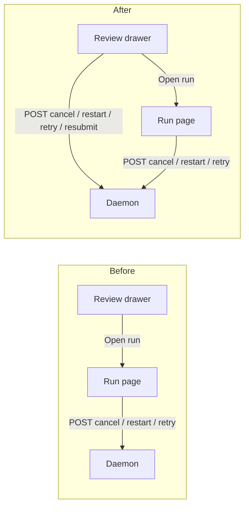

# The Line's Review drawer: identity, cause, and remedy

## The problem

The Review drawer lists every live workflow run. On the fleet it was built for, it now
shows 32 rows that are almost entirely useless:

- The bold identity on each row is a raw GUID.
- The state column reads `Blocked` with no cause.
- The only control is `Open run`, which leaves the drawer.

Two complaints, **one root cause**. Against the live database:

```
sqlite> SELECT status, current_phase, count(*) FROM workflow_runs GROUP BY 1, 2;
blocked|session_disappeared|31
completed|complete|17
waiting_for_session|reattached_resubmit_required|1
```

Every blocked run is blocked because its session was removed. When a session goes,
`WorkflowManager` calls `store.orphanBinding(bindingId, "session_disappeared")`, which nulls
`workflow_bindings.session_id`, cancels the in-flight reviewer attempts, and sets the run to
`blocked`. The drawer resolves a row's name with:

```ts
sessionName={(run.sessionId && named.get(run.sessionId)) || run.noteKey}
```

`named` is built only from **live** sessions, so a run whose session is gone falls all the
way through to `noteKey` - the GUID. You see GUIDs *because* the runs are blocked.

### Both missing facts already exist

| Fact | Where it already is | What is missing |
| --- | --- | --- |
| Human title | `workflow_bindings.session_name`, captured at bind time and immune to the session dying | `WORKFLOW_RUN_SUMMARY_SELECT` already `JOIN`s that table but selects only `note_key` and `session_id` |
| Block reason | `WorkflowRunSummary.phase`, on the SSE payload for every run | `runTriageSentence` prints `runStatusLabel(status)` and drops `phase` |
| Remedy | `POST /api/workflow-runs/:id/{cancel,restart-full,resubmit,retry}` | The drawer renders no action at all |

No new table, no new query, no new fetch.

## Decisions taken

Submitted through the dashboard's plan review, and settled:

| Question | Answer |
| --- | --- |
| Which remedies does the drawer offer inline? | **All argument-free remedies** - `Dismiss`, `Restart`, `Retry`, `Resubmit`: every route that needs nothing but a run id. |
| When do blocked runs fold into a group bar? | **3 or more sharing a phase.** A pair still reads as two ordinary rows. |
| After this plan? | **Create a phased implementation plan** with dependency-linked tasks. |

## What ships

Two phases, matching the two approved mockups in
[`docs/archive/mockups/line-review-drawer/index.html`](../../archive/mockups/line-review-drawer/index.html).

### Phase A - name it, say why, offer the one move

1. **Durable identity.** Add `b.session_name` to `WORKFLOW_RUN_SUMMARY_SELECT` and an
   optional append-only `sessionName?: string` to `WorkflowRunSummary`. The drawer resolves
   in three steps: live session name → `run.sessionName` → `run.noteKey`. The GUID is now the
   third fallback rather than the second, and when it does render it is mono and dim - an
   identifier, not a title.
2. **The cause, in the state column.** A `BLOCKED_PHASE_CLAUSES: Record<string, string>` map
   in `run-model.ts`, the sibling of the `GATE_WAIT_SENTENCES` and `ACTION_WAIT` maps already
   there. `phase` is a free `string` and `orphanBinding` writes arbitrary reasons into it, so
   the lookup falls back to `phase.replaceAll("_", " ")` - the same fallback `alerts.ts:369`
   already uses. `Blocked` becomes `Blocked · session gone`.
3. **The remedy.** A `runRemedy(run)` descriptor maps a phase to the one action that phase
   actually takes, and the row renders it beside `Open run`.
4. **Blocked stops borrowing amber.** A blocked run gets a red leading edge; amber keeps its
   existing meaning of "it is your turn". The reviewer chip on an orphaned run reads
   `Reviewers stopped` in grey rather than `Reviewers` in amber, because `orphanBinding`
   cancelled those attempts - they are not waiting, they are dead.
5. **Wider title column.** `.line-run-who` goes 240px → 340px, taken from the chip rail. 240px
   was sized when the bold line was a GUID that would ellipsize anyway; real binding titles
   ("Improve Foreman Context and Table Scrolling") do not fit.

### Phase B - group by reason, act on the batch

6. **Fold.** A pure `groupReviewRuns()` in `src/web/lib/line-review-groups.ts` folds blocked
   runs sharing a `phase` into one group. Runs that are not blocked stay individual rows, and
   a group of fewer than **three** renders as plain rows rather than a bar - a pair is not a
   pile, and collapsing one costs the reader the per-row chips while saving nothing.
7. **One control for the batch.** The group bar carries the reason once, the count once, the
   first few titles, and a single `Dismiss all`.
8. **The strip stops lying.** `foldReview` splits its amber half: `32 waiting on you` becomes
   `1 needs you · 31 stalled`. `foldReview`'s own doc comment already requires the strip and
   the drawer to read the same predicate - *"a strip that says '1 waiting on you' over a
   drawer that marks none is the surface arguing with itself"* - so the split lands in both
   or neither.

## The phase → clause → remedy table

The clause is what renders in the 190px state column. The remedy is the button.

| `phase` | Clause | Remedy | Route |
| --- | --- | --- | --- |
| `session_disappeared` | session gone | Dismiss | `POST /workflow-runs/:id/cancel` |
| `round_limit` | out of rounds | Restart | `POST /workflow-runs/:id/restart-full` |
| `inspector_round_limit` | out of Inspector rounds | Restart | `POST /workflow-runs/:id/restart-full` |
| `infrastructure_error` | provider call failed | Retry | `POST /workflow-runs/:id/retry` |
| `inspector_findings` | Inspector findings | - | `Open run` |
| `inspector_disabled` | Inspector off | - | `Open run` |
| `inspector_pr_closed` | PR closed | - | `Open run` |
| `inspector_head_mismatch` | head moved | - | `Open run` |
| `delivery_uncertain` | delivery unconfirmed | - | `Open run` |
| `delivery_refused` | delivery refused | - | `Open run` |
| `delivery_blocked` | delivery blocked | - | `Open run` |
| `stale_capture` | evidence went stale | - | `Open run` |
| `capture_error` | capture failed | - | `Open run` |
| *(unmapped)* | `phase.replaceAll("_", " ")` | - | `Open run` |

Plus one non-blocked case the fleet is currently sitting on:
`status = waiting_for_session`, `phase = reattached_resubmit_required` → clause
*reattached, needs resubmit*, remedy **Resubmit** (`POST /workflow-runs/:id/resubmit`).

A remedy is only offered where the route needs **no further input**. `Reattach` is
deliberately absent: `POST /api/workflow-bindings/:id/reattach` requires a `sessionId`, which
means a session picker, which is a dialog the drawer has no room for. Reattach stays on the
run page and in `WorkflowBindingDialog`, one click away through `Open run`.

`Dismiss`, `Dismiss all` and `Restart` are destructive and confirm before firing, with the
count echoed - the pattern `DELETE /api/ensembles/:id` already sets by demanding a
`confirmId` echo.

## The rule this breaks, on purpose

`ReviewDrawer.tsx:15-25` states a deliberate constraint:

> A projection of `WorkflowRunSummary` ... No fetch, no run detail, and no action:
> everything that CHANGES a run - resolving a delivery, rechecking Inspector, disabling a
> reviewer, resetting a round - stays on the run page, one click away through "Open run".

Phase A breaks the "no action" half. The rule was written when every row was a live run
making progress, where the honest answer to "what do I do about this" is "read it on the run
page". It does not survive 31 rows that will never move again: a triage surface that can only
describe a dead run is not triage.

The other two halves of the rule **hold**. There is still no fetch and no run detail - every
new fact comes off the `WorkflowRunSummary` the browser already has over SSE, and every
remedy is a single POST by run id with no payload. The revised rule, which the component
doc comment will state:

> No fetch and no run detail. Actions only where the summary alone proves the run is stopped
> and the route needs no argument beyond the run id.

That is what keeps `Reattach` (needs a session id), `Resolve delivery` (needs a delivery id
and a choice) and `Disable a reviewer` (needs a node id) out.

## Data flow

The read path is unchanged in shape - one more column on a join that already exists:

```
workflow_bindings.session_name
  -> WORKFLOW_RUN_SUMMARY_SELECT (existing JOIN)
    -> runSummaryFromRow -> WorkflowRunSummary.sessionName
      -> SSE workflow_run_upsert -> useEventStream -> ReviewDrawer
```

The write path is new. The Review drawer previously had no arrow back to the daemon; it now
POSTs to run routes that already exist and that the run page already calls:



## Files

| File | Change |
| --- | --- |
| `src/shared/workflow.ts` | `sessionName?: string` on `WorkflowRunSummary`, optional and append-only |
| `src/server/workflows/store.ts` | `b.session_name` in the select; `sessionName` in `runSummaryFromRow`, spread so an empty name costs no bytes |
| `src/web/workflows/run-model.ts` | `BLOCKED_PHASE_CLAUSES`, `blockedPhaseClause()`, `runRemedy()`; `runTriageSentence` appends the clause |
| `src/web/lib/line-review-groups.ts` | **new** - the pure fold, plus its ordering rule |
| `src/web/components/line/ReviewDrawer.tsx` | three-step name, tones, remedy button, group bar, revised doc comment |
| `src/web/App.tsx` | wires the remedy handlers and the confirm |
| `src/web/styles.css` | group bar, blocked tone, `.line-run-who` 240 → 340px |
| `src/server/line-summary.ts` | `foldReview` splits `waiting` into `needs you` / `stalled` |
| `README.md` | the Line section: the drawer's new actions and the split count |

### Deliberately not in scope

- **No agent accent dot.** It would mean a second denormalized column (`b.session_agent`) on
  a summary that is folded and pushed over SSE for every run in the fleet on every change.
  `externalSource`'s own doc comment refuses exactly this trade - *"bytes per run per event
  bought for nothing"* - and the dot fixes neither complaint.
- **No `Reattach` in the drawer.** See above; it needs a session picker.
- **No change to `DecideDrawer` or `IntakeDrawer`.** The group fold is written against
  workflow runs; generalizing it before a second drawer wants it would be inventing a
  requirement.

## Tests

| Layer | What it proves |
| --- | --- |
| `test/line-review-groups.test.ts` **new** | the fold: grouping by phase, the small-group threshold, ordering, non-blocked runs left alone |
| `test/line-drawer.test.ts` | `blockedPhaseClause` incl. the unmapped fallback; `runTriageSentence` for blocked; `runRemedy` per phase; `ReviewDrawer` markup renders the durable name, not the GUID, and the GUID when there is genuinely nothing else |
| `test/line-summary-fold.test.ts` | `foldReview`'s split sentence and tone |
| `test/workflow-store*.test.ts` | `runSummaryFromRow` carries `sessionName` off the binding, and omits it when empty |
| `e2e/specs/line-drawers.spec.ts` | the whole story in a browser: a run whose session was removed shows its title and `Blocked · session gone`, `Dismiss` confirms and removes the row, and a batch folds into one bar |

The e2e spec is the one that matters and is required by the project's UI rule. It selects by
role and accessible name - no `data-testid` - and runs against the built dashboard and the
built daemon with the fake agents in `e2e/fixtures/fake-agents.ts`, so no model tokens are
spent.

Two constraints the spec has to respect, both found while reading the existing suite:

- **A blocked run cannot be seeded by writing SQLite.** Run summaries are served from an
  in-memory map on the `Registry`, not re-read per request, so a direct `UPDATE
  workflow_runs` never reaches the browser. The spec has to make the daemon do it: dispatch a
  session, bind, submit, then `POST /api/sessions/:id/kill` and let `session_remove` reach
  `orphanBinding`.
- **`EXIT_LINGER_MS` is a hardcoded 8s** (`registry.ts:259`) between a session exiting and
  `session_remove` firing, and it is not env-tunable. The spec polls
  `/api/workflow-runs/:id` for `{ status: "blocked", phase: "session_disappeared" }` with an
  explicit timeout rather than the 10s `expect` default, and stays inside the config's 60s
  per-spec budget.
- **A second phase for the group fold is cheap**: bind with `maxRepairRounds: 1` and let the
  `E2E_FAIL_VERDICT` persona fail twice, which blocks at `round_limit`.

## Risks

- **`phase` is not a closed union.** Any map over it needs the string fallback, and the tests
  pin an unmapped phase so a future reason code degrades to readable text instead of
  `undefined`.
- **`workflowRunWaitsOnOperator` is shared.** It drives the strip fold, the drawer's amber,
  and the command palette. Splitting the drawer's presentation must not change the predicate
  itself, or the palette's "waiting on you" list silently changes meaning.
- **A destructive control in a strip drawer.** `Dismiss all` can cancel 30 runs from a surface
  the keyboard reaches with one keystroke, which is why it confirms with the count echoed.
