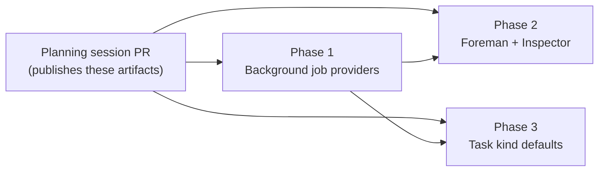

# Model selection - phased implementation

Implementation index for [`plan.md`](plan.md). Three phases, one pull request each.

## Source and incorporated decisions

Source plan: [`docs/plans/model-selection/plan.md`](plan.md), reviewed in two rounds through
`request_plan_decisions`. Every selection below is a **requirement**, not an open question, and is
already written into the source plan's *Decisions taken* tables.

**Axis 1 - the agent in a card, by task kind**

- One **matrix** on Settings → Models; not a card per kind, not named presets.
- A kind default carries **agent + model + effort**, each nullable, null meaning inherit.
- It reaches **every path that creates or launches a task** - a real tier in
  `resolveDispatchModel` plus the agent seed for the dispatch form, MCP `create_task`, task sources
  and Recurring Missions.

**Axis 2 - the app's own calls, by slot**

- **All controls on Settings → Models**, grouped by subsystem; Foreman and Inspector keep pointer
  lines.
- **All three slot groups** gain their own provider: the five background jobs, Foreman's four roles
  individually, and the Inspector's review model.
- **Both latent bugs are fixed in this work**: the Inspector's env-dropping fallback and the
  workflow-context provenance mislabelling.

## What the investigation changed

Three findings from reading the repository moved the boundaries, and one corrected the plan itself.

1. **The provider was never one app-wide switch.** The source plan's first draft said it was.
   Personas and Ensemble judges already choose per call; Foreman has one provider for all four of
   its roles (`ForemanConfigSchema.runner`, `src/shared/protocol.ts:1441`); the Inspector has its
   own. Only the five background jobs have nothing. The plan was corrected before phasing.
2. **Foreman settings already has a Models tab.** `FOREMAN_SETTINGS_TABS`
   (`src/web/lib/foreman-settings-tabs.ts`) owns `foreman/provider` and four model anchors, and its
   comment calls it "the one answer to which tab owns a settings anchor". Consolidating is therefore
   a **move** - tabs, anchors and the ⌘K index - not just an addition. Phase 2 owns all of it.
3. **There is no settings table component.** `<table>` appears in `src/web/components/` only in
   `DiffViewer.tsx`. All three groups the decisions ask for are matrices, so one phase has to build
   that component and the others render into it. That is the only dependency edge between Phase 1
   and Phase 3.
4. **Foreman's per-harness backlog dispatch models are a different thing** and are explicitly out of
   scope. They sit on Foreman's *Launches* tab and belong to the dispatch ladder, not to the
   app-owned calls being consolidated.

## Sizing and phase count

Estimated **non-test implementation lines, added or materially changed** (excludes tests and
documentation prose):

| Area | Estimate |
|---|---|
| Background-job providers, incl. shared matrix + row components | 300 - 400 |
| Foreman per-role providers, Inspector fix, consolidation + anchor move | 320 - 420 |
| Task-kind defaults across schema, resolvers, creators, dispatch form, panel | 380 - 480 |
| **Total** | **1000 - 1300** |

Assumptions: no migrations (every new key is an additive sibling with a default); no new HTTP
routes; the matrix component is roughly 120 lines including CSS; documentation and tests are real
work but excluded from the count by the rubric.

**Why three and not one.** At 1000-1300 lines this is far past the 200-line one-shot threshold, and
past what a mid-tier model can implement, verify and explain in one pass. The work also spans two
genuinely independent subsystems - the dispatch path over the `harnesses` blob, and the app-owned
call path over `llm` / `foreman` / `inspector` - that share no schema, resolver or worker.

**Why three and not four or five.** Each phase is a vertical slice that ships working, user-visible
behaviour and leaves the repository valid. Splitting any of them further would create a dead
surface:

- Splitting Phase 1 into "config plumbing" then "UI" would add config keys nothing can set.
- Splitting Phase 2's per-role providers from the consolidation would move controls onto a page,
  then change what they do a week later - two reviews of one screen.
- Splitting Phase 3 by layer would leave a resolver tier no surface writes to.

Layer boundaries are not phase boundaries here; each phase carries its own schema, server, browser,
docs and tests.

**Why Phase 1 is the background jobs rather than the task kinds.** The task-kind work was decided
first, but the background jobs are the gap the operator actually hit - they are the only model slots
in the product with no provider of their own. Phase 1 ships that, and picks up the shared matrix on
the way because its page has three tables.

## Phases

| # | Phase | File | Depends on | Delivers |
|---|---|---|---|---|
| 1 | A provider per background job | [`phase-1-background-job-providers.md`](phase-1-background-job-providers.md) | - | Per-job providers; the shared settings matrix; the pinning rule; the workflow-context provenance fix |
| 2 | Foreman's four roles and the Inspector, on the Models page | [`phase-2-foreman-inspector-providers.md`](phase-2-foreman-inspector-providers.md) | 1 | Per-role Foreman providers; the Inspector fallback fix; every app-owned model choice on one page |
| 3 | An agent, model and effort per task kind | [`phase-3-task-kind-defaults.md`](phase-3-task-kind-defaults.md) | 1 | The kind tier, the agent seed, and the Task kinds matrix |

## Dependency graph

Edges are direct prerequisites only. Every phase also carries the planning-session edge, so nothing
dispatches before these files exist on the default branch.

## Concurrency

- **Group A:** Phase 1 alone.
- **Group B:** Phases 2 and 3, concurrently, once Phase 1 has merged.

Phases 2 and 3 share no schema, resolver, worker or migration - Phase 2 touches `foreman` and
`inspector`, Phase 3 touches `harnesses`. They do both add a group to `LlmSettingsPanel.tsx` and
both touch `settings-search.ts` and `docs/models.md`. Those conflicts are **positional, not
semantic**: each adds its own group and its own entries, ownership is by section, and either merge
order works. `settings-registry.ts` has exactly one writer (Phase 3), so the Models category blurb
cannot be written twice.

## Merge order

Phase 1 first. Then Phase 2 and Phase 3 in either order, or at the same time; the second to merge
rebases onto the other's group structure in `LlmSettingsPanel.tsx`.

## Cross-phase contracts

Phase 1 establishes these; Phases 2 and 3 consume them and must not change them without reconciling
back into Phase 1's file.

| Contract | Owner | Consumers | Rule |
|---|---|---|---|
| `SettingsMatrix`, `ModelSlotRow` | Phase 1 | Phases 2, 3 | Extend by adding column definitions; never fork the component |
| The inherit rule | Phase 1 | Phase 2 | `null`/empty means inherit; a set value replaces and re-bases the model fallback onto the chosen provider. Phase 2 adds one rung (role → Foreman group → app-wide), which is an extension, not a competing ladder |
| The pinning invariant | Phase 1 | Phase 2 | Pinning a model pins its provider. No phase reintroduces a clear-on-change |
| Sibling-map storage | Phase 1 | Phase 2 | Additive record beside the existing model keys, merged per key, no migration |
| `llmJobRunner`, widened `LlmStatus` | Phase 1 | - | Foreman's three-field read of `/api/llm/status` must keep parsing |
| Agent-match guard | Phase 3 | - | A kind default's model applies only when the task's agent matches it |

## Final verification

Each phase runs `npm run typecheck`, `npm run lint`, `npm test`, and - because all three change UI -
`npm run build && npm run test:e2e` with a Playwright spec covering its own behaviour. No phase may
lean on a later one to repair an intermediate state.

Across the set, once all three have merged:

- The five background jobs, Foreman's four roles and the Inspector's review model each resolve their
  own provider, falling back to the app-wide radio when unset.
- Changing the app-wide provider clears nothing.
- An unset Inspector provider honours `MISSION_LLM_RUNNER`.
- A dispatched `plan` task runs on its configured agent, model and effort; a kind default whose agent
  does not match the task's falls through to the harness default.
- An installation that upgrades and changes nothing behaves exactly as it did before, with the one
  intended exception of the Inspector fallback fix.

## Cross-phase audit

Performed after all three phase files were written, over the complete set.

- **Every requirement is owned by exactly one phase.** Axis 1's three decisions → Phase 3. Axis 2's
  slot groups → Phase 1 (background jobs) and Phase 2 (Foreman roles, Inspector). The home decision
  → Phase 1 builds the page structure, Phase 2 completes the move. Bug 1 (Inspector fallback) →
  Phase 2. Bug 2 (workflow-context provenance) → Phase 1, because it lives in a background job.
- **Every consumer follows its prerequisite.** Phases 2 and 3 both consume Phase 1's matrix and
  neither consumes the other.
- **Concurrent phases merge in either order** - verified above; the only overlap is positional.
- **The final state matches the source plan** with no undocumented cleanup phase. Personas and
  Ensemble judges are untouched by design; they are the precedent this copies.
- **One deliberate deviation from the source plan's file list:** it named
  `src/web/components/ForemanSettingsPanel.tsx` and `InspectorSettingsPanel.tsx` without mentioning
  `foreman-settings-tabs.ts` or the ⌘K index. The repository shows anchor ownership is a declared
  table with a routing contract, so Phase 2 carries both. The source plan's list was a sketch; this
  is the corrected route.
