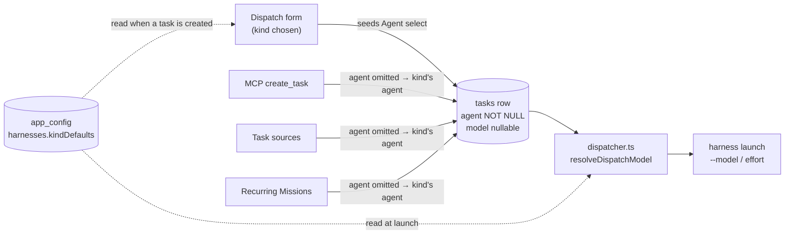

# Choosing the model for every kind of work

Make **Settings → Models** the place where every model choice is made, on both of the axes it
is currently wrong on.

**Axis 1 - the agent in a card.** Today the choice is made per harness: `Settings → Harnesses`
holds one default model and one default effort for each of Claude, Codex and Pi, and the
dispatch form starts on it. Which *kind* of work is being dispatched never enters into it, so
planning and shipping run on the same model unless somebody overrides the picker by hand on
every single dispatch.

**Axis 2 - the app's own calls.** Mission Control makes about eleven model calls for itself -
naming a task, deriving a Goal, narrating the away digest, compacting Workflow evidence,
evaluating an Ensemble, Foreman's Review / Verify / Triage / Backlog, the GitHub Inspector's
review, and every Persona. Which provider each of those runs on is answered **five different
ways**, on four different screens: Personas and Ensemble judges choose per call, Foreman chooses
one provider for all four of its roles, the Inspector chooses its own, and the five background
jobs get no choice at all. Picking the app-wide provider also *clears every background-job model
box*, because a `claude` model id is not something `codex` can resolve.

The fix is to finish the pattern rather than invent one: every slot gets the pair Personas
already have, and they all become visible in one place.

The two axes are independent and stay independent - which harness a session runs and which model
judges it are separate questions, which is the point the Models page already makes. What they
share is that both are answered here, and that both use the same rule for "unset": **null means
inherit**, never "run with no model".

## Axis 1 - the agent in a card, by task kind

### What already exists, and what has to be built

Three of the four pieces are already in the codebase, which is why this is a small change with
one genuinely new idea in it.

**Kind is already first-class.** `TASK_KINDS` (`src/shared/types.ts:1702`) is
`["ship", "scout", "plan", "pipeline", "chat"]`, `TASK_KIND_INFO` and `TASK_KIND_BEHAVIOR`
(`src/shared/task.ts:61`, `:106`) already carry each kind's copy and its launch rules, and every
picker in the app renders from those records rather than spelling its own options. A new
per-kind record slots in beside them.

**The model already resolves at launch, in tiers.** `resolveDispatchModel`
(`src/server/harnesses.ts:84`) is three tiers, narrowest first: the task's own pin, then a
launch-only model (Foreman's per-harness backlog model), then `harnesses.defaultModel[agent]`,
else no `--model` flag at all. A kind default is a fourth tier, inserted above the harness
default.

**The config blob already takes new keys without a migration.** `HarnessesConfigSchema`
(`src/shared/protocol.ts:2043`) is a schema-validated blob over the `app_config` KV, and
`HarnessesConfigPatchSchema` is deliberately spelled out per top-level key so each panel owns
the keys it writes and two panels can never lose each other's updates.

**A role carrying its own agent and model is already a pattern here.** An Ensemble role spec
(`EnsembleRoleSpec`, `src/shared/ensemble.ts:479`) stores exactly `agent: AgentType | null`,
`model: string | null`, `effort: ThinkingLevel | null` - the same nullable triple this needs, with
null meaning inherit. A Persona carries `runner_id` and `model_id` on its row
(`src/server/db.ts:1029`) and resolves them through the shared `resolveModelChoice` ladder. So
this is not a new idea in the codebase, only a new subject for it: the shape to copy already
exists twice.

**What is new is the axis itself** - a default keyed by kind rather than by harness - and the
one place the two axes meet: a kind default names an *agent*, and naming an agent decides which
model catalog its model comes from.

`TASK_KINDS` is append-only and never reordered (`src/shared/types.ts:1695-1704`), so a record
keyed by kind id is safe to persist: a key can be added but never means something else later.

### The constraint that shapes the whole design

`tasks.agent` is `TEXT NOT NULL` (`src/server/db.ts:617`) and `Task.agent` is
`AgentType`, never null (`src/shared/types.ts:1881`). `tasks.model` and `tasks.effort` are
both nullable, and null is what "resolve me at launch" means for them.

So the agent and the model cannot reach a task the same way:

- **Model and effort resolve at launch.** A kind default for them is a new tier in
  `resolveDispatchModel`, read when the task starts. Change the plan model today and a plan
  task that has been sitting in the backlog since last week launches on the new one. That is
  what the harness defaults already do, and what makes a default worth setting.
- **The agent is written when the task is created.** There is no "unset" agent to fall back
  from, so a kind default for the agent is a *seed*: the dispatch form moves its Agent select
  when you choose a Kind, and every task creator that omits an agent gets the kind's agent
  written onto the row instead of today's hardcoded `"claude"`
  (`DispatchSchema.agent`, `src/shared/protocol.ts:953`; `EMPTY_DISPATCH_DRAFT.agent`,
  `src/web/lib/task-draft.ts:71`). Change the plan agent today and a plan task already in the
  backlog keeps the agent it was filed with.

That asymmetry is not a wart to hide. The panel says it in one line under the section, because
an operator who changes the plan agent and expects a shelved task to pick it up would otherwise
have no way to find out they were wrong.

Making `tasks.agent` nullable would remove the asymmetry and is deliberately **not** proposed.
The agent is drawn on every card, sorted on by the registry's comparators, and filtered on by
Foreman; a nullable agent would push "which agent is this" into a resolve call at a dozen read
sites to save one line of copy.

### Which kinds get a row

Every kind whose `TASK_KIND_BEHAVIOR[kind].launch === "harness"` - today `ship`, `scout`,
`plan` and `chat`. `pipeline` is excluded, and excluded *by reading the registry* rather than
by a hardcoded skip list, because Conductor owns every downstream agent, model and effort
choice for a pipeline task (`src/shared/task.ts:126`) and a control that saves a preference
nothing reads is worse than no control.

A kind added later gets a row for free the moment it declares `launch: "harness"`.

### Where it lands in the ladder

The model ladder today, and with the kind default in it:

```mermaid
flowchart TD
  subgraph before["Today - resolveDispatchModel"]
    B1["Task's own model pin<br/>(dispatch form)"] --> B2["Foreman backlog model<br/>(this launch only)"]
    B2 --> B3["harnesses.defaultModel[agent]"]
    B3 --> B4["no --model flag<br/>(the CLI's own config)"]
  end
  subgraph after["Proposed"]
    A1["Task's own model pin<br/>(dispatch form)"] --> A2["Foreman backlog model<br/>(this launch only)"]
    A2 --> A3["kindDefaults[kind].model<br/>NEW - matched on agent"]
    A3 --> A4["harnesses.defaultModel[agent]"]
    A4 --> A5["no --model flag<br/>(the CLI's own config)"]
  end
```



The kind default sits **below** Foreman's launch-only model and **above** the harness default,
which is the only ordering that keeps both of the existing rules true: an explicit choice for
one launch still wins, and a per-harness default is still what a kind with nothing configured
falls back to.

"Matched on agent" is the one subtlety, and it lands differently on the two fields.

A **model** id is agent-namespaced - a `claude-opus-5` id is not something Codex can run - so a
row's model is stored *against* its agent, exactly as the existing `defaultModel: { claude, codex,
pi }` key already stores one. Two rules follow from that. A row whose Agent is Inherit has no agent
to store a model against, so its Model cell is empty and disabled and the schema rejects a model
without an agent, rather than persisting a value that could never apply. And a row that does name
an agent applies its model **only when the task's agent equals it**: a plan task the operator
switched to Codex by hand falls straight through to Codex's harness default rather than being
handed a Claude model id.

**Effort** is the opposite, and a blanket agent match would be wrong for it. `THINKING_LEVELS` is
one shared vocabulary every harness reads, so "high" chosen for planning is meaningful whichever
agent runs the task, and a row may set an effort while inheriting its agent. What varies is which
levels a harness accepts, and the registry already answers that:
`HARNESS_CAPABILITIES[agent].effort` is null for a harness with no launch-time effort control at
all, and `levelsFor(model)` narrows per model - Codex declines `max` on everything but its newest
two. So a kind's effort applies to whichever agent the task runs on, and falls through to that
harness's own default when the harness does not offer the level, the same way
`resolveSessionRuntime` drops a runtime the harness has no driver behind instead of dispatching
something the operator did not ask for.

### Where the choice is made, and by whom



The dashed edges are the point: the same stored record is read once when a task is created, to
settle its agent, and again when that task launches, to resolve its model. Saving it publishes the
existing `harnesses_config_changed` event (`src/shared/types.ts:2955`), so a second tab and an
already-open dispatch form both re-read it rather than going on naming a model you moved away
from - exactly as the harness defaults do today.

### The layout

**Adopted: one matrix on Settings → Models**, above the existing Background jobs group. Rows are
kinds, columns are Agent, Model and Effort. A first row, muted and not editable, shows what a kind
with nothing set falls through to.

```
TASK KINDS
                 Agent            Model              Effort
  (any kind)     -                harness default    harness default
  ship           [Claude Code ▾]  [Opus 5      ▾]    [high  ▾]
  scout          [Codex       ▾]  [GPT-5.6 Luna▾]    [low   ▾]
  plan           [Claude Code ▾]  [Fable 5     ▾]    [xhigh ▾]
  chat           [Inherit     ▾]  [Inherit     ▾]    [Inherit▾]

  A row left on Inherit follows Settings → Harnesses.
  pipeline has no row: Conductor owns its agent, model and effort.
```

The whole configuration is one glance, which is the actual job - "is scout cheaper than ship?" is a
comparison, and a table is what comparisons are read from. It stays four short rows however many
controls each row grows, and inheritance is legible because the inherited row is *drawn* rather
than described.

Two costs come with it and are accepted. Three selects on one line is tight at narrow widths, so
the table scrolls inside its own container rather than compressing its selects. And there is no
room for each kind's `blurb`, so the kind's own name carries the row and the blurb moves to the
row's tooltip - which is where `TASK_KIND_INFO.blurb` already goes on the surfaces that have no
line to spare for it.

## Axis 2 - the app's own calls, by job

### The pattern is already three-fifths built

Mission Control makes about eleven model calls for itself. They do **not** all follow the
app-wide Provider radio - three of the five groups already choose their own, and the state of
the world is uneven rather than uniformly global:

| Group | Slots | Provider granularity today | Where |
|---|---|---|---|
| Background jobs | Task title, Goal, Away digest, Workflow context, Ensemble evaluation | **None.** The app-wide radio, and nothing else | `Settings → Models` |
| Foreman | Review, Verify, Triage, Backlog | **One, shared by all four.** `ForemanConfigSchema.runner` is documented as "Provider used for *every* Foreman model call" | `Settings → Foreman` |
| GitHub Inspector | Review model (also used for follow-up replies) | Its own (`InspectorConfigSchema.runner`) | `Settings → GitHub Inspector` |
| Personas | One per Persona | **Per persona**, `null` meaning inherit | The Library |
| Ensemble judges | One per judge | **Per judge**, honoured end to end | The Ensemble editor |

So "I want Foreman on Codex" is possible today - it is just on a different page from every other
model choice, which is its own kind of annoying. The three things that are actually missing:

1. **The five background jobs have no provider of their own.** They are the only slots with
   nothing, so Goal cannot be Claude while anything else is Codex. This is the real gap.
2. **Foreman's provider is all-or-nothing across its four roles.** Triage is the cheap Tier 1
   router and Review hands a model an untrusted transcript and asks it to judge; there is no
   reason those two have to bill to the same account, and today they must.
3. **It is spread over three pages plus the Library**, so nobody can see what the app is
   spending on, let alone compare it.

### The chokepoint is two functions

Of the twelve app-owned runner lookups in the daemon, **ten already take an explicit runner
id**. Only two read the app-wide value, and they are the two five-line wrappers in
`src/server/llm/jobs.ts` that every background job goes through:

```ts
export function runJob(job: LlmJobId, prompt: string, opts: JobRunOptions = {}): Promise<string> {
  const cfg = getLlmConfig();
  return llmRunner(llmRunnerChoice(cfg).id).run(prompt, {
    model: llmJobModel(job, cfg).id,
    timeoutMs: opts.timeoutMs,
  });
}
```

`llmRunner(id)` (`src/server/llm/index.ts:34`) is a total lookup over a
`Record<LlmRunnerId, LlmRunner>`. There is no runner singleton - what is app-wide is only the
default *id*. So per-job providers is config plumbing, not an architecture change.

### The shape to copy is Personas

`resolvePersonaExecution` (`src/server/workflows/personas.ts`) is the rule, already shipped:

```ts
const runner =
  persona.runner === null
    ? appRunner
    : resolveLlmRunner(persona.runner as string, undefined);
const model = resolvePersonaModel(runner.id, persona.model, envModel);
```

`null` means inherit; a set value replaces the app runner **and re-bases the model fallback onto
that provider**. Every other resolver already accepts the runner it should use -
`resolveLlmJobModel(job, models, env, runner)`, `resolveForemanModel(role, cfg, env, runner)`,
`resolveInspectorModel(cfg, envValue, runner)` - so each one needs a source for that argument,
not a new signature.

### What a slot becomes

Every app-owned model choice becomes a **pair**: `{ runner: LlmRunnerId | null, model: string | null }`,
each half nullable, null meaning inherit.

Stored as a **sibling map**, not by changing the value type. `LlmConfig.models` is
`z.record(z.string(), ModelOverrideSchema)` today (`src/shared/protocol.ts:2689`) - a flat
`jobId → model` map. A `runners` record beside it keeps every stored value readable by an older
build and needs no migration, which is the property `defaultModel` and `defaultEffort` already
have as siblings in `HarnessesConfig`. Foreman's four gain a `runner` beside each existing
`*Model` key the same way, which is also what turns its one shared provider into four.

### The home - one page

**Adopted: every app-owned model choice that is an app *setting* moves onto Settings → Models**,
grouped by the subsystem that spends it, each row carrying a Provider and a Model. That is the ten
fixed slots in the inventory above - five background jobs, Foreman's four roles, the Inspector's
review model. Personas and Ensemble judges are excluded by construction rather than by omission:
their model is a field on a persona or role definition, one per row and unbounded in number, so
there is no fixed place for it on a settings page and the Library and the Ensemble editor remain
its home.

```
PROVIDER          (the default anything below on Inherit follows)
  ( ) Claude Code   (o) Codex

BACKGROUND JOBS          Provider           Model
  Task title             [Inherit      ▾]   [Inherit          ▾]
  Goal                   [Claude Code  ▾]   [Haiku 4.5        ▾]
  Away digest            [Inherit      ▾]   [Inherit          ▾]
  Workflow context       [Codex        ▾]   [GPT-5.6 Luna     ▾]
  Ensemble evaluation    [Inherit      ▾]   [Inherit          ▾]

FOREMAN                  Provider           Model
  Review                 [Claude Code  ▾]   [Opus 5           ▾]
  Verify                 [Claude Code  ▾]   [Opus 5           ▾]
  Triage                 [Codex        ▾]   [GPT-5.6 Luna     ▾]
  Backlog                [Inherit      ▾]   [Sonnet 5         ▾]

GITHUB INSPECTOR         Provider           Model
  Review model           [Inherit      ▾]   [Sonnet 5         ▾]

  Personas choose their own, per Persona, in the Library.
```

**Settings → Foreman and Settings → GitHub Inspector keep a pointer line** where their model
controls used to be, naming this page. Their other settings - mode, allowlist, timings - do not
move; only the model choices do.

That makes the Models panel a writer of the `foreman` and `inspector` blobs as well as `llm`,
which parts from the rule that each panel owns the config it writes. It is safe here, and for a
checkable reason rather than by hope: `ForemanConfigPatchSchema` is `.partial()`
(`src/shared/protocol.ts:1683`), and `setForemanConfig` merges the patch over a **freshly read**
`cur` inside the daemon (`src/server/foreman/config.ts:113`), so a patch carrying only the model
and runner keys cannot disturb a sibling key. The rule this parts from is about ownership and
discoverability, not about lost updates - and the whole point of this change is that the current
ownership split is what makes the settings undiscoverable.

The counter-argument, recorded because it is real: a reader looking for Foreman's models now has
to follow a pointer. That is the trade accepted for being able to see all eleven in one place.

### Two bugs this fixes on the way

Both are latent today because everything resolves from the same place. Per-slot providers
activate both, so both are **in scope for this work** rather than follow-ups.

- **The Inspector's fallback drops the environment layer.** `inspectorModel` resolves
  `cfg.runner ?? "claude"` (`src/server/inspector/config.ts:38`), so an unset Inspector provider
  ignores `MISSION_LLM_RUNNER` and the app config. Foreman does it correctly -
  `cfg.runner ?? llmRunnerChoice().id` - and its comment names this exact mistake: a literal
  `"claude"` "would drop the env layer". The Inspector is the only subsystem still doing it.
- **Workflow-context compaction records a provider it may not have used.**
  `compactWorkflowContext` (`src/server/workflows/context.ts:302-304`) computes
  `deps.runner ?? llmRunnerChoice(cfg).id` and writes it into the persisted `compaction`
  metadata, while the call itself goes through `runJobStructured`, which re-resolves
  independently. The two agree today only because both read the same app-wide value.

### Switching the app-wide provider stops clearing anything

Today `LlmSettingsPanel.tsx:100` writes
`models: Object.fromEntries(LLM_JOB_IDS.map((job) => [job, ""]))` on every provider change,
because a stored `claude-haiku-4-5` is meaningless once the runner is `codex`. That is correct
today and becomes wrong the moment a job names its own provider.

The replacement rule, and the one invariant worth stating out loud: **pinning a model pins its
provider.** A slot that names a model carries the provider that model belongs to, so changing
the app-wide default cannot invalidate it. Only slots left on Inherit move, and they move by
re-resolving rather than by being cleared.

That also removes the page's most surprising behaviour, where changing one radio silently wipes
five configured model ids.

**Changing a slot's own provider is the other half of the same rule, and it does the opposite.**
The invariant is about *whose* choice a control is. The app-wide radio says nothing about any
particular slot, so it must not disturb one that has been pinned. A slot's own Provider select is
a statement about exactly that slot, so its model follows: a pinned model drops back to Inherit
unless the newly-chosen provider's catalog offers the same id (`modelChoicesFor`,
`src/shared/model.ts:168`), and the slot then resolves through `providerModelDefault(runner,
"cheap")` like any unset job. Without that half, a job could hold `runners.goal = "codex"` beside
`models.goal = "claude-haiku-4-5"` and hand `runJob` a pair no runner can honour.

The product already behaves this way one page over: the dispatch form resets the model and effort
when the agent under them changes, and says so in as many words (`DispatchModal.tsx:2696`). The
panel should say it too rather than dropping the id silently - naming the model it reset is the
same courtesy `modelChoicesFor` already extends to an id it does not recognise, which it keeps and
marks "not in this build" instead of discarding.

**Installations that already have models saved need that provenance recorded once.** Today a saved
model is implicitly bound to the app-wide runner *because* the clearing rule kept it that way, so
after the upgrade every slot has a model and no provider of its own - and the next move of the
radio would strand it under a provider that cannot run it. The fix is not a migration: the moment
the radio changes is the one moment that provenance is both needed and still knowable, so
`setLlmConfig` materialises the outgoing resolved provider onto every slot that has a model and no
provider first, then applies the change. Server-side, because the route and a second dashboard tab
are writers too.

And because an environment variable can move the effective provider between restarts without any
config write at all, resolution itself refuses a pair no provider can honour: a model positively
known to belong to a different provider falls back to that provider's default and **says what it
dropped**. Only positively - model ids are free text, and an id in no catalog is a new or custom
model that must pass through untouched. That last hole exists on today's build for the same reason,
so it is a fix carried along rather than a regression introduced.


### The app-wide Provider radio stays

Demoted, not deleted. It becomes the answer for every slot left on Inherit, which is what an
untouched installation is entirely made of - so the shipped behaviour is unchanged and the
setting still answers "what is all of this running as?" in one place. An environment variable
still outranks it, and the panel still prints which of the three layers won, because a variable
set in the daemon's shell is invisible from the browser.

## What changes

Roughly, and in the order each axis would be built. They are independent - either can land
first, and neither blocks the other.

### Axis 1 - task kinds

- `src/shared/protocol.ts` - a `kindDefaults` key on `HarnessesConfigSchema`, keyed by the
  harness-launched kinds, each entry `{ agent, model, effort }` and every field nullable with
  null meaning inherit. A matching entry on `HarnessesConfigPatchSchema`, spelled out per key
  like its siblings.
- `src/server/harnesses.ts` - merge the new key in `setHarnessesConfig:56` alongside the three
  existing per-key merges, and add the kind tier to `resolveDispatchModel:86` and
  `resolveDispatchEffort:95`. Both take the task's kind as a new argument. Every launch path
  funnels through those two functions, which is why the tier is one edit rather than a search.
- `src/web/harnesses-reconcile.ts` - `mergeHarnessesPatch` merges the patch optimistically in the
  browser and has to learn the new key too, or an optimistic write replaces the whole record
  instead of one kind's row.
- `src/server/dispatcher.ts:449-450` - pass the task's kind through to both resolvers.
- The task-creating routes - resolve an omitted agent from the kind default instead of
  defaulting to `"claude"`. This is where MCP `create_task`, task sources and Recurring
  Missions inherit the behaviour without each learning about it. The default has to move off
  `DispatchSchema.agent` to do it: `z.enum(AGENT_TYPES).default("claude")` turns an omitted
  agent into an explicit Claude before any route sees the body, and nothing downstream can
  tell the two apart afterwards.
- `src/web/components/LlmSettingsPanel.tsx` - the matrix group above the existing Background
  jobs group. It
  reads `useLlm` today and the kind defaults live in the `harnesses` blob, so the panel takes the
  `useHarnesses` state as a second prop. `SettingsPage.tsx` already holds that state (L258) and
  passes it to the Harnesses panel, so both surfaces share one instance rather than opening a
  second poller with its own idea of the truth.
- `src/web/lib/settings-registry.ts` - the Models category's blurb and keywords, which today
  say "the app's own calls" and would be describing only half the page.
- `src/web/components/DispatchModal.tsx` / `src/web/lib/task-draft.ts` - choosing a Kind moves
  the Agent select, and the model and effort hints name the kind default when it is the one
  that applies.
- `src/web/lib/settings-search.ts` - ⌘K entries, so the kind rows are reachable by typing
  "plan model".
- `docs/models.md`, `docs/dispatch-and-backlog.md` ("Which model wins", which enumerates the
  tiers), `docs/harnesses-and-terminals.md`.
- `test/` - the resolution ladder including the agent-mismatch fall-through, the config merge,
  and the registry-driven row set. `e2e/` - a spec that sets a kind default, opens Dispatch,
  chooses that kind, and asserts the Agent select moved and the model hint names it.

### Axis 2 - per-slot providers

- `src/shared/protocol.ts` - a `runners` sibling map on `LlmConfigSchema` beside `models`
  (`:2689`), and a nullable `runner` beside each `*Model` key on `ForemanConfigSchema` (`:1441`).
  Additive, defaulting to inherit, so no migration and no behaviour change on upgrade. Foreman's
  existing single `runner` stays as its group-level default, so an installation that already set
  it keeps working and its four roles simply inherit from it.
- `src/server/llm/config.ts` - an `llmJobRunner(job, cfg)` beside `llmJobModel`, returning a
  `ResolvedLlmRunner` and reporting an unreadable stored id as `unknown` rather than swallowing
  it, exactly as `resolveLlmRunner` already does.
- `src/server/llm/jobs.ts` - the two wrappers, `runJob` and `runJobStructured`, resolve the job's
  own runner and pass its id into `llmJobModel` so the model fallback re-bases onto the chosen
  provider. This is the whole of the background-job change.
- `src/server/foreman/config.ts` and `worker.ts` - resolve per role instead of once per pass. The
  worker holds `triageRunnerId` as one module-level value today, deliberately, because "every
  triage in a pass runs on the same provider"; that comment stops being true and the value
  becomes per role.
- `src/server/inspector/config.ts:38` - `cfg.runner ?? "claude"` becomes
  `cfg.runner ?? llmRunnerChoice().id`, the ladder Foreman already uses.
- `src/server/workflows/context.ts:302-304` - label the persisted compaction with the runner the
  call actually used, rather than a separately-resolved one. Same for the `llm_calls` row built
  at `workflows/manager.ts:5705-5706`.
- `LlmStatus` / `llmStatus()` - carry the per-slot runner, not just one. Foreman reads this over
  HTTP (`/api/llm/status`) and today takes only `runner.id` from it, so this is what keeps the
  separate worker process honest.
- `src/web/components/LlmSettingsPanel.tsx` - a Provider select beside each model, and the
  provider-change handler stops clearing the model boxes.
- `src/web/components/ForemanSettingsPanel.tsx`, `InspectorSettingsPanel.tsx` - their model
  controls are replaced by a pointer line at Settings → Models. Every other setting in both panels
  stays where it is.
- `src/web/useLlm.ts` / `SettingsPage.tsx` - the Models panel now reads and writes three blobs
  (`llm`, `foreman`, `inspector`), so it takes the existing Foreman and Inspector state rather
  than opening its own pollers.
- `src/web/components/ModelField.tsx` - it already takes a `runner` prop to choose the catalog; it
  gains the control that sets it.
- `docs/models.md`, `docs/foreman.md`, `docs/inspector-and-shipping.md`, `docs/configuration.md`.
- `test/` - the per-slot ladder, that an unset slot resolves exactly as it does today, that
  changing the app-wide provider no longer clears a pinned model, and the two bug fixes above.
  `e2e/` - a spec that puts one job on a different provider and asserts the others did not move.

## What does not change

- **Settings → Harnesses keeps its per-harness defaults.** They are the tier a kind with
  nothing configured falls through to, so removing them would leave `pipeline`, discovered
  sessions and any future non-kind launch path with nothing to inherit. Two panels write the
  same `harnesses` blob, which is safe only because each owns its own top-level keys - the
  merge in `setHarnessesConfig` is per key, and the patch schema is spelled out rather than
  derived, precisely so this holds.
- **The two axes stay separate questions.** Which harness a session runs and which model judges
  it remain independent choices - the page answers both, and the group headings are what keep
  them from reading as one setting.
- **An untouched installation behaves exactly as it does today.** Every new slot ships on
  Inherit, so the app-wide Provider radio still decides all of them until somebody overrides one,
  and an installation that already set Foreman's single provider keeps it as its four roles'
  group-level default.
- **Foreman and the Inspector keep every setting except their model choices.** Mode, allowlist,
  timings and the rest stay in their own panels; only the model and provider rows move.
- **The environment still outranks the panel**, on both axes, and the panel still prints which
  of config / environment / shipped default won.
- **Personas are already done** and are not re-plumbed. They are the precedent this copies, not
  a slot to convert.
- **A running session keeps the model it launched with.** Only the next dispatch reads a
  changed value, as today.
- **A session Mission Control merely discovered is never touched.** Every key in the harnesses
  blob is scoped to dispatch.
- **No API keys enter this path.** Each provider still bills through whatever its own CLI is
  logged in as, which is what makes mixing them free to do.

## Decisions taken

### Axis 1 - task kinds (settled)

| Question | Adopted | Not taken |
|---|---|---|
| The control's shape | **One matrix** - rows are kinds, columns are Agent / Model / Effort, with the inherited row drawn on top | A card per kind (the page's existing idiom, but a screen longer and poor at comparison); named presets (reusable later, pure indirection on day one) |
| What a kind default carries | **Agent + model + effort**, each nullable, null meaning inherit - the same triple an Ensemble role already stores | Agent + model only; model only |
| How far it reaches | **Every path that creates or launches a task** - a real tier in `resolveDispatchModel`, plus the agent seed for the dispatch form, MCP `create_task`, task sources and Recurring Missions | Seeding the dispatch form and nothing else |

The reach decision is what makes the create-time / launch-time asymmetry above load-bearing rather
than incidental, so it is the thing to keep in view when this is built: **the model and the effort
are a tier, the agent is a seed**, and the panel has to say so where an operator will read it.

### Axis 2 - per-slot providers (settled)

| Question | Adopted | Not taken |
|---|---|---|
| Where the controls live | **All on Settings → Models**, grouped by subsystem; Foreman and Inspector keep a pointer line | A Provider select added in each panel where it already is; named presets every slot points at |
| Which slots gain their own provider | **All three** - the five background jobs, Foreman's four roles individually, and the Inspector's review model | Any subset |
| The two latent bugs | **Fixed in this work** - the Inspector's env-dropping fallback and the workflow-context mislabelling | Inspector only; both deferred |
| After this plan | **Create a phased implementation plan** and schedule the tasks | Stop after this plan |

The two axes are independent and phase separately: axis 1 touches the dispatch path and the
`harnesses` blob, axis 2 touches the app-owned call path and the `llm` / `foreman` / `inspector`
blobs. Neither blocks the other, and either can land first.
