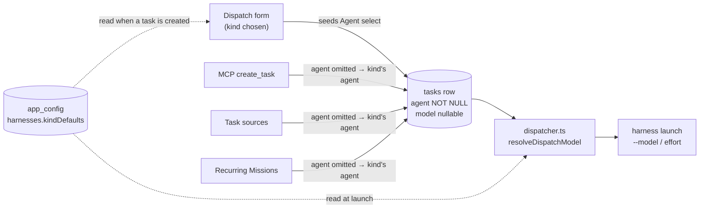

# A model per kind of task

Pick the agent and model a **plan** task runs on independently of the one a **ship** task runs
on, from Settings → Models.

Today the choice is made per harness: `Settings → Harnesses` holds one default model and one
default effort for each of Claude, Codex and Pi, and the dispatch form starts on it. Which
*kind* of work is being dispatched never enters into it, so planning and shipping run on the
same model unless somebody overrides the picker by hand on every single dispatch.

## What already exists, and what has to be built

Three of the four pieces are already in the codebase, which is why this is a small change with
one genuinely new idea in it.

**Kind is already first-class.** `TASK_KINDS` (`src/shared/types.ts:1702`) is
`["ship", "scout", "plan", "pipeline", "chat"]`, `TASK_KIND_INFO` and `TASK_KIND_BEHAVIOR`
(`src/shared/task.ts:61`, `:106`) already carry each kind's copy and its launch rules, and every
picker in the app renders from those records rather than spelling its own options. A new
per-kind record slots in beside them.

**The model already resolves at launch, in tiers.** `resolveDispatchModel`
(`src/server/harnesses.ts:84`) is three tiers, narrowest first: the task's own pin, then a
launch-only model (Foreman's per-harness backlog model), then `harnesses.defaultModel[agent]`,
else no `--model` flag at all. A kind default is a fourth tier, inserted above the harness
default.

**The config blob already takes new keys without a migration.** `HarnessesConfigSchema`
(`src/shared/protocol.ts:2043`) is a schema-validated blob over the `app_config` KV, and
`HarnessesConfigPatchSchema` is deliberately spelled out per top-level key so each panel owns
the keys it writes and two panels can never lose each other's updates.

**A role carrying its own agent and model is already a pattern here.** An Ensemble role spec
(`EnsembleRoleSpec`, `src/shared/ensemble.ts:479`) stores exactly `agent: AgentType | null`,
`model: string | null`, `effort: ThinkingLevel | null` - the same nullable triple this needs, with
null meaning inherit. A Persona carries `runner_id` and `model_id` on its row
(`src/server/db.ts:1029`) and resolves them through the shared `resolveModelChoice` ladder. So
this is not a new idea in the codebase, only a new subject for it: the shape to copy already
exists twice.

**What is new is the axis itself** - a default keyed by kind rather than by harness - and the
one place the two axes meet: a kind default names an *agent*, and naming an agent decides which
model catalog its model comes from.

`TASK_KINDS` is append-only and never reordered (`src/shared/types.ts:1695-1704`), so a record
keyed by kind id is safe to persist: a key can be added but never means something else later.

## The constraint that shapes the whole design

`tasks.agent` is `TEXT NOT NULL` (`src/server/db.ts:617`) and `Task.agent` is
`AgentType`, never null (`src/shared/types.ts:1881`). `tasks.model` and `tasks.effort` are
both nullable, and null is what "resolve me at launch" means for them.

So the agent and the model cannot reach a task the same way:

- **Model and effort resolve at launch.** A kind default for them is a new tier in
  `resolveDispatchModel`, read when the task starts. Change the plan model today and a plan
  task that has been sitting in the backlog since last week launches on the new one. That is
  what the harness defaults already do, and what makes a default worth setting.
- **The agent is written when the task is created.** There is no "unset" agent to fall back
  from, so a kind default for the agent is a *seed*: the dispatch form moves its Agent select
  when you choose a Kind, and every task creator that omits an agent gets the kind's agent
  written onto the row instead of today's hardcoded `"claude"`
  (`DispatchSchema.agent`, `src/shared/protocol.ts:953`; `EMPTY_DISPATCH_DRAFT.agent`,
  `src/web/lib/task-draft.ts:71`). Change the plan agent today and a plan task already in the
  backlog keeps the agent it was filed with.

That asymmetry is not a wart to hide. The panel says it in one line under the section, because
an operator who changes the plan agent and expects a shelved task to pick it up would otherwise
have no way to find out they were wrong.

Making `tasks.agent` nullable would remove the asymmetry and is deliberately **not** proposed.
The agent is drawn on every card, sorted on by the registry's comparators, and filtered on by
Foreman; a nullable agent would push "which agent is this" into a resolve call at a dozen read
sites to save one line of copy.

## Which kinds get a row

Every kind whose `TASK_KIND_BEHAVIOR[kind].launch === "harness"` - today `ship`, `scout`,
`plan` and `chat`. `pipeline` is excluded, and excluded *by reading the registry* rather than
by a hardcoded skip list, because Conductor owns every downstream agent, model and effort
choice for a pipeline task (`src/shared/task.ts:126`) and a control that saves a preference
nothing reads is worse than no control.

A kind added later gets a row for free the moment it declares `launch: "harness"`.

## Where it lands in the ladder

The model ladder today, and with the kind default in it:

```mermaid
flowchart TD
  subgraph before["Today - resolveDispatchModel"]
    B1["Task's own model pin<br/>(dispatch form)"] --> B2["Foreman backlog model<br/>(this launch only)"]
    B2 --> B3["harnesses.defaultModel[agent]"]
    B3 --> B4["no --model flag<br/>(the CLI's own config)"]
  end
  subgraph after["Proposed"]
    A1["Task's own model pin<br/>(dispatch form)"] --> A2["Foreman backlog model<br/>(this launch only)"]
    A2 --> A3["kindDefaults[kind].model<br/>NEW - matched on agent"]
    A3 --> A4["harnesses.defaultModel[agent]"]
    A4 --> A5["no --model flag<br/>(the CLI's own config)"]
  end
```



The kind default sits **below** Foreman's launch-only model and **above** the harness default,
which is the only ordering that keeps both of the existing rules true: an explicit choice for
one launch still wins, and a per-harness default is still what a kind with nothing configured
falls back to.

"Matched on agent" is the one subtlety. A kind default stores an agent *and* a model, and the
stored model is only meaningful for that agent - a `claude-opus-5` id is not something Codex can
run. So the tier applies its model **only when the task's agent equals the kind default's
agent**. A plan task the operator switched to Codex by hand falls straight through to Codex's
harness default rather than being handed a Claude model id. The existing per-harness key shape
(`defaultModel: { claude, codex, pi }`) makes the same point in the other direction.

## Where the choice is made, and by whom



The dashed edges are the point: the same stored record is read once when a task is created, to
settle its agent, and again when that task launches, to resolve its model. Saving it publishes the
existing `harnesses_config_changed` event (`src/shared/types.ts:2955`), so a second tab and an
already-open dispatch form both re-read it rather than going on naming a model you moved away
from - exactly as the harness defaults do today.

## The layout

**Adopted: one matrix on Settings → Models**, above the existing Background jobs group. Rows are
kinds, columns are Agent, Model and Effort. A first row, muted and not editable, shows what a kind
with nothing set falls through to.

```
TASK KINDS
                 Agent            Model              Effort
  (any kind)     -                harness default    harness default
  ship           [Claude Code ▾]  [Opus 5      ▾]    [high  ▾]
  scout          [Codex       ▾]  [GPT-5.6 Luna▾]    [low   ▾]
  plan           [Claude Code ▾]  [Fable 5     ▾]    [xhigh ▾]
  chat           [Inherit     ▾]  [Inherit     ▾]    [Inherit▾]

  A row left on Inherit follows Settings → Harnesses.
  pipeline has no row: Conductor owns its agent, model and effort.
```

The whole configuration is one glance, which is the actual job - "is scout cheaper than ship?" is a
comparison, and a table is what comparisons are read from. It stays four short rows however many
controls each row grows, and inheritance is legible because the inherited row is *drawn* rather
than described.

Two costs come with it and are accepted. Three selects on one line is tight at narrow widths, so
the table scrolls inside its own container rather than compressing its selects. And there is no
room for each kind's `blurb`, so the kind's own name carries the row and the blurb moves to the
row's tooltip - which is where `TASK_KIND_INFO.blurb` already goes on the surfaces that have no
line to spare for it.

## What changes

Roughly, and in the order the change would be made:

- `src/shared/protocol.ts` - a `kindDefaults` key on `HarnessesConfigSchema`, keyed by the
  harness-launched kinds, each entry `{ agent, model, effort }` and every field nullable with
  null meaning inherit. A matching entry on `HarnessesConfigPatchSchema`, spelled out per key
  like its siblings.
- `src/server/harnesses.ts` - merge the new key in `setHarnessesConfig:56` alongside the three
  existing per-key merges, and add the kind tier to `resolveDispatchModel:86` and
  `resolveDispatchEffort:95`. Both take the task's kind as a new argument. Every launch path
  funnels through those two functions, which is why the tier is one edit rather than a search.
- `src/web/harnesses-reconcile.ts` - `mergeHarnessesPatch` merges the patch optimistically in the
  browser and has to learn the new key too, or an optimistic write replaces the whole record
  instead of one kind's row.
- `src/server/dispatcher.ts:449-450` - pass the task's kind through to both resolvers.
- The task-creating routes - resolve an omitted agent from the kind default instead of
  defaulting to `"claude"`. This is where MCP `create_task`, task sources and Recurring
  Missions inherit the behaviour without each learning about it.
- `src/web/components/LlmSettingsPanel.tsx` - the matrix group above the existing Background
  jobs group. It
  reads `useLlm` today and the kind defaults live in the `harnesses` blob, so the panel takes the
  `useHarnesses` state as a second prop. `SettingsPage.tsx` already holds that state (L258) and
  passes it to the Harnesses panel, so both surfaces share one instance rather than opening a
  second poller with its own idea of the truth.
- `src/web/lib/settings-registry.ts` - the Models category's blurb and keywords, which today
  say "the app's own calls" and would be describing only half the page.
- `src/web/components/DispatchModal.tsx` / `src/web/lib/task-draft.ts` - choosing a Kind moves
  the Agent select, and the model and effort hints name the kind default when it is the one
  that applies.
- `src/web/lib/settings-search.ts` - ⌘K entries, so the kind rows are reachable by typing
  "plan model".
- `docs/models.md`, `docs/dispatch-and-backlog.md` ("Which model wins", which enumerates the
  tiers), `docs/harnesses-and-terminals.md`.
- `test/` - the resolution ladder including the agent-mismatch fall-through, the config merge,
  and the registry-driven row set. `e2e/` - a spec that sets a kind default, opens Dispatch,
  chooses that kind, and asserts the Agent select moved and the model hint names it.

## What does not change

- **Settings → Harnesses keeps its per-harness defaults.** They are the tier a kind with
  nothing configured falls through to, so removing them would leave `pipeline`, discovered
  sessions and any future non-kind launch path with nothing to inherit. Two panels write the
  same `harnesses` blob, which is safe only because each owns its own top-level keys - the
  merge in `setHarnessesConfig` is per key, and the patch schema is spelled out rather than
  derived, precisely so this holds.
- **The Background jobs group is untouched.** Its provider and its five job models are about
  calls Mission Control makes for itself and have nothing to do with the agent in a card. The
  page would then be answering two questions, and the group headings are what keep them apart.
- **Foreman's four models and the Inspector's review model stay where they are**, with the
  subsystems that spend them.
- **A running session keeps the model it launched with.** Only the next dispatch reads a
  changed value, as today.
- **A session Mission Control merely discovered is never touched.** Every key in this blob is
  scoped to dispatch.

## Decisions taken

| Question | Adopted | Not taken |
|---|---|---|
| The control's shape | **One matrix** - rows are kinds, columns are Agent / Model / Effort, with the inherited row drawn on top | A card per kind (the page's existing idiom, but a screen longer and poor at comparison); named presets (reusable later, pure indirection on day one) |
| What a kind default carries | **Agent + model + effort**, each nullable, null meaning inherit - the same triple an Ensemble role already stores | Agent + model only; model only |
| How far it reaches | **Every path that creates or launches a task** - a real tier in `resolveDispatchModel`, plus the agent seed for the dispatch form, MCP `create_task`, task sources and Recurring Missions | Seeding the dispatch form and nothing else |
| After this plan | **Stop here** - no phase documents and no scheduled implementation tasks | Create a phased implementation plan |

The reach decision is what makes the create-time / launch-time asymmetry above load-bearing rather
than incidental, so it is the thing to keep in view when this is built: **the model and the effort
are a tier, the agent is a seed**, and the panel has to say so where an operator will read it.

This plan is approved as written and is not scheduled. Picking it up later means starting from
"What changes" - no phase documents exist and no implementation tasks were created.
