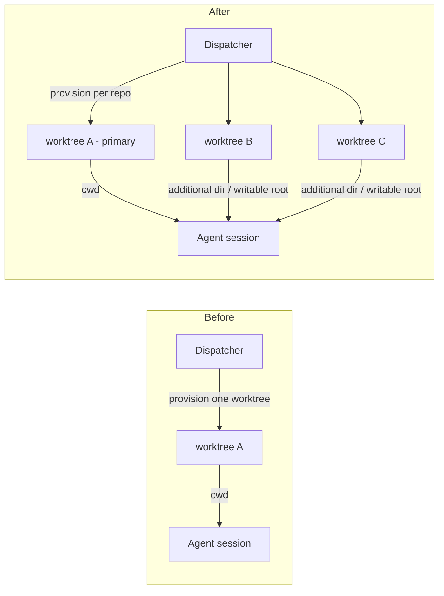
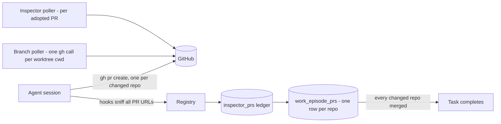
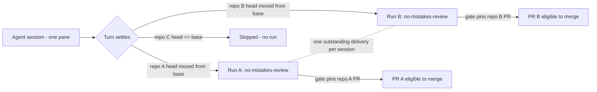

# Multi-repo tasks

**Status:** Delivered. Decisions adopted 2026-08-05. Phased into four serial phases - see [phased-plan.md](phased-plan.md) ([rendered](phased-plan.html)) - all four merged (#491, #493, #494, and the policy-and-prose phase). The out-of-scope list below is unchanged and is where any follow-on work starts.
**Rendered page:** [plan.html](plan.html)

## Goal

Attach multiple repositories to a single task so one agent session makes coordinated changes across several repos in shared context - cross-cutting integrations, contract changes that must land with their consumers, lockstep API migrations. One task produces up to one pull request per attached repository, and each changed repository gets its own full review workflow run.

## Adopted decisions

| # | Decision | Choice |
|---|---|---|
| 1 | Completion | A multi-repo task auto-completes only when every changed repo's PR has merged (all-merged quorum) |
| 2 | Review workflows | Per-repo workflow runs: one session supports N concurrent runs, one full no-mistakes-review per repo with changes; unchanged repos are skipped |
| 3 | Harnesses | Claude and Codex in v1, behind a new `HARNESS_CAPABILITIES` flag; Codex gains sandbox writable roots for secondary worktrees |
| 4 | Auto-merge | Independent merges: each PR merges when it alone is eligible, exactly today's per-PR verdict; no coordinated-merge mechanism |
| 5 | Session layout | One session; cwd is the primary repo's worktree; secondary repos are additional worktrees the agent is granted access to |
| 6 | Data shape | Existing `tasks` columns stay authoritative for the primary repo; secondaries live in a new `task_repos` child table (additive, back-compatible) |
| 7 | v1 entry points | Dashboard dispatch modal only; schedules, task sources, and MCP `create_task` stay single-repo for now |
| 8 | Assignment | Multi-repo tasks are dispatch-only in v1; assigning one to an existing session is refused |

Decisions 5-8 are defaults recommended by this scoping and are adjustable at review.

## Current state (what the feature has to move)

- There is no repos table. A repository is a scanned directory under the workspace roots (`src/server/repos.ts`); a task's repo is one `NOT NULL` scalar, `tasks.repo_root`, validated at a single chokepoint (`resolveTaskRepoRoot`), written through one statement (`upsertTask`), read through one function (`rowToTask`), and shipped whole over the `task_upsert` SSE event.
- One session = one cwd is the task/session correlation key, not a convention. Dispatched tasks correlate by exact `task.worktreePath === session.cwd`; hook and MCP ingest fall back to cwd uniqueness (`registry.ts` `activeTaskForCwd`, `findSessionByEnv`).
- Dispatch provisions exactly one worktree per task (`provisionWorktree`): a treehouse pool lease when available, else `git worktree add` at `WORKTREES_DIR/<taskId>` on branch `harness/<slug>-<shortId>`. Teardown is provider-aware and singular.
- The pool reaper spares only pinned trees. Pins come from live session cwds plus each task's single `worktreePath`. An unpinned worktree is eligible for `reset --hard` and return-to-pool - this is the one destructive edge in the feature.
- PR association is inferred, never reported by the agent. Hooks sniff `gh pr create` output, and `pullRequestUrlIn` returns only the first URL in a command's output. `Session.prUrl` is a scalar that overwrites. The work-episode binding (one per task, one per session, enforced by primary keys and a `pr_url IS NULL OR pr_url = ?` guard) refuses a second concurrent PR. Task completion today is "newest merged PR wins".
- The adoption ledger is already multi-PR. `inspector_prs` is keyed `owner/repo#number` with per-row `repo_root`, and the Inspector poller iterates PRs, not tasks - every PR a session opens, in any repo, is adopted, observed, and reviewed independently. `announcePrOpened` deliberately allows a session to announce a second PR.
- The workflow layer is one run per session. `workflow_bindings` enforces one active binding per session note (`UNIQUE(note_key) WHERE state='active'`) and carries scalar `session_cwd`/`session_repo_root`. A run's Inspector gate pins exactly one PR (`workflow_runs.inspector_pr_key`), evidence capture records one checkout head, and the `pull_request` session-action adapter proves one open PR at one repo, branch, and head. A second PR triggers `inspector_pr_switch_refused`.
- Harness write scope is rooted at cwd. Codex launches with `--sandbox workspace-write` scoped to its workspace; Claude's `settingSources: ["user","project","local"]` loads only the primary checkout's CLAUDE.md and settings. Claude has an additional-directories seam; Codex sandbox writable roots are configurable at launch.

## Design

### Data model

New child table, following the additive column contract in `docs/agent-guides/change-contracts.md`:

```sql
CREATE TABLE IF NOT EXISTS task_repos (
  task_id       TEXT NOT NULL,
  repo_root     TEXT NOT NULL,
  worktree_path TEXT,
  branch        TEXT,
  provider      TEXT,
  base_sha      TEXT,
  position      INTEGER NOT NULL,
  PRIMARY KEY (task_id, repo_root)
);
```

- `tasks.repo_root` / `worktree_path` / `branch` / `provider` remain the primary repo, untouched. Every existing single-repo consumer (Foreman prompts, report panel, drag payloads, assignment gates) keeps a meaningful value. A single-repo task has zero `task_repos` rows; old databases open unchanged.
- `tasks` gains one additive column, `base_sha TEXT`, holding the primary repo's baseline. The primary's other provisioning facts already live on `tasks`, so its baseline belongs beside them rather than forcing a `task_repos` row for the primary and breaking the "a single-repo task has zero `task_repos` rows" rule.
- `base_sha` records the commit each branch was cut at, for every repo including the primary: `tasks.base_sha` for the primary, `task_repos.base_sha` for each secondary. It powers two later rules: the changed-repo set (a repo whose head still equals its base is exempt from the PR requirement and gets no workflow run) and the completion quorum. **Both rules are unsound without a primary baseline.** If the primary appears in neither the episode-PR set nor the head-differs-from-base set, an agent that changes the primary without opening a primary PR leaves the primary invisible to the changed set: the quorum would complete the task on a merged secondary PR alone while primary work sat unmerged, and phase 3 would never create a workflow run for the primary, so its changes would ship unreviewed.
- Wire shape: `Task` gains `extraRepos: TaskRepoEntry[]` (`{ repoRoot, worktreePath, branch, provider, baseSha, prUrl, prState, mergedAt }`, PR fields derived by the registry when emitting) and `baseSha: string | null` for the primary, so a consumer of the changed-set rule sees every repo's baseline through one shape. It rides the existing whole-`Task` `task_upsert` event - no new `ServerEvent`, no `MissionState` change beyond the type.
- `DispatchSchema` gains `extraRepoRoots: string[]` (default `[]`). Each entry passes `resolveTaskRepoRoot`, is deduped, and must not equal the primary. `UpdateTaskSchema` mirrors it; `isAnnotationOnlyUpdate` counts keys, so a repo-set edit is automatically a provisioning change and stays refused after the task leaves the backlog - the desired behavior for free.
- Work episodes: new `work_episode_prs (episode_id, repo_root, pr_url, pr_head_sha, merged_at, UNIQUE(episode_id, repo_root))`. The existing scalar episode PR columns remain the primary repo's entry for back-compat. The `acceptPrForEpisode` refusal guard survives per repo: a repo that already holds a different PR on this episode still refuses a replacement.
- `TaskDependency` edges stay scalar in v1 and bind to the primary repo's PR; actual downstream release is governed by the task's completion (all-merged), which is the stronger condition.

### Dispatch and provisioning

- The dispatcher loops `provisionWorktree` over `[primary, ...extras]` with the same slug and short id; provider resolves per repo (a treehouse repo takes a pool lease, others use the git fallback - mixed providers are fine since provider is per entry). The git fallback needs a per-repo destination: its path is keyed on the task alone today (`WORKTREES_DIR/<taskId>`), so two non-pool repos on one task would collide on `git worktree add`. Each entry's slot, which is its `position`, discriminates the path, and slot 0 keeps today's exact path so single-repo dispatch is unchanged. Pool paths are already distinct because each repo has its own pool. The branch name is deliberately the same across repos. Every repo records its `base_sha` at cut time - the primary's onto `tasks.base_sha`, each secondary's onto its `task_repos` row - so the changed-set rule can evaluate the primary on the same footing as the secondaries.
- All-or-nothing: a failure mid-loop tears down already-provisioned entries (provider-aware: leases are returned, never git-removed) and fails the dispatch.
- Pool pins: the task pin set extends from `t.worktreePath` to also include every `extraRepos[].worktreePath`. This lands in the same change as provisioning - without it the reaper can `reset --hard` a secondary worktree under a live agent.
- Teardown (`teardownWorktree`, `teardownTaskResources`, startup reconciliation) loops the collection and nulls it alongside the existing scalars.
- Multi-repo tasks are dispatch-only: `TaskManager.assign` refuses them with a clear error, `canAcceptTask` returns false, and the board tile never shows a drop target for them.

### Agent handoff

- The session's cwd is the primary worktree; all correlation machinery is untouched.
- Claude: the SDK launch passes the secondary worktree paths as additional directories (verify the exact SDK option during implementation); the terminal path passes the equivalent `--add-dir` flags.
- Codex: the launch adds sandbox writable roots for each secondary worktree (verify the exact config key against a real installation; `HARNESS_CAPABILITIES` values must be measured, per the harness contract).
- A new capability flag (for example `multiRepoDispatch`) is added to `AGENT_TYPES`-keyed records; the compiler forces a measured value per harness. Claude and Codex: supported. Pi: null until verified.
- The dispatcher prepends a repo manifest to the intent: each repo's path, branch, and role, plus standing instructions - read each repo's AGENTS.md/CLAUDE.md before touching it (only the primary's loads automatically via `settingSources`), commit and push per repo, and open one PR per repo actually changed.

### PR tracking and completion

- `pullRequestUrlIn` returns all URLs in a command's output instead of the first; hook ingest carries the list. `announcePrOpened` already tolerates a sequence.
- The branch poller's targets extend: for each session owning a multi-repo task, add one `(secondary worktree cwd, branch)` pair per entry - still one `gh pr list` per distinct cwd, as today.
- `Session.prUrl` stays the scalar "current branch's PR" (card semantics unchanged). Multi-PR truth lives in the adoption ledger and `work_episode_prs`; the registry projects per-repo PR state onto `Task.extraRepos` when emitting.
- Merge reconciliation marks merges per `(episode, repo)`; `task_pr_merged` fires per PR as today.
- Completion quorum: `reconcileMergedTasks` completes a multi-repo task only when every repo in its changed set has a merged PR. The changed set is: repos with an episode PR, plus repos whose head differs from `base_sha` - evaluated over the primary and every secondary alike, reading the primary's baseline from `tasks.base_sha`. A closed-unmerged PR does not satisfy the quorum; the task stays visible for the operator. `outcome` lists all merged PRs; `outcomeUrl` keeps the primary repo's PR for back-compat.
- Auto-merge is unchanged: each PR merges independently under today's per-PR verdict (review clean, CI green, soak elapsed). The residual inconsistency window between sibling merges is accepted by decision 4 and noted under Risks.

### Per-repo workflow runs

One session supports N concurrent workflow runs, one per changed repo. The single-repo contracts that make the workflow subsystem safe - the `pull_request` adapter's proof rules, evidence identity `(round, segment)`, the gate's wait/block vocabulary - stay closed; each run is a textbook single-repo review scoped to one of the task's repo entries.

- **Bindings gain a repository dimension.** The active-binding uniqueness becomes per `(note_key, repo)`; each binding/run carries the repo entry it reviews.
- **Lazy run creation.** Runs are created at trigger time, not binding time: when the session's turn settles, each repo whose worktree head differs from its `base_sha` gets a run - the primary included, on its `tasks.base_sha` baseline; unchanged repos are skipped and never appear.
- **Per-repo evidence capture.** Context snapshots and evidence capture execute against the run's repo worktree, not `session.cwd`. Adapters stay pure: the manager supplies that repo's facts on `SessionActionAdapterContext` exactly as it does today for one repo.
- **Submission routing.** With N active runs, an evidence submission must name its run. The submit surface gains a repo discriminator, with daemon-side routing by which repo's head moved since capture as the fallback.
- **Cross-run delivery serialization.** N runs share one pane. At most one run's delivery (repair packet or session action) may be outstanding per session; other runs wait in an explicit queued state. Within a run, the existing two-actions-ready-refuse contract is unchanged.
- **Cross-repo repair staleness.** A repair for repo A that also touches repo B invalidates B's captured evidence. B's own head-mismatch/fresh-observation machinery catches it and requires resubmission. The per-PR merge verdict (`reviewedSha === headSha`) is the backstop that keeps anything stale from auto-merging.
- **Independent repair budgets.** Each run keeps its own `maxRepairRounds`; a finding in one repo restarts only that repo's graph.
- Persisted vocabularies touched (all append-only per the change contracts): any new wait reasons or block codes get their `Record` entries and human sentences in `run-model.ts`; no existing IDs are renamed.

### Policy gates

- Foreman schedulability and live-session gating require every attached repo to pass the allowlist (AND rule). This ships in phase 1 alongside provisioning, not as later polish: without it Foreman could auto-dispatch an agent into a secondary repo the operator never allowlisted. The Trust matrix needs no change - grants are already per repo.
- Review follow-through (`FollowupMark`) keys per PR instead of per session, so a nudge on repo A's PR does not erase repo B's history.
- Inspector needs no structural change: it is already per adopted PR with per-row `repo_root`, and standards resolution follows each PR's own checkout.

### UI

- Dispatch modal: the single repo field becomes chips plus the existing `RepoCombobox` as the adder (the Dependencies field pattern already in the modal). The first chip is the primary and is visually marked. Multi-repo entry is offered only when the selected harness has the capability. Draft/lastRepo storage becomes a list.
- Session and task surfaces: `prChipView` keeps the session's scalar chip; the task chip area on `SessionCard` and `ConsoleDetail` renders a per-repo PR list from `Task.extraRepos`. `WorkflowChip` fans out to one chip per run. Backlog cards and the report panel show the repo set with the existing chips-with-overflow pattern.
- Board drag: multi-repo tasks are never droppable in v1 (dispatch-only).

## Flows

Dispatch, before and after:



PR tracking and completion (after):



Per-repo workflow runs (after):



## Phasing

Each phase ships independently and leaves the product consistent.

1. **Multi-repo dispatch.** `task_repos` schema plus the additive `tasks.base_sha` column and migration with pre-feature upgrade test, shared contracts, per-repo provisioning/teardown with rollback recording every repo's baseline, pool pins for extras (same change), the capability flag, Claude additional directories, Codex writable roots, intent manifest, dispatch modal chips, the Foreman allowlist AND rule over the whole repo set (the consent gate ships with the capability that needs it, not later), e2e spec proving one dispatch yields N worktrees. PR behavior still today's (first PR wins).
2. **Multi-PR tracking and completion.** `work_episode_prs`, all-URL sniffing, poller fan-out, per-repo acceptance and merge reconciliation, all-merged completion quorum, per-repo PR rendering on cards and report, e2e.
3. **Per-repo workflow runs.** Binding repository dimension, lazy run creation from `base_sha` diffs, per-repo evidence capture, submission routing, cross-run delivery serialization, workflow chip fan-out, e2e.
4. **Policy and prose.** Per-PR follow-up marks, `pull-request` and `phased-plan` skill updates ("one PR per repository you changed"), session-action prompt, agent-guide and `docs/*.md` updates. The allowlist AND rule is deliberately not here - it ships in phase 1 with the capability it gates.

## Out of scope for v1

- Ensembles over multiple repos (N sessions x M repos)
- Schedule templates, task-source sweeps, and MCP `create_task` with multiple repos
- Assigning a multi-repo task to an existing session; board drag-to-assign
- Coordinated cross-repo merge ordering (decision 4 chose independent merges)
- Pi harness support (capability stays null until measured)

## Risks

- **Pool reaper eviction of secondary worktrees** is destructive. Mitigation: pins ship in the same change as provisioning; a test covers a live multi-repo task surviving a reap.
- **Independent merges leave an inconsistency window** between sibling PRs landing. Accepted by decision 4; the report and cards make partially-merged state visible via the completion quorum.
- **Cross-repo repair ping-pong**: tightly coupled changes can repeatedly stale each other's run evidence. Bounded by per-run repair budgets and the head-match merge verdict; called out in run surfaces so an operator can see it.
- **Codex writable-roots behavior** must be verified against a real installation before the capability is declared; if it cannot be verified, Codex falls back to null (unsupported) without blocking the Claude path.
- **Secondary repos' CLAUDE.md is not auto-loaded** (`settingSources` is cwd-rooted). Mitigated by the intent manifest instruction; verify whether additional directories load their own instructions and drop the workaround if they do.
- **Migration safety**: old databases must keep opening; the upgrade test seeds a pre-feature database per the change contract.

## Test plan

- Unit: schema upgrade from a pre-feature database; provisioning rollback; pin coverage under reap; multi-URL sniffing; per-repo episode acceptance and refusal; completion quorum incl. closed-unmerged; run creation skipping unchanged repos; delivery serialization; the ~25 existing tests that pin single-PR semantics updated deliberately.
- e2e (`e2e/`): second `seedRepo` in the daemon fixture (helper already parameterized); dispatch spec proving N worktrees and the repo chips UI; fake-agent flow opening two PRs and the card showing both; completion quorum over seeded `inspector_prs` rows; per-repo workflow run chips. Fake agents throughout - no model tokens.
