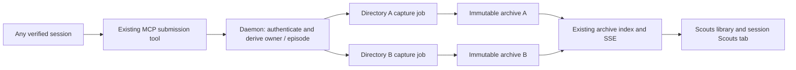

# Multiple scout reports from any session

**Status:** Implemented after operator approval on 2026-09-29. Completion-review repairs and final verification are complete.

**Date:** 2026-09-29

## Recommendation

Allow any Mission Control session with a verified submission identity to publish multiple scout reports when the operator asks for them. Keep one immutable archive per report directory. Use the existing `submit_scout_artifacts` tool once per report, with an optional report title, and make the reports discoverable from their originating session as well as the Scouts library.

The operator confirmed: “Both. I'd like other sessions to also be able to publish scouts if specifically instructed to. any session should be able to publish multiple scouts.” This includes every task kind and sessions with no task. A report is an additional deliverable; submitting one does not change the session's task kind, mark its work done, close it, or start a workflow.

Implement this as one coherent change in this session after approval, in the dependency order below. No separate implementation tasks or scheduling are proposed. The initial task handoff permits no commits, pushes, or pull requests.

## What the operator will experience

1. Ask a scout, ship, bugfix, plan, pipeline, chat, or taskless session to produce a report.
2. The agent writes `docs/reports/<unique-slug>/report.html` and calls `submit_scout_artifacts`. It receives a link/key for that report and a confirmation that publication succeeded, without an instruction to stop working.
3. Ask for another report in the same session. A different directory produces a second archive. Both reports remain independently readable, searchable, renameable, and deletable.
4. Open the session's **Scouts** detail tab to see its reports. Selecting an entry previews its source in Files; **Open archive** reads the immutable published copy in the existing archive reader. The main Scouts library also lists every report separately and can filter to the originating session.
5. Retry the same report submission after a lost response. The existing archive is returned; the library does not gain a duplicate.
6. Finish the underlying task through its normal completion path. A scout task still requires its submitted reports to be complete. Other task kinds keep their existing completion and workflow rules.

“Specifically instructed” is an agent behavior contract: the tool is available, but non-scout prompts tell the agent to publish only when asked. This proposal does not introduce an extra operator permission dialog per report or try to infer authorization by parsing the conversation.

## Verified repository findings

These are source-level findings, not claims that new behavior has been executed.

| Finding | Evidence | Consequence |
|---|---|---|
| Scout captures use an unscoped task/episode operation key. | `src/server/archives/manager.ts`: `reserve`; `src/server/archives/capture-store.ts`: `archiveOperationKey` | Two report paths currently converge on the same archive. |
| Directory-scoped capture already exists for plan archives. | `src/server/archives/manager.ts`: `reservePlanJobs`; `scope_json` in `src/server/db.ts` | Reuse the capture store and publishing pipeline rather than create another archive subsystem. |
| Submission requires a signed task/checkout credential and refuses non-scout tasks. | `src/server/scouts/submission-auth.ts`; `src/server/archives/task-gateway.ts`: `subjectForSubmission`; `src/server/routes.ts`: `/mcp/scouts/submit` | Removing the duplicate-report limit alone would not support the approved scope. |
| Credentials are provisioned only for scout dispatch/assignment and are looked up by checkout. | `src/server/dispatcher.ts`; `src/server/tasks.ts`; `src/shared/harness-runtime.mjs`; `src/server/agent-subprocess-env.ts` | Generalize identity provisioning, including safe handling of two sessions in the same checkout. |
| Completion returns on the first complete archive, and exit capture skips work when any current archive is published. | `src/server/archives/manager.ts`: `ensureReady`, `reserveOnExit` | A later failed report could otherwise be overlooked. |
| The first scout reservation clears its prompt journal. | `src/server/archives/manager.ts`: `reserve`; `src/server/scouts/prompt-context.ts` | Later scout reports need the journal retained until the episode ends. |
| The MCP response currently ends with “You can stop.” | `src/mcp/server.ts`: `submit_scout_artifacts` | Replace this completion cue when publication can happen mid-session. |
| Portable manifests carry repository/agent provenance, but no session/task/episode relationship. | `src/shared/archives.ts`: `ArchiveManifestOrigin`; `src/server/archives/capture.ts` | Add optional provenance so new report associations survive index rebuild and session removal. |
| Capture jobs require a task ID today; the Registry already owns taskless work episodes. | `src/server/db.ts`: `archive_capture_jobs`; `src/server/registry.ts`: `workEpisodeForSession` | Support a real session-owned capture subject, without inventing a task. |
| The library and reader already address separate archives by opaque keys. | `src/web/components/scouts/ScoutsPage.tsx`, `ScoutReader.tsx`; `src/server/archives/store.ts` | Reuse existing report rendering, search, rename, delete, and SSE invalidation. |

## Alternatives considered

| Approach | Tradeoff | Rough effort | Impact |
|---|---|---|---|
| Multiple reports only in scout tasks | Smallest change, but excludes explicitly requested reports from other sessions. | Small to medium | Solves only the original narrow limitation. |
| **One independent archive per report, from any session** | Reuses immutable archives; requires identity, lifecycle, and discoverability changes. | **Medium to large; approximately 3 to 5 engineering days including regression coverage** | **Satisfies the confirmed scope and keeps reports portable. Recommended.** |
| One mutable collection of reports per session | Needs collection/version semantics, a different reader, and changes to archive immutability. | Large; approximately a week or more | Useful for versioned report collections, which were not requested. |

Estimates are planning ranges. The largest uncertainty is extending authenticated submission across managed and discovered terminal sessions without weakening attribution.

## Approved product contract

| ID | Required behavior |
|---|---|
| SCOUT-01 | A single session can publish two or more reports with distinct archive keys and independent contents. |
| SCOUT-02 | All registered task kinds and registered taskless sessions can publish when instructed; SDK, terminal, assigned, restored, and discovered sessions follow the same capability contract. A client with no resolvable live identity receives an actionable refusal. |
| SCOUT-03 | Report publication is independent of task completion. Non-scout sessions gain no mandatory report or automatic report discovery. |
| SCOUT-04 | Within one owner/work episode, the same repository slot and report directory identify the same report. Retries return its archive; a new directory creates a new report. |
| SCOUT-05 | Published report bytes are immutable. A revision is submitted under a new slug. A rejected, unpublished report can be corrected and retried under its existing slug. |
| SCOUT-06 | Every report has a useful display title and source-session provenance. New associations survive session/task deletion, daemon restart, and index rebuild. |
| SCOUT-07 | A scout task completes only after at least one complete report exists and every explicitly submitted report in the current episode verifies. An earlier success cannot conceal a later failure. |
| SCOUT-08 | Accepted submissions survive restart and are settled before their owned checkout is destroyed. Failure retains the source checkout and identifies the affected report. |
| SCOUT-09 | Old archives and old in-flight captures remain readable/recoverable; a retry of a known legacy report does not duplicate it. |
| SCOUT-10 | Session details and the Scouts library show separate reports and update through the existing event stream. Deleting or renaming one report does not affect its siblings. |

The existing explicit close-without-report escape remains available for scout tasks, with wording that accurately identifies missing or incomplete reports. Automatic completion cannot take that escape. Its cleanup path must retain sources that have not been safely handled.

### Deliberate scope limits

- One submission publishes one report. A batch API, report ordering, and report version history are unnecessary for this release.
- Reports remain in the primary checkout. Existing repository slots continue to locate additional supporting files.
- Publication from non-scout sessions is explicit. Their incidental `docs/reports/` files are never automatically swept into the library.
- Existing archive limits, static HTML validation, containment checks, and companion-file rules continue to apply per report.
- New non-scout reports do not silently archive the surrounding ship/chat conversation. They carry the report, summary, title, and verified provenance; prompt context is unavailable unless an existing valid scout boundary supplies it.

## Data and request flow

Today: a scout-only credential reaches the submission route; every path from the same task episode selects one capture job and one archive.

Proposed: a session-scoped credential reaches the same submission route; the daemon derives its live owner and episode, then selects a capture job by report directory. Each job publishes an independent immutable bundle. The disposable index projects session provenance, and the existing archive event invalidates both the library and the open session's report list.

No new database writer, background polling loop, archive root, or session-eviction mechanism is introduced.

## Technical design

### 1. Make submission authority identify a session, not a task kind

Extend the existing signed capability mechanism with a versioned session authority. Bind it to the exact live Mission session, its verified runtime identity, checkout, and current work episode. Resolve an optional task through the Registry. Keep task/session/episode IDs out of agent-supplied report arguments.

Provision through the existing launch, assignment, restore, and discovery/adoption seams. Managed SDK launches already receive an exact Mission session ID. Terminal adapters must use their proven launch/pane/native-session association. A discovered, taskless session receives authority only once the daemon has positively associated its runtime with that Registry session. Cwd alone and the shared harness token alone must never mint authority.

Replace the cwd-only credential lookup for new clients with an identity-scoped capability locator. Terminal bridges use their OS parent PID; SDK bridges receive a private daemon-issued locator in their launch configuration. Public session IDs never select credential files. Preserve call-time reads and isolated subprocess handling, so long-lived MCP children receive rotated capabilities without inheriting the operator's state-home settings. Two sessions in one checkout must not overwrite each other's capability. Assignment and episode changes invalidate the prior authority; `session_remove` revokes it, with a startup reconciliation twin. Temporary `state === "exited"` is not a new durable cleanup path.

Retain the existing version-1 task/checkout verifier for compatible scout clients, constrained by its existing live-binding checks. New clients use the session capability. Missing/stale bridge support should explain that the client needs a refresh or restart; it must not fall back to a weaker identity claim.

Before widening production acceptance, pin this behavior with harness-aware tests for Claude, Codex, and Pi through supported terminal/SDK paths. If a runtime cannot supply a verified binding, fix that adapter seam before claiming SCOUT-02 complete.

### 2. Reuse capture jobs with one scope per report

Represent capture ownership as either task + work episode or session + work episode. New scout operation keys use an explicit version/kind namespace plus that owner and `{ slot, directory }`. Reuse `scope_json`; leave existing plan keys and legacy scout keys byte-for-byte intact.

Make `archive_capture_jobs.task_id` nullable for genuine taskless captures and add/query indexes for session-owned work as needed. This requires a guarded transactional table rebuild for the NOT NULL change, preserving every operation key, reserved archive ID, status, locator, and frozen context. Update both fresh schema and upgrade path. Do not use an empty or fabricated task ID.

Submission processing serializes reservation, input recording, and capture per report key. Claims coordinate accepted submissions per episode. Owner-level admission closes before cleanup drains those claims and stays closed until the checkout decision and resource update finish, including across episode changes. Completion uses the same admission boundary through its checked transition. Do not hold a database transaction across file I/O. Different reports may publish independently; two concurrent calls for the same report converge on one identity.

The same report key is a retry even if its source was edited after publication. Return explicit replay wording that the existing immutable report stands; do not imply edited bytes were accepted. Failed unpublished captures accept corrected inputs. The report directory is the retry identity, not a content hash or a fresh random submission ID.

### 3. Preserve titles, provenance, and compatibility

Add optional bounded `title` to the shared submission contract and both Zod schema edges. For new reports, use that title or a deterministic fallback combining the session's short name and report slug. Freeze the title when the report is first reserved; keep existing local archive rename behavior.

Add optional source provenance to new manifests: session ID and frozen display name, task ID when present, and episode ID. The archive's existing producer ID namespaces those local identifiers. Parse absent fields as unknown for old archives. Preserve the current format version if these optional fields are backward compatible with the existing parser; do not rewrite historical bundles or digests.

Project these fields into the disposable index with additive migrations and bounded session-filtered queries. Session lookups use producer + session identity so synced archives from another machine cannot be mistaken for local session output. Local navigation back to a source session is offered only while that exact local session exists; its label remains readable after removal.

Compatibility lookup precedes new reservation: reuse a legacy job when its stored submitted path matches this report. For legacy recovery captures without a stored submission, a verified primary artifact's original repository/path can establish the match. Never equate an unknown legacy partial with an arbitrary new report. Keep known legacy keys and archive identities unchanged. Historical bundles lacking provenance remain readable; do not invent source associations from titles or cwd.

Add an append-only daemon capability for the new submission semantics. New MCP clients check it before sending multi-report requests, so an old daemon cannot return report A as a misleading success for report B. Update bundled-tool smoke coverage.

### 4. Settle all owed reports without changing task ownership

For scout completion, wait for already-attributed submissions, verify all submitted jobs for the current task/episode, and require at least one complete report. Separate the aggregate readiness result from the single-report submission response; do not change `/mcp/scouts/submit` into an ambiguous list response. Preserve TaskManager's existing concurrent-cancel/reassignment checks, and prevent a newly admitted submission from slipping between the readiness snapshot and completion commit.

For every task kind, cleanup settles already-accepted scout captures before releasing its checkout. A plan task still also captures its plan directories through the existing plan path. Only scout tasks retain automatic recovery discovery and the mandatory-report completion gate. Ship, bugfix, plan, pipeline, and chat status transitions remain owned by their current managers.

On unexpected exit, reserve enough owner/episode/source information synchronously through the existing Registry hook, then resume all explicit pending captures. One successful report must not suppress another accepted report's recovery. For a scout with no explicit submissions, retain the existing conservative recovery rule: exactly one unambiguous conventional report can be recovered; zero or multiple candidates produce an honest partial. Do not start automatically archiving every directory in a shared checkout.

Startup resumes durable submitted jobs for both task-owned and taskless sessions. Retain scout prompt journals while their episode can produce more reports; freeze a bounded snapshot into each new job, without recollecting on retries. Clear coordination state only after that episode is definitively closed and all owed jobs have frozen what they need, with restart reconciliation. Non-scout reports do not trigger broad transcript retention.

### 5. Expose the relationship using existing UI owners

Add a **Scouts** tab immediately left of **Diff** through `src/web/lib/detailTabs.ts` and the shared `layouts/ConsoleDetail.tsx`, which serves both Board and Console detail. The tab shows a bounded, paginated list for the selected session, including report title, submission time, and available archive state. An empty list says that reports explicitly requested from this session will appear here.

Select a report to open its recorded source path in the existing Files preview. Keep **Open archive** beside each report for its immutable published copy in the existing Scouts reader, including when the source has changed or disappeared. Extend the existing Scouts route/filter state with source-session filtering and show source-session context in the reader. Reuse current search, rename, delete, and archive-key navigation. No new top-level navigation segment is needed.

Fetch the relationship on demand and refresh it from the existing `archive_changed` revision. Do not place an unbounded archive array on `Session` or the global SSE snapshot. Make loading, empty, and error states distinct. Test tab overflow and keyboard access at narrow widths using the existing detail-tab layout machinery.

### 6. Align agent instructions and documentation

Update `submit_scout_artifacts` descriptions/results to say “this report was archived” and return the specific archive key/link. Tell agents that each additional report uses a unique directory, that same-directory publication is a retry, and that submitting does not finish a task.

Keep mandatory delivery requirements in the scout task appendix. Add concise, optional-use guidance to the shared tool description so other task kinds publish only when asked. Keep existing required-tool launch policy separate from optional report availability: a ship launch should not fail merely because it was never asked for a report, but an attempted submission must fail clearly when the bridge cannot support it.

Update `docs/archives.md`, `docs/dispatch-and-backlog.md`, the relevant session/UI documentation, and affected architecture/change-contract wording. Update the repository-owned `skills/html-report/SKILL.md` if it states singleton submission behavior. Do not edit personal skills or generated files directly.

## Implementation sequence

Each batch includes focused regression tests and stays in this worktree. This is execution order, not separately scheduled work.

| Batch | Concrete work | Exit condition |
|---|---|---|
| 1. Contracts and compatibility | Add failing multi-report/auth/legacy cases; implement report scope identity, nullable task ownership, additive provenance/title contracts, and daemon capability. | Fresh and upgraded isolated databases preserve old rows; parser and key compatibility tests pass. |
| 2. Session authority | Extend signed capability provisioning, bridge lookup, Registry subject resolution, and adapter integration. | Every supported session/task kind can authenticate; taskless, shared-cwd, reassignment, spoofed, stale, and revoked cases are tested. |
| 3. Submission and retention | Reserve one job per report, serialize retries, preserve independent titles and prompt snapshots, and update MCP results. | Two reports create two exact bundles; retry/restart/concurrent-call cases do not duplicate or overwrite. |
| 4. Lifecycle | Aggregate scout readiness; settle explicit report jobs for all owners at cleanup/exit/restart; keep plan capture and non-scout completion separate. | Later failed reports are never hidden; cancellation and reassignment races keep their existing guarantees. |
| 5. Session and library UI | Add the session Scouts tab, provenance/filter queries, reader context, and plural completion copy. Write browser regressions before changing the visible behavior. | Browser tests prove both reports can be reached and managed independently from one session in Board and Console. |
| 6. Documentation and final verification | Update linked docs/tool guidance, run required checks, capture and register focused evidence. | All material criteria have evidence; task-related diff only; hand off without committing or opening a PR. |

## Verification and acceptance evidence

| Criteria | Proof required |
|---|---|
| SCOUT-01, 04, 05 | Focused store/manager tests: two paths, duplicate retry, same-key concurrency, different-key concurrency, failed-then-corrected report, immutable replay, and exact report bytes. |
| SCOUT-02, 03 | Credential/route/harness tests across task kinds and taskless sessions; shared-cwd isolation; stale/forged authority; SDK/terminal restore and assignment. Browser flow publishes from a ship session and proves it stays active. |
| SCOUT-06, 09 | Seed pre-change database and legacy manifests; upgrade and recover; retry legacy captures; rebuild the index; remove source session/task; verify provenance and old archive readability. |
| SCOUT-07, 08 | Lifecycle tests: valid A + invalid B blocks scout completion; pending B survives exit/restart; cleanup preserves sources on failure; non-scout status/workflows are unchanged; plan and scout outputs coexist. |
| SCOUT-10 | Playwright against the built daemon: two submissions from one real fake-agent session, same-directory retry stays at two rows, open both contents, session filter, independent rename/delete, live SSE update, narrow layout and keyboard access. Capture rendered screenshots. |

Extend the existing `test/scout-capture.test.ts`, `test/scout-lifecycle.test.ts`, `test/scout-submission-auth.test.ts`, `test/scout-prompt-context.test.ts`, `test/archive-migration.test.ts`, `test/archive-format.test.ts`, `test/archive-http.test.ts`, and corresponding launch/bridge tests. Add `e2e/specs/multiple-scout-reports.spec.ts` using the existing fake agents; no real model calls and no `data-testid` selectors. Update older singleton assertions to the new explicit contract.

Use the isolated single-file test invocation documented in `AGENTS.md` for focused runs.

After focused tests pass, run `npm run typecheck`, `npm run lint`, `npm run build`, `npm run smoke`, the focused Playwright spec, and the full `npm run test:e2e` required for changed UI surfaces. Run the broader unit suite once for the initial implementation because this touches shared archive and lifecycle ownership. If a later workflow repair is requested, run only the relevant focused tests before its authorized push, per repository instructions. On sandboxed macOS, Electron suite execution uses the required scoped approval rather than bypass flags.

Register final focused command output and gitignored screenshots through `submit_workflow_evidence`, mapped to the stable IDs above. Evidence files and generated `report.html` artifacts are never committed. The completed implementation results are recorded below.

## Main risks and controls

- **Cross-session attribution:** session-scoped credentials and exact runtime binding are prerequisites, especially in shared checkouts. No cwd-only minting or shared-token fallback.
- **Losing later reports during cleanup:** aggregate all accepted jobs, retain locators durably, and exercise completion/exit/cleanup races.
- **Breaking legacy idempotency:** retain old keys and recognize exact known legacy report paths before allocating a new identity.
- **Unintended conversation retention:** preserve the established scout boundary; leave non-scout prompt context unavailable instead of sweeping a conversation into a report.
- **Mixed running versions:** the new bridge checks a named daemon capability and refuses unsupported semantics explicitly.
- **Taskless storage migration:** upgrade tests must preserve real in-flight rows and indexes. Historical archives are never rewritten as part of the migration.

## Review decision

Approval adopts the proposed defaults: one immutable archive per directory, any verified session including taskless sessions, optional report titles, a session Scouts tab, explicit-only publication outside scout tasks, and completion that verifies all explicitly submitted scout reports.

The operator approved implementation in this session on 2026-09-29.

## Implementation notes

The implementation serializes submissions within one owner episode. This keeps legacy-job
adoption and completion claims in one ordering boundary; reports still have separate durable
keys and immutable bundles. Direct SDK session and terminal parent-process capabilities are
used for attribution. Native conversation identity is validated inside the signed capability,
but is not used as a lookup alias because two processes can share a native conversation.

Task-owned reports retain the existing bounded task intent as question metadata. Only scout
tasks collect a human prompt trail; other task kinds and taskless sessions do not gain
conversation capture.

## Implementation verification

- All 20 focused acceptance tests pass, including every harness and task kind, taskless
  publication, restored and terminal session capabilities, independent reports, retries,
  immutable bytes, legacy upgrade/replay, aggregate readiness, cleanup and provenance.
- The focused archive, HTTP, lifecycle and UI-contract regression run passed 339 tests.
  The final acceptance run above covers the additional restore/terminal/title cases.
- The real MCP client/bridge integration test passes. The prompt and skill catalog checks
  pass all 41 tests.
- The final Playwright feature test passes against the built daemon and captures screenshots.
  It verifies two reports, live refresh, immutable retry identity, the still-running ship task,
  reading both reports, persistent session filtering, independent rename/delete, keyboard
  access, narrow tab visibility, and Console/Board access. Its API-driven Board setup reloads
  configuration before asserting the layout.
- `npm run typecheck`, `npm run lint`, `npm run build`, the final incremental server build,
  `npm run smoke`, and `git diff --check` pass.
- The complete unit and Electron suite passes with 13,031 passed, 2 skipped, no failures
  and no cancellations. Its workflow-evidence posttest passes all 26 tests.
- The four repaired browser scenarios pass three repetitions each at four-worker concurrency.
  The final multi-report browser case also verifies retry after a catalog error, pagination,
  the report hover border, and descriptions for every added control.
- The full browser run completed with 1,036 passed, 14 skipped and two timing failures.
  Both failures were then repaired in test assertions, with no subsequent production changes.
  All 37 tests in the five affected browser files pass, as do the 12 repeated repair checks. The earlier
  full-run exit code remains 1; it is not reported as an all-green full-suite run.

### Completion-review repairs

The HTML preview navigation test now waits for the iframe's rendered highlight after the
parent find bar updates. Pi setup publishes its replacement fake atomically as JavaScript,
so a catalog process that has already selected Node cannot read a shell script at that path.
Its catalog is checked explicitly before dispatch, and the browser reloads after setup.

The full browser run exposed two further assertion races. The HTML edit/reload assertion now
retries its entire iframe read across the expected srcDoc navigation. Foreman's height check
waits for config, status and model discovery before measuring. The failing trace measured
the column while all three catalog-loading notices were present. The fixed check preserves
real fallback/error notices and the existing 1,300px limit; repeated loaded measurements are
923px for Posture, 1,209px for Launches and 1,178px for Safety.

The quorum, completion-reconciler, dependency and durable-merge tests use one shared fixture
that stops and drains each TaskManager. Their fictional worktree paths report unknown
occupancy instead of launching host process scans. All 89 focused fixture/oracle tests pass;
the broader task and route regression passes 750 tests with one skip.

The route oracle was regenerated for the new daemon capability. The Scouts route reads the
shared archive-kind registry. Every added report control uses the shared Tooltip, and report
hover styling uses the defined working-color token. All 20 focused UI contract checks pass.

A Pi build concurrency timeout coincided with a confirmed system sleep interval. That test
passes in isolation and in the final full suite. Final broad verification uses a wake assertion
limited to the test command's lifetime, without changing test deadlines or system settings.

The round-2 legacy retry regression first failed because an unpublished job with no recorded
report path adopted a different report's submission. Reservation now reuses legacy identity
only after a recorded submission or verified published bundle matches the requested report.
The regression covers both reserved and failed jobs, checks the entire legacy row remains
unchanged, verifies the new scoped job and archived bytes, and retries the new report without
creating a duplicate. All 83 focused archive, lifecycle, upgrade and capability tests pass.

The round-3 cleanup regressions first failed at both admission windows: before the initial
claim drain and after archive settlement while the provider still held the checkout decision.
Cleanup now closes admission for the task owner before its first wait, drains already accepted
claims, and keeps the boundary through checkout release or retention and task persistence.
Reschedule uses the same reservation as the other cleanup paths. Regressions also cover
nested completion/settlement, episode changes, unrelated owners, and reopening after refusal
or exception. The lifecycle fixture stops and drains its managers between tests, and isolates
automatic completion-return occupancy from host process scans. Exit recovery assertions follow
the submitted archive's identity instead of capture timestamp order. All 186 focused archive,
plan, lifecycle and checkout-cleanup tests pass.

Mission Control evidence includes the final focused command outputs, rendered UI screenshots,
coverage for SCOUT-01 through SCOUT-10, completion-review repairs, and full-suite results.
Evidence is gitignored. No commit, push, pull request or follow-up workflow was performed
during this implementation handoff.

### Published pull request repair

Inspector's session-ID spoofing regression first reproduced the capability lookup defect.
The bridge now ignores public session IDs for report authority, using the OS parent PID for
terminal sessions or a private daemon-issued SDK locator. Fresh and restored SDK sessions
receive their own locator, inherited locators are scrubbed, and startup reconciliation retires
obsolete public-ID files. Capability rotation still takes effect without restarting the bridge.

The operator also requested Scouts immediately left of Diff. The shared tab registry now
defines that order for Board, Console, and keyboard navigation. All 85 focused capability,
MCP, SDK, environment, archive, and tab tests pass. The built browser feature flow passes with
the tab order asserted in both layouts and fresh screenshots captured. Typecheck, lint, build,
and bundle smoke checks pass; lint retains existing warnings.

The follow-up Files navigation reuses the existing session file controller and HTML preview.
Report cards resolve the archived primary artifact's original path; the adjacent archive
action still reads the immutable copy. Failed metadata reads stay in Scouts with a retryable
error, and leaving the pane aborts pending navigation. Both Console and Board are covered.

The second Inspector repair restores state migration as the daemon's first import, before
scout credential modules can load config transitively. The strengthened migration test fails
against the prior order and passes with the fix. The Diff keyboard browser case also walks
through Scouts before Diff, matching the requested tab order.
