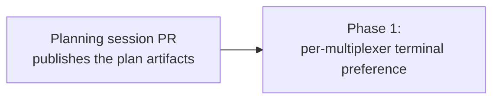

# Multiplexer focus terminal - implementation index

Source plan: [`plan.md`](./plan.md) (rendered: [`plan.html`](./plan.html))

## Incorporated decisions

Submitted by the operator in the Mission Control dashboard review of `plan.md`, and already
resolved into that file:

| Decision | Selected | Consequence for this decomposition |
| --- | --- | --- |
| Which mockup should this be built as? | **C - per-multiplexer chooser on each row** | The stored value is a map keyed by multiplexer, not a single id. `raiser` and the focus walk take the multiplexer as an argument. The panel needs a daemon-reported signal for "does this multiplexer need a terminal app". |
| Should the focus walk also skip terminals whose binary is absent? | **Yes** | `TerminalDeps` gains the availability dependency `TerminalTargetDeps` already has, and focus step 4 checks before spawning. |
| What should happen after this plan is finalized? | **Create phased implementation plan** | This document. |

The rejected alternatives (a single machine-wide preference band, and an always-open radio
list) are gone from `plan.md` and are not carried here.

## Repository findings

Verified against the checkout before phasing. These either confirm or correct the source plan.

| Finding | Evidence | Effect on the plan |
| --- | --- | --- |
| Focus step 4 loops `EMULATOR_IDS` and takes the first emulator that spawns, consulting no preference. | `src/server/actions.ts:2219-2227` | Confirms the problem statement. This is the primary edit site. |
| `TerminalDeps` carries only the two registries - no availability dependency. | `src/server/terminal/registry.ts:118-121` | **Corrects the plan.** The availability check cannot just call `binUnavailableReason`; `TerminalDeps` must extend `BinAvailabilityDeps`, and `defaultTerminalDeps` must supply `installed` / `unsupported`, mirroring `defaultTerminalTargetDeps` (`src/server/terminal/targets.ts:48-54`). Recorded in the phase file. |
| `raiser(deps)` takes no multiplexer and is called from two places. | `src/server/terminal/targets.ts:72-81`, called at `:113` and `:328` | Both call sites already hold the multiplexer, so adding the argument is mechanical. |
| cmux declares `attachArgv: null`; herdr and tmux declare one. | `src/server/terminal/cmux.ts:566`, `herdr.ts:297`, `tmux.ts:479` | Confirms that "which multiplexers get a control" is an adapter fact, and must be reported to the browser rather than restated there. |
| `multiplexerView` already branches on `sessions.attachArgv`. | `src/server/terminal/targets.ts:102-111` | `needsTerminalApp` costs one field in an existing branch. |
| A new `app_config` entry needs a `SETTINGS_BACKUP_DOMAINS` id, which is **append-only**. | `src/shared/settings-backup-domains.ts:1-7` | Append `terminals`; never reorder. This is one of the repository's controlled append-only ID contracts. |
| Settings backup and restore are driven by `APP_CONFIG_ENTRY_LIST`, with no second inclusion list. | `src/server/settings-backups/config-registry.ts:24-26`, and the `"generic"` branch at `:38-45` | A `fieldsEntry` with the default `capture: "generic"` is backed up and restored with **no** edit to the backup switch. |
| `setHarnessesConfig` merges per agent key so one panel edit cannot blank a sibling. | `src/server/harnesses.ts:105` | The terminals config merges per multiplexer key the same way. |
| Herdr reports no clients, so focus step 1 can never find a host tab for a Herdr session. | `src/server/terminal/herdr.ts:203-207` | Every Herdr Focus reaches step 4, making its preference the most exercised. Noted as a verification risk, not a code change. |
| `SETUP_DEPENDENCY_IDS` multiplexer values share their spelling with `MULTIPLEXER_IDS`. | `src/shared/setup-catalog.ts:19-34`, `src/shared/terminal.ts:31` | The panel can correlate a setup row to a terminal target without a new mapping table. |

## Sizing and phase count

**Estimate: 320-380 gross non-test implementation lines**, added or materially changed.

Assumptions behind the range: a new ~40-line server config module mirroring `harnesses.ts`;
~30 lines of Zod schema and patch schema; ~20 lines of route; ~60 lines of policy across
`targets.ts`, `actions.ts` and `registry.ts`; ~55 lines of new browser hook and API client;
~70 lines in `SetupPanel.tsx`; ~25 lines of change in `TerminalPreferencePicker.tsx` to
parameterize its group list and heading; ~35 lines of CSS. Comment density in this repository
is high and is included in the count.

**Phase count: one.** Above the 200-line threshold the rubric still defaults to a single phase,
and nothing here argues for more:

- The work is one vertical slice - schema, persistence, route, policy, UI - for a single
  setting. Splitting it at an application-layer boundary is the split the rubric names as
  invalid, and it would produce a dead surface in either direction: a stored preference nothing
  reads, or a chooser with nowhere to write.
- No sub-part is independently testable in a way that reduces risk. The policy change is only
  observable once something can set the preference; the UI is only assertable once the route
  answers.
- The availability check is roughly 25 lines inside the very function the preference ordering
  edits. Separating it would mean two pull requests touching the same loop.

So: one phase, one task, one pull request.

## Phases

| Phase | File | Outcome | Depends on | Repository |
| --- | --- | --- | --- | --- |
| 1 | [`phase-1-per-multiplexer-terminal-preference.md`](./phase-1-per-multiplexer-terminal-preference.md) | Each multiplexer that needs a window carries its own terminal-app preference, set on its Setup row and honoured by Focus. | Planning session only | `mission-control` (source repository) |

### Dependency graph

There is one phase, so there are no concurrency groups and no inter-phase merge order. Phase 1's
only prerequisite is this planning session, whose pull request publishes the artifact paths the
task names.

## Cross-phase contracts

With one phase there is nothing to hand between phases. The contracts below are the ones Phase 1
establishes for *future* work, and it must not leave them implicit:

- `multiplexerTerminal` is an exhaustive `Record<MultiplexerId, EmulatorId | null>`. Adding a
  multiplexer to `MULTIPLEXER_IDS` must fail typecheck here rather than silently produce a
  backend with no preference.
- `needsTerminalApp` on `TerminalTargetView` is derived from the adapter's `attachArgv`, never
  from a backend id. No consumer may name cmux.
- `terminals` is appended to `SETTINGS_BACKUP_DOMAINS` and never reordered.
- The preference is read at focus time, not captured at dispatch.

## Final verification strategy

Owned by Phase 1 and run before its pull request:

- `npm run typecheck` and `npm run lint`.
- Focused `node --test --import ./test/setup-state.mjs --import tsx` runs over the new and
  touched test files.
- `npm run build` then `npm run test:e2e` for the spec covering the new control, since a UI
  surface changed.

There is no later phase to defer any of this to.
