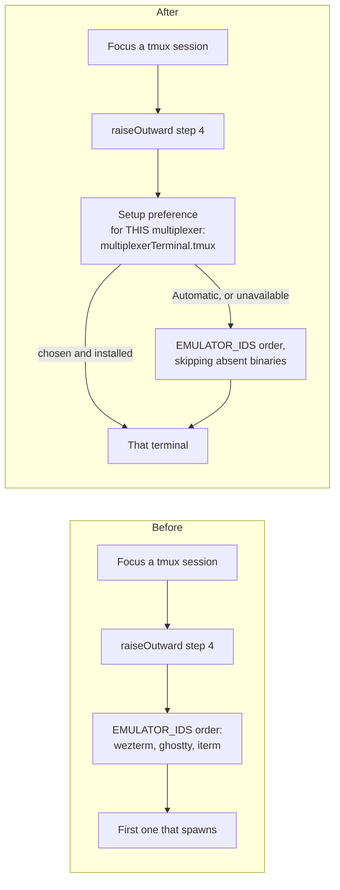

# A default terminal for multiplexer sessions

## Decisions taken

Reviewed in the Mission Control dashboard. Adopted:

- **Design: per-multiplexer chooser on each setup row** (mockup C). The rejected alternatives
  were a single compact preference band reusing `TerminalPreferencePicker`, and an always-open
  radio list. Both set one machine-wide terminal; C sets one per multiplexer, on the row that
  multiplexer already occupies.
- **Include the availability check.** Focus step 4 skips a terminal whose binary is absent
  rather than discovering it by failing to spawn.

Choosing C changes the shape of the setting, not just its presentation: the stored value is a
map keyed by multiplexer, and the policy functions take the multiplexer as an argument. That
is reflected throughout below.

## The problem

A session hosted in a multiplexer is detached. It has no window until someone asks for one,
and Focus is the ask. Today the operator gets no say in what window appears.

`raiseOutward` walks outward from the pane and, when nothing already hosts the multiplexer
session, opens a fresh tab (`src/server/actions.ts:2216-2227`):

```ts
const argv = attachArgv(inside.session);
for (const id of EMULATOR_IDS) {
  const spawn = deps.emulators[id].spawn;
  if (!spawn) continue;
  const opened = await spawn.tab({ argv, title: inside.session, cwd: null });
  if (opened.ok) return { ok: true };
}
```

`EMULATOR_IDS` is `["wezterm", "ghostty", "iterm"]`, and its order is declared in
`src/shared/terminal.ts` for a completely different reason - it ranks backends for *naming* a
discovered session, innermost first. Focus borrows that array as a preference list it was
never meant to be. An operator with WezTerm installed but living in Ghostty gets WezTerm
every time, and nothing in the product lets them say otherwise.

The loop also checks nothing before spawning. It has no `binPresent` call and relies on each
spawn failing, so on a machine with no terminal app installed a Focus makes three doomed
subprocess attempts before reaching the step 5 error.

The same fixed order appears a second time in `raiser()`
(`src/server/terminal/targets.ts:72-81`), which decides both the sentence the Setup and launch
menus print ("New session, raised in WezTerm.") and which emulator the explicit launch route
uses to show a freshly spawned detached session. So the guess is made in two places and
reported in a third.

Note what already exists and is *not* this: Harnesses has a per-agent **terminal backend**
preference (`HarnessesConfig.terminalBackend`, rendered by `TerminalPreferencePicker`). That
answers "which backend hosts a dispatched Claude session" - tmux, Herdr, cmux, WezTerm,
Ghostty or iTerm2. It does not answer "once that session is in tmux, what window do I get when
I press Focus". Those are different questions with different answer sets, and the second one
must exclude multiplexers entirely: attaching tmux inside cmux inside tmux is not a preference,
it is a bug.

## The change

Each multiplexer that needs a window gets its own answer to **which terminal app opens its
sessions**. The answer set is the emulator axis only (`EMULATOR_IDS`) plus Automatic, and the
control sits on that multiplexer's existing row in Setup under Terminals - the family whose own
description already says "A usable terminal path needs a window, and detached sessions may also
need a multiplexer."

Both fixed-order walks then consult the preference for the multiplexer in hand:

- `raiser(deps, mux)` returns that multiplexer's chosen emulator when it is available, and
  otherwise falls back to today's registry order.
- Focus step 4 tries the chosen emulator first, then the rest in registry order, skipping any
  whose binary is absent, so a terminal that is missing or fails to spawn still ends with a
  window rather than an error.

Automatic (`null`) is every multiplexer's default and preserves today's behaviour exactly. A
stored id that is not available on this machine runs as Automatic but stays reportable, the way
`resolveTerminalBackend` already reports an `unknown` backend, so the row can say it ignored
the preference instead of presenting the fallback as the operator's own choice.

### Which multiplexers get a control

Not all of them, and the UI must not decide this by name. A multiplexer whose sessions are
never without a window needs no emulator, and that is a fact of its adapter: cmux declares
`attachArgv: null` (`src/server/terminal/cmux.ts:566`) because it draws its own workspace.
Hard-coding "except cmux" in the panel would put a second copy of that declaration in the
browser, where it cannot be checked against the adapter.

So the daemon reports it. `TerminalTargetView` gains `needsTerminalApp?: boolean`, set by
`multiplexerView` from `Boolean(sessions.attachArgv)`, and the panel renders a chooser for
exactly the multiplexer rows that say `true`. cmux's row reads "Needs no terminal" instead,
and a future self-hosting multiplexer gets the same treatment without a UI edit.

### Flow



## Where it goes

| Layer | File | Change |
| --- | --- | --- |
| Vocabulary | `src/shared/terminal.ts` | `resolveEmulatorBackend` - the emulator-only sibling of `resolveTerminalBackend`, so "a multiplexer is not a valid answer here" is a type fact rather than a filter each caller repeats. Plus `needsTerminalApp?: boolean` on `TerminalTargetView`. |
| Wire | `src/shared/protocol.ts` | `TerminalsConfigSchema` carrying `multiplexerTerminal`, an exhaustive `Record<MultiplexerId, EmulatorId \| null>` defaulting to null, with a patch schema beside it. Exhaustive so adding a multiplexer fails typecheck here rather than silently gaining no preference. |
| Persistence | `src/shared/app-config-entries.ts`, `src/server/db.ts` | One `"setting"` entry, read and written through the existing `getAppConfig` / `setAppConfig` pair. Additive with a default, so an untouched install and an older build both resolve as they do now. |
| Route | `src/server/routes.ts` | `GET` / `PUT /api/terminals/config`, beside the setup routes, merging per multiplexer key the way `setHarnessesConfig` merges per agent (`src/server/harnesses.ts:105`) - so setting tmux's terminal cannot blank Herdr's. Deliberately not folded into `/api/harnesses/config`: that object is keyed per agent, and this one is keyed per multiplexer. |
| Availability view | `src/server/terminal/targets.ts` | `multiplexerView` sets `needsTerminalApp`, and names the chosen raiser in its blurb rather than the registry's first. `raiser(deps, mux)` gains the multiplexer argument and consults its preference before falling back to registry order. |
| Focus | `src/server/actions.ts`, `src/server/terminal/registry.ts` | Step 4 orders its emulator attempts by that multiplexer's preference and skips a backend whose binary is absent. `TerminalDeps` extends `BinAvailabilityDeps` and `defaultTerminalDeps` supplies `installed: binPresent` / `unsupported: binUnsupportedReason`, exactly as `defaultTerminalTargetDeps` already does (`src/server/terminal/targets.ts:48-54`) - so the check is injectable and a test can assert that an absent terminal is never spawned at all. |
| UI | `src/web/components/SetupPanel.tsx` | A trailing "Opens in" control on each multiplexer setup row whose target reports `needsTerminalApp`, reusing `TerminalPreferencePicker` with its group list narrowed to Terminal apps. Rows that do not report it render "Needs no terminal". |

The preference is read at focus time, not cached at dispatch, so changing it reaches the next
Focus without a restart - the same rule `terminalBackend` follows.

The correlation the panel needs already exists: a terminals-family `SetupRowView` carries a
`SetupDependencyId` whose multiplexer values share their spelling with `MULTIPLEXER_IDS`, and
`useTerminalTargets()` supplies the matching `TerminalTargetView` with its label, availability
and `needsTerminalApp`.

## The design

One chooser per multiplexer row, on the row it modifies. A row for a multiplexer that is not
installed carries a disabled control showing Automatic - there is nothing to set a preference
for yet, and a live control there would imply otherwise. A multiplexer that draws its own
window says so instead.

Rendered in `plan.html` beside this file.

## Tests

- `test/` - the preference-first ordering in `raiser(deps, mux)` and in focus step 4, per
  multiplexer; the fallback when the chosen terminal is unavailable, absent, or fails to spawn;
  that an absent binary is skipped without a spawn attempt; the exhaustive schema default; a
  per-key patch that leaves its siblings alone; an unknown stored id resolving to Automatic
  while staying reportable; `needsTerminalApp` false for a backend with `attachArgv: null`.
- `e2e/` - a Playwright spec opening Setup, selecting Terminals, choosing a terminal on the
  tmux row, and asserting the choice persists across a reload, that the cmux row offers no
  control, and that a not-installed multiplexer's control is disabled. Required: this is a new
  UI control.

## Open gaps

- Linux has no emulator adapter in this build. The setting is honest there - the list is empty
  and the row says so - but nothing changes for those operators.
- Raising a self-hosting multiplexer's own window (cmux `focus-window`) remains uninvented, as
  recorded in `actions.ts`. This plan does not close that gap; it only stops the emulator
  choice from being accidental.
- Herdr reports no clients (`src/server/terminal/herdr.ts:207`), so focus step 1 can never find
  an existing host tab for a Herdr session and every Focus falls through to step 4. That makes
  Herdr's preference the one most often used, and is worth confirming against a live Herdr
  before shipping.
