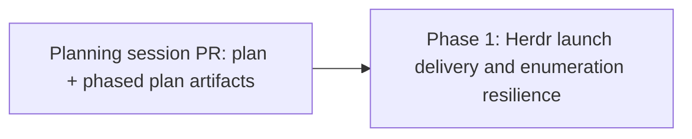

# Multiplexer session launch failures: implementation index

Source plan: [`plan.md`](plan.md) (rendered: [`plan.html`](plan.html)).

## Incorporated human decisions

Settled in the dashboard on 2026-09-09, then amended in discussion the same day:

1. **Herdr launch delivery gets all three changes.** Shrink what is typed by folding the environment
   and the agent argv into `launch-and-cleanup.sh`; send the Enter as a separate `pane.send_keys`
   write; verify the agent actually started before reporting success.
2. **Defect 3 is in scope.** `test/multi-repo-dispatch.test.ts` gets the `spawn` seam injected, plus
   a pinned boundary.
3. **Defect 4 is in scope.** Herdr's `list()` collapse becomes partial rather than total.
4. **Defect 2 is excluded.** The Pi / Mission MCP capability gate was accepted in the first review
   and then superseded: rather than build a refusal, Pi gets a Mission Control extension installed
   through Setup so hand-run Pi sessions reach parity with Claude and Codex. That is scheduled as
   its own plan task, **Pi Mission Control Extension**
   (`fa74e272-3762-4683-8fe8-bf9defe233ea`), and appears in no phase here.

## Investigated findings

Checked against the repository before drawing boundaries. Three of these changed the plan.

- **`isolatedAgentArgv` has exactly two callers**, `dispatcher.ts:2720` (dispatch) and
  `targets.ts:238` (the operator's explicit terminal launch). Both go through
  `shellCommand(argv)` on the way into a backend, so shortening the argv shortens every backend's
  command at once and neither caller changes.
- **The wrapper script already exists and already owns cleanup.** `agent-subprocess-env.ts:182`
  writes `#!/bin/sh` + `trap '/bin/rm -rf -- "$MISSION_HOME"' EXIT` + `"$@"`. The change is to move
  the `env -u … NAME=VALUE …` prefix and the agent argv from the returned array into that file's
  body. The `trap` must keep firing on the agent's exit, which is what releases the disposable state
  home, so the script must run the agent as its own last statement rather than backgrounding it -
  and must **not** `exec` it. Verified: `exec` replaces the shell process, so the `EXIT` trap never
  fires and the state home is never removed.
  [`phase-1-herdr-launch-delivery.md`](phase-1-herdr-launch-delivery.md) section 5.1 carries the
  same warning.
- **`test/agent-subprocess-env.test.ts:127` already pins the isolation end to end** by executing the
  returned argv and reading `MISSION_HOME`, `FLEET_HOME`, `HARNESS_HOME`, the token file and the
  post-exit removal of the state home. That test is the contract for this change and must keep
  passing unmodified except for any assertion that counts argv elements.
- **The herdr client already has `sleep` and `now` as injected deps** (`HerdrClientDeps`), so a
  bounded post-Enter poll is testable without real time and without a fixed sleep.
- **The client has no single-pane process lookup.** `snapshotWithProcesses` is the only path to
  `pane.process_info`, and it fetches every pane. Verification after Enter needs one pane, so the
  client gains a narrow `processInfo(paneId)` method; `snapshotWithProcesses` should be refactored
  to use it rather than growing a second spelling of the same request.
- **The leaking test is `test/multi-repo-dispatch.test.ts:285`**, the `soloharness` case, not the
  rollback case above it. Its own comment says "what happens after that is the ordinary launch path,
  which has no pane to talk to here" - which is the mistaken belief that produced the leak. It
  dispatches a `pi` task titled `T` with id `soloharness`, so `sessionLabel` yields `T` and
  `taskId.slice(0, 6)` yields `soloha`: **`T-soloha`**, which is exactly the label on the 42 leaked
  Herdr workspaces and the 2 leaked tmux sessions on the operator's machine. The identification is
  confirmed, not inferred.
- **Defects 1 and 4 touch the same two files** (`herdr.ts`, `herdr-client.ts`) and in `list()`'s case
  the same function. Splitting them would produce two pull requests that conflict on merge.

## Sizing

Gross non-test implementation lines expected to be added or materially changed:

| Area | Files | Estimate |
| --- | --- | --- |
| Fold env and argv into the wrapper script | `src/server/agent-subprocess-env.ts` | 30 - 45 |
| Split the Enter, verify the launch, roll back | `src/server/terminal/herdr.ts` | 40 - 60 |
| Narrow `processInfo(paneId)` on the client | `src/server/terminal/herdr-client.ts` | 20 - 30 |
| Partial enumeration collapse | `src/server/terminal/herdr-client.ts`, `herdr.ts` | 20 - 30 |
| Inject the `spawn` seam | `test/multi-repo-dispatch.test.ts` | ~5 |
| **Total** | | **115 - 170** |

Assumptions: no new module, no schema or persistence change, no migration, no dashboard surface, and
no change to the `Multiplexer` or `MuxSessions` interfaces. Tests are excluded from the count and are
substantial in their own right, particularly the herdr adapter's fake-socket coverage.

## Phase count rationale

**One phase, one task.** The estimate is under the 200-line threshold, and three independent reasons
agree with the threshold here:

- Defects 1 and 4 edit the same two files and, in `list()`, the same function. Two pull requests
  would conflict on merge, and the second would be reviewed against a base that no longer matches
  the first's reasoning.
- Defect 3 is a five-line change in a test file. A test-only phase is exactly what the sizing rubric
  says not to create, and it belongs with the enumeration work because the leak it causes is what
  made the enumeration cost visible.
- The wrapper-script change and the herdr delivery change are one behavior seen from two ends: the
  Enter is only reliable because the paste is small, and the paste is only small because the wrapper
  carries the environment. Merging one without the other leaves a launch path that is half-fixed and
  whose test would have to assert the intermediate state.

There is no second phase to justify, so no combination argument is needed.

## Phases

| Phase | Name | File | Depends on | Repository |
| --- | --- | --- | --- | --- |
| 1 | Herdr launch delivery and enumeration resilience | [`phase-1-herdr-launch-delivery.md`](phase-1-herdr-launch-delivery.md) | This planning session only | Source repository |

### Dependency graph

### Concurrency and merge order

One phase, so there is nothing to run concurrently and nothing to order. Phase 1 is released when
this planning session's pull request merges the artifacts to the default branch.

## Cross-phase contracts

No cross-phase contracts exist, because there is one phase. Two contracts still bind Phase 1 against
the rest of the repository and are recorded here so a later change cannot undo them silently:

- **`isolatedAgentArgv` returns a launchable argv, and the state home is released when the agent
  exits.** Shortening the argv must not move cleanup off the agent's exit. `agent-subprocess-env.test.ts`
  owns this.
- **`Multiplexer.list()` returning `[]` means "this backend has no panes", never "this backend had a
  problem".** Making the collapse partial narrows what can produce `[]`; it must not introduce a
  third meaning, and a genuinely invalid snapshot still yields `[]`.

## Final verification strategy

- `npm test`, and the single-file runs the phase file names, with `--import ./test/setup-state.mjs --import tsx`.
- `npm run typecheck` and `npm run lint`.
- `npm run build` and `npm run smoke`, because `isolatedAgentArgv` is on the launch path that
  `smoke-bundles.mjs` exercises.
- No `npm run test:e2e` requirement: nothing in this phase changes a dashboard surface. If the new
  Herdr failure text ends up rendered on a card in a form a person reads differently, that arm gains
  a spec.
- Manual confirmation on the operator's machine, which is the only check that reproduces the original
  report: one Herdr dispatch of each of `claude` and `pi` reaching `working`.
