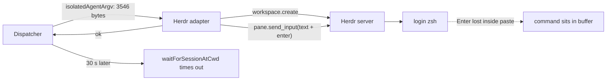
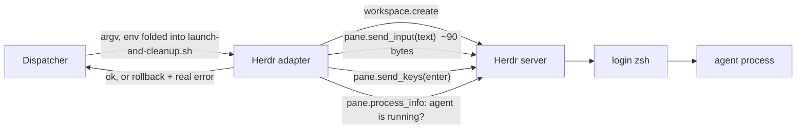

# Multiplexer session launches: why Herdr dispatches fail

## What this plan was measured against

Five dispatches the operator ran between 20:49 and 20:54 on 2026-09-09, read out of the live
`tasks` table, plus reproduction against the running Herdr 0.9.0 server (protocol 22) and the
running tmux 3.7c on the same machine.

| Task | Agent | Backend | Outcome |
| --- | --- | --- | --- |
| `b996da19` | claude | herdr | **failed** - "agent session never appeared (the launch may have exited immediately)" |
| `442fdef2` | pi | herdr | **failed** - same |
| `f216ab61` | pi | herdr | **failed** - same |
| `d2b819a9` | pi | tmux | **done** |
| `159cdeca` | pi | (none reached) | **failed** - "the launch could not carry the required Mission MCP tools request_plan_decisions, create_task" |

Two distinct defects, and the split is exactly along those lines. Herdr fails for every agent;
tmux succeeds for the same agent. Pi fails before any backend is chosen, for a reason that has
nothing to do with terminals - and that one leaves this plan for its own, larger piece of work.

Two further defects were found while reproducing, and both make the first one worse rather than
being independent annoyances.

## Decisions taken

Reviewed and settled in the dashboard on 2026-09-09:

- **Herdr launch delivery: all three changes.** Shrink what is typed, send the Enter as a separate
  key write, and verify the agent actually started before reporting success. The narrower options
  were considered and rejected: shrinking alone makes the failure rare rather than impossible,
  because the race is size-sensitive rather than size-bounded; and blocking Herdr for dispatch
  costs the operator the terminal they actually use.
- **Both defects found while reproducing are in scope**, defect 3 and defect 4.
- **Defect 2 leaves this plan entirely.** The first review settled on a harness capability gate
  that would refuse a Pi task requiring Mission MCP tools before a worktree was cut. That decision
  was then superseded in discussion: rather than build a refusal, make Pi capable. Pi gets a
  Mission Control extension installed through Setup, so a **hand-run** Pi session reaches Mission
  Control the same way Claude and Codex already do. Defect 2 is therefore recorded here as a
  finding and scheduled as its own plan, not phased from this one. See
  [Defect 2](#defect-2-pi-cannot-carry-mission-mcp-tools-scheduled-as-its-own-plan) for what that
  costs in the meantime.
- **Phases cover defects 1, 3 and 4 only.**

## Defect 1: the Herdr adapter types the launch command into a shell, and the Enter is lost

### What is actually on screen

All three failed Herdr workspaces are still open. Their agent panes contain the full launch
command sitting at a `zsh` prompt, **unexecuted**, and `pane.process_info` reports the pane's only
foreground process is `zsh`:

```
✓ ❯ '/usr/bin/env' '-u' 'MISSION_HOME' '-u' 'FLEET_HOME' '-u' 'HARNESS_HOME'
'PATH=/usr/bin:/bin:/usr/sbin:/sbin:/Users/jordanmance/bin: … :/opt/homebrew/sbin'
'MISSION_HOME=/var/folders/…/mission-control-agent-state/session-vnMcw
```

The workspace was created, the command was delivered, nothing ran. Dispatch then waited
`READY_TIMEOUT_MS` (30 s) for `waitForSessionAtCwd` to see an agent, saw none, and reported the
launch as having exited immediately. It never started.

### Why Herdr and not tmux

Every other multiplexer hands the command to the multiplexer to **exec**. Herdr is the only one
that **types** it:

| Backend | How `spawnDetached` starts the agent |
| --- | --- |
| tmux | `new-session -d -s NAME -c CWD -- <command>` - tmux execs it |
| cmux | `new-workspace --name … --command <command>` - cmux execs it |
| **Herdr** | `workspace.create` opens a login shell, then `pane.send_input(text, keys: ["enter"])` types the command at its prompt |

Herdr's socket API has no command parameter. `WorkspaceCreateParams` accepts `cwd`, `label`,
`env`, `focus` and `source_workspace_id`, and `PaneSplitParams` and `TabCreateParams` are the
same. `agent.start` exists but takes a fixed `kind` for a supported interactive agent, not an
arbitrary argv. So typing is currently the only door, and the adapter is not wrong to use it.
What is wrong is how it types.

### The measurement

`pane.send_input` carries the text and the Enter in one call. Against the live server, into a
fresh unfocused workspace, with a command of the size dispatch actually produces:

| Delivery | Command size | Executed |
| --- | --- | --- |
| `send_input(text, keys: ["enter"])` - one call | 3,009 bytes | **1 of 6** |
| `send_input(text)`, wait 400 ms, `send_keys(["enter"])` | 3,009 bytes | **6 of 6** |

Sweeping the size in a single call shows no clean threshold: 207, 607, 907, 1009 and 1509 bytes
executed; 1109 and 3009 did not. That is the signature of a race, not a limit. The Enter is
delivered before the shell has finished consuming the bracketed paste, so it lands inside the
paste and becomes a literal newline in the edit buffer instead of a submit.

**A real dispatch command is 3,546 bytes** (measured from the live `tmux new-session` argv of a
dispatched session). At that size the single call loses the race almost every time, which is why
all three Herdr dispatches failed and none of the operator's short manual launches ever did.

### The second half of the defect

`spawnDetached` returns `{ ok: true }` as soon as `send_input` answers `ok`. `ok` means "the
bytes were accepted", not "the command ran". So the adapter reports a successful launch for a
workspace where nothing started, and the failure surfaces 30 s later as a timeout in the
dispatcher with a message that blames the agent for exiting. The workspace and the worktree are
then kept, per the dispatcher's own rule, which is why all three are still on the machine.

### The flow, before and after

Today:



Proposed:



### Fix

Three changes, and each is independently useful:

1. **Shrink what is typed.** `isolatedAgentArgv` already writes a wrapper script,
   `launch-and-cleanup.sh`, into the disposable state home and then prefixes it with
   `/usr/bin/env -u … PATH=… MISSION_HOME=… …`. Folding the environment assignments and the agent
   argv into that script leaves one short line to type: `/bin/sh /var/…/launch-and-cleanup.sh`,
   about 90 bytes instead of 3,546. This is backend-agnostic and harness-agnostic; tmux and cmux
   get a shorter argv for free and behave identically.

   The environment must stay in the exec prefix inside the script rather than move to Herdr's
   `workspace.create` `env` map. Measured: the `env` map does reach the shell for `MISSION_HOME`,
   but the login shell's rc files rewrite `PATH` straight back to the operator's interactive PATH,
   which defeats the isolation the prefix exists to provide.

2. **Separate the Enter from the paste.** `pane.send_input(text)` then `pane.send_keys(["enter"])`,
   with the paste confirmed settled in between rather than a fixed sleep - `pane.read` on the
   pane, or `pane.wait_for_output`, both of which the 0.9.0 API publishes.

3. **Verify the launch before reporting success.** After Enter, poll `pane.process_info` until the
   pane's foreground process is no longer the bare login shell, bounded by a short timeout. If it
   never changes, roll the workspace back the way a refused `send_input` already does and return
   the real error, so the operator reads "Herdr accepted the command but the shell never ran it"
   instead of a 30 s timeout blaming the agent.

## Defect 2: Pi cannot carry Mission MCP tools (scheduled as its own plan)

`159cdeca` is a Pi task that declared `request_plan_decisions` and `create_task` as required
Mission MCP tools. `dispatcher.ts` gates that with:

```ts
const missionMcpRegistered = codexLaunch.missionMcp || askChannel.args.includes("--mcp-config");
```

`askChannelContribution` returns the off contribution for any agent that is not `claude`, and
`codexLaunch.missionMcp` is Codex's own path. There is no third arm, so for Pi
`missionMcpRegistered` is **always false** and every Pi dispatch declaring a required Mission MCP
tool fails at launch.

This is not a missing registration. **Pi has no MCP client at all.** `pi --help` on the installed
0.85.1 publishes no MCP flag, and `src/shared/harness-capabilities.ts` already declares `mcp: null`
for Pi with exactly that reasoning: it "extends via in-process TS extensions, not MCP". So the
tool can never be carried today, and the current code tells the truth in the worst possible place:
after the task was accepted, after the worktree was cut, in a message that asks whether a bundle is
built when rebuilding it would change nothing.

### Why this is not fixed here

The narrow fix is a harness capability gate that refuses the combination before a worktree is cut.
It was reviewed and initially accepted, then superseded: a refusal is work that the real fix
deletes. The real fix is a **Mission Control extension for Pi, installed through Setup**, giving
Pi the integrations Claude and Codex already have, in **hand-run sessions** and not only in
dispatched ones. Passive session discovery already works for a Pi session someone starts
themselves; what is missing is everything the discovery leads to.

Pi's extension point is the right shape for it. `pi.registerTool()` takes a name, a description,
a typebox parameter schema and an async `execute` with full Node access, which is the same shape
an MCP tool has. Verified against the installed Pi 0.85.1: an extension passed with `-e` is
evaluated before Pi validates its model arguments, and `.ts`, `.js` and `.mjs` all load, so a
built `.mjs` can ship from `dist/`. Two further facts make the fit better than expected. Mission
Control's prompts already name tools bare (`src/server/plans/prompt.ts` writes
`` `request_plan_decisions` ``, not the Claude-namespaced form), so a Pi tool registered under the
bare name matches every existing prompt unchanged. And Pi's `--tools` allowlist covers extension
tools, mirroring Claude's `--allowed-tools`.

That work is scheduled as its own plan task, because it is a parity project rather than a bug fix:
Mission MCP tools, workflow participation, cost tracking, terminal input and response reading, and
whatever else Claude and Codex get from their hooks. It also carries a problem this plan does not:
an extension installed into the operator's home from a build has to be detected when it goes
stale, the way `src/server/environment/claude-hooks.ts` already reports stale Claude hook paths
without repairing them.

### What this costs until that lands

A Pi task that declares required Mission MCP tools keeps failing at dispatch, after its worktree
is cut, with a message that misdirects toward rebuilding the MCP bundle. That is the status quo
and it is not made worse here. It is stated plainly so nobody reads the omission as an oversight.

## Defect 3: `test/multi-repo-dispatch.test.ts` opens real multiplexer sessions on the operator's machine

The machine currently holds **44 leaked homes: 42 Herdr workspaces plus 2 tmux sessions**, all
rooted in `/private/var/folders/…/T/mission-multirepo-dispatch-*/` temp directories, all running
`/bin/echo`, none of them closed. They carry two labels, `T` and `T-soloha`, and both come from the
**same** test case - see "Why one case produced two labels" below. `test/multi-repo-dispatch.test.ts`
sets `MISSION_CLAUDE_BIN` and `MISSION_PI_BIN` to `/bin/echo` but constructs
`new Dispatcher(registry, undefined, { worktrees, resolveBases })` **without injecting the `spawn`
seam**, so `spawnUniquely` runs for real: it lists real homes, opens a real tmux session or a real
Herdr workspace, and leaves it behind when the test's temp home is deleted.

One of those leaked tmux sessions is still holding a live launch pointed at `MISSION_PORT=7317`,
the operator's real daemon.

The dispatcher already declares the seam for exactly this reason (`deps.spawn`, documented at
`dispatcher.ts:258` as "`spawnUniquely` opens an actual tmux session on the machine running the
tests"). This test simply does not use it.

### Why one case produced two labels

`spawnUniquely` takes the bare label when it is free and the suffixed one when it is not:

```ts
const unique = `${baseName}-${shortId}`;
const name = held === null || held.has(baseName) ? unique : baseName;
```

The task is titled `T` with id `soloharness`, so `sessionLabel` gives `T` and `taskId.slice(0, 6)`
gives `soloha`. The FIRST run on this machine found `T` free and took it. Every run after that found
`T` still held - nothing ever closes these - and took `T-soloha`.

Measured, which is what settles it: the two tmux sessions are rooted in `soloharness-api` worktrees
from two different runs, `mission-multirepo-dispatch-lG5Puu` created 2026-09-08 20:57 (label `T`) and
`mission-multirepo-dispatch-HbV8ux` created 2026-09-08 23:03 (label `T-soloha`). The 42 Herdr
workspaces are likewise rooted in distinct `mission-multirepo-dispatch-*` directories. One case,
many runs, two labels. There is no second leaking case to find.

### A second defect the labels expose

`spawnUniquely` checks `held.has(baseName)` and never `held.has(unique)`, so once the bare name is
taken every later run lands on the SAME `T-soloha`. That is why 42 Herdr workspaces share one label.
It matters beyond tidiness: `heldHomeNames` returns a map keyed by session NAME, so 42 workspaces
collapse to a single entry and `killHome("T-soloha")` can only ever tear down one of them.

This is **recorded, not scheduled**. Fixing it changes dispatch naming for every backend, which is
outside what this plan's review approved, and it is invisible in normal use because a real dispatch's
`shortId` is a distinct task id. See the follow-up note in the pull request.

### Fix

Inject the `spawn` seam in that test. Then pin the boundary the way the repository pins its other
"a test must not reach the operator's machine" rules: a test that fails if a dispatcher
constructed without an explicit `spawn` seam can reach a real backend under the test runner.

## Defect 4: one slow pane makes every Herdr session disappear at once

`herdrMultiplexer.list()` calls `snapshotWithProcesses`, which issues one `session.snapshot` plus
**one `pane.process_info` per pane, each on its own unix socket connection**, eight at a time.
Any single one of those failing for a reason other than `pane_not_found` returns a failure for the
whole call, and `list()` maps any failure to `[]`. `[]` means every Herdr card on the machine
vanishes for that tick.

Measured on the live server, with the 42 leaked workspaces present:

| | Value |
| --- | --- |
| Workspaces / panes | 47 / 93 |
| `session.snapshot` | 113 ms |
| 93 × `pane.process_info`, 8 concurrent | 314 ms |
| Per call p50 / p95 / max | 2 ms / 104 ms / 106 ms |
| **Whole `list()`** | **427 ms** |
| Discovery tick | 1,500 ms |
| Per-call read timeout | 1,000 ms |
| Hard refusal | `panes + 1 > 512` |

This is not failing today, and the numbers say so plainly. What they also say is that the cost is
linear in pane count, that 94 socket connections are opened every 1.5 s, and that the failure
mode when it does arrive is all-or-nothing rather than degraded. Defect 3 is what pushed this
machine from 5 panes to 93; the two belong in the same plan.

### Fix

Make the collapse partial rather than total: a pane whose `process_info` fails is reported with a
null pid, exactly as `pane_not_found` already is, instead of discarding the other 92. Keep the
whole-call failure only for the cases that genuinely invalidate the snapshot (protocol below the
floor, identity mismatch). The same applies to the `return []` inside the adapter's own loop,
which discards every pane when one pane's workspace or tab lookup misses.

## Scope and non-goals

- **Not** reaping the 42 leaked workspaces automatically. They are operator state and a daemon
  that deletes multiplexer workspaces it did not create is a worse defect than the one it cleans
  up. The plan fixes the source; removing what already leaked is a one-line manual step the
  operator can take when they choose.
- **Not** changing tmux or cmux launch semantics beyond the shorter argv that falls out of the
  wrapper-script change.
- **Not** the Pi work. Defect 2 is recorded as a finding and scheduled separately; see the
  decisions above.
- **Not** raising `HERDR_MIN_PROTOCOL`. Herdr 0.9.0 / protocol 22 is compatible and the floor is
  correctly a floor. The four "Herdr server is incompatible" task failures earlier on 2026-09-09
  predate the running build and did not recur.

## Verification

- A `node:test` case for the Herdr adapter proving the Enter is a separate write from the paste,
  and that a pane whose foreground process never leaves the login shell is reported as a failed
  launch with the workspace rolled back.
- A `node:test` case for `isolatedAgentArgv` proving the wrapper script carries the environment
  and the agent argv, and that the returned argv is short.
- A `node:test` case pinning that a dispatcher built without an explicit `spawn` seam cannot reach
  a real backend under the test runner.
- A `node:test` case for the partial Herdr enumeration: one pane whose `process_info` fails leaves
  the other panes reported rather than blanking the list.
- No Playwright spec. Nothing in the phased scope changes a dashboard surface: the launch path, the
  test seam and the enumeration collapse are all server-side. If the Herdr failure message lands on
  a card in a form a person reads differently, that arm gains one.
- Manual confirmation on this machine: one Herdr dispatch of each of claude and pi reaching
  `working`, which is the exact thing that failed three times on 2026-09-09.
