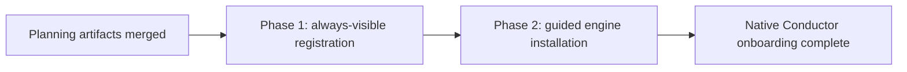

# Native Conductor onboarding: phased implementation

Status: Approved for scheduling on 2026-08-17

Source plan: `docs/plans/native-conductor-onboarding/plan.md`

## Approved outcome

Conductor is always discoverable in Settings. An operator with an existing Conductor engine
can register a workspace repository and grant Mission Control observation through one explicit
Register and observe action. An operator without the engine can launch the upstream interactive
installer in a visible hosted terminal from a verified local ai-conductor main checkout, or use
copyable instructions when no eligible checkout exists.

The repository-specific consent gate remains intact. Runs -> Pipelines and Dispatch -> Pipeline
appear only for active repositories. Mission Control never writes provider-owned files, never
accepts browser-authored commands, and never silently downloads or installs Conductor.

## Incorporated human decisions

The 2026-08-17 continuation accepted the source plan's recommended choices:

1. **Guided terminal installation.** Launch the upstream interactive installer only from a
   verified local ai-conductor main checkout. Fall back to instructions when none exists.
2. **Register and observe.** Run provider registration first, then save Mission Control
   observation consent. Report and recover from partial success rather than hiding it or trying
   to roll provider state back.
3. **Phased delivery.** Publish the plan artifacts, schedule dependency-linked implementation
   tasks, and release them through the merged planning pull request.

## Investigated findings

- Settings has one conditional category. The availability abstraction exists solely to hide
  Conductor and is threaded through the rail, hash fallback, arrow-key walk, palette stores, and
  tests: `src/web/lib/settings-registry.ts`, `src/web/components/SettingsPage.tsx`,
  `src/web/App.tsx`, and `src/web/lib/palette-index.ts`.
- `SettingsStatus.pipelines.present` is an append-only wire member and should remain for
  compatibility even after it stops deciding category existence. The watcher has a separate
  slow presence cadence whose only user-visible purpose is the disappearing row. That cadence
  can be removed while `pipelines.observing` remains the Runs gate.
- `ConductorPanel` currently merges only provider projects and configured rows. The existing
  `/api/repos` catalog and `resolveRepoRoot()` supply the missing candidate inventory and
  canonical main-root authority.
- `useConductor` already serializes optimistic whole-config PUTs and rejects stale poll results.
  Registration should join that queue discipline rather than create a second settings store.
- `PipelineProvider` already owns provider-specific CLI composition and output validation for
  controls, consoles, and task launch. Repository registration belongs on the same provider
  axis, while routes remain provider-neutral.
- `conduct-ts register <path>` is noninteractive and uses Conductor's sanctioned registry
  writer. Its exact `Registered <name> (<absolute-path>).` output can confirm the canonical
  target; exit code alone is insufficient under the provider's established rules.
- The existing terminal target registry and `launchTerminal()` already distinguish available
  emulators and multiplexers. A new installer route can reuse that launcher without exposing
  argv to the browser.
- The upstream `bin/install` is interactive and broad: it builds, links user-level tools and
  skills, changes user configuration, and can install global helper packages. This is why its
  launch requires an explicit confirmation, an eligible main checkout, and a visible terminal.
- The existing ai-conductor E2E fixture already intercepts every provider spawn and records argv.
  It needs registration and installer arms so tests never touch the operator's installation or
  spend model tokens.

## Sizing and phase-count rationale

Estimated total non-test production change: **700 to 1,050 lines**.

Assumptions behind the range:

- 300 to 450 lines for unconditional discovery, provider-neutral registration contracts and
  route, hook orchestration, repository candidate merging, commissioning UI, status copy, and
  Dispatch refresh.
- 250 to 400 lines for provider-owned installer candidate verification, the typed terminal
  launch route, confirmation UI, terminal selection, and setup state integration.
- 150 to 200 lines of styles and documentation-facing UI support. Tests, fixtures, and docs are
  excluded from the estimate.

Two phases are warranted. Combining them would put two different mutation boundaries in one
review: a bounded noninteractive provider registry command and an interactive installer that may
change several user-level locations and global packages. The second also has extra trust,
terminal-availability, and worktree-refusal cases. Separating them lets Phase 1 ship a complete,
useful path for already-installed engines while Phase 2 adds installation without leaving the
repository broken or creating a dead UI surface.

A third phase is not warranted. Settings visibility, registration, observation consent, Dispatch
eligibility, docs, and their tests are one vertical slice and must land together. Splitting server
contracts from the panel would create an unused API or a setup interface that cannot act.

## Phase graph

| Phase | Outcome | Direct prerequisites | Task id |
|---|---|---|---|
| 1 | Always-visible Settings plus Register and observe for installed engines | Planning session | Pending publication |
| 2 | Verified local-checkout installer launched in a hosted interactive terminal | Phase 1 and planning session | Pending publication |

## Concurrency and merge order

There is one execution lane:

1. Merge Phase 1.
2. Dispatch and merge Phase 2.

Phase 2 directly consumes Phase 1's provider setup contract, `useConductor` action state, panel
commissioning model, and E2E fake. It cannot safely run or merge concurrently. Both scheduled tasks
also depend on the active planning session so neither can start before these documents reach the
default branch.

## Cross-phase contracts

The following names and ownership rules are fixed across both phases:

- **Provider owns provider mutations.** `PipelineProvider.registerRepo(repoRoot)` composes argv,
  spawns `conduct-ts`, bounds output, parses confirmation, and never throws. Routes do not branch
  on `"ai-conductor"`.
- **Registration and observation remain two durable facts.** The UI may offer one Register and
  observe action, but it first calls provider registration and then uses the existing whole-config
  PUT. A failed consent write leaves a visible registered/not-observed state and an Enable
  observation recovery action.
- **Canonical main roots key everything.** `/api/repos` supplies candidates and
  `resolveRepoRoot()` resolves submitted paths before a provider command or config write. A linked
  worktree input is converted to its owner; installer checkouts must themselves be main checkouts.
- **Settings visibility is unconditional.** Engine detection changes setup state, never whether the
  page, hash, or palette result exists.
- **Runs and Dispatch remain consent-gated.** `pipelines.observing` and
  `activePipelineRepos(config)` keep their current meanings.
- **Installer launch is typed.** The browser sends provider id, verified checkout path, and terminal
  backend id only. Server/provider code owns the executable, arguments, cwd, terminal title, and
  hold-open wrapper.
- **No silent acquisition.** Neither phase clones, downloads, upgrades, uninstalls, or writes
  Conductor's registry directly.
- **Wire compatibility is additive.** Keep `SettingsStatus.pipelines.present`; append only optional
  setup fields to shared responses when Phase 2 needs them.

## Phases

### Phase 1: Always-visible registration

Plan: `docs/plans/native-conductor-onboarding/phase-1-always-visible-registration.md`

Deliver the complete installed-engine path: permanent Settings discovery, workspace repository
selection, provider-validated registration, sequential observation consent, visible partial
success, and exact-repository Dispatch readiness.

### Phase 2: Guided engine installation

Plan: `docs/plans/native-conductor-onboarding/phase-2-guided-engine-installation.md`

Add verified local ai-conductor checkout discovery and an explicit, user-visible hosted terminal
for the upstream installer, with copyable fallback guidance and no silent acquisition.

## Final verification strategy

Each phase runs its focused unit and route tests, `npm run typecheck`, `npm run lint`, and the
specific Playwright spec it changes. Because both phases change browser behavior, each also runs a
successful `npm run build` before `npm run test:e2e` and captures gitignored browser evidence.

The final Phase 2 verification additionally runs `npm test`, `npm run smoke`, and the complete E2E
suite. The complete-state browser proof must show:

1. Conductor visible with no engine.
2. Copyable fallback when no eligible checkout exists.
3. Verified checkout confirmation and faked terminal launch.
4. Installed engine with an unregistered workspace repository.
5. Register and observe success and exact-repository Pipeline dispatch.
6. Provider-registered but observation-failed recovery.
7. Narrow layout and keyboard navigation without color-only status.

## Final cross-phase audit

- Every source-plan requirement is owned exactly once: Phase 1 owns permanent discovery,
  registration, observation, Dispatch alignment, and base commissioning UI; Phase 2 owns installer
  discovery, trust, confirmation, and terminal launch.
- Phase 2 consumes Phase 1's provider-neutral setup seam and does not replace its registration or
  consent path.
- No concurrent edits are claimed. The direct edge Phase 1 -> Phase 2 matches the actual shared
  files and contracts.
- Both phases leave the repository operable on merge. Phase 1 has an instructions fallback for a
  missing engine; Phase 2 enhances that state without being required to repair it.
- The final state matches all three approved decisions and requires no undocumented cleanup phase.
