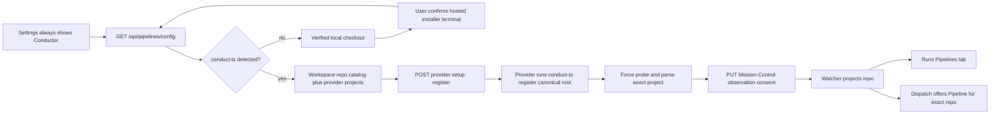

# Native Conductor onboarding

Status: Approved for implementation planning on 2026-08-17

## Decision

Make **Settings -> Conductor** a permanent, searchable category. Its visibility must not
depend on whether `conduct-ts` is on the daemon's `PATH`, whether a Conductor registry
exists, or whether Mission Control is observing a repository.

Turn that always-visible page into one guided setup surface for three independent facts:

1. **Engine installed on this machine.** Detect `conduct-ts`. When it is missing, offer a
   user-visible installer terminal from a verified local ai-conductor main checkout, or
   copyable instructions when no eligible checkout exists.
2. **Repository registered with Conductor.** Offer Mission Control's existing workspace
   repository catalog and invoke `conduct-ts register <canonical-main-repo-root>` through
   the provider adapter. Mission Control never edits Conductor's registry.
3. **Repository observed by Mission Control.** Keep the existing master and per-repository
   consent. This remains the fact that earns the Runs -> Pipelines tab and the `Pipeline`
   dispatch kind for the selected repository.

The first implementation should favor **Register and observe** as the primary repository
action. It performs registration first, then enables Mission Control's master and repository
consent only after the CLI confirms success. A partial failure is reported honestly and is
recoverable from the same row.

## Why this is the right boundary

The current implementation made discoverability depend on setup. That is backwards for a
native integration: the place that explains and performs setup is exactly the place an
unconfigured operator cannot reach.

The native lifecycle is not "install Conductor in every repository." Conductor's engine is
installed once for the user's machine. Each repository is then registered in Conductor's
user-level registry, and Mission Control separately records permission to observe that
repository. The interface must name those scopes so a user does not run a global installer
once per repo or mistake registration for observation consent.

This does **not** make Pipeline appear indiscriminately in Dispatch. Dispatch continues to
offer Pipeline only when the exact selected main repository is in
`activePipelineRepos(config)`. Always-visible Settings fixes discovery; registration and
observation still gate execution.

## Current evidence

- The category is already registered, but availability explicitly filters it on
  `settingsStatus.pipelines.present`: `src/web/lib/settings-registry.ts:228`,
  `src/web/lib/settings-registry.ts:369`, `src/web/components/SettingsPage.tsx:258`,
  `src/web/App.tsx:713`, and `src/web/lib/palette-index.ts:576`.
- The server defines "present" as either stored pipeline configuration or a provider binary
  on `PATH`, and runs a separate once-per-minute presence check solely to reveal or hide the
  row: `src/server/pipelines/index.ts:181`, `src/server/pipelines/index.ts:1050`.
- The current Conductor panel only unions repositories already reported by Conductor with
  repositories already stored in Mission Control. It cannot offer an unregistered workspace
  repository: `src/web/components/ConductorPanel.tsx:134`.
- Mission Control already has the required repository inventory and canonicalization doors:
  `src/server/repos.ts:80`, `src/server/repos.ts:123`, `src/server/routes.ts:2323`, and
  `src/server/routes.ts:2328`.
- The provider contract already establishes the critical ownership rule: Mission Control
  spawns provider CLIs and never writes provider-owned files. It also already composes
  controls, consoles, and task launches: `src/server/pipelines/types.ts:139` and
  `src/server/pipelines/conductor/index.ts:355`.
- ai-conductor exposes a noninteractive, sanctioned registration command. It validates a git
  repository, upserts through its own registry writer, prints
  `Registered <name> (<absolute-path>).`, and exits nonzero on refusal:
  `docs/reference/cli.md:477` and `src/conductor/src/engine/registry-cli.ts:80` in the
  ai-conductor repository.
- ai-conductor's `bin/install` is intentionally broader than registration. It builds the
  engine, links skills and `conduct-ts`, updates user configuration, and may install global
  rendering dependencies. It is interactive for several choices. That makes a silent daemon
  invocation an unsafe first version; it belongs in a terminal the user can see and control:
  `bin/install:7`, `bin/install:591`, `bin/install:693`, `bin/install:1331`, and
  `bin/install:1524` in the ai-conductor repository.

## Intended experience

### Permanent entry and honest status

The Conductor rail row, deep link, and command-palette result always exist. The row may carry
an amber status dot while setup needs action, a green dot when at least one repository is
actively observed, and no error-red state unless a requested setup action actually failed.
Missing software is an incomplete setup state, not an application error.

The Runs -> Pipelines tab remains earned by active observation. The Dispatch modal remains
repo-sensitive: it offers Pipeline only for the selected repository after that repository is
registered and observation is enabled.

### One compact commissioning line

At the top of the panel, a thin three-stage signal path summarizes the actual dependency:

```text
Settings rail                 Conductor panel
┌──────────────────┐          ┌──────────────────────────────────────────────────┐
│ Display          │          │  ⇶ Conductor                                     │
│ Agents           │          │  ● Engine ───── ● Register repo ───── ● Observe │
│ Conductor      ● │  ─────>  │                                                  │
│ Worktrees        │          │  [contextual setup card for the first open step] │
└──────────────────┘          │                                                  │
                              │  Repositories                                    │
                              │  repo-name  Registered  Observed  Action          │
                              └──────────────────────────────────────────────────┘
```

This is not a large onboarding wizard. It is a stateful status line inside the existing
settings layout, followed by the existing `ConsoleCard` language. Completed stages become
green; the next action is blue; a stage needing input is amber. The line remains visible
after setup because it continues to explain why a repository can or cannot dispatch through
Pipeline.

### State 1: engine missing

The panel says: **"Install Conductor once on this machine. Repositories are registered
separately."** It offers one of two safe actions:

- If the workspace repository catalog contains a verified ai-conductor main checkout, show
  **Open installer**. Before opening the terminal, confirm the exact checkout and summarize
  the user-level locations the upstream installer can change. The daemon launches that
  checkout's `bin/install` in a hosted interactive terminal. It does not pipe input, hide
  output, or infer answers.
- If no eligible checkout exists, show copyable clone/install instructions and an **I
  installed it, check again** action. A first version does not download or clone code from a
  Settings button.

Eligibility is deliberately narrow: a real main checkout, not a linked worktree; the expected
`bin/install` and package markers present; and either a recognized upstream remote or a future
explicit trust grant. Detection may identify candidates, but only a user click launches one.

### State 2: engine present, repository unregistered

The repository section includes the existing workspace repositories, not only projects
returned by the Conductor probe. A searchable picker supports repositories outside the first
screen without inventing a second repository scanner.

The primary action is **Register and observe**. Its server flow is ordered:

1. Resolve the submitted path through the existing canonical main-repository resolver.
2. Invoke the provider's exact registration argv without a shell.
3. Accept success only when exit code and parsed stdout both confirm the same canonical path.
4. Force a provider probe so the row reflects Conductor's registry.
5. Persist Mission Control's master and per-repository observation consent.
6. Reconcile the watcher and publish settings status through the existing configuration path.

If step 5 fails after registration, the interface says **"Registered with Conductor; Mission
Control observation still needs enabling"** and offers **Enable observation**. It does not
attempt to undo a registry write it does not own.

### State 3: registered and observed

Keep the existing observation switch, health line, ingest status, and Foreman triage controls.
The repository row distinguishes:

- Registered / not registered, derived from the fresh provider probe.
- Observed / not observed, derived from Mission Control config.
- Dispatch ready, derived from both master and repository consent.

Do not overload one checkbox to represent all three after initial setup. The combined primary
action is a convenience with an explicit label; the resulting durable states remain visible
and independently reversible.

## Visual system

Use the application tokens and typography already established in `src/web/styles.css`.
Conductor should feel like a first-party settings surface, not a branded mini-application.

| Role | Token | Value | Use |
|---|---|---:|---|
| App background | `--bg` | `#0a0c0f` | Existing Settings canvas |
| Card surface | `--panel` | `#14181e` | Setup and repository cards |
| Hairline | `--border` | `#232a33` | Signal path and row separation |
| Primary text | `--fg` | `#e7ebf1` | Labels and decisions |
| Active action | `--working` | `#4a9eff` | Current commissioning stage |
| Complete / attention | `--idle` / `--attention` | `#35c08a` / `#f6a733` | Ready and user-action states |

Type roles stay inside the existing system: application sans for instructions and controls,
the existing `--mono` face for paths, commands, engine versions, and status output, with the
current 17px section heading and 12.5px settings-body scale.

The signature element is the compact `⇶` commissioning line. The first draft was a generic
three-card onboarding stepper; that consumed too much space and made an infrastructure state
look temporary. The revision is a persistent signal path that encodes the real dependency and
uses Conductor's existing glyph. Everything below it remains standard Console cards and rows.
No celebratory animation is needed. State changes use the existing short transition timing and
respect reduced motion.

## Data and request flow



The new registration door should be provider-shaped, even though ai-conductor is initially the
only implementation. Extend `PipelineProvider` with a narrow setup capability such as
`registerRepo(repoRoot)`, returning a typed result that includes whether the provider confirms
the repository. Do not add `if (provider === "ai-conductor")` command composition to
`routes.ts`.

The installer is different from registration and should not be generalized as provider
control. It is an interactive terminal ceremony rooted in a verified source checkout. Reuse
the terminal target selection and launcher used by pipeline consoles. Give it its own typed
request with only `provider`, `checkout`, and `backend`; the browser never supplies argv or a
shell fragment.

## Implementation slices

### 1. Remove discovery gates, keep readiness gates

- Make `settingsCategoryAvailable("conductor", ...)` unconditional, or remove the category's
  availability special case entirely.
- Stop filtering Conductor out of Settings navigation, hash resolution, and command-palette
  indexing.
- Keep the existing `SettingsStatus.pipelines.present` wire field for compatibility, but
  treat it as an engine/config detection signal rather than category existence. Do not rename
  or reorder the persisted or append-only contract in this change.
- The once-per-minute presence check can remain only if the rail consumes the detection signal
  for its status dot. Otherwise remove that sub-cadence and let the open panel's cached probe
  own engine detection. `pipelines.observing` remains unchanged and continues to gate Runs.

### 2. Model setup explicitly

- Extend the pipeline provider contract with repository registration using the provider's CLI.
- Add shared Zod request and result schemas for registration and installer-terminal launch.
- Add a typed registration route beside the existing config and console routes. Resolve paths
  server-side and bound process duration and captured output.
- Reuse `listRepos()` for candidates and `resolveRepoRoot()` for authority. Never accept a
  linked worktree as a durable registration root.
- Add a read-only local-checkout detector for installer candidates. Keep its matching rules
  provider-owned or in a dedicated setup module, not in the React component.

### 3. Build the native panel states

- Fetch workspace repositories with the Conductor view and merge them with provider projects
  and configured rows by canonical provider/repo key.
- Add the commissioning line, missing-engine card, local installer candidate, repository
  picker, registration action, and partial-success copy.
- Preserve optimistic config writes in `useConductor`; serialize setup actions so a stale poll
  cannot overwrite a just-completed registration or consent change.
- Keep the existing advanced observation and Foreman controls available below setup. Do not
  hide cleanup controls when detection fails.

### 4. Align Dispatch and documentation

- Keep Dispatch's exact-repository gate. After successful Register and observe, refresh the
  active pipeline repo list so the open modal can expose Pipeline without a reload.
- Rewrite `docs/pipelines.md` to say Settings is always present, installation is machine-wide,
  registration is per repo, and observation is separate consent. Remove the current
  absent-by-default promise and update any stale visualizer integration notes.

## Failure and safety contract

- **No direct registry writes.** `conduct-ts register` remains the only Conductor registry
  writer.
- **No browser-supplied command.** Routes accept provider ids, canonicalizable paths, and
  terminal backend ids only. The provider and server compose all argv.
- **No silent global install.** The first version never clones code or runs `bin/install` in
  the background. Installation opens in a user-visible terminal after explicit confirmation.
- **No worktree install.** Refuse installer candidates and registration targets that resolve to
  disposable linked worktrees; always use the main checkout.
- **Validate outcomes.** Registration requires both a successful exit and exact, bounded
  output naming the canonical root. Probe again before claiming registration.
- **Report partial completion.** Registration followed by a failed consent write is not rolled
  back and is not called complete.
- **Preserve reversibility.** Disabling observation never deregisters the project. A future
  deregistration control would be a separate, explicitly destructive provider action.

## Tests and evidence

### Unit and contract tests

- Rewrite settings registry, sidebar rendering, deep-link, and palette tests so Conductor is
  present with no engine and no stored config.
- Add provider registration cases for exact argv, missing binary, invalid repository, linked
  worktree resolution, nonzero exit, misleading zero-exit output, output truncation, timeout,
  idempotent re-registration, and exact canonical-path confirmation.
- Add route tests for Zod refusal, path canonicalization, provider result mapping, force-probe,
  successful consent, and the registered-but-not-observed partial failure.
- Test the candidate union across workspace repositories, provider projects, and configured
  rows. A configured but now-unregistered row must remain visible so consent can be withdrawn.
- Keep `SettingsStatus` comparison coverage if `pipelines.present` remains a rail status input;
  remove only dead presence-poll tests if that cadence is removed.

### Browser coverage

Per the repository UI contract, update `e2e/specs/settings-conductor.spec.ts` and the fake
Conductor fixture to cover:

1. No engine: Conductor is visible in the rail, command palette, and deep link, and presents
   machine-scoped install guidance.
2. Installer candidate: the UI confirms the checkout and requests a hosted terminal without
   ever running the real installer in tests.
3. Installed but unregistered: a workspace repository can be selected and registered through
   the fake CLI.
4. Partial failure: registration remains visible and Enable observation recovers it.
5. Dispatch: Pipeline remains absent for other repositories and appears for the exact repo
   only after observation is active.
6. Narrow Settings: the commissioning line wraps or stacks without clipping, keyboard order is
   logical, and status is not encoded by color alone.

Use roles, labels, and placeholders only; add no `data-testid`. The fake must intercept both
registration and installer-terminal launch so the suite spends no model tokens and performs no
real user-level installation.

### Validation

Run focused pipeline/settings tests first, then `npm run typecheck`, `npm run lint`,
`npm test`, `npm run build`, `npm run smoke`, and `npm run test:e2e`. Capture browser evidence
for the missing-engine, registration, ready, and partial-failure states in a gitignored evidence
location.

## Non-goals

- Bundling ai-conductor inside Mission Control or making Mission Control its package manager.
- Silently cloning, downloading, upgrading, or uninstalling ai-conductor.
- Writing `~/.ai-conductor/registry.json` or any provider-owned state directly.
- Auto-registering every workspace repository.
- Showing Pipeline in Dispatch for an unobserved repository.
- Starting a pipeline as part of registration.
- Deregistration or provider upgrade management in the first release.
- Generalizing the visible page into a multi-provider marketplace before a second provider
  exists.

## Confirmed product decisions

The 2026-08-17 continuation approved the recommended choices and authorized implementation
phasing, task scheduling, and publication of the plan artifacts:

1. **Engine installation:** use a guided, interactive terminal launched from a verified local
   ai-conductor main checkout, with copyable instructions when no eligible checkout exists.
   Mission Control does not silently download or install Conductor.
2. **Repository primary action:** use Register and observe, with explicit partial-success
   handling when provider registration succeeds but Mission Control consent does not.
3. **Implementation follow-up:** create a merge-aware phased implementation plan and schedule
   its dependency-linked tasks after the artifacts are committed and pushed.
