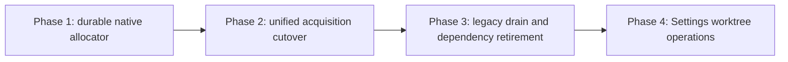

# Phased plan: native Mission Control worktree management

## Source and approval

- Approved source: [`plan.md`](plan.md), rendered at [`plan.html`](plan.html).
- Submitted on 2026-08-15 through Mission Control's plan review.
- The human selected the recommended answer for all four architecture choices and authorized this
  phased implementation follow-up.

## Incorporated human decisions

| Decision | Adopted requirement | Consequence for implementation |
| --- | --- | --- |
| Native pool activation | Default on for Mission Control acquisitions, with lazy creation and per-repository disable/capacity controls | Dispatch and checks stop consulting different gates. A repository without config gets the safe default policy, while a stored override can select the disposable Git provider. |
| Legacy transition | Staged compatibility drain | New worktrees never enter Treehouse after cutover. Existing `provider = 'treehouse'` rows keep provider-authoritative cleanup, and foreign or uncertain leases remain untouched. |
| Operator surface | Settings > Worktrees in this initiative | The final phase includes configuration, inventory, legacy drain, and preview-first actions with Playwright and visual verification. |
| Manual sessions | Keep `make session` as a daemon client | The script no longer allocates independently. A running daemon is required, and release is available through the panel and a companion client action. |
| Follow-up | Create phases and dependency-linked tasks | Every phase below becomes one task gated on this planning session and its own direct prerequisite. |

## Repository findings that refine the source design

The source plan's architecture is compatible with the repository, with these implementation-level
refinements:

1. **Pool policy belongs in `app_config`, not in two places.** The root plan's illustrative
   `worktree_pools` fields mixed operational identity with enablement, maximum slots, and setup
   policy. Existing daemon settings consistently use a schema-validated blob over `app_config`
   (`harnesses.ts`, workflow config, skills config). Native pool tables will therefore store
   operational facts only; `app_config.worktrees` is the sole policy source.
2. **Lease identity must reach durable domain rows.** A random lease ID held only in
   `worktree_slots` does not protect a late teardown from a task or check that has already acquired a
   newer lease under the same owner key. Native task and check records need nullable lease-ID
   columns, populated only by the `mission` provider and cleared with the existing resource fields.
3. **The process substrate is reusable as-is.** `listProcesses()` already returns every process,
   not only agents, and `readProcCwds()` resolves their cwd in one batched `lsof`. The manager needs a
   bounded occupancy projection over those functions, not a new scanner or a Go port.
4. **The settings integration has a registry contract.** `SETTINGS_CATEGORIES` owns route validity,
   rail order, scope, search, and test discovery. Worktrees becomes a `sessions` / `machine`
   category through that registry, not a one-off link in `SettingsPage`.
5. **Volatile detail stays off the snapshot.** Existing content-free config invalidation events and
   hooks such as `useHarnesses(revision)` provide the correct pattern. `worktrees_changed` bumps a
   revision; the open panel fetches current Git/process detail over HTTP.
6. **Legacy Treehouse cannot be removed as a persisted provider.** The append-only
   `WorktreeProvider` and historical `workflow_check_leases.provider` default require a fail-closed
   bridge for as long as a database can still contain those values. Dependency removal means no
   install requirement and no new Treehouse acquisition, not pretending old rows were Git rows.
7. **The existing reaper also schedules check recovery.** Native maintenance must accept the check
   lease manager's reclaim hook before the Treehouse reaper is retired, or the cutover would quietly
   remove crash recovery for checks.
8. **Historical Treehouse identity cannot be manufactured safely.** Current acquisition persists a
   path and holder but discards the v2.1.1 lease ID. Observing an ID during upgrade cannot prove it is
   the lease the old row originally owned. Phase 3 may conditionally return only a durably captured
   exact ID; existing null-ID rows remain pinned and visible with manual remediation.

## Sizing estimate and phase-count rationale

Expected production change: **2,700 to 4,100 non-test lines**, excluding tests, documentation, plan
artifacts, and generated output.

Assumptions behind the range:

- 900 to 1,350 lines for durable native pool state, Git materialization, occupancy, reconciliation,
  configuration, and manager lifecycle;
- 650 to 950 lines to adapt task dispatch, workflow checks, task/check persistence, manual session
  routes and client behavior;
- 350 to 600 lines for the structured legacy bridge, drain accounting, setup removal, and timer/env
  compatibility;
- 800 to 1,200 lines for Settings registration, browser state, inventory/actions, styling, and route
  presentation.

Four phases are the fewest safe implementation units for work of this size and concurrency risk:

- Combining Phases 1 and 2 would ask one change to prove the allocator's crash/ABA safety while also
  moving three production consumers and multi-repository rollback onto it. A regression could not be
  localized to the new mechanism or the cutover.
- Combining Phases 2 and 3 would mix stopping new Treehouse ownership with deleting the old acquisition
  and setup paths. The separate boundary proves all new acquisitions are native before legacy code is
  narrowed.
- Combining Phases 3 and 4 would put provider migration, destructive legacy safety, settings routing,
  browser state, layout, and end-to-end tests into one large review. The backend contract must be
  stable before the destructive operations surface is exposed to people.
- Splitting any phase further would create a test-only or schema-only preparation PR, or a UI shell
  without an operable API. Those are not useful merge units.

## Phases

| # | Phase | Delivers | Behavior after merge |
| --- | --- | --- | --- |
| 1 | [Durable native allocator](phase-1-durable-native-allocator.md) | `mission` provider identity, schema, policy config, native slot manager, occupancy and startup reconciliation | Native allocation is implemented and tested behind an unselected provider; current Treehouse/Git callers are unchanged. |
| 2 | [Unified acquisition cutover](phase-2-unified-acquisition-cutover.md) | Task, check, and manual session acquisition through the manager, default-on policy, durable lease IDs, Git degradation | All new Mission Control worktrees are native by default; `make session` is a daemon client; no new Treehouse lease is created. |
| 3 | [Legacy drain and dependency retirement](phase-3-legacy-drain-and-dependency-retirement.md) | Structured Treehouse compatibility, legacy inventory/drain APIs, retired install/config/runtime assumptions | Exact-ID legacy rows remain conditionally reclaimable and uncertain rows fail closed, while Treehouse stops being an installation or new-runtime prerequisite. |
| 4 | [Settings worktree operations](phase-4-settings-worktree-operations.md) | Settings > Worktrees, configuration, native and legacy inventory, preview-first actions, SSE invalidation, E2E proof | Operators can understand, configure, open, return, prune, reconcile, destroy, and drain worktrees from the application. |

## Dependency graph and merge order

Direct prerequisites:

- **Phase 1:** none.
- **Phase 2:** Phase 1.
- **Phase 3:** Phase 2.
- **Phase 4:** Phase 3.

Merge order is Phase 1, then Phase 2, then Phase 3, then Phase 4.

## Concurrency

There are no concurrent implementation phases.

- Phases 1 and 2 both shape the manager/provider interface, persistence mapping, and daemon startup
  ordering.
- Phases 2 and 3 both change `dispatcher.ts`, `check-lease.ts`, the Treehouse adapter, the reaper
  lifecycle, scripts, and provider tests.
- Phase 4 consumes the final native plus legacy status/action contracts and must not invent a browser
  projection while Phase 3 is still changing their meaning.

Serial execution is also operationally useful: each merge answers one migration question before the
next is allowed to remove or expose anything.

## Cross-phase contracts

Phase 1 owns these contracts; later phases consume rather than redefine them:

1. **Provider identity:** append `"mission"` to `WorktreeProvider`. `"treehouse"` and `"git"`
   keep their historical meanings forever. Cleanup selects the persisted provider, never current
   availability.
2. **Policy authority:** `app_config.worktrees` is the only source for default enablement, repository
   overrides, maximum slots, and optional operator-authored setup profiles. Pool and slot tables do
   not duplicate policy.
3. **Repository identity:** a pool is unique by the physical Git common directory. Pool paths are
   under `$MISSION_HOME/worktree-pools`; remote URL is display metadata, not identity.
4. **Lease identity:** every native acquisition creates a cryptographically random lease ID. Release
   compares slot, lease ID, and owner. Task/check domain rows persist that ID; Git and legacy rows
   leave it null unless legacy identity was captured at acquisition.
5. **Authority split:** the slot row owns allocation state. Tasks and workflow check rows own the
   meaning and lifetime of their work. The manager verifies both before destructive actions; a
   session becoming `exited` is never cleanup authorization.
6. **State machine:** filesystem mutations are bracketed by durable `provisioning`, `returning`, or
   `pruning` intent. Any mismatch among SQLite, Git registration, filesystem, owner rows, and
   occupancy becomes `quarantined`.
7. **Git hygiene:** reuse `resetWorktreeToCommit`; clean with `-fd`, never `-fdx`; verify exact HEAD;
   preserve multi-repository all-or-nothing unwind and `WorktreeTeardownError.reclaimed` semantics.
8. **Process safety:** known Mission Control processes close through their existing owner. A batched
   all-process cwd scan runs before reuse or deletion. Unknown occupancy fails closed and is never
   killed automatically.
9. **Manual ownership:** `make session` talks to the loopback daemon. It does not write SQLite or
   allocate Git worktrees itself, and a daemon outage produces a direct start-the-daemon error.
10. **Legacy boundary:** the Treehouse adapter is read/return-only after Phase 2. It uses JSON and
    conditional identity where provable, never adopts a slot into native state, never substitutes
    `git worktree remove`, and never touches null-ID, foreign, or otherwise uncertain leases.
11. **Browser convergence:** `worktrees_changed` is content-free and exhaustively handled. Detailed
    status stays on HTTP and is refreshed on open, invalidation, and a slow reconnect backstop.
12. **Action safety:** preview and execute are separate calls. Execute revalidates owner, lease,
    process, Git, and observed slot version; a stale preview returns conflict rather than acting.

## Final verification strategy

Each phase runs the focused tests named in its file, `npm run typecheck`, `npm run lint`, and
`npm test`. Runtime phases also run `npm run build` and `npm run smoke`. Phase 4 runs the built
Playwright suite and captures gitignored desktop and narrow evidence for the inventory and destructive
preview states.

The complete initiative must additionally prove:

- a new installation with no `treehouse` binary can dispatch tasks, run checks, and acquire/release a
  manual session through one native inventory;
- existing `treehouse` and `git` rows from an upgraded database still call only their recorded
  provider, including when the binary is absent;
- a stale native teardown cannot release a newer lease;
- crash recovery cannot make an uncertain slot available;
- separate clones of one remote get separate pools, while a linked worktree resolves to its owning
  common directory;
- capacity reduction is a preview-first right-size operation, not automatic deletion;
- the Settings page shows native, legacy, dirty, occupied, quarantined, and over-capacity states and
  keeps wide detail scrollable at narrow widths;
- no e2e daemon can see or mutate the operator's Treehouse pool or launch a real model binary;
- setup, configuration, README, and worktree/check documentation no longer require Treehouse for new
  operation.

## Complete-set audit

- Every adopted decision is assigned: activation and manual sessions in Phase 2, legacy drain in
  Phase 3, Settings > Worktrees in Phase 4, and task scheduling in this planning session.
- Every root-plan capability is owned once: allocator/status safety in Phase 1, acquire/return
  integration in Phase 2, Treehouse compatibility/removal in Phase 3, and human operations in Phase 4.
- No phase changes a provider value created by another provider. The append-only and
  provider-authoritative contracts are repeated in every phase where cleanup occurs.
- No phase converts an observed legacy ID into ownership. Phase 3 and Phase 4 surface null-ID rows as
  unverifiable and preserve their domain pins until the operator resolves them outside the app.
- The graph is strictly serial and the file overlap justifying that order is explicit.
- The final state contains one native allocator and one intentionally narrow legacy adapter, not two
  competing pool implementations.
