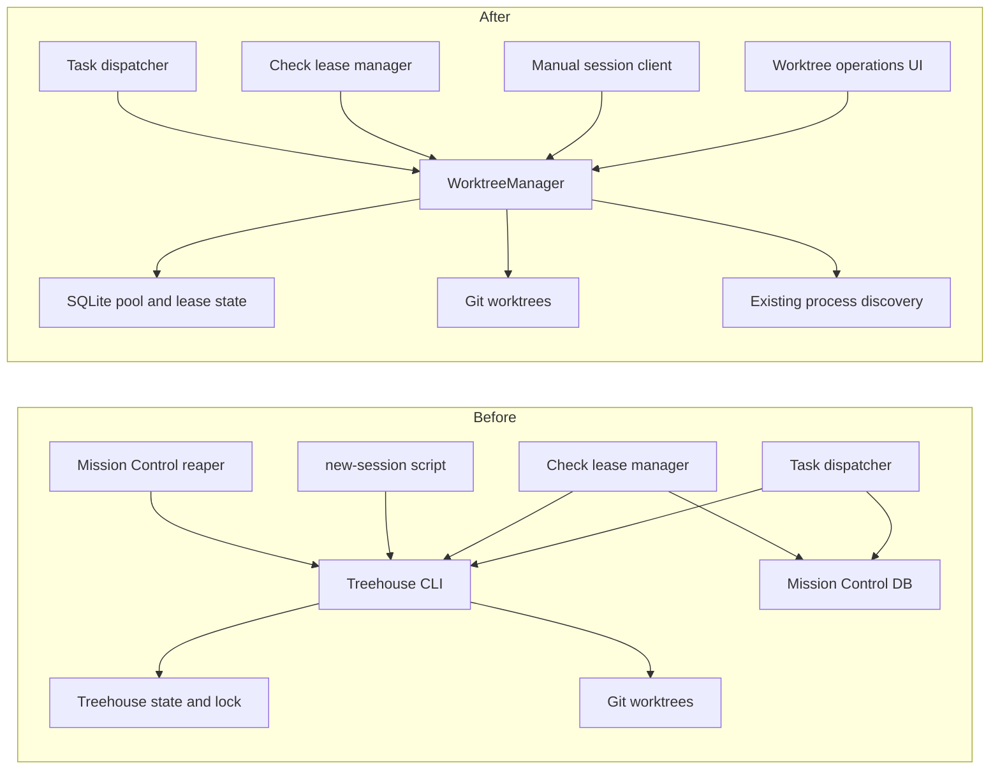
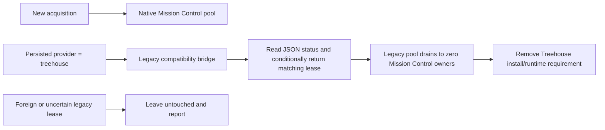

# Native worktree management: absorbing Treehouse into Mission Control

- **Status:** Approved for phased implementation planning
- **Date:** 2026-08-15
- **Scope:** Planning only. This document proposes no application changes by itself.
- **Decision record:** All four recommended plan choices and the phased implementation follow-up were
  submitted in Mission Control on 2026-08-15.

## Executive recommendation

Replace Treehouse as a runtime dependency with one daemon-owned, SQLite-backed worktree manager
implemented in Mission Control. Route task dispatch, workflow checks, and manual development
sessions through that manager. Keep the existing task and check lifecycle rules above it, reuse the
Git and process primitives Mission Control already has, and add an operator-facing worktree inventory
with conservative return, prune, and destroy actions.

Do not port Treehouse wholesale and do not create another state file beside Mission Control's
database. Treehouse is deliberately a small, local CLI primitive. Mission Control has already built
most of the application-specific policy around it: provider selection, exact-commit pinning,
multi-repository rollback, durable check ownership, leaked-lease recovery, session pins, and explicit
task cleanup. A native manager can consolidate those layers while preserving the fail-closed safety
properties that make pooled worktrees trustworthy.

The safest transition is a staged drain. New acquisitions move to a new persisted provider while the
existing Treehouse adapter remains only as a compatibility bridge for durable rows and leases that
already say `treehouse`. Mission Control must never adopt, reset, or delete a legacy lease merely
because its path looks idle.

## Investigation basis

This investigation covered:

- Mission Control at commit `aa0928d2` on 2026-08-15, including the dispatcher, pooled-lease reaper,
  workflow check leases, process discovery, Git utilities, setup scripts, database schema, UI, and
  existing worktree plans and contracts.
- The locally installed Treehouse `v2.1.1` command surface and a read-only JSON status snapshot of
  this repository's live pool.
- Treehouse's current upstream README, vision, changelog, configuration, pool, Git, process, state,
  and license sources. Treehouse is MIT-licensed, but an independent TypeScript implementation is
  preferable to copying Go source. Any substantial copied source would require retaining its license
  notice.

The live pool snapshot is operational evidence, not a cleanup authorization. It contained 54 slots:
46 leased and 8 available. Only 5 leased entries reported a process. The repository currently asks
for `max_trees = 32`, so the pool also demonstrates a lifecycle gap: lowering the configured ceiling
does not right-size an already-grown pool. An idle-looking lease can still be intentional, so none of
these leases should be reclaimed without correlating Mission Control ownership and applying the
safety checks in this plan.

## What Treehouse actually provides

Treehouse's design is narrower than Mission Control's. It is a no-daemon CLI that owns reusable Git
worktree allocation and local safety, while intentionally avoiding agent orchestration.

| Treehouse capability | Current behavior | Native disposition |
| --- | --- | --- |
| Pool identity | A directory under the configured root, keyed by repository name plus a hash of remote URL or repository path | Key a pool by the canonical Git common directory. This avoids making separate local clones with the same remote share worktree bookkeeping. |
| Acquire | `get --lease --json` chooses an available slot or creates one up to `max_trees`, resets it, and returns a random lease ID, holder, and timestamp | Implement as a durable daemon transaction plus a Git materialization step. Return `{ path, leaseId, owner, baseSha }`. |
| Return | `return --if-lease-id --if-lease-holder` checks lease identity under the same cross-process lock, then resets and clears the lease | Use a random lease ID and conditional SQLite transition. A stale caller cannot release a newer lease. |
| Status | `status --json` reports slot state, lease metadata, and processes whose current directory is under a worktree | Expose structured daemon status and a dashboard inventory. Reuse Mission Control's process inventory and cwd resolution. |
| Dirty protection | Untracked files count as dirty. Reset uses `git reset --hard` and `git clean -fd`, preserving ignored caches | Reuse `resetWorktreeToCommit` and the existing snapshot/dirty helpers. Never use `clean -fdx`. |
| Process protection | Scans every process cwd before reuse or destructive actions | Build a generic bounded occupancy service from existing `ps`, `lsof`, terminal, and check process identity code. Unknown occupants fail closed. |
| Recovery | Atomic state writes under a file lock; corrupt state is reconstructed and every uncertain slot is quarantined | SQLite is the authoritative state store. Reconcile database rows, Git registrations, and domain owners at startup, quarantining uncertainty. |
| Prune | Dry-run by default; removes only clean, merged, idle, unleased slots unless risk flags are given | Provide preview-first reclaim and right-sizing. Safe prune is limited to available, clean, merged, process-free slots. |
| Destroy | Narrow target, preview by default, explicit flags for unlanded, in-use, or leased work | Provide exact-scope preview and explicit risk acknowledgements. No implicit global destroy. |
| Enter | Prints or opens an existing named worktree without changing ownership | Keep the existing open-terminal action and make every inventory path copyable/openable. |
| Init/config | User config controls roots and hooks; repository `treehouse.toml` controls safe settings but not executable hooks | Move capacity and enablement into Mission Control settings. Setup/warm commands remain explicit operator configuration, never repository-controlled execution. |
| Update/completion | Installs and operates the standalone CLI | These disappear with the external runtime dependency. They are distribution features, not worktree-domain behavior. |

Treehouse `v2.1.1` is safer than the contract Mission Control currently codes against. In particular,
it now exposes JSON lease identity and conditional return. Mission Control's adapter still describes
and parses an older text-only protocol. Updating that bridge can make the migration safer, but it
should not become another long-lived abstraction that must later be replaced.

## What Mission Control already owns

Mission Control is already more than a Treehouse caller:

- `src/server/dispatcher.ts` chooses Treehouse or a throwaway Git provider, pins every checkout to an
  exact base commit, provisions multiple repositories all-or-nothing, records the provider, and
  unwinds partial failures with the matching cleanup mechanism.
- `src/server/pool.ts` discovers relevant repositories, parses Treehouse status, correlates task,
  session, and check pins, verifies no process, dirt, or unmerged work, and performs background and
  dry-pool leak recovery.
- `src/server/pool-lease.ts` centralizes most daemon Treehouse calls, serializes per-repository call
  sequences, and maintains in-memory acquisition generations and pending-lease timestamps to reduce
  status-then-return races.
- `src/server/workflows/check-lease.ts` has its own durable lease table and state machine, startup
  recovery, supervisor identity, retry/backoff behavior, and a Git fallback. These are workflow
  execution semantics, not generic pool semantics.
- `src/server/discovery/processes.ts`, `src/server/discovery/proc-cwd.ts`,
  `src/server/workflows/check-identity.ts`, and `src/server/workflows/check-group.ts` already provide
  process enumeration, cwd lookup, stable process identity, and guarded termination for processes
  Mission Control owns.
- `src/server/util/git.ts`, `src/server/actions.ts`, and
  `src/server/git/ensemble-snapshot.ts` already resolve repository identity, calculate remote/default
  refs, inspect changes, create snapshots, and perform exact reset/clean operations.
- `scripts/new-session.mjs` independently acquires a Treehouse lease for `make session`, while
  `scripts/worktree-setup.mjs` warms dependencies after acquisition.
- The database already persists `worktree_path`, exact base SHA, and provider for task and check
  ownership. The daemon is the only permitted SQLite writer.

The current fallback prevents Treehouse absence from blocking isolation, but it is intentionally
cold and disposable. It does not provide pooling, inventory, capacity management, recovery, or a
manual session lease.

## Redundant and conflicting implementations

| Area | Current duplication or conflict | Consolidation |
| --- | --- | --- |
| Provider decision | Dispatch requires both Treehouse and committed `treehouse.toml`; checks use Treehouse whenever the binary exists | Give the native manager one enablement/capacity policy used by tasks, checks, and manual sessions. |
| Lease identity | Treehouse now has stable lease IDs; Mission Control instead uses holder history, path equality, an in-process mutex, acquisition generations, and a pending-registration TTL | Make a persisted random lease ID the compare-and-swap identity. Keep the compatibility bridge conditional on Treehouse's real lease ID when available. |
| Status parsing | `pool.ts` and check ownership parse human-readable Treehouse output independently of the structured protocol now available | Remove text parsing from native paths. Legacy reads use `status --json` in one adapter. |
| Ownership state | Treehouse state, task rows, check rows, in-memory pending maps, live registry state, and worktree paths all carry partial ownership facts | Make the native slot/lease row allocator authority. Task and check rows remain domain authority and are reconciled against it. |
| Repository locking | Mission Control has an in-process per-repository mutex because Treehouse calls are separate processes; Treehouse also takes a cross-process state lock | Route all new allocations through the single daemon and serialize with SQLite transactions plus per-pool asynchronous work queues. |
| Process safety | Treehouse scans cwd with `gopsutil`; Mission Control separately runs `ps`, `lsof`, terminal tracking, and check identity logic | Add one occupancy query over the existing process substrate. Never copy a second process scanner into the pool. |
| Git reset and safety | Treehouse owns reset/clean/merged checks; Mission Control repeats exact pinning, dirty checks, default-branch checks, and snapshots | Reuse Mission Control's existing Git functions, then extract shared helpers only where the native manager and current callers need the same operation. |
| Cleanup lifecycles | Generic leaked-lease reaping and check-specific lease reclaiming each contain Treehouse ownership and return rules | Put acquisition, conditional release, status, quarantine, and safe reclaim in the native manager. Keep task retention and check retry/supervisor state in their domain managers. |
| Manual acquisition | `scripts/new-session.mjs` shells out directly and duplicates holder conventions because bare Node cannot import TypeScript | Make the script a daemon client or retire it. It must not become a second database writer or native allocator. |
| Configuration | `treehouse.toml`, Treehouse user config, `MISSION_POOL_REAP_MS`, setup installation logic, and code-level defaults influence different slices | Introduce one Mission Control pool configuration model and a documented migration for the existing repository opt-in. |
| Operations UI | Task cleanup and open-terminal actions exist, but there is no pool capacity, status, quarantine, prune, destroy, or legacy-drain surface | Add one worktree operations surface backed by daemon APIs and SSE invalidation. |

The largest consolidation opportunity is not deleting the check lease manager. It is narrowing it.
Checks still need durable attempt ownership, supervisor identity, retries, and provider-authoritative
cleanup. The generic manager should supply a leased checkout; the check manager should decide what a
workflow attempt means and when it may release that checkout.

## Target architecture

### Ownership boundary

Create a `WorktreeManager` under the daemon with one provider registry:

- **Native pooled provider:** default target for new tasks, checks, and manual sessions.
- **Git disposable provider:** retained as an explicit emergency/degraded provider and for rollback
  during rollout. It remains cold and provider-authoritative.
- **Treehouse legacy provider:** read/return compatibility only for records created before cutover.
  It cannot serve new native acquisitions after the cutover flag is enabled.

Dispatcher, check execution, and manual session entry call the same manager API. Ensemble dispatch
continues to call the ordinary dispatcher, so this plan does not create an ensemble-specific
provisioner.



The before-state has two partially overlapping authorities connected through a text-oriented CLI.
The after-state has one allocator authority inside the daemon, with domain-specific owners above it
and Git/process mechanisms below it.

### Persisted model and state machine

Add append-only schema rather than repurposing existing rows:

- `worktree_pools`: stable pool ID, canonical Git common directory, display repository root, pool
  path, enabled flag, maximum slots, optional operator-approved setup profile, timestamps, and last
  reconciliation result.
- `worktree_slots`: stable slot ID and ordinal, pool ID, path, lifecycle state, exact HEAD, lease ID,
  owner kind, owner key, lease timestamps, last-used timestamp, quarantine reason, and last error.

The main lifecycle is:

```text
provisioning -> available -> leased -> returning -> available
       |             |          |          |
       +-------------+----------+----------+-> quarantined

available -> pruning -> removed
```

Every filesystem mutation is bracketed by a durable intent state. A reservation is committed before
`git worktree add`; a return is committed before reset; a prune is committed before removal. On
restart, reconciliation compares each intent with Git's registered worktree list and the filesystem.
Missing, mismatched, or ambiguous resources are quarantined instead of guessed back into service.

Each acquisition creates a cryptographically random lease ID and an owner tuple such as
`task:<task-id>:<repo-slot>`, `check:<attempt-id>`, or `manual:<session-id>`. Release is a conditional
transition on slot ID, lease ID, and owner. This replaces the current holder-label and in-memory ABA
mitigations for native worktrees.

Keep `WorktreeProvider` append-only. Add a new value such as `mission`; never rename or reinterpret
the persisted `treehouse` and `git` values. Existing task and check rows continue to select their
original cleanup provider.

### Repository identity and paths

Resolve every input path to the owning main repository and canonical Git common directory before
looking up a pool. Hash that common directory for the on-disk pool path, for example:

```text
$MISSION_HOME/worktree-pools/<repo-name>-<common-dir-hash>/<slot>/<repo-name>
```

Treehouse can key by remote URL. That is convenient across clones but unsafe for native Git
bookkeeping because worktrees belong to one Git common directory. Separate clones of the same remote
must therefore have separate native pools.

### Acquisition and return

Acquisition must:

1. Resolve the repository and pool configuration.
2. Serialize allocation for that pool.
3. Reserve an available clean slot or a new slot below the maximum.
4. Materialize/reset outside the database transaction while the durable state says `provisioning` or
   an existing slot is unavailable to other callers.
5. Reset to the requested exact commit and verify `HEAD` byte-for-byte.
6. Run only an operator-approved setup profile, if configured.
7. Commit the random lease ID and owner, then return the lease.

Return must:

1. Compare slot, lease ID, and owner in the database.
2. Refuse if the domain owner still pins the checkout.
3. Ask the owning terminal/check supervisor to close only processes Mission Control can identify.
4. Scan cwd occupancy. Any unknown process keeps the slot quarantined or leased unless an exact,
   explicitly confirmed force operation targets it.
5. Preserve task work until the existing explicit cleanup action authorizes release.
6. Snapshot where the existing task contract requires it, then reset with `clean -fd`, verify, and
   mark the slot available.

### Status, prune, and destroy

The manager's status projection should include pool capacity, slot state, owner and age, linked task,
check, or session, process occupants, dirty/untracked state, exact HEAD, ahead/unmerged status against
the fetched default branch, disk use, and quarantine/error detail.

Operational actions are preview-first:

- **Return** targets one leased slot and requires matching ownership. Force is available only after a
  preview identifies the exact process and Git risks.
- **Safe prune** considers only available, clean, merged, process-free slots. It can also right-size a
  pool whose current slot count exceeds its new maximum.
- **Destroy** targets one slot or one named pool. A preview classifies leased, in-use, dirty, and
  unlanded worktrees; separate acknowledgements gate each risk class. There is no global one-click
  destroy.
- **Repair/reconcile** never deletes uncertainty. It restores provably safe rows and quarantines the
  rest with an actionable explanation.

### Operator surface

The recommended first-class surface is **Settings > Worktrees**, because capacity, pool roots,
warmup profiles, and legacy migration are operational settings rather than day-to-day task content.
It should show:

- a repository summary with used/available/quarantined/over-capacity counts;
- expandable slot inventory with ownership, age, process, Git, and disk signals;
- Enable/disable, maximum slots, and setup profile controls;
- Preview Return, Prune, Destroy, and Reconcile actions with explicit confirmations;
- a legacy Treehouse section that distinguishes Mission Control leases from foreign/user leases and
  tracks drain progress;
- Open terminal and Copy path actions for a slot.

The UI should fetch detail on demand and refresh through a new exhaustive SSE invalidation event,
rather than stuffing volatile process and Git status into the global snapshot or polling from the
browser. Every visible behavior needs an end-to-end Playwright specification.

Treehouse command concepts map into the application as follows:

| Treehouse command | Mission Control surface |
| --- | --- |
| `get` | Dispatch, check acquire, or manual session acquire through the daemon |
| `return` | Task cleanup or an exact Return action in the worktree inventory |
| `status` | Worktree inventory and structured API |
| `prune` | Preview and safe prune/right-size action |
| `destroy` | Scoped destructive preview with risk acknowledgements |
| `enter` | Open terminal and Copy path |
| `init` | Enable/configure a repository pool |
| hooks | Operator-approved setup profile |
| `update`, completion | Removed with the standalone CLI dependency |

## Legacy migration and dependency removal

The migration must avoid dual ownership of any checkout.



Recommended migration sequence:

1. Add the native provider and schema behind a reversible acquisition setting. Legacy rows continue
   to resolve through their recorded provider.
2. Stop creating new Treehouse leases. The compatibility adapter uses `status --json` and conditional
   return on Treehouse `v2.1.1` when the persisted lease can be proven. Older rows without a lease ID
   retain the current full safety ladder and are never force-returned from path/holder alone.
3. Inventory legacy pools read-only. Correlate paths with task, check, and session state; label foreign
   leases and dirty/unmerged work; let the operator drain or explicitly abandon them.
4. Remove Treehouse installation from `scripts/init.mjs`, Treehouse PATH assumptions, direct script
   shell-outs, `treehouse.toml` as an active gate, and ordinary documentation only after new
   acquisitions no longer depend on the binary.
5. Retain the `treehouse` provider value and a fail-closed diagnostic/cleanup bridge while any durable
   database row can still reference it. If the binary is missing, report the blocked legacy cleanup;
   never substitute `git worktree remove` behind Treehouse bookkeeping.
6. Once legacy Mission Control ownership reaches zero, document how operators can remove Treehouse
   and its external pool. Foreign leases remain the operator's property.

Directly importing Treehouse's existing pool into the new tables is not recommended. It creates a
window where two state stores believe they own the same worktree, and Treehouse's pool key can join
clones that the native common-directory key intentionally separates.

## Delivery sequence

### 1. Native manager foundation

- Add the append-only provider value, pool/slot schema, repository identity, state machine, conditional
  lease transitions, reconciliation, and focused contract tests.
- Extract shared Git reset/merged/dirty operations from current code without changing task cleanup
  semantics.
- Build the occupancy query over existing process discovery and identity services.
- Provide structured status and preview APIs before enabling acquisition.

### 2. One acquisition path

- Route dispatcher provisioning through `WorktreeManager` while preserving exact base SHA,
  multi-repository all-or-nothing rollback, and provider-authoritative teardown.
- Route check acquisition through the same manager while keeping `workflow_check_leases` as the
  check-domain recovery record.
- Route or retire `scripts/new-session.mjs` according to the selected manual-session decision.
- Keep the Git disposable provider as a reversible rollout/degradation path.

### 3. Operations surface

- Add the selected UI location, repository summaries, slot details, configuration, legacy status, and
  preview-first actions.
- Add exhaustive SSE handling and browser coverage for every visible state and action.
- Document pool behavior, safety, capacity, setup profiles, manual sessions, and recovery.

### 4. Legacy drain

- Update the compatibility adapter to structured Treehouse `v2.1.1` reads and conditional returns
  where identity is available.
- Show drain progress and refuse foreign, dirty, occupied, or uncertain leases.
- Validate upgrade behavior against databases containing `treehouse` tasks and check leases.

### 5. Retire the dependency and duplicated code

- Remove Treehouse from bootstrap and new-acquisition probes.
- Remove text status parsing, holder-history ownership, pending TTL/generation maps, the in-process
  Treehouse call mutex, duplicated check parsing, and direct `new-session` Treehouse calls once their
  compatibility duties are gone.
- Remove or migrate `treehouse.toml` and reframe `MISSION_POOL_REAP_MS` under the native configuration
  model.
- Keep only the fail-closed legacy cleanup/diagnostic code required by persisted provider history.

This sequence is intentionally merge-aware: each step leaves a working provider-authoritative system
and does not require a flag day across task dispatch, checks, scripts, and UI.

## Expected file and contract impact

| Area | Expected change |
| --- | --- |
| `src/shared/types.ts` | Append native provider, pool/status/action contracts, and SSE invalidation event. |
| `src/server/db.ts` | Add pool/slot schema and migrations beside their upgrade path. Preserve legacy provider defaults and rows. |
| `src/server/worktrees/` | New manager, repository identity, provider registry, state machine, occupancy, reconciliation, and action previews. |
| `src/server/dispatcher.ts` | Delegate provisioning/teardown to the manager; preserve multi-repository rollback and exact pinning. |
| `src/server/workflows/check-lease.ts` | Delegate tree acquisition/release while retaining attempt lifecycle and supervisor semantics. |
| `src/server/pool.ts`, `src/server/pool-lease.ts` | Shrink to a temporary legacy bridge, then remove code that no longer serves persisted Treehouse rows. |
| `src/server/routes.ts`, `src/web/` | Add settings/status/action routes and the selected worktree UI. |
| `scripts/new-session.mjs`, `scripts/init.mjs`, `scripts/worktree-setup.mjs`, `Makefile` | Remove direct Treehouse ownership, route manual sessions through the daemon if retained, and preserve explicit warmup behavior. |
| `docs/README.md`, setup/configuration/worktree docs | Describe native ownership, safety, migration, and removal of the external prerequisite. |
| `test/`, `e2e/` | Add state-machine, crash-recovery, migration, concurrency, provider, route, and browser behavior coverage. |

## Verification strategy

### Unit and contract coverage

- Two concurrent acquires cannot receive the same slot.
- A stale lease ID or owner cannot return a newly re-leased slot.
- Crash points before/after Git add, reset, lease commit, return, and prune reconcile deterministically
  or quarantine.
- Canonical main repository/common-directory identity separates distinct clones of one remote and
  joins paths inside one linked-worktree family.
- Dirty, untracked, unmerged, occupied, pinned, unknown, and missing-path states fail closed.
- Reset preserves ignored caches and removes untracked non-ignored files.
- Task cleanup remains explicit after a session exits.
- Check attempt rows remain recoverable and select their persisted provider even when availability or
  configuration changes.
- Mixed Treehouse/Git/native task repositories unwind only through their recorded provider.
- Old databases with `treehouse` task/check rows migrate and open safely.
- Capacity decreases produce a safe right-size preview, not surprise deletion.

### Integration and end-to-end coverage

- Dispatch, check, and manual acquisition share one slot inventory and exact-commit behavior.
- Multi-repository provisioning rolls back a partial native allocation.
- Settings changes update status through SSE invalidation.
- The browser renders available, leased, occupied, dirty, quarantined, legacy, and over-capacity
  states with accessible controls and no `data-testid` selectors.
- Return, prune, destroy, reconcile, and legacy drain show previews and require the correct
  confirmations.
- Fake agents remain mandatory so end-to-end work spends no model tokens.
- Runtime verification proves layout, scrolling, confirmation focus, and large-pool performance.

Run focused tests while developing, then the repository gates required by the touched surfaces:
`npm test`, `npm run typecheck`, `npm run lint`, `npm run build`, `npm run smoke`, and
`npm run test:e2e` after the build.

## Safety invariants

- The daemon remains the only SQLite writer and the only allocator for native slots.
- Persisted provider IDs are append-only. Cleanup always uses the provider that created the worktree.
- A session reaching `exited` never implies durable task cleanup. The existing explicit task cleanup
  and `session_remove` contracts remain authoritative.
- No second session-eviction or process-termination path is introduced.
- Unknown processes are not killed automatically.
- Ignored caches survive reuse; `git clean -fdx` is forbidden.
- No repository-controlled executable hook runs merely because a repository was opened.
- No uncertain legacy lease is adopted, reset, or deleted.
- No production, signing, release, or CI configuration is in scope.

## Risks and mitigations

| Risk | Mitigation |
| --- | --- |
| Reimplementing mature pool safety introduces data loss | Port behavior as explicit invariants and adversarial tests, reuse existing Git/process primitives, and quarantine ambiguity. |
| Two allocators touch one checkout during migration | New pools use separate paths and state. Legacy provider rows never switch identity in place. |
| SQLite state and Git registrations diverge across crashes | Persist intent before mutation and reconcile every transitional state at startup. |
| Pooling every repository consumes unexpected disk | Create slots only on demand, expose a ceiling and disk use, and support preview-first right-sizing. |
| Process scanning is expensive or platform-sensitive | Reuse batched process discovery, perform detailed occupancy on demand/before mutation, cache only within a bounded operation, and fail closed on unsupported evidence. |
| Native worktree setup executes untrusted code | Setup profiles are operator-authored, explicit, visible, and disabled by default for unknown repositories. |
| Legacy cleanup cannot prove ownership | Leave the lease untouched and surface the exact manual remediation. |
| A large operations UI delays dependency removal | Keep the API/manager boundary independent; the selected UI scope can land after native acquisition while legacy cleanup remains available. |

## Non-goals

- Replacing task lifecycle, workflow check semantics, terminal backends, or session eviction.
- Creating a second dispatcher or an ensemble-specific worktree path.
- Managing arbitrary worktrees that Mission Control did not create, except read-only discovery and an
  exact operator-requested import/destroy flow added by a later plan.
- Automatically killing unknown processes or deleting dirty/unlanded work.
- Copying Treehouse's updater, shell completion, Go process scanner, or file-state implementation.
- Changing release, signing, deployment, or CI configuration.

## Adopted decisions

### 1. Native pool activation

**Adopted: default on for Mission Control acquisitions, with per-repository disable and capacity
controls.** Native slots are created only on demand. This resolves today's dispatch/check policy
split and ensures the application no longer silently loses pooling when Treehouse is absent.

### 2. Legacy Treehouse transition

**Adopted: staged drain through a read/return-only compatibility bridge.** This preserves
provider-authoritative cleanup and gives operators visibility into foreign or uncertain leases.

### 3. Operations UI scope

**Adopted: a full Settings > Worktrees panel in the first initiative.** This keeps
configuration, inventory, status, legacy drain, and destructive previews together without adding a
new primary navigation destination.

### 4. Manual development sessions

**Adopted: keep `make session`, but make it a daemon client and release its durable lease from
the Worktrees panel or a companion client command.** This preserves the current workflow while making
the daemon the only allocator and state writer.

### 5. Implementation follow-up

**Adopted: create a phased implementation plan and dependency-linked Mission Control tasks.** The
phase artifacts must be committed and pushed before their tasks are scheduled, and every task remains
gated on this planning session until the plan pull request merges.

## Success criteria

- A clean installation can provision warm, isolated task, check, and approved manual-session
  worktrees without installing Treehouse.
- One daemon-owned inventory explains every native slot's repository, owner, age, process state, Git
  safety, disk use, and next safe action.
- Concurrent and crash-interrupted operations cannot double-lease, release a newer lease, or make an
  uncertain checkout available.
- Dispatch and checks use one activation policy and one acquisition implementation.
- Existing `treehouse` and `git` records retain correct provider-authoritative cleanup across upgrade.
- Operators can safely drain legacy Mission Control leases while foreign leases remain untouched.
- The old text parser, holder heuristics, in-memory ABA maps, duplicate Treehouse shell-outs, and
  bootstrap dependency are removable after the drain.
- Task retention, exact-commit pinning, multi-repository rollback, check recovery, and ignored-cache
  warmth behave exactly as before.

## Primary sources

- [Treehouse repository and README](https://github.com/kunchenguid/treehouse)
- [Treehouse product boundary and safety vision](https://github.com/kunchenguid/treehouse/blob/main/VISION.md)
- [Treehouse changelog, including v2.1.1 lease identity](https://github.com/kunchenguid/treehouse/blob/main/CHANGELOG.md)
- [Treehouse pool and lease implementation](https://github.com/kunchenguid/treehouse/blob/main/internal/pool/pool.go)
- [Treehouse state locking and recovery](https://github.com/kunchenguid/treehouse/blob/main/internal/pool/state.go)
- [Treehouse Git safety implementation](https://github.com/kunchenguid/treehouse/blob/main/internal/git/git.go)
- [Treehouse configuration and pool identity](https://github.com/kunchenguid/treehouse/blob/main/internal/config/config.go)
- [Treehouse process occupancy detection](https://github.com/kunchenguid/treehouse/blob/main/internal/process/detect.go)
- [Treehouse MIT license](https://github.com/kunchenguid/treehouse/blob/main/LICENSE)
