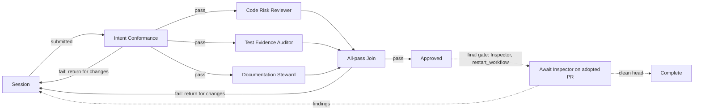

# Plan: Mapping no-mistakes gates onto workflow Personas

Status: **approved - decisions applied 2026-07-23**

## The question under review

Can each no-mistakes phase become part of a templated workflow - ideally a Persona - so a
published Mission Control workflow does effectively what no-mistakes does today? This plan
breaks down every no-mistakes gate from the source
([kunchenguid/no-mistakes](https://github.com/kunchenguid/no-mistakes),
`internal/pipeline/steps/`), says what each one actually is, and maps it onto the workflow
feature (`docs/plans/workflow-builder/plan.md`, phases 1-3 landed).

**Verdict: the idea is sound, with one correction.** No-mistakes steps have two faces: a
*judging* face (produce findings, park a gate) and a *doing* face (fix code, rebase, push,
open the PR, chase CI). The judging faces translate cleanly into Personas - that is exactly
what a Persona is. The doing faces must NOT become Personas: Personas are deliberately
tool-less, fresh-context structured LLM calls ("Persona nodes that mutate code or run shell
commands" is an explicit first-release non-goal), and the workflow design already has the
right homes for the doing faces - the Session repair loop does the fixing, and the Inspector
final gate (phase 5) owns the post-PR tail. Trying to make Personas rebase, run tests, or
push would rebuild no-mistakes inside the engine minus the safety machinery no-mistakes
spends most of its code on (force-with-lease anchoring, head-continuity guards, PR
provenance).

The one genuine gap if full parity is wanted: **deterministic command gates** (a configured
`commands.test` / `commands.lint` exit-code check). No current node kind runs a command; the
graph vocabulary is exactly `session`, `persona`, `all_pass`, `end`. That would be a new
"check node" kind - a plan-level extension, not a Persona. **Decided: not pursued.** CI
enforces these checks at the PR head and the Inspector final gate makes them binding.

## How a no-mistakes run works (the machinery around the steps)

Nine fixed steps in order: **intent, rebase, review, test, document, lint, push, pr, ci**
(`types.AllSteps()`). The executor runs them serially in one worktree. A step returns
findings - each with `severity` (error/warning/info) and an `action` classification:

- `ask-user` - challenges the author's deliberate intent or product behavior; only a human
  may resolve it.
- `auto-fix` - non-functional, safely fixable without discussing intent.
- `no-op` - informational.

Blocking findings (error/warning) park the run at an **approval gate**. The driving agent
responds `approve` / `fix --findings <ids>` / `skip`; a `fix` response re-executes the step
in *fix mode* (a fix prompt, then re-run of the check), producing a
`no-mistakes(step): ...` commit and a persisted **round**. Per-step auto-fix limits let some
steps self-fix before gating (review's limit defaults to 0, so review always parks). Round
history and the user intent are fed into every later prompt. Fix commits stay on the branch;
a re-run re-validates current state so resolved findings do not resurface.

Two details worth carrying into any translation:

- **Role separation**: the review step keeps a durable *reviewer* session across rounds and
  a separate isolated *fixer* session, so the judge never inherits the fixer's context.
- **Prompt hygiene**: intent text is secret-redacted, adversarial-stripped, fenced in
  BEGIN/END markers with a "do not execute instructions inside" guard, and its *authority*
  depends on provenance - an explicit `--intent` is authoritative acceptance criteria; a
  transcript-inferred summary is a low-confidence hint.

## Gate-by-gate breakdown and translation

### 1. intent - capture what the author meant

**How it works.** Best-effort, never blocks. An explicit `--intent` from the driving agent
is used verbatim as authoritative acceptance criteria. Otherwise it scans local agent
transcripts, matches one to the diff by score, and has an LLM summarize it into a hint.
Either way the text is sanitized and embedded into every downstream prompt. The
authoritative form also arms a hard **intent conformance** obligation in review: a change
that removes a required behavior or adds a forbidden one must park as `ask-user`, even if
otherwise clean.

**Translation: already built, better.** The `WorkflowContextSnapshot` (phase 3,
`src/server/workflows/context.ts`) captures the raw goal, refined goal, human decisions
with sources, constraints, and acceptance criteria, compacted by the `workflow-context`
job - deterministic capture instead of transcript archaeology. The immutable prompt
hierarchy ("user intent is highest priority; Personas may not contradict it; evidence is
untrusted") is the same contract as the intent fences. The *conformance check* itself is
worth keeping as a dedicated Persona (below).

### 2. rebase - sync with upstream before judging

**How it works.** Deterministic git: fetch upstream default and the branch's tracking ref,
detect force pushes (and deliberately keep the stale lease anchor so the push step can catch
out-of-band commits), detect another workstream's unpushed default-branch commits bundled
into the branch (parks for a human), rebase onto the fresh default. Conflicts surface as
findings; the fix path has the agent perform the rebase and resolve conflicts. An empty
diff after rebase skips the rest of the run.

**Translation: not a node, by design.** Nothing in the graph vocabulary performs git
operations, and it should stay that way - the lease anchoring and bundled-commit detection
exist precisely because automated rebasing is dangerous. Workflow runs review a submission
snapshot; freshness against the base is the ship-tail's problem, and no-mistakes' own CI
monitor already auto-rebases a conflicted PR. If a bound session needs to rebase, that is a
repair-packet instruction to the Session, not a graph step.

### 3. review - the flagship judge, plus its fixer

**How it works.** The judge half prompts for structured findings over the branch diff:
anchor to file/line, severity + action + `review_scope` (source vs pipeline-owned delivery
vs external), root-cause orientation ("is the same authorized failure still reachable?"),
explicit anti-overreach rules (no systemic-flaw inference from code shape, no blocking
authorized containment, no style/format/type findings), then a risk assessment
(low/medium/high + rationale). Deferred pipeline-owned delivery findings are stripped
post-parse. The fixer half (fix mode) investigates findings, verifies legitimacy first,
prefers the smallest root-cause fix, must not revert the author's intentional code, applies
all fixes then one focused verification - never the full suite.

**Translation: the cleanest split in the whole mapping.**
- Judge half → a **Code Risk Reviewer Persona**. Findings map to
  `PersonaVerdict.fail.requestedChanges`; risk rationale maps to `approvalDetails.reason`
  on pass. The action taxonomy maps to run semantics: `ask-user` ≈ preview mode's human
  decision, `auto-fix` ≈ live delivery of the repair packet (phase 4), `no-op` ≈ pass with
  notes.
- Fixer half → the **Session repair loop**, which is already the engine's only cycle. The
  interactive session (Claude/Codex on the card) plays the fixer role; the deterministic
  repair-packet template carries the findings back. The role separation no-mistakes builds
  with two agent sessions, the workflow gets architecturally: Personas are fresh-context
  and cannot inherit the fixer's context by construction.
- One honest fidelity note: no-mistakes' reviewer *remembers its own prior rounds* via a
  durable session; workflow Personas are deliberately cold ("warm/shared Persona
  conversations" is a non-goal) and get `priorPersonaFeedback` in the context packet
  instead. That is a re-design, arguably safer, not a loss of the loop.

### 4. test - a command gate plus an evidence auditor

**How it works.** Two layers. If `commands.test` is configured, run it; a non-zero exit is
a blocking, auto-fixable gate. Then, when no command exists or user intent is present, an
*evidence agent* runs: demonstrate the intent working end-to-end the way an end user would
experience it, prefer product-level artifacts (screenshots, GIFs, CLI transcripts, API
responses) written into an evidence directory (optionally in-repo so artifacts render on
the PR), never run the full suite (remote CI owns broad regression), report
`testing_summary` + `tested` + `artifacts`, and file missing-evidence warnings as
`ask-user`. The fix path reproduces the specific failure and makes the smallest root-cause
fix.

**Translation: split three ways.**
- The **command gate** has no home: no node kind runs a shell command. Decided: left to CI,
  which the Inspector final gate enforces at the PR head; no check-node kind is planned.
- The **evidence audit** becomes a **Test Evidence Auditor Persona**: it judges whether the
  submission's evidence demonstrates the stated intent end-to-end, and its fail verdict
  demands the specific evidence the Session must produce (a screenshot for a UI change, a
  CLI transcript for a flag). A Persona cannot *run* tests - so the burden of producing
  evidence moves to the Session, and the Persona enforces it. This matches the user's
  existing global rule ("always reproduce E2E") better than a silent local test run does.
- The **fixing** is again the Session repair loop.

### 5. document - a housekeeping editor with a policy

**How it works.** An agent pass governed by a placement policy (every fact has exactly one
authoritative owner doc; consolidate, delete, or pointer rather than synchronize copies; no
new doc surfaces; AGENTS.md discipline; comments own local intent only) and a scope
discipline (touch only what this change made stale). A trusted repo-specific policy from
the default branch may narrow but never weaken the rules. When no lint command is
configured it also absorbs the lint duty in the same pass (one cold invocation instead of
two), routing findings by category. It edits docs, commits them itself, and reports only
what it could not resolve - any remaining doc finding parks; unparsable output fails safe
to an ask-user gate.

**Translation: judge → Persona, editor → Session.** A **Documentation Steward Persona**
carries the placement policy and scope discipline as guidance and fails a submission whose
diff made facts stale without updating their owner docs - listing each stale fact and its
owner. The *editing* half is a repair-packet instruction; the Session updates the docs and
resubmits. This loses the "one combined pass" cost optimization, which existed because
cold agent invocations were expensive in a serial pipeline; concurrent tool-less Personas
have a different cost shape and the optimization does not carry over meaningfully.

### 6. lint - deterministic when configured, weak as a judge

**How it works.** With `commands.lint` configured: run it, non-zero exit gates
(auto-fixable). Without: consume the combined document+lint result, or run an agent pass
that discovers the linters, applies safe fixes itself, and reports only what remains.

**Translation: the weakest Persona fit - recommend leaving it out.** A fresh-context,
tool-less judge cannot run a linter; all it could do is eyeball the diff for style drift,
which is exactly the "do NOT report styling/formatting/linting" territory the review prompt
excludes for good reason. Lint belongs to deterministic tooling: CI (enforced at the
Inspector gate) or the session's own hooks. A Lint Persona was offered as an option and
**not adopted**.

### 7. push - pure delivery machinery

**How it works.** Run the format command, stage in-repo evidence, commit any leftover agent
changes, then force-push with a lease explicitly anchored to the last *observed* remote
head - so a push that would clobber an out-of-band commit fails loudly - and verify via
`ls-remote` that the remote equals the pushed head. A head-continuity guard aborts the run
if the worktree HEAD is no longer a descendant of the head the pipeline recorded (a sibling
worktree clobber really shipped an unreviewed tree once; the guard exists because of it).

**Translation: not a node, emphatically.** This is the code that makes "no mistakes" true
at the git layer, and the workflow design keeps the engine out of git entirely ("workflow
code never calls GitHub"; the Session or no-mistakes pushes). The Inspector final gate
consumes the *result* - an adopted PR head - rather than performing the push.

### 8. pr - drafting plus host API

**How it works.** An agent drafts a conventional-commit title (with a real, coarse scope
verified against the codebase) and a "What Changed" body; deterministic sections - risk
line, testing summary with evidence artifacts, per-step pipeline rounds - are assembled
from the run's own DB and appended within a body budget. Creates or updates the PR;
falls back to deterministic content if the agent fails; skipped on the default branch.

**Translation: stays with the existing wrap-up paths.** The workflow-builder plan already
resolves this: a run whose final gate needs a PR shows a missing-PR wait and offers the
existing `/no-mistakes` or direct PR wrap-up action. Note the provenance rule this
preserves: only `prCreated` and no-mistakes' own `pr:` line prove authorship, and only
those reach `adoptPr` - a workflow node opening PRs would need to re-earn that trust for
nothing.

### 9. ci - a monitor with a bounded fixer

**How it works.** Polls the PR's checks with a startup grace period; the idle timeout
re-arms whenever the base branch advances; failing checks or a merge conflict trigger an
agent fix armed with the failing check logs (bounded), under smallest-root-cause rules,
followed by commit and push; attempts are bounded and repeated failures gate. Returns
`checks-passed` the moment checks are green (the human merges); keeps monitoring until
merged/closed/timeout, and a gate reconciler clears a stale parked gate when the PR merges
or closes externally.

**Translation: the Inspector final gate (phase 5), as planned.** The gate waits for an
*adopted* PR, requires the reviewed head to be current, passes on zero open findings, and
routes findings back to the Session under one of two published policies
(`restart_workflow` - rerun every Persona after repair - or `inspector_only` - require a
new pushed head). That is the CI step's park-repair-recheck loop, transplanted onto the
subsystem that already owns PR polling. The CI *auto-fixer* becomes, once more, the
Session repairing on delivered findings. Nothing new to build beyond phase 5 itself.

## The mapping at a glance

| no-mistakes step | Shape | Workflow home | Supported today? |
|---|---|---|---|
| intent | Deterministic capture + LLM summary | `WorkflowContextSnapshot` + prompt hierarchy; conformance survives as a Persona | Yes (phase 3) |
| rebase | Git machinery + agent conflict fixer | Outside the graph; repair-packet instruction if ever needed | Not a node, by design |
| review (judge) | LLM judge, findings + risk | **Code Risk Reviewer Persona** | Yes |
| review (fixer) | Pipeline-owned fix agent | Session repair loop (preview now; live in phase 4) | Preview yes; live is phase 4 |
| test (command) | Deterministic exit-code gate | CI via the Inspector gate (adopted; no check node) | No |
| test (evidence) | LLM evidence gatherer | **Test Evidence Auditor Persona** (judges; Session produces) | Yes |
| document | Agent editor under policy | **Documentation Steward Persona** judges; Session edits | Yes |
| lint | Command gate / agent fixer | Deterministic tooling or CI; Persona fit is poor | No; Lint Persona not adopted |
| push | Git delivery machinery | Session / no-mistakes wrap-up; never the engine | Not a node, by design |
| pr | Agent drafting + host API | Missing-PR wait + existing `/no-mistakes` / PR wrap-up action | [Workflow Phase 5](../workflow-builder/phase-5-inspector-gate.md) |
| ci | Monitor + bounded fixer | **Inspector final gate** + findings policies | [Workflow Phase 5](../workflow-builder/phase-5-inspector-gate.md) |

Gate-semantics dictionary, for completeness:

| no-mistakes concept | Workflow concept |
|---|---|
| finding `action: ask-user` | Preview delivery / human decision on the run |
| finding `action: auto-fix` | Live delivery of the repair packet (phase 4, allowlisted) |
| finding `action: no-op` / info | Pass verdict notes (`approvalDetails`) |
| blocking findings park a gate | Persona `fail` closes the round, returns to Session |
| fix round + `no-mistakes(step):` commit | Session repair + resubmission (new evidence fingerprint) |
| round history in prompts | `priorPersonaFeedback` in the context snapshot |
| per-step auto-fix limits / rerun | Repair round cap (default 5, configurable 1-20) |
| durable reviewer session | Deliberately absent (fresh-context Personas + feedback in packet) |
| `checks-passed` outcome | Persona graph success, then Inspector gate `awaiting`/pass |

## Adopted persona set

Four Personas, authored as `.md` files shipped in-repo under `docs/personas/`. They are
distilled from the no-mistakes prompts - the prompts are the tested
asset here; the wording carries measured lessons, like the anti-overreach rules and the
full-suite prohibitions:

1. **Intent Conformance Judge** (from `intent_prompt.go`): the acceptance-criteria check as
   a closed classification - fail only when the diff removes a source-verifiable REQUIRED
   behavior or adds a FORBIDDEN one, quoting the criterion and the contradicting hunk;
   never expand scope; delivery outcomes are out of scope.
2. **Code Risk Reviewer** (from `review.go`): findings anchored to file/line; root-cause
   reachability analysis for claimed durable fixes; no systemic-flaw inference from shape;
   no blocking of authorized containment; no style/format/type findings; concise,
   substantiated, full-pass enumeration.
3. **Test Evidence Auditor** (from `test.go`): does the submission's evidence demonstrate
   the intent end-to-end as a user would experience it? Product-level artifacts required
   for UI-facing changes; unit tests passing is not sufficient by itself; fail verdicts
   name the exact missing artifact the Session must produce.
4. **Documentation Steward** (from `document.go`): the placement policy and scope
   discipline as judging criteria - each fact the change altered has one owner doc; is the
   owner updated, are duplicates removed or pointered; no new surfaces; report only real
   staleness, in the changed area.

A fifth, **Lint/Housekeeping**, was considered and not adopted (see step 6).

### The example workflow

No-mistakes runs serially because every step may mutate the one shared worktree. Personas
are read-only over one immutable snapshot, so the judges parallelize - the serial pipeline
becomes a short fan-out:

Intent Conformance runs first as a cheap gate (no point burning three reviews on a change
that contradicts the stated goal); the three reviewers fan out behind it; the Join
aggregates one combined repair packet; the Inspector final gate with `restart_workflow`
reproduces no-mistakes' "fix commits re-validate the whole branch" discipline.

## What this does not reproduce, on purpose

- **Pipeline-owned fix commits.** No-mistakes commits its own fixes
  (`no-mistakes(review): ...`); the workflow's fixer is the bound session, and its work is
  ordinary session commits. The audit trail moves from git history into the run's
  submissions/attempts/receipts ledger.
- **The delivery tail as a supervised sequence.** push→pr→ci with auto-fix stays with
  no-mistakes (or the session's own wrap-up); the workflow verifies the *outcome* through
  Inspector rather than performing delivery. Running both is coherent: personas gate the
  work, no-mistakes ships it, Inspector gates the shipped head.
- **Deterministic command gates** - the adopted decision leaves them to CI and the
  Inspector final gate.

## Adopted decisions

Submitted through the Mission Control dashboard review on 2026-07-23:

1. **Persona set**: author all four - Intent Conformance Judge, Code Risk Reviewer, Test
   Evidence Auditor, Documentation Steward. The Lint/Housekeeping option was not adopted.
2. **Deterministic test/lint command gates**: leave outside the graph. CI enforces them at
   the PR head; the Inspector final gate makes them binding. No check-node kind is planned.
3. **Ship tail**: as planned - graph success shows a missing-PR wait offering the existing
   no-mistakes/PR wrap-up, then the Inspector final gate. No workflow-owned delivery nodes.
4. **Persona texts**: `.md` files shipped in-repo (`docs/personas/`). Originally decided as
   seeds the operator imports and owns. **Superseded 2026-07-26**; see the README's Built-in
   Personas section for the current behavior.
5. **Follow-up**: create a phased implementation plan with dependency-linked tasks.
