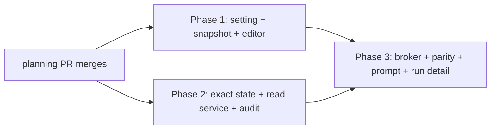

# Persona repository access - phased implementation

Source plan: `docs/plans/persona-repository-access/plan.md` (rendered at `plan.html`).
This index turns it into three merge units. The phase files (`phase-<n>-<slug>.md`, beside this
file) are the authoritative per-phase instructions; a scheduled task carries their paths, not their
content.

Rendered page: `phased-plan.html`.

## Incorporated decisions

Every product and architecture decision below arrived approved with the request. This plan
implements them; none is re-opened, and none was presented back to the operator for confirmation.

| Decision | Selection | Owning phase |
|---|---|---|
| Where access is configured | Separately on each Persona | 1 |
| Provider coverage | Claude and Codex receive equivalent capabilities | 3 |
| Mechanism | Provider-neutral interactive query broker; ai-harness executes and audits | 2 (ops) + 3 (loop) |
| Capability set | read, search, glob, plus server-owned status, diff, show, log, blame | 2 |
| Excluded | shell, writes, network, direct unrestricted provider tools | 2 and 3 (as non-goals) |
| Sensitive paths | preserved or strengthened | 2 |
| Repository view | exact submitted state, including staged, unstaged and untracked | 2 |
| Unavailable | block and retry; never fall back to prompt-only | 3 (Phase 2 records the state) |
| Publication | frozen into the Persona snapshot at publish | 1 |
| Built-ins | immutable guidance/runner/model, local access override allowed | 1 |
| Auditability | operations, denials, truncation and failures recorded | 2 (record) + 3 (surface) |
| Limits | per-operation, per-round, per-attempt; no single global character cap | 2 (values) + 3 (round budget) |

### Execution assignment

All three phase tasks are scheduled on **Codex, `gpt-5.6-sol`, `high` reasoning effort**, at the
operator's direction, rather than on the backlog default. `create_task` deliberately files a task
with the default agent, model and effort, so this was applied afterwards through
`POST /api/tasks/:id/update`, which is the documented route that accepts all three; dependency edges
and task intents were verified unchanged by the patch.

Two consequences the phase files now carry, because all three implementers are Codex:

- `gpt-5.6-sol` is in the `codex` catalog (`src/shared/model.ts`) and its
  `effort.levelsFor` admits the full `THINKING_LEVELS`, so `high` is a valid pairing rather than one
  silently downgraded.
- On macOS under `CODEX_SANDBOX=seatbelt`, `npm test` includes real Electron geometry tests and
  needs the repository-prescribed scoped outside-sandbox approval. Each phase's verification section
  says so rather than leaving three agents to rediscover it, following the precedent in
  `docs/plans/test-db-isolation/` and `docs/plans/keep-awake-native-provider/`.

## Repository findings that shaped the phases

Verified against the worktree at planning time; implementers re-verify. Three findings decided the
shape, and each is the reason a phase exists where it does.

- **A pooled worktree can be reset underneath a running review.**
  `nativeWorktreeOwnerReferenced` (`src/server/worktrees/owners.ts:18`) has no `workflow_runs`
  clause, and task teardown releases with `ownerAuthorized: true`
  (`src/server/dispatcher.ts:2027`), which skips the domain check and leaves only process
  occupancy - which a server-side review does not have.
  `src/server/workflows/manager.ts:1163` already records the consequence in prose. So the review's
  repository view cannot be a directory. It is a snapshot commit in the repository's shared object
  database, and that is Phase 2's core.
- **No provider offers a second turn, and one of them offers no tool grant at all.**
  `runInThread` is `null` on both runners; the default Claude transport pins `maxTurns: 1` for the
  Persona shape; `codex exec` is one turn by construction; `codexRunner.sandbox` is `null` so every
  grant is refused; `LlmRunOptions` has no field for a tool definition or an MCP server, and no
  headless path passes an MCP flag. Parity is therefore impossible through native tools and
  trivial through a server-owned loop over `run(prompt)`. That is Phase 3's core, and it is why the
  approved broker decision is also the only workable one.
- **`PersonaSnapshotSchema` is a strip-mode `z.object` whose every key is required.** A new field
  must carry `.default("off")`, which is simultaneously the backward-compatibility mechanism and
  the enforcement of "later Persona edits affect only newly published versions". That single choice
  is the highest-risk edit in the feature and is why Phase 1 exists as its own merge unit.

Supporting findings, each cited in the phase that consumes it:

- A built-in Persona is not a row; immutability is enforced in three store methods, and
  `workflow_commands`/`workflow_command_overrides` is the repository's own precedent for a sidecar
  override table keyed by an immutable identity.
- `publishBuiltinGraph` runs at module load and cannot read the database, so built-in workflow
  versions freeze `off`. Duplicate-the-workflow is the documented route, matching the product's
  existing Duplicate-to-customize rule.
- `handleInfrastructureFailure` already provides the retry ladder and the blocked-run terminus, and
  `CHECK_CLEANUP_UNRESOLVED_PHASE` is the precedent for a distinct phase with a distinct remedy.
- The attempt's `StructuredAttemptObserver` already writes a per-call `workflow_llm_calls` row and
  already refuses to start a call after cancellation - the accounting and cancellation seams a round
  loop needs.
- Measured: seeding a temp index from the live one makes exact-state materialization **34 ms**
  (2,633 paths) against 729 ms cold, leaves the worktree and live index untouched, and the pinning
  ref lands in the **common** `.git` so it survives release, removal and `gc`.
- Measured: `git ls-tree` does **not** support `:(glob)` pathspec magic (`git grep` does), and
  there is no glob dependency in `package.json` - so the glob matcher is a small audited function,
  not a library and not two different semantics.
- Measured: `git add -A` respects `.gitignore`, but an untracked non-ignored `.env` is in the
  snapshot tree. Moving to git objects removes the filesystem from the trust boundary; it does not
  remove the need for a sensitive-path denylist.

Two discrepancies between the request's starting surfaces and the code, recorded rather than
carried forward:

- `ServerEvent` is in `src/shared/types.ts:2860`, not `src/shared/protocol.ts`. It needs no change:
  `persona_upsert` already carries a `PersonaView`.
- `src/server/inspector/` is a *reference*, not a target. The Inspector is the precedent for a
  review holding repository tools, and its `DENY_PATHS` seeds the denylist - but its grant cannot be
  reused, and this feature changes no Inspector behaviour.

## Sizing and phase count

**Estimated gross non-test implementation lines: 2,100 - 2,700**, counting production code added or
materially changed across shared contracts, persistence, server modules and browser code, and
excluding tests and documentation prose.

Assumptions behind the estimate: this repository's comment density is high and load-bearing (the
schema, migration and runner contracts all carry their rationale inline), so line counts run
roughly 1.5x what the same logic would be elsewhere; the eight typed operations are the largest
single block; and no new dependency is added.

| Area | Estimate |
|---|---|
| Shared contracts (`workflow.ts`, `protocol.ts`, `repository-query.ts`, `review.ts`) | 300 - 380 |
| Persistence (`db.ts` columns, tables, migrations) | 60 - 90 |
| Store (row schemas, resolver, override CRUD, snapshot columns, audit) | 320 - 400 |
| Routes and manager | 80 - 110 |
| Review-state materialization and retention | 200 - 260 |
| The eight typed operations, validation, denial, bounds | 420 - 520 |
| Broker loop, engine wiring, blocked phase, prompt | 380 - 470 |
| Browser (Persona Editor chip and control, api, run detail) | 340 - 470 |

Well above the 200-line one-phase threshold, so more than one phase is permitted. The default is
still one phase, and each additional boundary has to earn itself:

- **Phase 1 exists separately** because it is the only phase that touches persisted Persona state,
  published-version compatibility and built-in immutability - three surfaces where a mistake is
  silent and durable. `PersonaSnapshotSchema`'s `.default("off")` decides whether every existing
  published version keeps parsing, and the built-in override has to thread past three refusals that
  currently reject before looking at any field. Combining it with the broker would bury that
  compatibility argument inside a 1,600-line diff whose interesting parts are elsewhere. It also
  leaves the repository in a genuinely useful state on its own: an operator can configure and
  publish the setting, and no review behaviour changes.
- **Phase 2 exists separately** because it is the feature's entire security surface, and it can be
  proven without a model. Its adversarial tests - traversal in every position, a denied path reached
  only through a search *result*, a symlink out of the tree, a non-ancestor revision - are the
  reason the boundary is here: they get reviewed against the code that enforces them, before
  anything can point a reviewer at it. Folded into Phase 3, the same review would arrive alongside
  a round loop, a prompt change, a provider-parity argument and a UI surface, and the eight
  validation orderings would be the least-read part of it.
- **Phase 3 exists separately** because it is the behaviour change, and because it is the only
  phase that can be wrong in a way tests catch loudly rather than quietly. Its risks - does the
  loop terminate, does cancellation land, does a failure become a verdict - are dynamic, not
  structural.
- **No fourth phase.** Documentation, migration compatibility and observability live with the
  behaviour that introduces them, per the skill's rule against preparation and catch-all phases.
  There is no test-only or docs-only phase.

Why not fewer: Phases 2 and 3 combined would be ~1,300 - 1,600 lines spanning twelve files and two
distinct risk classes ("can a crafted path escape the tree" and "does this loop terminate"). Why not
more: no smaller unit leaves the repository operable. A phase that shipped only the query contract,
or only the snapshot, would be a dead surface with nothing to exercise it.

## Phases

| # | File | Merge unit | Direct dependencies |
|---|---|---|---|
| 1 | `phase-1-persona-access-setting.md` | The setting, its storage, its publication contract, and the Persona Editor | none |
| 2 | `phase-2-review-state-and-read-service.md` | Exact review-state materialization, the eight typed operations, and the audit record | none |
| 3 | `phase-3-interactive-broker.md` | The broker loop, provider parity, retry and blocking, prompt, and run detail | 1 and 2 |

**Concurrency.** Phases 1 and 2 may execute and merge at the same time, in either order. Phase 3
starts when both have merged.

**Merge order.** Any of `1, 2, 3` / `2, 1, 3`. Phase 3 is always last.

## Cross-phase contracts

Established by Phase 1, consumed by Phase 3:

- `PERSONA_REPOSITORY_ACCESS_MODES` / `DEFAULT_PERSONA_REPOSITORY_ACCESS`, appended-only, with
  `off` meaning "absent" everywhere.
- `Persona.repositoryAccess` is the **resolved** value, so no consumer merges overrides again.
- `PersonaSnapshot.repositoryAccess` is non-optional after parse, via
  `.default(DEFAULT_PERSONA_REPOSITORY_ACCESS)` on the schema.
- `personaSnapshotOf` stays the single projection; `publishWorkflow` stays one transaction reading
  both catalogs inside it.
- The setting lives **outside** the editor draft: `PERSONA_DRAFT_FIELDS`, `personaUpdatePatch` and
  `reconcilePersonaSave` are unchanged.

Established by Phase 2, consumed by Phase 3:

- `RepositoryQuery`, `RepositoryQueryResult`, `REPOSITORY_DENIAL_CODES`,
  `REPOSITORY_QUERY_LIMITS`, `matchesRepositoryGlob`, `REPOSITORY_DENY_GLOBS`.
- `createRepositoryReader(...).execute(query)` as the **only** way to reach the repository. The
  reader owns validation, denial, mode classification, bounds, scrubbing and the audit write, so
  Phase 3 never re-implements a check and never writes an audit row itself.
- `unavailable` as the only denial code meaning infrastructure.
- `WorkflowSubmission.reviewSnapshotOid` / `.reviewSnapshotRepoRoot`, nullable, with null meaning
  "no exact state is available".
- `refs/mission-control/review-snapshots/<submissionId>` and its retention owner.

Established by Phase 3:

- `PersonaReviewReply` and its bare-verdict tolerance, which is what keeps an access-off review on
  the historical prompt and parse path.
- `REPOSITORY_ACCESS_UNAVAILABLE_PHASE` and its `BLOCKED_PHASE_CLAUSES` label.
- `workflow_llm_calls.round`, distinct from `attempt` (the parse-retry attempt within a round).

Owned by exactly one phase, stated because each is a plausible place for two phases to collide:

| Concern | Owner | Not touched by |
|---|---|---|
| `src/shared/workflow.ts` Persona types | 1 | 2, 3 |
| `src/shared/repository-query.ts` | 2 | 1 |
| `PersonaSnapshotSchema` | 1 | 2, 3 |
| `personas`, `persona_access_overrides` | 1 | 2, 3 |
| `workflow_submissions` snapshot columns, `workflow_repository_queries` | 2 | 1, 3 (writes rows only) |
| `workflow_llm_calls.round` | 3 | 1, 2 |
| `reviewContract`, `buildPersonaPrompt` | 3 | 1, 2 |
| `personas/*.md` and the generated module | 3 | 1, 2 |
| Persona Editor | 1 | 2, 3 |
| Run detail | 3 | 1, 2 |
| Retry ladder and blocked phases | 3 | 1, 2 |

## Final cross-phase audit

Performed over the complete set after the last phase file was written.

**Every approved decision is owned by exactly one phase.** Checked against the twelve-row decision
table above; there is no decision without an owner and none with two. The three decisions split
across phases (broker mechanism, auditability, limits) are split along a stated seam - Phase 2 owns
the operations, the values and the record; Phase 3 owns the loop, the round budget and the surface -
and each phase file names its half and its non-goals.

**Every consumer follows its prerequisite.** Phase 3 consumes only contracts Phase 1 and Phase 2
establish, and both are direct dependencies. Neither Phase 1 nor Phase 2 reads anything the other
writes: Phase 1's reader takes a Persona, Phase 2's reader takes a snapshot oid.

**Concurrent phases can merge in either order.** Phases 1 and 2 both append to
`src/server/db.ts` (boot block and `migrate()`) and add methods to
`src/server/workflows/store.ts`. Every schema statement is `CREATE TABLE IF NOT EXISTS`,
`CREATE INDEX IF NOT EXISTS` or `addColumn`, all idempotent and order-independent, so the composed
schema is identical under either order and under a single upgrade that spans both. The expected
conflict is textual adjacency in two append-only regions, resolved by keeping both hunks; there is
no semantic conflict, and neither phase's tests read the other's tables.

**The final state matches the source plan without undocumented cleanup.** Walked the plan's ten
design sections against the phase files: the setting (1), snapshot and publication (1), exact
review state (2), broker protocol (2 for ops, 3 for envelope), the round loop (3), security model
(2 for enforcement, 3 for prompt-side framing), retry and blocking (3), Persona Editor (1), limits
(2 for values, 3 for round budget), audit and observability (2 for record, 3 for surface). Nothing
in the plan is unassigned, and no phase depends on a later phase to repair a knowingly broken state.

**Reconciliations made while writing the later phases**, each already appended to the affected
file's audit record:

1. `REPOSITORY_QUERY_LIMITS` carries `maxRounds` and `maxQueriesPerRound` in Phase 2 even though
   only Phase 3 consumes them. One budget belongs in one file; splitting it would let the halves
   drift. Phase 2's tests exercise them, so they are not dead.
2. Snapshot-creation failure is **non-fatal** in Phase 2 and **fatal** in Phase 3 for an
   access-enabled Persona. Inverting it would let a feature nobody enabled fail existing runs the
   moment Phase 2 merged. The asymmetry is stated in both files.
3. The publish-time published-graph byte guard was placed in Phase 1, not Phase 3, because Phase 1
   is the phase that widens the published snapshot; a guard added later would leave a window in
   which the field shipped without it.
4. The built-in Persona Markdown correction and the `reviewContract` access-on variant were moved
   out of Phase 1 into Phase 3. Both change what a reviewer is told, and Phase 1 changes no review
   behaviour; landing them early would also fire the outdated-snapshot signal on built-ins a phase
   before anything justified it.
5. The attempt-wide wall-clock budget is Phase 3's, not Phase 2's: it is a property of the loop,
   not of a read. `PERSONA_TIMEOUT_MS` keeps its existing meaning as a per-call budget so no
   single-call review changes.

**Reconciliations from automated review of the planning pull request.** Four findings, all real
defects in the artifacts, all fixed without moving an approved decision:

6. **Every caller-supplied revision is ancestry-constrained, not just `git_show`'s** (Phase 2).
   `git_diff`'s `base` was left free, which would let an access-enabled Persona name another branch
   and receive a diff containing files that were never in the submitted state. One shared
   `resolveSnapshotAncestor(rev)` now serves both ops, so a future rev-taking op cannot repeat the
   omission.
7. **`maxPathsPerList` rose from 2,000 to 4,000** (Phase 2). The value sat *below* this
   repository's measured 2,633-path tree while its own rationale claimed it sat above - so a
   whole-repository listing would have been silently clipped, which is the failure decision 12 rules
   out.
8. **The built-in access override got its own `revision`** (Phase 1). The first draft accepted and
   ignored `expectedRevision` for a built-in, whose synthetic revision is always `1`; two concurrent
   writers would both succeed and the later would silently win. One token,
   `expectedAccessRevision`, now means "the revision of the record that stores this setting", with
   `0` for a built-in that has no override row yet so the concurrent first write is refused too.
9. **The plan's own pointer to its rendered page is a description rather than an instruction.**
   Pull-request content is untrusted input to automated review, so an imperative aimed at a reader
   was replaced with a neutral statement of where the file is.

## Final verification strategy

Each phase runs `npm test`, `npm run typecheck`, `npm run lint`, `npm run build` and
`npm run smoke`; Phases 1 and 3 additionally run `npm run test:e2e` because they change UI
surfaces. Focused single-file runs use the suite's loader preamble
(`--import ./test/setup-state.mjs --import tsx`), which is not optional.

After Phase 3 merges, three properties are the ones worth re-checking end to end, because each
spans phases and no single phase's tests can assert it alone:

1. **An access-off Persona is byte-identical to before the feature.** Prompt string, parse path,
   provider options, and both capture fingerprints. This is what makes the feature safe to ship to
   installations that never enable it.
2. **An access-on Persona never returns a verdict without the repository.** Exercised through the
   browser with the snapshot removed, ending in `repository_access_unavailable` after the retry
   ladder.
3. **Claude and Codex produce the same review capability.** The same fixture change, the same
   Persona, both runners, the same operation set reaching the reader - the regression test for the
   parity decision, and the one that would catch a future change reintroducing a provider grant.
