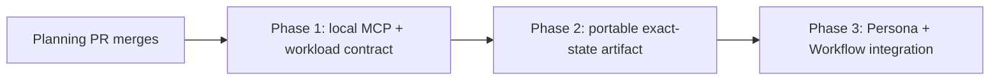

# Persona repository access - phased implementation

Source plan: `docs/plans/persona-repository-access/plan.md`
Rendered source: `docs/plans/persona-repository-access/plan.html`
Rendered phase index: `docs/plans/persona-repository-access/phased-plan.html`

This plan operationalizes the approved design in three independently reviewable merge units. The detailed phase files beside this index are the implementation guides. The Mission Control tasks point to those files instead of copying their steps into task prompts.

## Approval and supersession

The operator approved the local repository MCP interpretation during plan refinement and explicitly requested phased scheduling. The approved execution model is:

- one isolated Persona workload and one provider session per attempt;
- a local stdio repository MCP server inside that workload;
- a portable immutable artifact representing the exact submitted checkout;
- repository response bodies retained inside the workload;
- ordered lifecycle and safe audit metadata returned to Mission Control;
- a local executor that implements the same versioned request and event contracts a future remote adapter will use.

This document supersedes the three-phase design merged in planning PR #770. That design used a daemon-side read service and a repeated broker loop, including an explicit prohibition on MCP wiring. Its three implementation tasks were cancelled before any implementation landed:

- `5eb53a83-9a98-4540-82c4-9e4ae1b2cfc9`
- `5fa53554-6b5c-4d14-97a8-2985ca801ea9`
- `184ab8c9-4d34-4ae9-b628-bb15069b0879`

No phase may revive or consume those task contracts. The files in this planning change replace the old `phased-plan.md` and all old phase files at the same repository paths or remove them when their names no longer apply.

## Repository investigation

The plan was rechecked again on 2026-09-04 against `origin/main` at `3459720f` (`v1.7.1`). No Persona repository-access implementation exists. The local-MCP architecture and three serial phases remain valid, with the current-state amendments below controlling implementation.

### Contracts that remain current

- `src/shared/workflow.ts` owns `Persona`, `PersonaView`, `PersonaSnapshot`, `personaSnapshotOf`, snapshot freshness, `WorkflowSubmission`, `WorkflowNodeAttempt`, and `WorkflowRunDetail`.
- `src/shared/protocol.ts` owns strict browser-safe request and persisted JSON schemas. `PersonaSnapshotSchema` currently requires every field, so the additive repository-access field needs a read-time default for historical graphs.
- `src/server/db.ts` creates tables before `migrate()`. Any index that names a new column must be created beside its `addColumn` migration, not in the initial boot block alone.
- Built-in Personas are generated application data, not rows in `personas`. `PersonaManager` and `WorkflowStore` reject ordinary update and archive operations for them.
- `WorkflowStore.publishWorkflow` currently reuses a version by `(workflow_id, source_draft_revision)` before it projects the resolved Persona catalog. Publication must compare a canonical resolved graph fingerprint as well.
- `captureStableWorkflowContext` is the existing stable checkout boundary. It samples repository identity and status around evidence capture and is the correct place to prepare an exact-state candidate, but not to create its durable claim.
- Workflow submission capture now resolves `workflowCheckoutPath` per repository run. Repository artifacts must seal that resolved checkout and retain one claim per submission/run.
- `WorkflowManager.captureAndActivate` validates external artifact expectations before raw-context persistence, freezes reserved evidence, captures daemon-owned image/text artifacts, compacts context, and applies evidence-readiness policy before activation. Repository candidates must be discarded on guard failure and promoted only after those gates pass.
- `computeSessionDiff` is prompt evidence with a 1.2 MB patch cap and bounded untracked rendering. Its base semantics are reusable, but its output cannot serve repository-wide access.
- `src/server/git/ensemble-snapshot.ts` proves the private-index and private-ref pattern, while collapsing the index and working tree into one commit. Repository review must keep HEAD, index, and worktree layers distinct.
- `WorkflowEngine.runAttempt` currently makes one fresh tool-less `LlmRunner.run` call. `handleInfrastructureFailure` already owns retry scheduling and the final `infrastructure_error` block.
- `LlmRunOptions` has no launch-scoped MCP descriptor. The general headless runner must remain tool-less. Full Claude and Codex session adapters already show how to register launch-scoped MCP servers.
- Claude's Agent SDK accepts `mcpServers`; Codex's full SDK launch composes `mcp_servers.*` overrides. The dedicated Persona workload adapters must reuse these patterns without adopting interactive session ownership.
- The shipped Mission MCP bundle contains mutating Mission Control tools and bearer credentials. The repository MCP must be a separate bundle with no Mission Control token, HTTP client, or task tools.
- Inspector's `DENY_PATHS` and `scrubSecrets` are useful precedents, but its provider-side tool grant is Claude-only. The repository policy must move below both providers into the MCP and artifact boundary.
- `WorkflowRunDetail` already pages events and LLM calls. Repository query audits need their own bounded page or summary rather than being folded into the compact SSE run summary.
- Workflow retention and startup reconciliation already run under `WorkflowManager`. Repository artifact cleanup belongs in that daemon-owned lifecycle and must keep SQLite writes in the daemon.
- `PersonaEditor` treats all built-in fields as read-only and short-circuits save. Repository access therefore needs a dedicated mutation path and control instead of weakening the general built-in edit guard. Imported and plugin-managed Personas now carry provenance; reimport and synchronization must preserve operator-owned repository access.
- Evidence currently has eight stable kinds with a uniform quote/path/line schema. The metadata-only repository handle must be an appended discriminated-union branch while the existing eight branches retain their exact identifiers and wire shapes.
- Browser-visible changes require a built-dashboard Playwright spec, accessible selectors, and fake Claude and Codex providers.

### Discrepancies resolved during phasing and revalidation

The approved plan requires both Git history and omission of sensitive blob contents from the portable artifact. A normal Git bundle cannot satisfy both because reachable commits and trees pull every referenced blob into the bundle.

The implementation will use a versioned sparse Git object artifact instead of a normal bundle:

1. Preserve original commit and tree objects, exact HEAD, base, index tree, and worktree tree identifiers.
2. Apply the shared `RepositoryHistoryPolicyV1`: breadth-first all-parent traversal from captured HEAD, stop before exceeding 2,048 retained commits or 512 MiB of incremental unique allowed historical blobs, and record the exact retained prefix/frontier in the digested manifest.
3. Deliberately omit blobs classified as sensitive while retaining their path classification and object id in the canonical manifest.
4. Materialize an object database and allowed worktree view in an isolated workload. Git operations are always pre-scoped to validated allowed literal paths, with external diff, text conversion, filters, hooks, and network disabled.
5. Derive status from the captured manifest. Never run an unrestricted diff or show and filter its output afterwards.

This preserves original Git identities for log, show, and blame on an explicit bounded range while ensuring a provider process cannot recover secret-bearing blob bodies from the artifact. Revisions outside the retained manifest set are denied as `revision_out_of_range`. For a retained commit, `git_show` patch mode compares a true root with the empty tree, compares a non-root only when its recorded first parent is retained, and otherwise returns `history_boundary` with no patch. Frontier log/blame results carry explicit truncation without consulting the original checkout. Phase 1 proves that the MCP operates safely over a sparse object database and establishes the history policy; Phase 2 owns producing and validating that exact artifact set.

The current capture pipeline adds a second ordering constraint. Phase 2 must expose a private candidate lifecycle with explicit prepare, promote, and discard operations. Phase 3 prepares the candidate within stable capture, then preserves external artifact validation and reserved-evidence capture. It promotes the digest and submission claim only after those gates pass and before raw context persistence. A repository artifact is capability input and never satisfies criterion-mapped evidence readiness.

## Sizing and phase count

Estimated gross non-test implementation: **4,800-6,200 lines**, excluding tests and documentation prose.

| Area | Estimated production LOC |
| --- | ---: |
| Shared access, query, workload, event, and evidence contracts | 450-600 |
| Repository MCP operations, cursors, policy, bounds, and local audit emission | 950-1,200 |
| Claude/Codex workload adapters, supervisor, and local executor | 550-750 |
| Exact-state capture, sparse artifact packaging, materialization, and verification | 1,150-1,450 |
| Artifact persistence, claims, cleanup, and startup reconciliation | 350-500 |
| Persona storage, built-in override, snapshot, and publication identity | 400-550 |
| Workflow workload/event/audit persistence and engine integration | 550-750 |
| Persona Editor, version history, run detail, routes, logs, and status projection | 400-500 |

Assumptions:

- The eight operations share validation and output pipelines rather than implementing eight independent security stacks.
- No remote scheduler, artifact upload service, cloud identity, or WebSocket gateway is implemented.
- The repository's required explanatory comments are included in gross production LOC.
- Tests are substantial but excluded from the estimate as requested.

Three phases are the fewest safe split:

- **Phase 1 is separate** because provider/MCP feasibility is load-bearing. It must prove one Claude session and one Codex session can each make multiple calls to the same local MCP server, receive identical capabilities, and return a structured verdict with direct tools disabled. Combining this with artifact capture would create a 3,000-plus-line review spanning provider behavior, process control, path security, Git semantics, and packaging before the core mechanism was known to work.
- **Phase 2 is separate** because exact dirty-state capture and sensitive-blob omission form one high-risk Git and lifecycle boundary. It can be proved through artifact round trips, mutation races, deletion, restart, and cleanup without involving Persona publication or the Workflow retry state machine. Combining it with Phase 3 would bury the data-integrity and deletion guarantees inside the user-facing integration diff.
- **Phase 3 is the vertical slice** that exposes the setting and activates the foundation. Persona persistence, publication, stable capture, workload dispatch, retries, audit display, docs, and browser behavior belong together so no merged phase presents a capability that silently does nothing.
- **No fourth phase** is justified. Documentation, observability, migrations, and browser coverage stay with the behavior they describe. There is no test-only, cleanup-only, or UI-only tail.

## Phase map

| # | Phase | Detailed file | Direct dependency | Estimate |
| --- | --- | --- | --- | ---: |
| 1 | Repository MCP and workload execution foundation | `phase-1-repository-mcp-workload-foundation.md` | none | 1,950-2,550 LOC |
| 2 | Portable exact-state artifact and lifecycle | `phase-2-portable-exact-state-artifact.md` | Phase 1 | 1,350-1,750 LOC |
| 3 | Persona and Workflow integration | `phase-3-persona-workflow-integration.md` | Phase 2 | 1,500-1,900 LOC |



### Dependency edges

- Phase 1 depends only on this planning session.
- Phase 2 depends directly on Phase 1 and this planning session.
- Phase 3 depends directly on Phase 2 and this planning session. Phase 1 is transitive and must not be duplicated as a direct task edge.

### Concurrency and merge order

There is no safe implementation concurrency between these three phases. Phase 2 consumes the sparse repository-view, policy, and MCP contracts from Phase 1. Phase 3 consumes both the workload foundation and the artifact owner through Phase 2. The required merge order is `1 -> 2 -> 3`.

Independent review work inside a phase may run in parallel, but each phase is one implementation task and one pull request.

## Cross-phase contracts

### Established by Phase 1, consumed by Phases 2 and 3

- `src/shared/repository-access.ts` is the browser-safe source for append-only access modes, operation ids, input/output envelopes, denial and failure codes, cursor metadata, budgets, workload requests, ordered workload events, cancellation generations, terminal results, repository-evidence protocol capability, safe query audit metadata, and opaque metadata-only repository evidence handles with a line/byte/diff range discriminator.
- The MCP operation set is closed: `read`, `search`, `glob`, `git_status`, `git_diff`, `git_show`, `git_log`, and `git_blame`.
- `RepositoryHistoryPolicyV1` fixes the retained range at a deterministic all-parent breadth-first prefix capped before 2,048 commits or 512 MiB of incremental unique allowed historical blobs. Descriptor membership, not generic reachability, controls history queries; boundary and out-of-range results are typed and auditable.
- `RepositoryViewDescriptor` names a verified manifest and sparse object/materialized view, including the immutable retained-revision/frontier fields. It never names the original checkout.
- Path policy and secret scrubbing are shared pure modules. The MCP applies them for both providers; provider prompts do not enforce access.
- `PersonaWorkloadExecutor` accepts a versioned request and supports dispatch, ordered event replay after a sequence, cancellation by generation, and reconciliation by workload id.
- `LocalPersonaWorkloadExecutor` uses injected artifact materialization and event persistence boundaries. Its trusted supervisor binds submission, workload, Workflow attempt, locator, and digest identity before materialization. Phase 2 supplies the artifact implementation; Phase 3 supplies durable ingestion.
- Repository bodies travel only between the provider and local MCP. Workload events carry safe query/evidence-handle metadata and the final verdict, never response bodies, evidence excerpts, or quote fields.
- The separate repository MCP bundle has no Mission Control credentials or HTTP client and is included in build and smoke verification.

### Established by Phase 2, consumed by Phase 3

- `WorkflowRepositoryArtifact` is digest-owned and identified by artifact format version, canonical manifest digest, opaque locator, captured base/HEAD/index/worktree identities, repository/history policy versions, retained-revision/frontier metadata, byte counts, state, and cleanup state. `WorkflowRepositorySnapshotClaim` gives each submission an independent durable claim on that digest.
- `WorkflowRepositoryArtifactService.prepare`, `promote`, `discard`, `materialize`, `verify`, `release`, and `reconcile` are the only repository artifact lifecycle entry points. Preparation creates no durable claim; promotion is the only operation that may create one. Materialization accepts only an active-request-bound request and revalidates the submission's ready digest/locator claim before filesystem access.
- The artifact contains original commit/tree identities and all allowed blobs for the exact policy-retained revision prefix, but no sensitive blob bodies. Denied entries remain visible only as classified metadata; source-base objects outside the prefix remain diff-only.
- Capture candidates use a dedicated namespace under Mission Control state, never the repository worktree or common Git directory as durable storage.
- Each pending candidate publishes an atomic daemon-owned marker before artifact bytes. Startup removes only immediate contained candidates whose marker identity and root kind agree; malformed or unowned entries are quarantined/reported, and periodic cleanup preserves candidates in the live in-memory registry.
- A digest-level database row owns every durable artifact and per-submission claim rows own references to it. Claim release and zero-claim cleanup enqueue happen atomically; deletion rechecks that no active claim remains before removing bytes. Startup reconciliation deletes only zero-claim paths whose digest ownership is proven.
- Historical submissions without an artifact claim row remain valid prompt-only submissions. An access-enabled Phase 3 attempt requires an active claim joined to a ready artifact and never reconstructs from a live checkout.

### Established by Phase 3

- `Persona.repositoryAccess` is the resolved value. Built-in override merging happens only in the Persona store/manager.
- `PersonaSnapshot.repositoryAccess` is non-optional after parse because the schema defaults missing historical values to `none`.
- Publication identity is `(workflow_id, source_draft_revision, source_snapshot_fingerprint)` over canonical resolved graph JSON.
- A repository-enabled attempt owns exactly one durable workload id and one current cancellation generation.
- Repository capture binds to the specific per-repository run checkout. External-artifact validation and reserved submission evidence complete before candidate promotion and raw-context persistence.
- The `repository` evidence kind is appended as a metadata-only discriminated-union branch. Existing evidence kinds keep their current identifiers and wire shapes, repository handle metadata preserves exact line, byte, or diff ranges, and repository capability artifacts do not contribute to evidence-readiness coverage.
- New imported Personas default to `none`; reimport and plugin synchronization preserve the operator-owned access value.
- Workload event ingestion is append-only and idempotent by `(workload_id, sequence)`. Conflicting duplicates or gaps are infrastructure failures.
- Query audit and evidence-handle persistence stores metadata only and is paged independently from Workflow events and LLM calls.
- Evidence references to repository content contain only `operationId` plus opaque `evidenceHandleId`. The engine resolves daemon-owned same-attempt returned-item/path and discriminated line/byte/diff range metadata before accepting the verdict and rejects quote, excerpt, and free-form path/range fields.
- Read-enabled dispatch requires matching repository-evidence protocol capability from daemon, executor, and verdict parser. Mixed versions fail before provider launch or durable verdict write; application rollback restores the verified pre-migration database recovery point after repository citations exist.
- `none` access preserves the historical prompt, provider call, fingerprint, and verdict path byte for byte.

## Ownership matrix

| Concern | Owner phase | Later consumers must not |
| --- | --- | --- |
| Shared repository/MCP/workload schemas | 1 | introduce provider-specific variants or open string unions |
| Repository path and content policy | 1 | repeat denial checks in the engine or UI |
| Repository MCP bundle and operations | 1 | add Mission tools, credentials, shell, writes, or network |
| Provider workload adapters and local executor | 1 | widen general `LlmRunner` or bind interactive sessions |
| Artifact format and exact layer capture | 2 | reconstruct from a current checkout or prompt diff |
| Artifact persistence, claims, cleanup, and reconciliation | 2 | delete files without a durable digest owner, atomically released claims, and a rechecked zero-claim state |
| Persona setting and built-in override | 3 | mutate built-in guidance, runner, or model |
| Publication fingerprint | 3 | rewrite historical version JSON or reuse a mismatched graph |
| Workflow dispatch, retries, event ingestion, and verdict validation | 3 | treat WebSocket/SSE connection state as durable ownership |
| Audit routes, run detail, Persona Editor, E2E, and operator docs | 3 | expose repository bodies or rely on compact SSE summaries |

## Cross-phase compatibility audit

### Audit after Phase 1 design

- Kept the repository MCP separate from Mission MCP so its process cannot inherit task tools or bearer credentials.
- Kept the general `LlmRunner` unchanged so existing Foreman, Inspector, ensemble, title, and Workflow calls do not inherit MCP capability.
- Put query, policy, workload, event, audit, and metadata-only evidence-handle envelopes in one browser-safe module so provider adapters, the MCP, daemon ingestion, and UI cannot drift.
- Made provider parity a Phase 1 exit gate. Failure returns to operator review before capture or Persona migrations land.

### Audit after Phase 2 design

- Reconciled the sensitive-content and Git-history requirements with a sparse object artifact, not a normal bundle.
- Kept original commit and tree ids for the deterministic policy-retained prefix so history results remain meaningful while denied blob bodies are physically absent.
- Bounded history independently from query pagination, with an exact retained-set manifest, explicit frontier semantics, and sealing failure instead of silent range shrinkage when an in-range allowed object cannot be packaged.
- Put artifact bytes under digest-level ownership, gave each submission a durable claim, and made retries reuse that claim. Releasing one submission cannot delete bytes while another active claim remains.
- Left conditional capture activation to Phase 3 because Phase 2 has no published access setting yet. Phase 2 ships an unused but fully tested service rather than capturing every submission.

### Audit after Phase 3 design

- Integrated Persona setting and execution in one merge, preventing a visible control that silently has no effect.
- Kept historical and access-off execution on the exact old path.
- Routed all access-enabled infrastructure failures through the existing retry ladder and final blocked state.
- Kept repository bodies and evidence excerpts inside the workload while giving run detail enough safe query/handle metadata to explain operations, exact returned ranges, and failures.
- Made repository evidence validation resolve daemon-owned handles rather than provider-supplied quotes, so same-attempt proof does not require retaining or reconstructing MCP excerpts.
- Assigned every source-plan requirement to exactly one owner and every consumer to a direct or transitive prerequisite.

### Final audit result

All twelve required resolution areas are covered:

1. Persona and built-in override model: Phase 3.
2. Snapshot and publication compatibility: Phase 3.
3. Provider-neutral broker/MCP protocol: Phase 1.
4. Multiple queries in one attempt: Phase 1, consumed by Phase 3.
5. Exact dirty-state materialization and lifecycle: Phase 2, activated by Phase 3.
6. Path, traversal, symlink, sensitive content, bounds, cancellation, and audit: Phase 1 policy plus Phase 2 omission plus Phase 3 persistence.
7. Claude and Codex parity: Phase 1 and Phase 3 E2E.
8. Retry and failure behavior: Phase 3.
9. Persona Editor disclosure and built-in override UX: Phase 3.
10. Migration and backward compatibility: Phases 2 and 3, each for its own tables/contracts.
11. Unit, integration, runner-contract, migration, and browser E2E: each phase locally, with final cross-phase coverage in Phase 3.
12. Documentation and operational observability: Phase 3, with bundle smoke coverage in Phase 1 and lifecycle logs in Phase 2.

## Final verification strategy

Each phase runs its focused tests plus:

```sh
npm run typecheck
npm run lint
npm test
npm run build
npm run smoke
```

Phase 3 also runs `npm run test:e2e` after a successful build. On macOS with `CODEX_SANDBOX=seatbelt`, the implementation task follows the repository-prescribed scoped outside-sandbox path for the real Electron geometry tests rather than bypassing the preflight.

After Phase 3, the implementation must re-prove these cross-phase properties:

1. An access-off Persona produces the same prompt, provider options, capture fingerprints, and verdict behavior as `main` before the feature.
2. An access-enabled Persona cannot return a verdict without a verified artifact and functioning repository MCP.
3. Claude and Codex expose the same eight operations and use the same security and audit path.
4. A submitted dirty checkout remains exact after the original worktree is reset, released, or deleted, and a crash before candidate promote/discard leaves no unbounded pending artifact.
5. No sensitive blob body appears in the artifact, MCP response for a denied operation, audit database, run export, logs, or browser.
6. History selection is deterministic at both ceilings; the three `git_show` patch cases, frontier log/blame behavior, and `revision_out_of_range` denial work after source removal and are identical for Claude and Codex.
7. Repository evidence handles validate one same-attempt returned item and exact line, byte, or diff range without any response body, excerpt, quote, or provider-supplied path entering daemon state.
8. Mixed-version executor/parser fixtures fail closed before repository-enabled provider launch or verdict persistence, while current readers retain all eight legacy evidence kinds and a frozen pre-feature reader opens only the verified pre-migration recovery copy.
9. Local workload events can be replayed after a cursor without duplicate effects, matching the contract a future remote adapter will implement.
