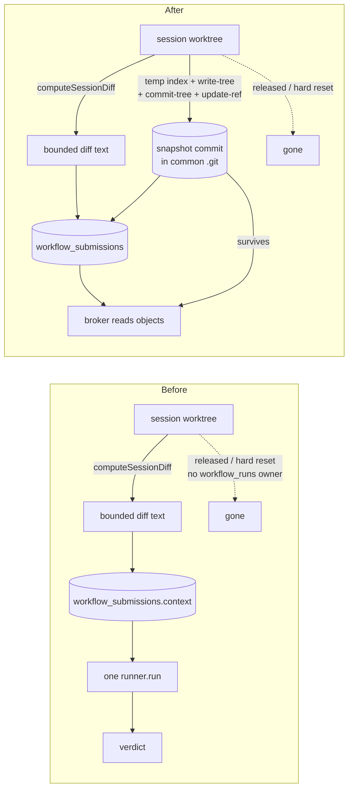
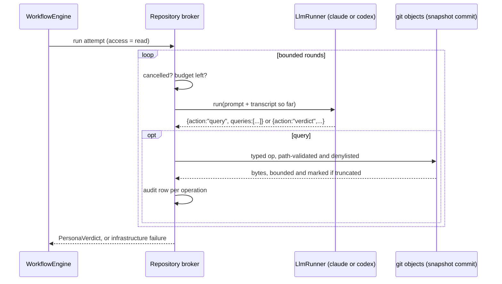

# Persona repository access

Give selected Workflow Personas read-only access to the **complete Git worktree** of the
change they are reviewing, through a provider-neutral query broker that ai-harness executes
and audits against the exact submitted state.

A rendered, self-contained version of this document sits beside it at `plan.html`.

## The problem

A Persona review today sees a bounded text packet and nothing else. `readWorkflowContextRaw`
(`src/server/workflows/context.ts:559`) freezes a diff clipped to `MAX_DIFF_BYTES` (800,000),
up to 500 `git status` lines, a transcript window, standards documents, Check outcomes and
registered evidence, and hands that to one `runner.run(prompt)` call
(`src/server/workflows/engine.ts:1018`). The reviewer cannot open an unchanged file.

Every shipped built-in says so in its own words. `code-quality-judge` states "You have no
repository tools and the pull request does not exist yet". `code-risk-reviewer` is asked to
judge whether a fix is durable - "ask whether that same failure stays reachable through a
sibling path" - which is a question about code the diff does not contain.

The Inspector already crossed this line and is the proof it matters: it holds
`REVIEW_TOOLS = "Read,Grep,Glob"` (`src/server/inspector/worker.ts:280`) because "reviewing a
diff without being able to open a file misses most of what matters (does this break a caller?
is there a test?)". A Persona reviewing the *same* change locally gets none of that.

The Inspector's mechanism cannot simply be reused, for three reasons this plan is shaped by:

1. **It cannot reach Codex.** `codexRunner.sandbox` is `null`
   (`src/server/llm/codex.ts:436`), so `grantRefusal` refuses every grant before spawning.
   The Inspector's own comment records the consequence: "Codex currently cannot, so it reviews
   the supplied diff without repository tools instead of silently accepting a weaker grant."
   A native grant is a Claude-only feature.
2. **It cannot see the submitted state.** A grant scopes tools to a `cwd`. That directory is a
   pooled worktree that the daemon may hard-reset underneath a running review - see
   *Verified findings* below. The Inspector already carries a `liveDir` fallback because
   "the adopted `cwd` may be a transient session worktree that gets released and reused".
3. **It cannot be audited.** A provider-executed `Read` is invisible to ai-harness. There is
   no record of what was read, what was denied, or what was truncated.

## Approved decisions

These are settled. This plan implements them; it does not re-open them.

| # | Decision |
|---|---|
| 1 | Access is configured separately on each Persona. |
| 2 | Claude and Codex reviewers receive equivalent capabilities. |
| 3 | A provider-neutral **interactive query broker**: the reviewer requests typed repository operations; ai-harness executes and audits them against the exact review checkout. |
| 4 | Supported capabilities: read, search and glob across repository files, plus server-owned Git status, diff, show, log and blame. |
| 5 | No arbitrary shell execution, file writes, network access, or direct unrestricted provider tools. |
| 6 | Sensitive-path protections are preserved or strengthened. Repository-wide code access must not expose credentials, host files, `.git` internals, or known secret-bearing files. |
| 7 | The repository view represents the exact submitted review state - committed, staged, unstaged and untracked. A detached checkout of the captured commit alone is insufficient. |
| 8 | If the exact review checkout or the repository-read service is unavailable, block and retry the Persona attempt. Never silently fall back to prompt-only review. |
| 9 | The access setting is frozen into the Persona snapshot at publish. Later Persona edits affect only newly published workflow versions. |
| 10 | Built-in Personas stay immutable for guidance, runner and model, but a local repository-access override is configurable for them. |
| 11 | Repository operations, denials, truncation and failures are auditable. |
| 12 | Query and response limits protect reliability without preventing an expansive review of large changes. No single global character limit that silently excludes most of the worktree. |

## Verified findings

Measured against the worktree at planning time. Implementers re-verify; the numbers are
recorded because three of them decide the design.

**Persona storage and immutability.** `Persona` is
`src/shared/workflow.ts:461`; the row is `personas` (`src/server/db.ts:1088`). A built-in is
**not a row** - `BUILTIN_PERSONAS` is projected from compiled-in Markdown
(`src/server/workflows/builtin-personas.ts:65`) and merged into every read through the store's
private `withBuiltins` / `withAddressableBuiltins` / `builtinPersona`
(`src/server/workflows/store.ts:2121-2133`). Immutability is enforced in exactly three store
methods, as the first statement inside the transaction, returning `reason: "builtin"`:
`insertPersona` (`:2222`), `updatePersonaCas` (`:2268`), `archivePersonaCas` (`:2322`). The
route maps that to `409 persona_builtin` (`src/server/routes.ts:1379`). **There is no existing
per-persona override mechanism for a built-in**, and none can be added by patching a row,
because there is no row. `workflow_commands` / `workflow_command_overrides`
(`src/server/db.ts:1157`, `:1173`) is the repository's own precedent for exactly this shape:
shipped defaults in one place, local exceptions in a sidecar table keyed by the immutable
identity.

**Snapshot compatibility.** `PersonaSnapshot` (`src/shared/workflow.ts:1401`) is produced by
the single projection `personaSnapshotOf` (`:1419`), used by both publishers - the store's
`publishWorkflow` (`src/server/workflows/store.ts:3231`) and the built-in catalog's
compile-time `publishBuiltinGraph` (`src/server/workflows/builtin-workflows.ts:148`). It is
validated by `PersonaSnapshotSchema` (`src/shared/protocol.ts:3981`), a plain `z.object` -
**strip mode**, verified against zod 3.25.76: unknown keys parse and are dropped, but every
declared key is required. A new snapshot field must therefore carry `.default(...)`, or every
already-published `workflow_versions.graph_json` row and every historical
`workflow_node_attempts.persona_snapshot_json` row stops parsing and the version resolves to
`null`.

**The review is a single one-shot call, and no provider offers more.** `runInThread` is `null`
on both runners (`src/server/llm/claude.ts:168`, `src/server/llm/codex.ts:430`). The default
Claude transport is the Agent SDK (`src/shared/llm.ts:72`) and it pins `maxTurns: 1` for a
tool-less schema-less run - the exact Persona shape. `codex exec` is one turn by construction
(`features.shell_tool=false`, `features.unified_exec=false`,
`src/server/llm/codex.ts:303-322`). `LlmRunOptions` (`src/shared/llm.ts:273`) has no field
that could carry a tool definition or an MCP server, and no headless path passes
`--mcp-config` or `-c mcp_servers.*`. The in-repo MCP server (`src/mcp/server.ts:213`) binds
one stdio transport and is explicitly launch-scoped: "everything in this file is LAUNCH-scoped:
it reaches sessions the dashboard dispatches and nothing else."

**A pooled worktree can be reset underneath a running review.** `nativeWorktreeOwnerReferenced`
(`src/server/worktrees/owners.ts:18`) consults `tasks`, `task_repos`, `workflow_check_leases`
and `worktree_slots` - there is **no `workflow_runs` clause**. Task teardown calls
`release(lease, { ownerAuthorized: true })` (`src/server/dispatcher.ts:2027`), which skips the
domain check and leaves only process-occupancy as a gate; a server-side review holds no
process in the tree. The workflow manager already records the consequence
(`src/server/workflows/manager.ts:1163`): "a worktree can be reclaimed while its pull request
is still open ... There is then genuinely nothing to review." **Any design that reads the live
checkout during a review is reading a directory another subsystem is entitled to erase.**

**Retry and blocking already exist.** `handleInfrastructureFailure`
(`src/server/workflows/engine.ts`) records the attempt as `error`, schedules
`MAX_INFRA_ATTEMPTS = 3` attempts with `retryBaseMs * 4 ** (attempt - 1)` backoff, and on
exhaustion fails the submission and sets the run `blocked` with a phase string. Phases are
free-form strings with a label map (`BLOCKED_PHASE_CLAUSES`,
`src/web/workflows/run-model.ts:864`), and `CHECK_CLEANUP_UNRESOLVED_PHASE`
(`src/server/workflows/engine.ts:92`) is the precedent for a distinct phase whose operator
remedy differs.

**Per-round accounting already exists.** The attempt's `StructuredAttemptObserver`
(`src/server/workflows/engine.ts:973`) writes a `workflow_llm_calls` row per provider call
with `purpose: "persona_review"`, byte counts and an error code, and its `start` hook already
refuses to begin a new call once the run or submission stops being `running` - which is the
cancellation seam a multi-round loop needs.

**Git can materialize the exact dirty state, cheaply and immutably.** Measured on this
repository:

| Step | Result |
|---|---|
| `cp .git/index $TMP` then `GIT_INDEX_FILE=$TMP git add -A` | **34 ms**, 2,633 paths |
| cold temp index (`read-tree HEAD` then `add -A`) | 729 ms |
| live worktree and live index after the run | unchanged (`git status` byte-identical) |
| `git rev-parse --git-path refs/mission-control/review-snapshots/x` | resolves into the **common** `.git/refs`, not the per-worktree dir |
| `git gc --prune=now` with the ref set | snapshot commit still `cat-file -t` reachable |
| `node_modules/` (gitignored) | absent from the tree |
| an untracked, non-ignored `.env` | **present** in the tree |
| a symlink | mode `120000`, blob content is the target string; not followed |
| `git cat-file -p <snap>:../etc/passwd` | `fatal: '../etc/passwd' is outside repository` |
| `git cat-file -p <snap>:/etc/passwd` | `fatal: path ... exists on disk, but not in <snap>` |
| `git cat-file -p <snap>:.git/config` | `fatal: path ... exists on disk, but not in <snap>` |
| `git grep`, `git log`, `git blame`, `git diff` against the snapshot commit | all work |
| `git cat-file --batch-check` | returns `<oid> blob <size>` (or `missing`) **without reading bytes** |
| `git ls-tree` with `:(glob)` pathspec | **not supported** - `pathspec magic not supported by this command` |
| `git grep` with `:(glob)` pathspec | supported |

## The design

### 1. The setting, and where it lives

One appended-only enum in `src/shared/workflow.ts`:

```ts
export const PERSONA_REPOSITORY_ACCESS_MODES = ["off", "read"] as const;
export type PersonaRepositoryAccess = (typeof PERSONA_REPOSITORY_ACCESS_MODES)[number];
export const DEFAULT_PERSONA_REPOSITORY_ACCESS: PersonaRepositoryAccess = "off";
```

Two values rather than a bag of per-capability booleans. The approved capability set
(decision 4) is one coherent read-only grant; splitting it into eight toggles would offer an
operator eight combinations nobody asked for and would put eight fields into every published
snapshot. The list is appended-only for the reason every other durable enum in this repository
is: the strings reach durable rows.

Storage follows the `workflow_commands` precedent, because the two kinds of Persona are
genuinely different objects:

- **Operator Personas** get a column: `personas.repository_access TEXT NOT NULL DEFAULT 'off'`.
  It is part of the row, so it participates in `revision`, in the CAS write path, in
  Duplicate, and in import/export - none of which a sidecar table would give it.
- **Built-in Personas** get a sidecar row:
  `persona_access_overrides(persona_id TEXT PRIMARY KEY, repository_access TEXT NOT NULL, revision INTEGER NOT NULL DEFAULT 1, created_at, updated_at)`.
  A built-in has no row to carry the setting, and inventing one would make it operator data
  and break the four properties `builtin-personas.ts` exists to guarantee.

The override row carries **its own `revision`**, and that is not decoration. A built-in's
`Persona.revision` is the synthetic constant `1` that `builtin-personas.ts` documents ("a build has
exactly one copy of each document"), so it cannot serve as a compare-and-swap token: two dashboards
changing the same built-in's access would both compare against `1`, both succeed, and the later
write would silently discard the earlier one while each browser reported its own value as committed.
The sidecar's revision is the token that makes that a refusal instead, exactly as
`workflow_commands.revision` does for the shipped command slots.

So the setting exposes one number with one meaning - **the revision of the record that stores it** -
surfaced on `PersonaView` as `repositoryAccessRevision`:

| Persona kind | `repositoryAccessRevision` is | A write |
|---|---|---|
| Operator row | the `personas` row's `revision` | CAS on the row, bumping it, as every other Persona edit does |
| Built-in with an override | the override row's `revision` | CAS on the override row, bumping it |
| Built-in with no override yet | `0` | inserts, and succeeds only if no row exists - so the concurrent first write is refused too |

One private resolver in `WorkflowStore` applies overrides where built-ins are merged in, so
every existing read path picks them up without a second merge rule to keep in step.

The write path is a **new route**, `PUT /api/personas/:id/repository-access`, not a widening of
`UpdatePersonaSchema`. `PATCH /api/personas/:id` keeps refusing a built-in outright, which is
the whole of decision 10: guidance, runner and model stay immutable, and exactly one setting
is locally configurable. Widening `PERSONA_EDIT_FIELDS` would have required per-field built-in
logic inside the three store methods whose current strength is that they refuse before looking
at any field.

Two consequences of that separation, both deliberate:

- The setting is **not part of the editor draft**. `PERSONA_DRAFT_FIELDS`
  (`src/web/workflows/PersonaEditor.tsx:53`) and `personaUpdatePatch` are untouched, so
  `reconcilePersonaSave`, the guidance CAS and the conflict banner keep their current shapes.
  The control commits on change, for both kinds of Persona, and reports failure on the existing
  `persona-error` line.
- Committing on change is also the only shape that *works* for a built-in, which is the check
  that confirms the separation rather than merely permitting it: a built-in renders no Save
  button at all - the primary flips to `Duplicate to edit` (`:638-645`) and `save()` hard-returns
  for `builtin` (`:518`) - so a setting that rode the draft would be unreachable on exactly the
  Personas decision 10 exists for.

The route body is revision-and-mode only, so it takes the existing small guard
(`REVISION_ONLY_BODY_MAX_BYTES = 1024`, `src/server/routes.ts:532`) rather than
`PERSONA_BODY_MAX_BYTES`, and it returns the same `personaFailure` envelope
(`src/server/routes.ts:1379`) every other Persona mutation does - including
`revision_conflict` with the current `PersonaView` attached, which is what lets the editor
re-render the value that actually won, and minus the `builtin` arm, which is the one refusal
this route must not make.

### 2. Snapshot and publication

`PersonaSnapshot` gains `repositoryAccess: PersonaRepositoryAccess`, produced by
`personaSnapshotOf` so both publishers are covered by construction.
`PersonaSnapshotSchema` declares it as
`z.enum(PERSONA_REPOSITORY_ACCESS_MODES).default("off")`.

`.default("off")` - not `.optional()` - is the load-bearing choice, and it satisfies decision 9
exactly:

- Every version published before this feature parses, and parses as `off`. A historical
  workflow version does not silently acquire repository access because someone later ticked a
  box. "Later Persona edits affect only newly published workflow versions" is enforced by the
  absence of the key meaning `off`, not by a migration.
- Every reader gets a non-optional value, so no call site has to decide what absent means.

`personaSnapshotIsOutdated` (`src/shared/workflow.ts:1431`) gains an access comparison, so
changing the setting marks published versions as outdated - which is the honest signal, and the
one that tells an operator a re-publish is what makes the change take effect.

**Built-in workflows are a documented limitation.** `publishBuiltinGraph` runs at module load
and cannot read the database, so a shipped workflow's persona nodes always freeze
`repositoryAccess: "off"`. An operator who wants a built-in reviewer to hold access uses the
existing **Duplicate** gesture on the workflow (`src/web/workflows/WorkflowLibrary.tsx:578`)
and publishes their own version, which snapshots the live catalog including the override. This
is the same "Duplicate to customize" rule the product already teaches for built-in Personas,
and it keeps a build's own app data free of machine-local state.

**One pre-existing cliff, made explicit.** `validateWorkflowGraph` checks
`graphJsonBytes` (500,000) against the **draft** graph, whose persona nodes carry only an id,
while the published graph inlines up to 100,000 bytes of guidance per node and is read back
through `parseJson`'s 500,000-byte cap. Six maximum-size Personas in one workflow publish
cleanly today and then read back as `null` forever. This plan adds roughly thirty bytes per
persona node, so it does not create the cliff - but because it widens the snapshot at all, the
same change adds a publish-time byte check of the **published** graph against the read cap.
That is a ten-line guard closing a latent data-loss path in a controlled file, and skipping it
while touching the field would be the wrong trade.

### 3. The exact submitted review state

At capture time, the daemon writes a **review snapshot commit** into the repository's object
database: a commit whose tree is the worktree exactly as submitted - committed, staged,
unstaged and untracked - parented on the captured `HEAD`, pinned by a ref under
`refs/mission-control/review-snapshots/<submissionId>`.

```
cp <worktree>/.git/index $TMP          # seeds the stat cache: 34 ms instead of 729 ms
GIT_INDEX_FILE=$TMP git add -A          # respects .gitignore; never touches the live index
GIT_INDEX_FILE=$TMP git write-tree
git commit-tree <tree> -p <headSha> -m "mission-control review snapshot <submissionId>"
git update-ref refs/mission-control/review-snapshots/<submissionId> <commit>
```

The oid and the repository root are persisted on `workflow_submissions`. Every repository
operation then runs against that commit, and the worktree is never read again.

This answers decision 7 more completely than a checkout could, and it answers decision 8's
availability problem structurally rather than by retrying into a race:

- **It is the exact submitted state.** A detached checkout of the captured `HEAD` is missing
  the staged, unstaged and untracked work, which for a session mid-repair is most of the
  change. The snapshot tree contains all four.
- **It is immutable and it outlives the checkout.** Refs under `refs/` live in the **common**
  git directory (verified: `--git-path` resolves to the main `.git/refs`), and the ref makes
  the objects reachable, so the snapshot survives `release()`'s hard reset, `removeSlot`, and
  `git gc --prune=now` (all verified). This is the direct answer to the reclamation hazard:
  the review no longer depends on a directory another subsystem may erase.
- **No worktree is borrowed, so no lease is needed.** `check-lease.ts` exists because a check
  runs a build in a tree; a repository read needs no tree at all. Reusing that machinery would
  add a durable lease row, a holder token, a reclamation backoff ladder and a second consumer
  of the pool, to solve a problem the object database does not have.
- **The filesystem is not in the trust boundary.** There is no directory to escape from. Host
  paths, `..`, absolute paths and `.git` internals are not denied by a rule that could have a
  hole - they are absent from the namespace (all three verified to fail at the git layer).

Lifecycle ownership is the submission's. The snapshot is created inside the existing bounded
capture window in `readWorkflowContextRaw`, so the existing capture-boundary re-read and
single retry already cover a worktree that moved mid-capture; the snapshot additionally
asserts its parent is the captured `headSha`. The ref is deleted by the same retention path
that prunes a submission's evidence. Neither `evidenceFingerprint` nor
`repositoryFingerprint` includes the snapshot oid: they are identity and change-detection keys
that trigger keys, idempotency and the unchanged-resubmission guard are built on, and folding a
new input into them would invalidate every existing run.



### 4. The broker protocol

Provider-neutral, in `src/shared/`, so the browser can render an audit record and neither
runner needs to know it exists.

A reviewer's reply is one envelope, a discriminated union on `action`:

```ts
type PersonaReviewReply =
  | { action: "query"; queries: RepositoryQuery[] }
  | { action: "verdict"; verdict: PersonaVerdict };
```

A `RepositoryQuery` is a discriminated union on `op`, covering exactly decision 4 and nothing
else:

| `op` | Arguments | Executed as |
|---|---|---|
| `read_file` | `path`, `startLine?`, `lineCount?` | `cat-file --batch-check` for type and size, then the blob |
| `search_text` | `pattern`, `pathGlob?`, `fixedString?`, `maxMatches?` | `git grep -I -n` against the snapshot commit |
| `list_paths` | `pathGlob`, `maxPaths?` | `git ls-tree -r -z` filtered by the shared matcher |
| `git_status` | - | `git diff --name-status <headSha> <snapshot>` plus the captured porcelain status |
| `git_diff` | `path?`, `base?` | `git diff` between the snapshot and `base` or `HEAD`; `base` must be an ancestor of the snapshot |
| `git_show` | `rev`, `path?` | `git show`; `rev` must be an ancestor of the snapshot |
| `git_log` | `path?`, `maxEntries?` | `git log --max-count=N --format=<NUL-separated>` |
| `git_blame` | `path`, `startLine?`, `lineCount?` | `git blame --porcelain <snapshot> -- <path>` |

Every result is `{ ok: true, ... , truncated: boolean }` or
`{ ok: false, code: RepositoryQueryDenialCode, detail }`, with the denial codes an appended-only
list: `not_found`, `not_a_file`, `sensitive_path`, `path_invalid`, `symlink`, `submodule`,
`binary`, `too_large`, `unsupported_rev`, `invalid_argument`, `budget_exhausted`, `unavailable`,
`cancelled`.

A denial is **data, never an error**: the reviewer is told, in the response, that the path is
denied and why, and goes on reviewing. Only `unavailable` is infrastructure, and it takes the
attempt down the retry ladder rather than into a verdict.

### 5. How one attempt makes many queries

The broker is a **server-owned round loop** over the existing single-shot
`LlmRunner.run(prompt)`. Each round re-sends the review prompt with the accumulated
query-and-response transcript appended, and asks for either another query batch or the final
verdict.



This is the design's central decision, and it is chosen because it is the only shape that
satisfies decision 2:

- **It needs nothing from either provider.** No new `LlmRunOptions` field, no MCP wire into
  four transports, no `runInThread`, no turn-cap change. Claude and Codex become equivalent by
  construction rather than by two adapters that must be kept in step - and Codex's `sandbox:
  null` stops being relevant, because no grant is ever requested.
- **It preserves the fresh-context guarantee.** `LlmRunner.run`'s contract is that every call
  starts empty (`src/shared/llm.ts:377`); this loop keeps that literally true and carries
  continuity in the prompt the daemon composes, so no cross-session context can bleed.
- **It is auditable by construction.** Every operation is executed by ai-harness, so decision
  11 is satisfied by the code path rather than by a provider's cooperation.
- **It is cancellable between rounds.** The existing observer already refuses to start a call
  once the run or submission stops being `running`.

The cost is honest and worth stating: re-sending the transcript means the prompt grows with
each round, so a review that uses all its rounds costs more input tokens than one that does
not. Server-side prompt caching absorbs most of the repeat, and the round ceiling bounds the
rest. The alternative - implementing `runInThread` for two providers - buys token efficiency
in exchange for a resumable per-provider session, which is the exact mechanism the runner
contract warns reintroduces cross-session bleed.

Where the provider can validate the envelope shape it is asked to: `claudeRunner.structuredOutput`
guarantees input shape, so the round schema is passed as `LlmRunOptions.schema` and
`runStructured`'s `shapeGuaranteed` skips the redundant JSON re-prompt. Codex ignores it and
the existing two-attempt parse ladder covers it. A reply that will not parse after the ladder
is an infrastructure failure, exactly as today - never a fail verdict.

### 6. Security model

Decision 6 is met by removing the filesystem from the picture and then layering the existing
defences on what remains.

1. **No filesystem access at all.** Every read is a git object read against one immutable
   commit. Traversal, absolute paths, host files and `.git` internals are structurally absent -
   verified at the git layer, not asserted.
2. **Path validation before git is invoked.** Reject empty, absolute, NUL-bearing, and any path
   with a `.` or `..` segment; reject `.git` as a leading segment. Paths are matched as bytes
   against the tree listing and never normalized, because git paths are bytes and a
   normalization step would make two spellings resolve to one object.
3. **A sensitive-path denylist**, seeded from the repository-relative half of the Inspector's
   `DENY_PATHS` (`src/server/inspector/worker.ts:295`) and **strengthened**: the Inspector
   denies `**/.git/config`, this denies `.git/**` outright, and the list is applied to the
   *results* of `search_text` and `list_paths` as well as to the arguments of `read_file`. A
   matcher that only guarded arguments would be exactly the hole
   `claude-grant.ts` already documents: "`Grep` takes an absolute path and prints the matching
   lines, so a `Read(...)`-only list protects nothing it names." The measurement above is why
   this layer survives the move to git objects: an untracked, non-ignored `.env` **is** in the
   snapshot tree.
4. **Modes are classified, links are never followed.** Mode `120000` is denied as `symlink`
   and `160000` as `submodule`. A symlink's blob content is its target string, so serving it as
   file content would hand the reviewer an arbitrary host path under a repository-relative name.
5. **Binary refusal without reading.** `cat-file --batch-check` yields type and size first, so
   an oversize blob is refused as `too_large` before a byte is read; `git grep -I` skips binary
   content (verified).
6. **Per-operation output scrubbing.** `scrubSecrets` (`src/server/inspector/scrub.ts`) runs
   over every broker response. Its own comment makes the trade explicit - "a mangled example is
   a nuisance, a published credential is an incident" - and it applies with more force here,
   because a verdict's evidence quotes can reach a public pull request through the feedback
   packet.
7. **Untrusted framing.** Every response is delivered inside an `untrustedBlock`
   (`src/server/review/prompt.ts`), so repository content the reviewer fetched carries the same
   `-untrusted` fence as the diff it came from.

`REVIEW_SNAPSHOT_ONLY` currently tells every reviewer "do not look anything up". With access
enabled that sentence is false, so `reviewContract` gains an opt-in variant that names the
repository snapshot as part of the reviewed snapshot and the broker as the only way to reach it.
When access is off the rendered string stays **byte-identical** to today, pinned by a test -
four reviewers across two providers share that function and none of the other three is
changing.

### 7. Retry, blocking, and never falling back

Decision 8 maps onto machinery that already exists. A missing snapshot, an unreadable object
database, a vanished repository root or a git invocation that fails is an **infrastructure
failure**, routed through `handleInfrastructureFailure`: the attempt is recorded `error`, up to
`MAX_INFRA_ATTEMPTS` attempts are scheduled with the existing exponential backoff, and on
exhaustion the submission fails and the run blocks.

It blocks in a **distinct phase**, `repository_access_unavailable`, with its own
`BLOCKED_PHASE_CLAUSES` entry, for the reason `CHECK_CLEANUP_UNRESOLVED_PHASE` is distinct
from `infrastructure_error`: the operator's next move differs. "The provider call failed" is
debugged; "the repository this review needs is gone" is answered by re-running against a live
checkout.

What must never happen, and is prevented by there being no such branch in the code: a Persona
with `repositoryAccess: "read"` completing a review without the repository. Prompt-only is not
a degraded mode of this feature; it is a different review, and passing it off as the configured
one would silently weaken every gate an operator turned on.

### 8. Persona Editor

The setting joins the existing property-chip row beside Provider and Model
(`src/web/workflows/PersonaEditor.tsx:750-802`), as a chip named `repository` with
`controlLabel="Repository access"`. A chip is a `<button>` whose accessible name is
`<name><value>` and whose popover is a `role="group"` named by `controlLabel`
(`src/web/library/LibraryPropertyChip.tsx:151-161`), so the browser spec reaches it exactly as
`persona-rail.spec.ts` already reaches Provider - `getByRole("button", { name: /^repository\b/ })`
then `getByRole("group", { name: "Repository access" })`. On an unsaved draft the chip reads
`resolves after save` and its control is disabled, following the Model chip.

Its popover holds the choice and the disclosure, because this is the one Persona setting whose
security boundary an operator has to be told rather than guess:

- what is granted - read, search and glob over the exact submitted worktree, plus server-run
  `status`, `diff`, `show`, `log` and `blame`;
- what is not - no shell, no writes, no network, no provider tools;
- what is denied - credential-shaped and secret-bearing paths, `.git` internals, symlinks and
  submodules, with denials recorded;
- what the state means - that the setting takes effect for **newly published** workflow
  versions, so an existing version keeps the behaviour it was published with.

For a built-in the chip is the single enabled control on an otherwise read-only editor, and it
says so: the override is local to this machine, does not change the shipped guidance, and does
not make the Persona editable. Everything else keeps `readOnly = archived || builtin`, the
primary action stays `Duplicate to edit`, and `PersonaEditorStatus`'s built-in banner keeps its
precedence over every other state. An archived Persona's chip stays disabled - the exception is
for built-ins, not for read-only in general.

No new `ServerEvent` is needed. `persona_upsert` already carries a `PersonaView`
(`src/shared/types.ts:2977`), so a widened `Persona` reaches the browser through the existing
frame and `useEventStream`'s exhaustiveness check stays untouched.

### 9. Limits

Decision 12 rules out one global character cap, so the budget is a small hierarchy - per
operation, per round, per attempt - each of which announces truncation where it bites:

| Limit | Value | Why |
|---|---|---|
| `maxRounds` | 8 | Enough to open a file, follow its callers, and check its test; bounded so a loop cannot run forever |
| `maxQueriesPerRound` | 12 | Batching is what keeps round count low; a reviewer asks for a directory listing and six files at once |
| `maxResponseBytesPerQuery` | 96,000 | Roughly a 2,500-line source file whole |
| `maxRoundBytes` | 320,000 | A full batch of substantial files in one round |
| `maxAttemptBytes` | 2,000,000 | The expansive-review budget: ~40 large files across the whole attempt |
| `maxMatchesPerSearch` | 200 | A search is for locating code, not for exporting it |
| `maxPathsPerList` | 4,000 | Comfortably above this repository's measured 2,633-path tree, so a whole-repository listing is complete rather than clipped |
| `maxLogEntries` | 100 | Blame and log answer "why is this here", not "replay the history" |

Truncation is never silent: an `ok` response carries `truncated: true` and the omitted byte
count, `read_file` accepts `startLine`/`lineCount` so a clipped file can be paged rather than
guessed at, and every truncation is written to the audit record.

### 10. Audit and observability

Decision 11 gets a durable table rather than only log lines, because "what did this reviewer
read" is a question asked after the fact:
`workflow_repository_queries(id, run_id, submission_id, node_attempt_id, round, ordinal, op, path, detail, outcome, denial_code, bytes, truncated, duration_ms, created_at)`.

Alongside it: `workflow_llm_calls` gains a `round` column so a provider call can be placed in
its round (`attempt` continues to mean the parse-retry attempt within a round), bounded
aggregate `workflow_events` rows report per-round operation counts, denials and truncations on
the run timeline, and run detail renders a per-attempt summary - operations, bytes, denials,
truncations - so the cost and the reach of an access-enabled review are visible without a
database query.

## Migration and backward compatibility

| Existing thing | What happens |
|---|---|
| Existing operator Personas | `addColumn(d, "personas", "repository_access", "TEXT NOT NULL DEFAULT 'off'")`. The column default **is** the true backfill, so no `UPDATE` follows the `ALTER` - the idiom `db.ts:1221-1227` documents. |
| Existing built-in Personas | No override row, so they resolve to `off`. |
| Already-published workflow versions | `graph_json` lacks the key; `.default("off")` parses it as `off`. No rewrite of any stored graph. |
| Historical `workflow_node_attempts` rows | Same `.default("off")` path through `PersonaSnapshotSchema`. |
| In-flight runs at upgrade | Pinned to their published version, which parses as `off`; behaviour is byte-identical to before. |
| Existing submissions | `review_snapshot_oid` is nullable and null; a Persona with access off never asks for it, and one with access on cannot exist against a version published before the column did. |
| A newer daemon's rows read by an older build | Zod strip mode drops the unknown key and nothing rewrites the column, so the field round-trips. |
| Exported workflow versions | `manager.exportVersion` serializes the parsed version, so a re-import of an old export lands `off`. |
| `reviewContract` output with access off | Byte-identical, pinned by a test. |

## Testing strategy

Every layer is used for what only it can say.

- **Unit (`test/`)**: the enum and its default; `personaSnapshotOf` including the field;
  `PersonaSnapshotSchema` parsing a pre-feature snapshot as `off` **and** rejecting an unknown
  mode; `personaSnapshotIsOutdated` reacting to an access change on both a row and a built-in;
  path validation refusing absolute, `..`, NUL and `.git`; the denylist applied to arguments
  **and** to search and list results; the glob matcher; every limit boundary; denial-code
  mapping; `reviewContract` byte-equality when access is off.
- **Persistence and migration**: modelled on the two existing patterns rather than invented.
  `test/persona-migration.test.ts` hand-writes the pre-feature `personas` table (never importing
  the current schema, since a fixture built from `db.ts` would create the new column itself), and
  `test/session-action-migration.test.ts` hand-seeds a published `workflow_versions.graph_json`
  in its old shape and asserts it still parses through the current store. This feature needs both:
  a database built without `repository_access` opens, migrates, and reads `off` with guidance
  bytes unchanged; a `graph_json` written before the field resolves with `repositoryAccess: "off"`
  and its node ids intact; a second open is idempotent; the override table refuses a
  non-built-in id; retention deletes the snapshot ref.
  It also closes a **gap the investigation named**: nothing today seeds a `PersonaSnapshot`
  written by a *newer* build - an unknown extra key inside `graph_json` - and asserts the current
  parser tolerates it. Zod's strip mode makes that true; it has never been pinned, and it is the
  property that lets this field ship without a rewrite of stored graphs. `test/workflow-publish.test.ts`
  pins only the source-text shape of `publishWorkflow`, which the added field must keep passing.
- **Runner contract (`test/llm-runner-contract.test.ts`)**: the broker requests **no** grant
  and **no** tools from either runner, so the feature cannot regress into a provider-tool
  grant; and the same round schema drives Claude and Codex identically, which is decision 2's
  regression test.
- **Integration (`test/workflow-engine.test.ts`, `test/workflow-context.test.ts`)**: a real
  fixture repository with committed, staged, unstaged and untracked content; the snapshot
  contains all four and excludes gitignored paths; the broker answers each op against it;
  reading the snapshot still works after the worktree is removed; a multi-round attempt
  terminates, is cancellable mid-loop, and records one audit row per operation; a missing
  snapshot blocks in `repository_access_unavailable` after the retry ladder and **never**
  produces a verdict.
- **Security (`test/workflow-security.test.ts`)**: the existing home for "malicious Persona and
  evidence content stays data inside the review contract" gains the broker's half - a crafted
  repository path cannot leave the tree, a denied path is absent from every response shape, and a
  fetched file arrives inside an `-untrusted` fence.
- **Browser (`e2e/`)**: setting access in the Persona Editor and seeing it persist across reload;
  the disclosure copy present in the popover; a built-in whose access chip is the only enabled
  control while `Save` has count zero and the primary reads `Duplicate to edit`; and a full
  access-enabled review round trip. All of it reaches the existing selector vocabulary -
  `persona-rail.spec.ts` already drives a chip popover end to end - and the review is steered
  through the existing marker channel: the fake Claude keys behaviour off a marker planted in
  Persona guidance, and already persists a per-call counter in a file precisely because "each
  review call is its own process", which is exactly what a two-round broker exchange needs.

## Documentation

Each page is owned by the phase that introduces the behaviour it documents:

| Page | What it gains | Phase |
|---|---|---|
| `docs/workflows.md` | The Persona setting, the capability and denial list, the limits, the publish-freeze rule, the built-in override and its Duplicate-the-workflow limitation; then the review behaviour, the blocked phase and the audit surface | 1, then 3 |
| `docs/security.md` | A pointer that access exists and is off by default; then the full trust boundary and layered defences; then the prompt-side framing | 1, 2, 3 |
| `docs/database-and-migrations.md` | The column, the override table, the snapshot columns, the audit table and the ref namespace | 1, 2 |
| `docs/worktrees-and-checks.md` | That a review's repository view is a snapshot commit and is therefore unaffected by worktree reclamation | 2 |
| `docs/models.md` | The round-loop cost model | 3 |
| `docs/event-stream.md` | The per-round aggregate event kinds, if it enumerates them | 3 |

`docs/architecture.md` is deliberately **not** in that list. It is a 52-line component index that
points at the technical pages rather than describing tables or subsystems, so this feature has
nothing to add to it, and adding a line would make a page whose job is orientation slightly worse
at it.

Built-in Persona Markdown under `personas/` is corrected in Phase 3 where it asserts "you have no
repository tools", which is a generated-source edit (`npm run personas`), and one that marks
published snapshots of those built-ins outdated - the honest consequence, recorded rather than
avoided.

## Out of scope

- Write access, shell execution, network access, or any provider tool grant.
- Repository access for the Inspector, Foreman, ensembles, or Check nodes.
- Cross-repository reads. One run is one repository, and `workflowCheckoutPath` is the single
  place that says which.
- Reading a session's live checkout at review time. The snapshot replaces it deliberately.
- Fixing the pre-existing published-graph size cliff beyond the publish-time guard described
  above; the guard prevents new data loss and the underlying read cap is left alone.

## Risks

| Risk | Mitigation |
|---|---|
| Token cost of re-sent transcripts | Round and byte ceilings; provider-side prompt caching; per-attempt audit makes the cost visible rather than surprising |
| A reviewer burning rounds without converging | `maxRounds` is a hard stop; the final round is asked for a verdict explicitly, and a non-verdict at the ceiling is an infrastructure failure, never a fail |
| Snapshot creation slowing capture | Measured at 34 ms with a seeded index; the cold path is 729 ms and is the fallback when the live index cannot be copied |
| Ref accumulation in an operator's repository | Refs are deleted by the same retention that prunes submission evidence, and a startup sweep removes refs with no live submission |
| A crafted repository path or content steering the reviewer | Untrusted fencing on every response, the same framing the diff already carries, plus scrubbing and the denylist |
| Snapshot content not matching the captured diff | Created inside the existing bounded capture window, parent asserted equal to the captured `headSha`, and covered by the existing boundary re-read and retry |
