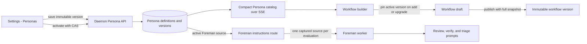
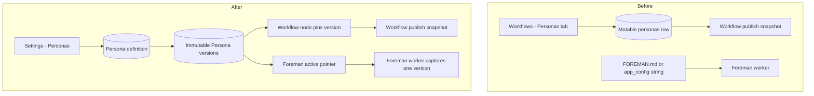

# Plan: Independent, versioned Personas and an activatable Foreman profile

Status: **proposed**

## Outcome

Mission Control should treat a Persona as a first-class configuration resource. A Persona may
be eligible for a workflow review stage, but workflow membership is a use of the resource, not
its owner or identity.

The same model should expose Foreman's standing instructions as a system Persona:

- the shipped `FOREMAN.md` remains a built-in, read-only default;
- users can save exact Markdown as immutable Foreman versions;
- saving a version does not silently activate it;
- users can activate the built-in default or any saved Foreman version;
- Foreman is never offered as a workflow stage;
- activation affects the next Foreman evaluation, while an evaluation already in flight
  finishes against the one version it captured;
- Foreman's authority, model roles, mode, allowlists, and queue behavior remain ordinary
  Foreman configuration and are not Persona content.

Operator-authored workflow Personas gain the same immutable version history. A workflow stage
pins the active Persona version when the stage is added or explicitly upgraded. Later Persona
activation cannot rewrite an existing workflow draft, published workflow, binding, or run.
Built-in workflow Personas remain app-owned, read-only catalog entries and do not gain database
version rows.

## Why this is a domain correction, not a Foreman text editor

The repository already contains most of the individual mechanisms, but their ownership is
split in a way that makes the requested behavior difficult:

| Current behavior | Repository surface | Limitation |
|---|---|---|
| Operator Personas are mutable rows with a monotonic CAS `revision` | `src/shared/workflow.ts`, `src/server/workflows/personas.ts`, `src/server/workflows/store.ts` | A save overwrites the previous Markdown. The revision detects conflicts but is not a recoverable version. |
| Built-in review Personas are generated from `docs/personas/*.md` and merged into reads without database rows | `src/server/workflows/builtin-personas.ts` | This is the correct immutable built-in model and should stay. |
| Workflow publish embeds exact Persona snapshots | `WorkflowStore.publishWorkflow` | Published history is safe, but an unpublished stage refers only to `personaId` and can change when that row is edited. |
| Foreman's effective standing instructions are one string in `app_config`, seeded by `FOREMAN.md` | `src/server/foreman/instructions.ts` | There is no history, name, active-version pointer, or provenance. |
| The daemon exposes `GET` and `PUT /api/foreman/instructions`; the worker reads once per evaluation | `src/server/routes.ts`, `src/server/foreman/client.ts`, `worker.ts` | The read-once behavior is already the correct atomic evaluation boundary, but the route returns only text. |
| Persona authoring lives under `#/workflows/personas` | `WorkflowPage.tsx`, `PersonaLibrary.tsx`, `PersonaEditor.tsx` | The information architecture says Personas belong to Workflows even though other consumers now exist. |
| Settings has Foreman and Workflows categories, but no Personas category | `src/web/lib/settings-registry.ts`, `SettingsPage.tsx` | There is no independent configuration home for the resource. |

The implementation should consolidate these mechanisms around one Persona domain instead of
adding a second, Foreman-only version store.

## Product rules

### 1. A Persona has identity, immutable versions, and an active version

Keep stable resource identity separate from behavior-bearing content.

**Stable Persona definition**

- opaque id;
- name, normalized name, and description;
- provenance: built-in, operator-authored, or system;
- whether it is eligible for a workflow stage;
- optional system key (`foreman` is the first);
- active version id, when the active source is a saved version;
- CAS resource revision;
- archive and timestamps.

**Immutable saved version**

- opaque id and parent Persona id;
- monotonically increasing version number within that Persona;
- exact guidance Markdown, with no trimming or newline normalization;
- workflow-review runner and model overrides, when the Persona is stage-eligible;
- optional short change note;
- creation timestamp.

Name is stable identity rather than version payload. Rename remains a CAS metadata edit.
Everything that changes model behavior is immutable once saved.

Creating a normal operator Persona writes version 1 and activates it in one transaction because
a new resource needs a usable version. Every later **Save new version** only appends. A separate
**Activate** action moves the pointer with CAS.

### 2. Built-ins stay immutable and unversioned

The four generated review Personas keep their current design:

- no database row;
- no save, activate, archive, or rename;
- exact content comes from the current build;
- Duplicate creates an operator-owned Persona with version 1;
- workflow publish still embeds their exact Markdown.

This preserves the upgrade behavior already documented in `README.md`: a changed built-in can
make a published snapshot read as outdated, while the published snapshot itself never changes.

`FOREMAN.md` is another built-in source, presented as **Built-in default** in the Foreman
Persona history. It is not numbered and is not inserted into `persona_versions`. For the
Foreman system Persona, `activeVersionId = null` has one precise meaning: use that built-in
default. A saved empty-string version remains distinct and means "no standing instructions."

### 3. Foreman is a system Persona, not a workflow node

Represent Foreman as one system Persona definition with:

- `systemKey = "foreman"`;
- workflow-stage eligibility off;
- identity and archive controls locked;
- built-in `FOREMAN.md` as the default source;
- zero or more operator-authored saved versions;
- one active source, either Built-in default or a saved version.

The workflow builder filters by stage eligibility, not by a hard-coded id. Foreman therefore
cannot appear in the stage picker, graph palette, pipeline editor, or validation catalog.

Only the standing Markdown belongs to this Persona. These remain outside every version:

- enabled, dry-run, semi-auto, and live posture;
- repo allowlists and access approval;
- queue and wrap-up policy;
- cheap-tier posture;
- provider and the four Foreman model roles;
- backlog launch models.

That boundary preserves the existing security contract in `foreman/prefs.ts`: prose may raise
the quality bar and shape judgment, but cannot grant permission or remove an escalation rule.

### 4. Workflow stages pin versions

When a stage-eligible operator Persona is added, the draft node stores both `personaId` and the
then-active `personaVersionId`. Activating version 4 tomorrow does not alter a node pinned to
version 3.

The builder shows:

- `Code Risk Reviewer · v3` on the node;
- `v4 active` when a newer active version exists;
- an explicit **Upgrade to v4** action;
- a retained, readable selection when the pinned version is no longer the active one;
- a validation blocker if the Persona is archived, matching today's archive policy.

Built-in nodes continue to store the built-in Persona id because built-ins deliberately have no
version rows. Their exact bytes are frozen at workflow publish, as they are today.

Published workflow graphs continue embedding full Persona snapshots. New snapshots add
`sourcePersonaVersionId` and `sourceVersion`; legacy snapshots with only `sourceRevision` remain
readable. Runs continue using only the published snapshot, never a live Persona lookup.

## Target flow



The two consumers use the same version store differently:

- a workflow stage pins a version as authored input;
- Foreman follows the active pointer at the start of each evaluation.

There is no flow from Foreman into the workflow graph.

## Persistence and migration

### Tables and columns

Add one new table:

| Table | Purpose and constraints |
|---|---|
| `persona_versions` | Immutable content. `id TEXT PRIMARY KEY NOT NULL`, `persona_id TEXT NOT NULL`, positive `version`, exact `guidance_md`, nullable runner/model, change note, `created_at`, and unique non-null `(persona_id, version)`. |

Extend the existing `personas` table through `addColumn` calls in `migrate()`:

- `active_version_id TEXT`;
- `stage_eligible INTEGER NOT NULL DEFAULT 1`;
- `system_key TEXT`.

The existing `revision` becomes the definition-level CAS token. Do not reset it during
migration. The legacy `guidance_md`, `runner_id`, and `model_id` columns remain inert upgrade
fossils after the cutover; new code must not dual-write them.

The unique `(persona_id, version)` index belongs beside the new `persona_versions` table.
Indexes that mention the new columns on the existing `personas` table cannot run before
`migrate()`, so create these only after the `addColumn` calls:

- unique `system_key` where non-null;
- the replacement operator-name uniqueness index excluding system rows.

The system Foreman row must not steal a name from an existing operator Persona. Replace the
current all-row normalized-name index with a partial index over non-system rows, and let the
system row use the visible name **Foreman** independently.

Keep the current database ownership model: do not add `REFERENCES` clauses to this family.
Store methods validate the active version belongs to the Persona inside the same transaction.

### Data migration

Run one idempotent transaction after the new columns and table exist:

1. For every existing operator Persona without a version, insert version 1 from its current
   exact Markdown, runner, and model, then set it active.
2. Preserve the existing row's `revision` as its resource CAS token. Older overwritten
   revisions cannot be reconstructed and the migration must not invent them.
3. Add the system Foreman definition if it is absent.
4. Read the legacy `app_config["foreman.instructions"]`:
   - missing or non-string means Built-in default remains active;
   - a string, including `""`, becomes saved Foreman version 1 and is activated;
   - remove the legacy key only after the version and pointer commit.
5. Upgrade every mutable-Persona node in `workflow_definitions.draft_graph_json` to the
   backfilled version id. Built-in nodes remain id-only.
6. Leave `workflow_versions`, bindings, runs, attempts, and verdicts byte-for-byte unchanged.

Migration tests must seed a pre-feature database. Fresh-database tests cannot prove that the
new columns, partial indexes, legacy empty-string behavior, or graph rewrite work on an
operator's existing state.

## Server architecture

### Extract a Persona domain

Personas currently live inside workflow modules. Move the reusable contracts and persistence
boundary to:

- `src/shared/persona.ts` for browser-safe definitions, version refs, views, and helpers;
- `src/server/personas/store.ts` for rows, migrations, version append, activation, and reads;
- `src/server/personas/manager.ts` for policy, effective model projection, Registry updates,
  and built-in merging;
- `src/server/personas/builtins.ts` plus the generated source for immutable review Personas
  and the Foreman default descriptor.

`src/shared/workflow.ts` and `src/server/workflows/*` become consumers. This is the code-level
change that makes "a Persona may be used by a workflow" true instead of leaving Persona storage
owned by `WorkflowStore`.

The Foreman worker remains a separate HTTP-only process. It never imports the Persona store and
never touches SQLite.

### API

Use bounded summaries for catalogs and fetch bodies only for the selected resource or version:

```text
GET    /api/personas
POST   /api/personas
GET    /api/personas/:id
PATCH  /api/personas/:id
DELETE /api/personas/:id

GET    /api/personas/:id/versions?beforeVersion=&limit=
POST   /api/personas/:id/versions
PUT    /api/personas/:id/active-version
```

Every mutating route gets a shared Zod schema in `src/shared/protocol.ts` and goes through
`parseBody`. Version creation and activation accept `expectedRevision`. A stale tab receives
409 plus the current summary; its local Markdown remains untouched.

Rules enforced at the manager/store boundary:

- built-in review Personas reject every mutation;
- archived Personas reject new versions and activation;
- a version can be activated only on its own Persona;
- system Foreman rejects rename and archive;
- system Foreman versions allow exact empty Markdown;
- stage-eligible Persona versions require non-empty Markdown and may carry runner/model;
- Foreman versions must not carry runner/model overrides;
- stage pickers and graph validation accept only `stageEligible`.

Keep `GET /api/foreman/instructions` as the worker-facing projection, but return:

```ts
{
  text: string;
  source: "builtin" | "saved";
  personaId: string;
  personaVersionId: string | null;
  version: number | null;
  contentSha256: string;
}
```

For one compatibility release, translate legacy `PUT /api/foreman/instructions` into
"append and activate" and translate `reset: true` into "activate Built-in default." New UI
uses the Persona routes so save and activation remain separate.

### Live state

Keep the existing top-level `personas` SSE collection and `persona_upsert` event, but make the
payload a compact summary:

- identity, provenance, archive, and stage eligibility;
- active version id/number/source;
- latest saved version number;
- effective runner/model summary where applicable;
- no version history and no Markdown body.

Settings fetches the selected body over HTTP. Workflow pickers need only summary data. This
prevents a version history of 100 KB Markdown documents from turning every SSE reconnect into a
large document transfer.

No new top-level SSE collection is needed, but the changed type still requires coordinated
updates to `ServerEvent`, `registry.snapshot()`, `MissionState`, `useEventStream.ts`, and every
consumer currently typed as `PersonaView`.

## Foreman runtime integration

Change the worker's captured instruction input from a string to a small immutable object carrying
the text and source reference.

Preserve the existing one-read rule:

1. At the start of an evaluation, the worker reads the active Foreman source once.
2. Triage and full review receive the same captured object in shadow mode.
3. Work-item verification and prompted wrap-up receive the same object used for their prompt.
4. If activation occurs while a model call is running, that call finishes on the old version.
5. The next evaluation reads the newly active version.

`instructionsSection()` and its one-way-ratchet framing remain unchanged except that callers pass
`captured.text`.

Record provenance wherever Foreman's judgment is already durable:

- add Persona version id/source hash columns to `foreman_episodes`;
- add the same reference beside the last durable work-item verification verdict;
- show `Built-in default` or `Foreman vN` in episode detail.

For a saved version, the immutable row preserves the exact historical text. For the built-in
default, the content hash identifies which installed default was used without turning the
built-in into a database version.

An unreadable or missing active saved version must not silently fall to another saved version or
the built-in default. The route reports an error, the worker follows its existing logged
"judging on policy alone" degradation for that evaluation, and Settings shows the Persona as
needing attention.

## User experience

### Settings - Personas

Add `#/settings/personas` to the settings registry in **Background work**, before Foreman and
Workflows. Reuse the existing Persona library/editor components, but reshape their actions around
versions:

- filters: All, Workflow stages, Foreman, Built-in, Archived;
- search by name and description;
- provenance and eligibility badges;
- selected active version and paginated version history;
- exact Markdown editor and preview;
- Copy Markdown, Download `.md`, Import `.md`, and Duplicate;
- **Save new version** with optional change note;
- **Activate vN** as a separate action;
- explicit dirty-draft and stale-revision handling;
- built-ins read-only, with Duplicate as the customization path.

The Foreman entry is always present. Its history begins with **Built-in default** and then saved
versions. It cannot be archived, renamed, or added to a workflow. Selecting Built-in default and
activating it replaces today's Reset action. Saving empty Markdown creates a visible
**No standing instructions** version rather than collapsing to default.

### Workflow surface

Remove Persona authoring from the Workflows tab set. Keep Workflows focused on workflows, runs,
and ensembles.

- `#/workflows/personas` redirects to `#/settings/personas` so saved links do not go blank.
- The workflow builder includes a **Manage Personas** link to Settings.
- Stage pickers show active stage-eligible versions only.
- Existing pinned versions remain readable in node properties.
- Upgrade is explicit per node; there is no "update all silently" path.

### Foreman settings

Settings - Foreman keeps operational posture and model controls. Add one compact **Persona**
section showing the active source and a link to `Settings - Personas - Foreman`.

Do not embed a second Markdown editor in the Foreman panel. One resource gets one editor, one
version history, and one activation path.

## Before and after



The after-state has one authoring domain and two explicit consumption modes. Workflow publication
still owns run immutability; Foreman activation owns the operator's current standing judgment.

## Delivery phases

### Phase 1 - Persona contracts and additive persistence

- Extract shared Persona types without changing consumer behavior.
- Add the version table and `personas` columns.
- Implement row parsing, exact-Markdown storage, version append, activation, and CAS.
- Backfill existing Personas and legacy Foreman instructions.
- Add migration tests for unset, empty, custom, archived, and conflicted names.

Exit: every current operator Persona and Foreman instruction value has an equivalent active source
after restart, with no workflow version or run changed.

### Phase 2 - Version API, compact live catalog, and compatibility adapters

- Add shared schemas and Persona routes.
- Change Registry/SSE to summaries and move bodies/history to bounded HTTP reads.
- Preserve the worker-facing Foreman instructions route with source metadata.
- Keep the legacy PUT adapter for one release.

Exit: a caller can append, list, and activate versions with CAS, and two tabs cannot overwrite or
activate across each other.

### Phase 3 - Independent Persona settings UI

- Add the Settings category and search entries.
- Move/refactor Persona library and editor components into an independent web module.
- Build version history, Save new version, Activate, built-in, Foreman, conflict, and dirty-state
  interactions.
- Redirect the old Workflows Persona route and add Manage Personas links.

Exit: every Persona can be viewed from Settings, mutable Personas can create and activate versions,
and built-ins remain visibly immutable.

### Phase 4 - Workflow version pinning

- Extend draft Persona nodes with a version id for mutable Personas.
- Backfill existing drafts and update shared graph validation.
- Pin active version on add, retain the pin across activation, and add explicit Upgrade.
- Publish from the pinned version and add source-version metadata to snapshots.
- Keep legacy published snapshots and run execution readable without rewriting them.

Exit: activating a Persona version cannot change an existing draft node, published version,
binding, or run.

### Phase 5 - Foreman capture and audit provenance

- Return the active source object from the daemon route.
- Thread one captured source through triage, review, verification, and prompted wrap-up.
- Add version/hash provenance to episodes and verification state.
- Surface the active source in Foreman settings and episode detail.
- Test activation during an in-flight shadow evaluation.

Exit: each new Foreman judgment can be attributed to Built-in default or an immutable saved
version, and both tiers always judge the same captured text.

### Phase 6 - Cleanup, documentation, and release hardening

- Stop all new writes to legacy Persona content columns and the old app-config key.
- Update `README.md` sections for Workflows, Personas, Foreman instructions, routes, and env
  fallback behavior.
- Update generated Persona tooling paths if the server module moves.
- Run focused store, migration, route, SSE, UI, workflow, and Foreman suites, then the normal
  repository validation pipeline when implementation is complete.

Exit: documentation and code describe one Persona model, with no UI or worker path still treating
Foreman instructions as an unversioned string.

## Test matrix

### Persistence and migration

- existing Persona becomes active version 1 with byte-identical Markdown;
- prior CAS revision is preserved but not presented as invented version history;
- creating v2 does not activate it;
- activating v2 or rolling back to v1 is atomic and CAS-protected;
- empty Foreman version is distinct from Built-in default;
- legacy unset, null, empty, and custom app-config values migrate correctly and idempotently;
- system Foreman coexists with an operator Persona named Foreman;
- indexes are created only after dependent columns exist;
- legacy workflow versions and runs remain readable.

### Workflow behavior

- a new stage pins the then-active mutable version;
- activating a later version does not change the stage;
- explicit upgrade changes only the selected node and draft revision;
- built-in stages still publish exact current-build Markdown;
- publish resolves the pinned version or fails clearly if it is unreadable;
- run attempts use only the published snapshot;
- archived Personas remain in history but block unpublished drafts as today;
- Foreman is absent from every workflow picker and palette.

### Foreman behavior

- Built-in default, saved non-empty, and saved empty versions render correctly;
- shadow tiers receive the same captured version object;
- mid-call activation affects only the next evaluation;
- prose never changes authority, allowlist, or mode decisions;
- route failure keeps the existing logged policy-only degradation;
- episodes and work verification expose the version or built-in hash that judged them;
- the separate worker reaches the feature over HTTP only.

### Web and live state

- Settings registry, routing, keyboard navigation, search, and scope badges include Personas;
- the old Workflows Persona hash redirects;
- version list is paginated and Markdown is not sent in the SSE snapshot;
- dirty edits survive conflict and are guarded on navigation;
- built-ins expose Duplicate but no Save/Activate/Archive;
- Foreman exposes Save version and Activate but no workflow eligibility;
- active and pinned version labels are accessible without relying on color.

## Risks and mitigations

| Risk | Mitigation |
|---|---|
| "Revision" and "version" remain ambiguous | Rename UI language immediately: resource revision is internal CAS only; users see immutable v1, v2, and Active. |
| Activation silently changes existing workflow behavior | Pin version id in each mutable-Persona draft node and require explicit Upgrade. |
| Foreman version text accidentally grants authority | Keep every operational/consent field in `ForemanConfig`; reuse the existing prompt ratchet unchanged. |
| SSE grows with every version | Stream only compact Persona summaries and fetch selected Markdown/history over bounded HTTP. |
| Migration invents history that never existed | Backfill exactly one v1 from current bytes and state plainly that overwritten revisions are unrecoverable. |
| Empty instructions collapse to default | Use `activeVersionId = null` only for Built-in default; an empty saved version is a real row. |
| A worker uses two versions in one shadow comparison | Capture one source object per evaluation and pass it to both tiers. |
| Built-in updates become database migrations | Keep built-ins outside `persona_versions`; published workflows continue embedding exact snapshots. |

## Non-goals

- Making Foreman schedulable as a workflow stage.
- Turning workflow Personas into interactive agents, terminal sessions, or tool-using workers.
- Versioning Foreman authority, allowlists, operational mode, queue policy, or model-role choices.
- Reconstructing Persona revisions that were overwritten before this feature.
- Mutating existing published workflow versions or historical runs.
- Allowing a Persona activation to bulk-upgrade workflow nodes without explicit review.
