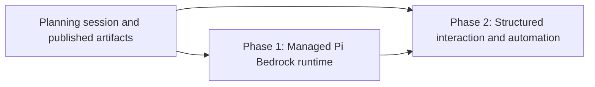

# Pi-managed Amazon Bedrock models: phased implementation

## Approved direction

The operator selected **Create phased plan and disabled backlog tasks**. This phased plan implements
the source design in [plan.md](plan.md): Amazon Bedrock remains a Pi provider, Mission Control uses
Pi's TypeScript SDK for managed sessions, and Pi retains exclusive ownership of AWS credentials and
model discovery.

## Repository findings that shape the split

1. `src/server/harness/pi/model-catalog.ts` already discovers Pi's configured provider-qualified
   model ids through a bounded, prompt-free RPC probe. Bedrock does not need another catalog.
2. `src/server/dispatcher.ts` already sends Pi terminal launches the complete `--model <id>` value.
   Terminal Bedrock support needs proof and copy, not a second provider path.
3. `src/shared/harness-capabilities.ts` and `src/server/harness/index.ts` deliberately agree that Pi
   is terminal-only and `sdk: null`. Both must change together under the existing harness contract
   test.
4. `src/server/harness/types.ts` already defines the complete provider-neutral `SdkSpec`, launch,
   handle, event, question, usage, and live-control boundary. A Pi adapter belongs behind this seam.
5. `src/server/sdk/supervisor.ts` already owns SDK session persistence, restart restoration, send,
   stop, and registry eviction. Pi must consume it, not add another session owner.
6. Pi 0.85.1 exposes `createAgentSessionRuntime`, `ModelRuntime`, `SessionManager`, typed session events,
   model/thinking controls, abort, compaction, and `ExtensionUIContext` through
   `@earendil-works/pi-coding-agent`.
7. Pi's SDK can therefore host extension questions directly. The older unimplemented
   `docs/plans/agent-sdk-sessions/phase-6-pi-rpc-driver.md` is superseded for transport choice, but its
   proven requirements for question correlation, Work Queue, and terminal handoff remain inputs.
8. Pi has no Mission MCP client. A managed Pi session still cannot run task kinds whose launch
   requires Mission MCP, and this plan must not relax the dispatch refusal.
9. Pi's permission vocabulary does not fit the closed shared `PermissionMode` union, and no measured
   multi-repository SDK grant exists. Both capabilities remain null.
10. Browser tests already fake Pi and cover catalog selection. The implementation extends those
    fixtures and never consumes real Bedrock tokens or operator Pi configuration.

## Sizing estimate and phase-count rationale

Estimated non-test implementation change: **1,100 to 1,650 lines**.

Assumptions:

- 650 to 950 lines for the pinned SDK boundary, Pi runtime/session construction, event normalization,
  controls, registry/capability wiring, error classification, and small provider-neutral supervisor
  refinements if required;
- 450 to 700 lines for project trust, the structured UI bridge, question cancellation, Work Queue
  eligibility and acknowledgements, pull-request provenance, and related projections.

Tests, fixtures, lockfile changes, and documentation are excluded from the estimate. Two phases are
justified because Phase 1 produces an independently useful managed session for direct operator use,
while Phase 2 introduces blocking user interaction and unattended automation on top of Phase 1's
event invariants. Combining them would place provider/auth/session integration, event normalization,
dialog correlation, and queue concurrency into one oversized review. Splitting further would create
test-only, documentation-only, or transport-stub merges that are not useful on their own.

## Dependency graph

Phase 2 cannot run concurrently with Phase 1. Both backlog tasks depend directly on this planning
session. Phase 2 also depends directly on the Phase 1 task.

## Phase map

| Phase | Brief | Independently useful outcome | Direct phase dependencies |
| --- | --- | --- | --- |
| 1 | [Managed Pi Bedrock runtime](phase-1-managed-pi-bedrock-runtime.md) | Operators can create, resume, control, and hand off managed Pi sessions using configured Bedrock models | None |
| 2 | [Structured Pi interaction and automation](phase-2-structured-pi-interaction-and-automation.md) | Managed Pi safely handles extension questions, project trust, Work Queue, and pull-request provenance | Phase 1 |

## Source requirement allocation

| Source-plan requirement | Owning phase | Notes |
| --- | --- | --- |
| Live Bedrock catalog and exact model id | Phase 1 | Reuse the existing catalog; add terminal and SDK regression coverage |
| Managed launch, resume, restart restore | Phase 1 | Join the shared SDK supervisor |
| Prompt, steer/follow-up, interrupt, model/thinking, clear, stop, handoff | Phase 1 | All direct operator controls land together |
| Core event and usage normalization | Phase 1 | Establishes the stable input for automation |
| Credential and provider diagnostics | Phase 1 | Pi remains the credential owner |
| Project trust | Phase 2 | Must be resolved before local executable resources load |
| Structured extension questions | Phase 2 | Builds on a stable SDK session and shared question protocol |
| Question timeout/replacement cleanup | Phase 2 | Same owner as the question bridge |
| Work Queue eligibility and acknowledgement | Phase 2 | Depends on normalized idle, turn, and question events |
| Pull-request provenance | Phase 2 | Required before managed Pi may participate in workflow automation |
| Operator and architecture documentation | Both | Each phase documents only behavior it ships; Phase 2 closes the old RPC-plan discrepancy |

No approved source-plan requirement is unassigned or assigned twice.

## Shared contracts across both phases

- The complete Pi model id remains opaque to Mission Control. Only Pi splits provider from model.
- Pi reads its own agent directory and credentials. Mission Control never accepts AWS secrets or
  persists profile/region choices.
- The adapter lazy-loads the pinned Pi SDK behind an injected dependency boundary.
- `SdkSupervisor` remains the sole managed-session owner, and final removal still goes through
  `Registry.beginEviction`.
- A missing Pi session is not recreated under an old Mission Control id.
- Mission MCP requirements remain a hard launch refusal for Pi.
- Permission mode and multi-repository capability remain null until separately measured and planned.
- Every automated test uses fakes and an isolated temp home. Real Pi/Bedrock access is manual and
  opt-in only.

## Integration and merge order

1. Merge Phase 1.
2. Rebase Phase 2 on the merged Phase 1 head.
3. Re-run Phase 2's focused, full, build, smoke, and E2E gates against that head.
4. Merge Phase 2 only after the managed lifecycle, question, and queue scenarios are green together.

The plan introduces no feature flag or schema migration. Phase 1's capability registration makes the
SDK runtime visible only when its real adapter is present. Phase 2 extends that same adapter and
shared capability records; it does not add a second rollout switch.

## Verification ownership

Phase 1 owns provider/model identity, SDK loading, new/resume/restore, normalized core events, usage,
controls, failure diagnostics, terminal regression, runtime selection UI, and package loading.

Phase 2 owns trust gating, extension UI requests, answer correlation, cancellation/timeout, queue
eligibility and acknowledgements, PR provenance, and end-to-end automation. Its regression run also
repeats the Phase 1 lifecycle paths because automation depends on them.

## Final cross-phase audit

- **Outcome audit:** Phase 1 makes Bedrock-backed managed Pi directly usable. Phase 2 completes safe
  interactive and automated operation. Together they satisfy every success criterion in `plan.md`.
- **Ownership audit:** provider/auth/model logic stays in Pi; Mission Control only adapts session and
  UI events. The harness registry, SDK supervisor, and registry eviction remain the shared sources of
  truth.
- **Compatibility audit:** terminal Pi remains supported; no AWS credential or model schema is added;
  missing SDK support fails locally; Claude and Codex traverse unchanged shared contracts.
- **Dependency audit:** Phase 2 directly consumes the Phase 1 adapter and event vocabulary, so it is
  strictly sequential. No other cross-phase edge is hidden.
- **Test audit:** no task needs real AWS or Pi state. Browser-visible changes have Playwright coverage,
  and server/package changes carry build and smoke proof.
- **Scope audit:** Bifrost, direct AWS calls, Pi MCP, permission modes, multi-repository support, and
  arbitrary Pi terminal presentation remain out of scope.
- **Cleanup audit:** documentation reconciliation is owned by the phase that makes each statement
  true. There is no later cleanup or documentation-only phase.

## Scheduled task map

Both phase tasks were created only after all six plan paths resolved at pushed commit
`818a500f7715b9be2fa476ca7cc689aac5cbd08b`. Mission Control's `create_task` tool creates enabled
tasks, so each task was immediately parked through the task update API and then read back. Both rows
were `status: backlog`, `enabled: false`, and `sessionId: null` at verification time.

| Phase | Task id | Stored state | Direct task dependencies | Planning-session edge |
| --- | --- | --- | --- | --- |
| 1. Managed Pi Bedrock runtime | `8e625014-710a-4c0d-84b9-a84f0043f0ad` | Backlog, disabled, no live session | None | Present and unsatisfied through planning task `b52bdbe6-12a2-438d-97a1-1d95c5640b94` |
| 2. Structured Pi interaction and automation | `2d6db8bc-3897-4e8d-a49c-a133314a822b` | Backlog, disabled, no live session | Phase 1 task `8e625014-710a-4c0d-84b9-a84f0043f0ad`, unsatisfied | Present and unsatisfied through planning task `b52bdbe6-12a2-438d-97a1-1d95c5640b94` |

The tasks remain disabled after scheduling. Their planning-session edges prevent premature dispatch
while this planning task is open, and the Phase 2 edge prevents it from starting before Phase 1
completes. Enabling either task later is an explicit operator action.
