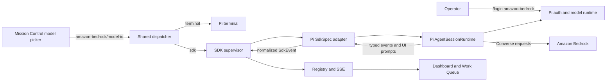

# Pi-managed Amazon Bedrock models

## Outcome

Mission Control can launch, supervise, resume, and automate Pi sessions that use models exposed by
Amazon Bedrock. An operator signs in through Pi, selects a live `amazon-bedrock/<model-id>` entry in
Mission Control's existing model picker, and may choose either Pi's terminal runtime or its managed
SDK runtime. The model id reaches Pi unchanged, Pi owns all AWS authentication and refresh behavior,
and Mission Control stores no AWS keys or profile configuration.

This plan turns the verified local path into a product capability. Pi 0.85.1 already lists Bedrock
models, `amazon-bedrock/deepseek.v3.2` completed a direct prompt and tool loop, and Mission Control's
terminal dispatcher already passes Pi's provider-qualified model ids through `--model`. The missing
piece is a first-class managed Pi runtime with the lifecycle and interaction contracts already used
by the Claude and Codex SDK adapters.

## Decisions

| Decision | Contract |
| --- | --- |
| Harness ownership | Bedrock is a Pi provider, not a fourth Mission Control harness. Pi remains the source of truth for provider discovery, credentials, model metadata, and inference. |
| Authentication | The operator runs Pi's `/login amazon-bedrock` flow. Mission Control never reads, copies, persists, or displays AWS secrets. The managed runtime uses Pi's normal agent directory and credential runtime. |
| Model identity | Preserve the full Pi id, for example `amazon-bedrock/deepseek.v3.2`, from discovery through dispatch. Do not add a Bedrock allowlist or translate ids into AWS API payloads. |
| Managed transport | Pin `@earendil-works/pi-coding-agent` and use its TypeScript SDK. Build on `createAgentSessionRuntime`, `ModelRuntime`, `SessionManager`, typed session events, and `ExtensionUIContext`. Do not introduce a hand-written RPC protocol while the supported SDK exposes the required seams. |
| Runtime choice | Keep the existing Pi terminal path. Add `sdk` through the existing `SdkSpec` registry so dispatch, restore, shutdown, handoff, and eviction remain daemon-owned and shared. |
| Project resources | Honor Pi's project-trust decision before loading project-local extensions, skills, prompts, or context. A managed session fails closed or asks through the existing structured question surface. It never silently trusts a checkout. |
| Extension UI | Project Pi's `select`, `confirm`, `input`, and `editor` requests into Mission Control's existing correlated SDK question events. Unsupported presentation-only UI features become diagnostics, not hanging promises. |
| Automation | Work Queue support is enabled only after Pi emits normalized idle/busy, turn completion, question, and pull-request provenance events. Terminal Pi remains ineligible for SDK-only automation. |
| Deliberate exclusions | No Bifrost coding-tool key, direct AWS SDK client, Mission MCP client inside Pi, Pi permission-mode mapping, or Pi multi-repository claim. Those require separate evidence and contracts. |

## Why the Pi SDK is the right boundary

The Pi package now exposes an SDK at the same architectural level Mission Control needs:

- `createAgentSessionRuntime` owns new, resume, fork, and replacement-safe session state;
- `ModelRuntime` resolves configured provider credentials and models, including Bedrock;
- `AgentSession` exposes typed events, prompt, steer, follow-up, abort, compaction, model selection,
  thinking level, and disposal;
- `bindExtensions` accepts an `ExtensionUIContext`, which lets a non-terminal host fulfill structured
  extension prompts without reverse engineering the terminal renderer;
- `SessionManager` persists and reopens Pi's own JSONL session format.

That is functionally equivalent to the role the Claude and Codex SDKs play in Mission Control. The
adapter should still isolate the vendor import behind a thin injected dependency seam, as the current
Claude and Codex adapters do. This keeps event normalization testable without loading credentials or
spending model tokens.

Pi's RPC mode remains a diagnostic fallback for manual comparison during implementation, not a
production transport. Choosing both SDK and RPC would create two session-lifecycle implementations,
two event decoders, and ambiguous resume ownership.

## Current-state findings

### The terminal path is already Bedrock-capable

`src/server/harness/pi/model-catalog.ts` runs Pi's prompt-free model catalog request and returns
provider-qualified ids. `src/server/dispatcher.ts` sends the selected id as `--model <id>`, while
`src/server/harness/pi/launch.ts` supplies Mission Control's exact session id and initial task. This
means the terminal runtime needs regression coverage and clearer setup guidance, not a new provider
implementation.

### Pi is deliberately terminal-only today

`src/shared/harness-capabilities.ts` advertises only `terminal` for Pi, and
`src/server/harness/index.ts` registers `sdk: null`. The shared SDK supervisor already owns the
durable lifecycle that a Pi adapter should join. Bypassing it would duplicate persistence, restart,
shutdown, and `Registry.beginEviction` behavior.

### The shared adapter contract is sufficient

`src/server/harness/types.ts` defines `SdkSpec`, `SdkLaunchOptions`, `SdkSessionHandle`, and normalized
`SdkEvent` values. `src/server/sdk/supervisor.ts` persists lifecycle and usage, restores sessions
after daemon restart, and routes all final removal through the registry. Claude and Codex adapters
provide the injection and lazy-import pattern Pi should follow.

### Structured questions are the critical compatibility seam

Pi extensions may block on `select`, `confirm`, `input`, or `editor`. The SDK exposes
`ExtensionUIContext`, and `AgentSession.bindExtensions` applies it to the extension runner. Mission
Control must correlate each request to one answer, cancel it on session replacement or shutdown, and
never leave an extension promise hanging. This contract belongs after the basic SDK lifecycle is
stable because it also gates safe Work Queue automation.

### Credential errors need product-grade diagnostics

The model picker is live and may show a provider before its AWS session expires. The adapter must
distinguish at least: Pi not installed or SDK unavailable, no `amazon-bedrock` login, expired AWS SSO
or profile, Bedrock model-access denial, unavailable region/model, and ordinary provider errors. The
message should tell the operator to repair the credential in Pi, never ask them to paste a secret into
Mission Control.

## Architecture

The model catalog and both runtimes converge on Pi-owned configuration. Mission Control owns session
coordination and UI projection. Neither side duplicates the other's source of truth.

## Functional requirements

1. Pi continues to discover its model catalog without prompting, and provider groups include
   `amazon-bedrock` whenever Pi reports configured Bedrock models.
2. A selected Bedrock model id is stored and dispatched without truncation, aliasing, or provider
   translation in both terminal and SDK runtimes.
3. Pi advertises `terminal` and `sdk` only when the server registry has a working Pi SDK spec. Stored
   unsupported runtime values continue through `resolveSessionRuntime` fallback behavior.
4. The SDK adapter launches a new Pi session in the allocated worktree and binds the exact Mission
   Control session id to a durable Pi session file.
5. The SDK adapter resumes that exact Pi session after normal navigation and daemon restart. Missing
   or corrupt session files fail explicitly and do not create a look-alike conversation.
6. Initial prompts and later sends map to `prompt`; busy-session user messages use Pi's steer or
   follow-up behavior according to the existing `sendIfIdle` contract.
7. Pi session events normalize into bound, state, activity, assistant text/thinking, tool start/update/
   result, usage, turn completion, question, and exit events without double counting a turn.
8. Interrupt uses Pi's abort path and returns the session to an honest idle or failed state. Stop and
   replacement dispose resources exactly once and remove sessions only through `Registry.beginEviction`.
9. Model and thinking selections are applied session-locally. Mission Control never rewrites Pi's
   global defaults while launching a task.
10. Clear context uses Pi's new-session replacement contract while preserving the Mission Control
    session identity and updating the persisted driver session reference atomically.
11. Handoff to terminal reopens the same Pi session rather than creating a new one.
12. Pi project trust is checked before project-local resources load. Denial produces a usable session
    without those resources or a clear refusal, according to Pi's SDK contract.
13. Structured extension UI requests appear as correlated Mission Control questions. One answer,
    timeout, session replacement, or stop settles each request exactly once.
14. Work Queue may target a managed Pi session only when it is idle, question-free, and able to emit a
    reliable turn-complete event. Queue acknowledgement and retry semantics remain shared.
15. Any pull request created by Pi is attributed from observed tool output using the existing SDK
    provenance contract, not inferred from prose.
16. Operator documentation explains Pi Bedrock login, model selection, terminal versus managed
    runtime behavior, credential refresh, and the deliberate absence of stored AWS credentials.

## Failure and compatibility contracts

| Condition | Required behavior |
| --- | --- |
| Pi SDK package cannot load | Refuse managed Pi launch with a focused diagnostic; terminal Pi remains available. |
| Bedrock is not configured in Pi | The live catalog omits it or launch reports how to run `/login amazon-bedrock`; no Mission Control credential form appears. |
| AWS SSO or profile expires | Session reports a recoverable provider failure naming Pi login/refresh as the repair path. No automatic credential mutation. |
| Stored model disappears | Preserve the stored id in the picker fallback, fail launch clearly if selected, and do not silently substitute a paid or closed model. |
| Pi session file is absent/corrupt | Refuse resume and surface the actual condition. Never start a fresh session under the old Mission Control id. |
| Daemon stops during a turn | Dispose/abort through the supervisor, persist the last honest state, and let startup restoration use the established SDK rules. |
| Project trust is undecided | Do not load project-local executable resources until the decision is resolved. |
| Question loses its consumer | Cancel or time out the Pi UI promise and emit an explanatory event. Do not deadlock the session. |
| Unsupported Pi UI method | Emit a diagnostic and return a defined cancellation value. Presentation-only widgets do not become durable dashboard state. |
| Terminal Pi task enters Work Queue | Keep the existing SDK-runtime refusal. |

Backward compatibility is additive. Existing Pi terminal sessions, stored Pi models, and model
catalog behavior continue to work. No SQLite schema migration is expected: the existing runtime,
driver session id, usage, question, and event records are reused. If implementation proves a new
persisted field is essential, it must be added through `src/server/db.ts`'s normal additive upgrade
path and documented as a deviation before code is merged.

## Implementation map

| Area | Expected ownership |
| --- | --- |
| Package pin and bundle | `package.json`, `package-lock.json`, server build and smoke inputs |
| Pi vendor isolation | New focused `src/server/harness/pi/sdk-deps.ts` |
| Pi adapter and event normalization | New focused modules under `src/server/harness/pi/` |
| Harness registration | `src/server/harness/index.ts` |
| Capability projection | `src/shared/harness-capabilities.ts` |
| Shared lifecycle reuse | Existing `src/server/sdk/supervisor.ts`, control, store, restore, and registry seams; extend only where a provider-neutral contract is missing |
| Structured questions | Existing SDK question event and answer route, backed by a Pi `ExtensionUIContext` bridge |
| Work Queue | Existing shared eligibility and send/ack paths; Pi-specific code only normalizes events |
| Browser coverage | Existing Pi model-catalog and SDK runtime E2E fixtures/specs; never contact Bedrock in tests |
| Documentation | `docs/sessions.md`, model/provider setup guidance, and the older unimplemented Pi RPC phase |

## Verification strategy

Automated tests must use injected fake Pi SDK dependencies and the existing fake-agent E2E harness.
They must not read the operator's `~/.pi`, contact AWS, renew SSO, or spend model tokens.

- Unit tests pin provider-qualified Bedrock id parsing, session construction, event ordering, usage
  mapping, model/thinking selection, steer/follow-up, abort, clear, resume, restore, question cleanup,
  project trust, and error classification.
- Harness contract tests prove Pi exposes the managed runtime through the shared registry without
  introducing Pi-specific branches in dispatcher routes.
- Supervisor and restart tests prove exact session restoration, one-time disposal, and registry-owned
  eviction.
- Browser E2E covers live-provider grouping from a fake catalog, selecting a Bedrock model, choosing
  SDK, dispatching, receiving progress, answering an extension question, interrupting, clearing,
  handing off to terminal, and queuing follow-up work.
- Package smoke proves the pinned Pi SDK and its required assets load from the built server bundle and
  packaged application.
- The implementation runs focused tests first, then `npm run typecheck`, `npm run lint`, `npm test`,
  `npm run build`, `npm run smoke`, and `npm run test:e2e`. Run `npm run package` when the SDK's asset
  loading differs between the checkout and packaged application.
- A final opt-in manual check may use the operator's existing Pi login to dispatch one harmless
  Bedrock prompt. It is supplemental evidence and must never become a required CI test.

## Delivery shape

Estimated non-test production change: **1,100 to 1,650 lines**.

Assumptions:

- 650 to 950 lines for the SDK dependency seam, model/auth/session construction, event normalization,
  lifecycle controls, registry/capability wiring, failure diagnostics, and any provider-neutral
  supervisor refinements;
- 450 to 700 lines for project trust, the `ExtensionUIContext` bridge, question correlation,
  Work Queue and pull-request provenance integration, and visible runtime-state projection.

Tests, fixtures, generated lockfile changes, and documentation are excluded. The work is split into
two mergeable phases because manual managed sessions are independently useful, while structured
extension interaction and unattended queue eligibility build on a proven event/lifecycle core and
carry materially different concurrency risks.

Phase 1 delivers a production-usable managed Pi runtime for direct operator sessions, including
Bedrock models. Phase 2 adds structured extension interaction and automation parity. Phase 2 depends
directly on Phase 1; the phases must not run concurrently.

## Non-goals

- Implementing an Amazon Bedrock client inside Mission Control.
- Storing AWS access keys, SSO cache material, profile names, or region overrides in Mission Control.
- Routing coding-agent traffic through Bifrost.
- Maintaining a Mission-owned list of open-weight models.
- Adding MCP client support to Pi.
- Inventing Pi permission modes or claiming multi-repository support without provider evidence.
- Replacing or removing Pi's terminal runtime.
- Generalizing arbitrary Pi widgets, headers, footers, themes, or terminal keybindings into dashboard
  UI.
- Changing Claude or Codex runtime behavior except where a shared regression test proves the existing
  contract.

## Documentation reconciliation

`docs/plans/agent-sdk-sessions/phase-6-pi-rpc-driver.md` describes an earlier, unimplemented RPC
approach. This plan supersedes that transport choice because Pi now publishes a first-class SDK with
session runtime and UI-host contracts. The planning change marks the older phase as superseded; the
implementation updates product documentation as each capability actually lands.

## Success criteria

- A configured `amazon-bedrock/*` model can be selected and dispatched through both Pi runtimes with
  its exact id preserved.
- The managed Pi session survives navigation and daemon restart, supports send/interrupt/clear/stop/
  handoff, and reports honest usage and terminal state.
- Pi credentials remain entirely Pi-owned and no secret-bearing data enters Mission Control state,
  logs, task intents, or tests.
- Project-local executable resources never load before trust is established.
- Structured Pi questions can be answered from Mission Control without orphaned promises.
- Work Queue uses managed Pi only after event and question invariants are proven.
- Existing terminal Pi, Claude, and Codex behavior remains green.
