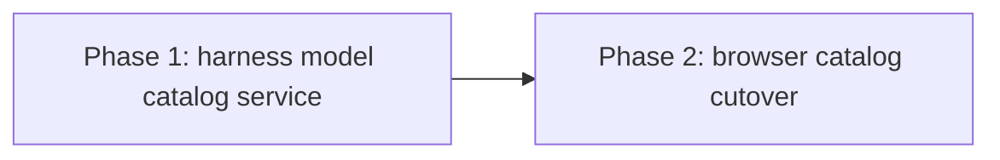

# Pi live model catalog: phased implementation

Source plan: [plan.md](plan.md) ([rendered](plan.html)). Supporting evidence:
[investigation report](../../reports/pi-model-catalog-source/report.html) and
[planned request sequence](../../../.docs/architecture/sequences/pi-model-catalog.md).

The implementation is divided into two serial merge units. Phase 1 makes the daemon able to
resolve a safe, account-aware model catalog through the exhaustive harness registry. Phase 2
atomically moves every browser picker onto that service, including the Pi picker the original
investigation missed in Foreman's backlog defaults.

Each phase document is an implementation brief, not a frozen patch recipe. The implementer must
re-read adjacent ownership patterns, follow the phase where the repository agrees, and record any
necessary deviation and its reasoning in the pull request.

## Incorporated human decisions

| Decision | Selection | Consequence |
| --- | --- | --- |
| Pi catalog | Mirror every model Pi reports available | No curated live shortlist or provider allowlist |
| Presentation | Group by provider | Every Pi choice retains its provider identity through the browser contract |
| Failure posture | Keep selection and dispatch usable | A failed probe falls back to a stale successful cache or shipped choices |
| Persistence | Keep the existing model-id path | No SQLite migration and no change to `--model provider/id` launch behavior |
| Delivery | Create and schedule phased work | One dependency-linked Mission Control task is created per phase |

## Phase sizing

The estimated non-test implementation is **600 to 850 lines**. The server half is approximately
350 to 500 lines for shared wire contracts, an exhaustive harness capability, Pi RPC framing and
validation, process bounds, cache policy, daemon wiring, and the aggregate route. The browser half
is approximately 250 to 350 lines for the shared provider, grouped option rendering, six consumer
integrations, visible fallback state, and documentation. Tests and e2e fakes are additional.

One phase would combine a security-sensitive child-process protocol with a broad React cutover and
two unrelated test harnesses. That is too much process, compatibility, UI, and e2e behavior for one
mid-tier implementation session to verify and explain reliably. Phase 1 is a useful merge boundary:
it ships a complete, bounded, generic API that can be tested without changing any picker or adding a
temporary browser source of truth. Phase 2 then changes every picker in one atomic cutover. A third
phase would either split the service from its route or leave some pickers live and others static, so
it would add handoff risk without an independently coherent result.

## Repository findings that shaped the phases

- `MODEL_CATALOG` and `modelChoicesFor` in `src/shared/model.ts` are the current option source. The
  comment that neither CLI exposes a machine-readable account list is false for installed Pi 0.84.2.
- The installed Pi returns structured full model objects for RPC `get_available_models`. A
  no-session, prompt-free, offline probe returned 38 account-available OpenAI rows in under one
  second. All 38 derived `provider/id` strings pass the existing `ModelIdSchema`.
- `Harness` in `src/server/harness/types.ts` already names `models` as the next server-owned
  capability. `HARNESSES` is the exhaustive registry, so the route must ask that capability rather
  than branch on `agent === "pi"`.
- `buildApp` receives daemon-owned services as optional parameters appended to its positional
  signature. A catalog service needs the same pattern so focused route tests can inject time and
  discovery behavior without spawning an operator's Pi binary.
- The source plan proposed invalid-agent route coverage, but the browser needs every catalog at
  once. An aggregate `GET /api/harnesses/models` response keyed exhaustively by `AgentType` has no
  agent path parameter to reject, avoids three requests, and makes a partially missing harness a
  schema failure rather than a 404. This phased plan adopts the aggregate route.
- The daemon cannot merge every possible current off-catalog value into one global response. A
  current value can live in Harnesses config, a new or backlog task, a schedule, an ensemble member,
  or Foreman's backlog defaults. The browser resolver must retain the value at each consumer, as
  `modelChoicesFor` does today.
- The original call-site inventory missed `ModelField`. `ForemanSettingsPanel` passes all three
  `AgentType` values to it for backlog-task defaults, including Pi. It is a dispatch-time picker and
  must join the Phase 2 cutover. The same component's Claude/Codex-only LLM runner uses remain
  behaviorally unchanged.
- The complete browser cutover is six consumers: `HarnessesPanel`, `DispatchModal`,
  `ScheduleEditor`, `EnsembleDispatch`, `ModelField`, and the label lookups embedded in Dispatch and
  Ensemble summaries. Leaving any one on `modelChoicesFor` would preserve a second visible source.
- The architecture guide forbids browser polling as a live channel. The catalog provider performs
  one HTTP read when it mounts. Server-side freshness and explicit retry can reuse that request; no
  timer is added to the browser.
- The e2e daemon redirects `MISSION_PI_BIN` to a loud unimplemented stub. Phase 2 must replace it
  with an RPC-only fake that refuses every non-probe invocation, preserving the suite's zero-token
  guarantee.
- No durable schema changes are needed. The existing safe provider-qualified id is still the only
  value written to config, task, schedule, or ensemble contracts and passed to Pi.

## Phases

| # | Phase | File | Delivers | Direct prerequisites |
| --- | --- | --- | --- | --- |
| 1 | Harness model catalog service | [phase-1-harness-model-catalog-service.md](phase-1-harness-model-catalog-service.md) | Safe Pi RPC discovery, exhaustive harness capability, cache and fallback policy, aggregate daemon API | none |
| 2 | Browser catalog cutover | [phase-2-browser-catalog-cutover.md](phase-2-browser-catalog-cutover.md) | One browser catalog provider, provider-grouped Pi choices in every picker, fallback UX, fake-Pi Playwright proof, docs | Phase 1 |

## Dependency graph and merge order

The phases are serial. Phase 2 consumes the response contract and refresh semantics Phase 1 owns,
and both phases touch `src/shared/model.ts` and catalog contract tests. There are no concurrency
groups. Merge order is Phase 1, then Phase 2.

## Cross-phase contracts

- **C1, one harness owner (Phase 1):** every server harness has a required model-catalog spec.
  Claude and Codex explicitly return shipped data; Pi explicitly supplies discovery plus fallback.
  Generic routes, cache code, and browser code never branch on the Pi agent id to start a process.
- **C2, bounded safe wire shape (Phase 1):** the browser receives only validated ids, bounded
  labels and provider names, presentation metadata, source, refresh time, and a non-secret problem
  code. Raw Pi objects, auth details, cost fields, environment values, stdout, and stderr never cross
  the route.
- **C3, no model work (Phase 1):** discovery uses the configured Pi binary, creates no session,
  sends no prompt, disables project-local resources and tools, and is bounded by measured time,
  bytes, rows, and string lengths.
- **C4, cache semantics (Phase 1):** concurrent reads share one probe. A valid success replaces the
  in-memory last-success entry. Failure returns that stale entry when one exists, otherwise shipped
  fallback. SQLite never stores discovered catalogs.
- **C5, aggregate route (Phase 1):** `GET /api/harnesses/models` returns one exhaustive catalog per
  `AgentType`. It is an ordinary loopback-protected read and does not enter the SSE snapshot.
- **C6, existing persistence (Phase 1):** `ModelIdSchema` and every selected-model write and launch
  path remain unchanged. Catalog discovery authorizes presentation, not dispatch.
- **C7, one browser source (Phase 2):** a root catalog provider owns the one fetch and exposes one
  resolver. Every `modelChoicesFor` UI call site moves to it in the same phase. Shared pure helpers
  may retain `MODEL_CATALOG` as initial and failure data, not as a second live store.
- **C8, complete mirroring (Phase 2):** Pi choices are neither curated nor provider-filtered. The UI
  groups all validated rows by provider, preserves deterministic Pi order within each provider, and
  deduplicates by the full provider-qualified id.
- **C9, retained selection (Phase 2):** every picker adds its current value when the resolved
  catalog omits it. A cache refresh, fallback, downgrade, or unrelated edit cannot erase a stored
  selection.
- **C10, usable degradation (Phase 2):** loading and failure never disable an otherwise writable
  picker. A compact note distinguishes live data from a failed or stale read and offers a bounded
  retry through the same provider.
- **C11, zero-token tests (Phase 2):** the e2e Pi fake answers only the exact model-catalog RPC
  protocol and fails loudly for agent launches. No test reaches an installed provider.

## Compatibility strategy

There is no database migration and no wire change to dispatch, tasks, Harnesses config, schedules,
or ensembles. Phase 1 adds a read-only route and a required server capability while the dashboard
continues using shipped choices. Older Pi versions, missing binaries, custom wrappers, malformed
responses, and accounts with no available providers degrade through the same fallback result.

Phase 2 changes choice production only. A saved id remains valid whether or not discovery currently
reports it, and the exact id still follows the existing schema and launch path. Claude and Codex use
the new browser provider but receive the same shipped choices and ordering as before.

## Plan-wide verification

Both phase pull requests run their focused tests, `npm run typecheck`, `npm run lint`, `npm test`,
`npm run build`, and `npm run smoke`. Phase 2 additionally runs its focused Playwright spec and the
complete `npm run test:e2e` gate because it changes visible controls. UI evidence is written only to
the gitignored e2e artifacts area and attached to the pull request when useful.

After both phases merge, one fake-Pi browser flow proves a model absent from the shipped fallback is
grouped under its provider, selectable in Harnesses and dispatch-time surfaces, persisted as the
exact `provider/id`, retained across reload, and still retained when a later probe fails. Unit and
HTTP tests prove protocol correlation, allowlisting, bounds, cleanup, cache behavior, and generic
registry ownership.

## Plan-wide non-goals

- Dynamic Claude or Codex discovery;
- model API calls that test whether each returned row can complete a prompt;
- SQLite persistence for discovered catalogs;
- per-model reasoning-effort redesign;
- changes to selected-model storage or Pi launch arguments;
- parsing Pi's human-formatted `--list-models` table;
- browser polling or a second live event channel.

## Cross-phase audit record

- 2026-08-18: traced the static catalog, all browser consumers, Harness ownership, route-service
  injection, existing persistence, Pi RPC documentation and installed behavior, and the e2e agent
  redirection against repository commit `50b7467b`.
- 2026-08-18: added `ModelField` to the browser cutover after finding Foreman's Pi backlog-default
  picker, which the source investigation did not enumerate.
- 2026-08-18: selected one aggregate route instead of a per-agent route. It matches the required
  one-fetch browser store and removes invalid-agent input rather than adding a route family.
- 2026-08-18: kept the entire browser change in Phase 2. A partial cutover would make model options
  depend on which picker the operator opened and recreate the competing-source defect this work is
  meant to remove.
