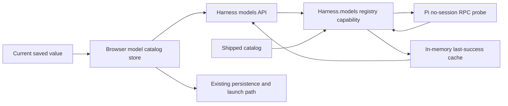

# Pi live model catalog proposal

Status: Approved for phased implementation and scheduling.

Source report: [Pi model catalog sourcing investigation](../../reports/pi-model-catalog-source/report.html)

## Approved human decisions

- **Catalog presentation:** mirror every model Pi reports available, grouped by provider.
- **Implementation follow-up:** create a merge-aware phased plan and schedule its dependency-linked implementation tasks.

## Outcome

Mission Control should source Pi model choices from the Pi installation and account it will actually launch, while remaining usable when discovery is unsupported or fails. Selecting a model must continue to persist and launch the same safe provider-qualified `provider/id` value used today.

## Evidence driving the proposal

- `src/shared/model.ts` currently compiles four Pi choices into every picker.
- Pi 0.84.2 reports 38 available models on this machine through both `--list-models` and RPC `get_available_models`.
- Only three of the four shipped rows appear in Pi's current available list; 35 Pi-reported rows are missing from Mission Control.
- RPC returned the full list as structured JSON in under one second, used no session and sent no prompt.
- All 38 derived `provider/id` values pass the existing `ModelIdSchema`.
- The server harness interface already identifies `models` as a future harness-owned capability in `src/server/harness/types.ts`.

## Scope

### In scope

1. A harness-owned model catalog capability, with explicit live discovery and fallback behavior.
2. Structured Pi discovery through its resolved binary and RPC `get_available_models` command.
3. A browser-safe API contract and one shared client catalog store for every dispatch-time picker.
4. Preservation of the harness-default row and any saved off-catalog model.
5. Visible fallback/staleness behavior that never prevents dispatch solely because discovery failed.
6. Focused server, contract, rendering, and Playwright coverage, plus behavior documentation.

### Out of scope

- Changing how selected models are persisted or passed to Pi.
- Invoking model APIs to test every listed model.
- Dynamically sourcing Claude or Codex catalogs in the first change. They use the same harness contract but retain shipped results.
- Redesigning Pi's reasoning-effort picker from per-harness to per-model metadata.
- Persisting discovered catalogs in SQLite.

## Decision: source and fallback

Use Pi's structured RPC command as the primary source. Do not parse the human table unless a future compatibility need proves it necessary.

The Pi adapter will:

1. Resolve the binary through the same `resolveAgentBin("pi")` path used by dispatch.
2. Start a short-lived, no-session RPC process with project-local resources disabled.
3. Send one correlated `get_available_models` JSON line.
4. Ignore unrelated RPC events and accept only the matching successful response.
5. Map only allowlisted fields needed by Mission Control: provider, ID, name, context window, reasoning support, and input modes.
6. Construct `provider/id`, validate it with `ModelIdSchema`, deduplicate it, and apply measured bounds for subprocess time, output bytes, and model count.
7. Exit on success or failure and return a typed discovery result with no credential data.

The daemon will keep the last successful result in memory and deduplicate concurrent probes. On missing binary, unsupported command, no available provider, invalid output, timeout, or child failure, it will return the last successful or shipped fallback. The browser resolver then merges the current off-catalog value at each picker, because saved values can live in several unrelated configs and drafts. Failure is a catalog-quality state, not a dispatch outage.

## Changed request flow

Today the browser imports `MODEL_CATALOG.pi` directly and sends a selected value through the existing config/task path.

After this change:

The new flow ends at choice production. `ModelIdSchema`, config/task persistence, and `--model provider/id` launch behavior stay unchanged.

## Implementation sequence

### 1. Contract and harness ownership

- Add shared schemas/types for a bounded harness model catalog response and its source/status.
- Add a required server-only model capability to `Harness` so every harness must explicitly provide static or discovered choices.
- Keep `MODEL_CATALOG` as the shipped fallback and pure-label source while separating fallback data from runtime discovery.
- Add exhaustive registry tests that prevent a new harness from silently omitting its model behavior.

### 2. Pi structured discovery

- Write failing tests around a fake RPC child for a valid response, events before the response, malformed JSON, wrong correlation ID, timeout, excessive output, duplicate/unsafe IDs, no available models, and non-zero exit.
- Implement the Pi adapter with exact argv boundaries, no shell, no session, no prompt, project-local resources disabled, and bounded stdout/stderr.
- Map only safe presentation fields and derive provider-qualified IDs.
- Feature-detect by behavior. Do not require Pi 0.84.2 based on one installed sample.

### 3. Daemon route and cache

- Add aggregate `GET /api/harnesses/models`, dispatching through the registry rather than branching on `agent === "pi"`.
- Return live/fallback source, last successful refresh time, and a bounded user-facing error state.
- Deduplicate concurrent probes and keep only an in-memory last-success result.
- Add HTTP tests for live, fallback, stale-cache, exhaustive-agent, and missing-service responses.

### 4. Browser catalog store and consumers

- Fetch catalog data once through a shared hook/context rather than adding a separate request in each picker.
- Feed Harnesses settings, Dispatch, Schedules, Ensemble dispatch/summary, and Foreman's per-harness backlog defaults from the same resolved choices.
- Preserve `Harness default` and merge the current saved value when absent from both live and fallback results.
- Mirror every Pi-available model and group the complete result by provider.
- Show a compact fallback note when Pi discovery failed without disabling selection or dispatch.

### 5. End-to-end behavior and documentation

- Extend the fake Pi binary to answer the RPC model probe without contacting a provider.
- Add a Playwright spec proving a dynamically returned Pi model appears, can be selected, reaches the exact persisted provider-qualified ID, survives reload, and falls back without losing the saved value.
- Update the models/harness documentation to explain that Pi choices reflect the locally installed and configured Pi catalog, when they refresh, and what fallback means.
- Run focused tests, typecheck, lint, build, smoke, and the relevant Playwright spec, then the full required UI gate.

## Compatibility and safety rules

- Use the configured Pi binary, including `MISSION_PI_BIN` overrides.
- Never invoke a model or create a session during discovery.
- Never expose Pi's full raw model object, auth state, headers, or credentials to the browser.
- Never load project-local Pi extensions while probing a catalog from an arbitrary repository.
- Apply a timeout, byte cap, row cap, ID schema, and deterministic deduplication before returning any collection.
- Preserve the last selected off-catalog value and never replace it during an unrelated edit.
- Treat discovery as optional capability quality. Existing dispatch must continue on fallback.

## Verification

- Unit tests prove RPC framing, allowlisted mapping, bounds, process cleanup, and failure fallback.
- Contract/HTTP tests prove registry ownership and response status.
- Static React tests prove loading, live, fallback, and retained-selection markup.
- Playwright proves the visible option-to-route-to-persisted-value loop with the fake Pi binary.
- No test may invoke a real agent provider or spend model tokens.

## Claims and assumptions

- Verified: the current picker is static, Pi RPC is structured and account-aware, and current IDs fit the existing schema.
- Verified: the probe can be no-session and prompt-free.
- Approved product choice: mirror every Pi-available model, grouped by provider.
- To measure during implementation: safe output/model-count bounds across configured providers and the refresh policy for remote dynamic catalogs. These values must be measured before they become constants.
