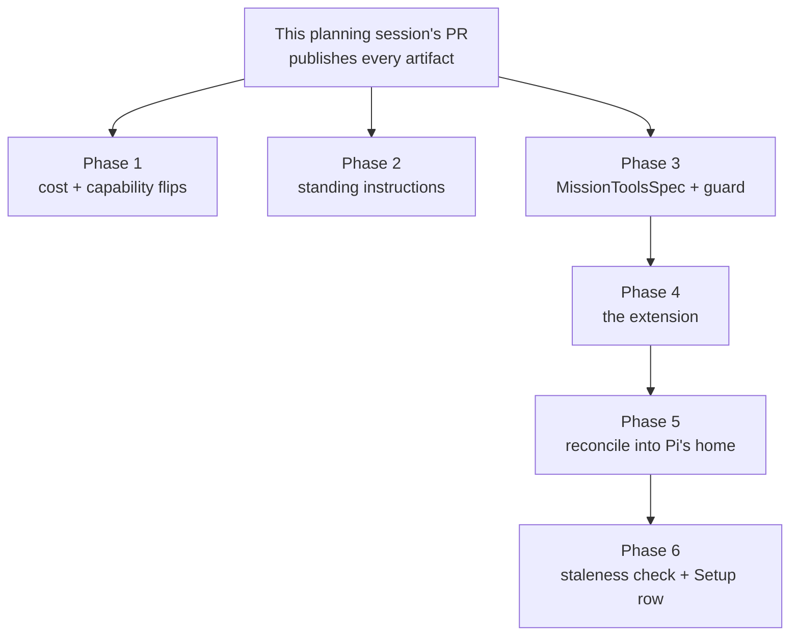

# Pi parity: phased implementation

The implementation index for [`plan.md`](plan.md). That plan is the approved goal and its
decisions are settled; this document is how the work is split into merge units, what the
repository said when each assumption was tested against it, and which task owns which phase.

## Incorporated decisions

Answered in the Mission Control dashboard on 2026-09-10 and treated here as requirements, not
options:

| Decision | Answer |
| --- | --- |
| Tools mechanism | **Bridge `dist/mcp/server.mjs` over stdio**, not a native reimplementation |
| Distribution | **Reconciled symlink in `~/.pi/agent/extensions/`**, not `pi install`, not the `settings.json` `extensions` array |
| Staleness | **Report only**, matching `claude-hooks.ts`. No auto-repair, and no one-press remedy on the Setup row |
| First cut | **Cost only.** Standing instructions, the capability guard and the extension were offered and not selected |
| Capability flips | **Both taken now**: `workQueue` on the strength of `agent_settled`, `multiRepoDispatch` as an empty grant |
| Follow-up | Create this phased plan |

## What the repository said when the plan was tested against it

Five findings, each measured after the decisions were taken. Three of them change a phase and
one of them narrows what the first cut delivers, so they are recorded here rather than absorbed
into the phase files quietly.

### 1. Hand-run Pi cost is not reachable in Phase 1. It moves to the extension.

`plan.md` claimed cost would work on hand-run sessions "because passive discovery already
locates the transcript". It does not.

- `startUsagePoller` skips any session without `agentSessionId`
  (`src/server/usage.ts:48`), and `locatePiTranscript` returns null without one
  (`src/server/harness/pi/transcript.ts:82`).
- A **dispatched** Pi session has one: `preparePiLaunch` passes `--session-id <uuid>`
  (`src/server/harness/pi/launch.ts`), and Pi writes that id verbatim into both the filename
  and the transcript header - measured.
- A **hand-run** Pi session has none, and cannot be given one the way Codex's is.
  `annotateCodexRollouts` works entirely off the rollout file the Codex process holds **open**
  (`src/server/discovery/codex-rollouts.ts`), and Pi was measured **not to hold its session
  file open at all**: driven over `--mode rpc` until `agent_settled`, with the file confirmed
  on disk, `lsof -a -p <pid> -Fn | grep jsonl` returned nothing.

A cwd-plus-newest-file heuristic was considered and rejected. The poller's own comment states
the rule - "cwd and a synthetic discovery id are never enough to attach dollars to a card" -
and two Pi sessions in one checkout would be indistinguishable. The extension already knows the
answer exactly (`ctx.sessionManager.getSessionId()`), so hand-run identity is **Phase 4's**,
and hand-run cost arrives with it. Phase 1 delivers dispatched-session cost and says so.

### 2. Pi cannot be re-priced locally, so `HarnessUsageEvent` must carry a vendor cost.

`plan.md` leaned toward re-pricing from `MODEL_CATALOG.pi`. That catalog carries **no rates** -
it is id, label, hint, provider, context window, reasoning and input modes
(`src/shared/model.ts:138`) - and Pi is multi-provider across the thirty-odd providers its
`--help` lists, so a local price table for Pi would have to track all of them.

Pi's own per-message `cost` object is the only viable source, and `UsageSpec.estimate(event)`
receives only a `HarnessUsageEvent`, which has no cost field. Phase 1 therefore widens
`HarnessUsageEvent` with an optional vendor-reported cost that `estimate` passes through.
Claude and Codex leave it null and keep pricing from their own tables, so no existing row
changes. `codex/usage.ts:109` and `llm/codex.ts:429` are the only two constructors.

### 3. The empty `multiRepoDispatch` grant contradicts an existing test invariant.

`test/multi-repo-policy.test.ts:118` asserts that **any non-null** `multiRepoDispatch` renders
at least one flag naming every directory, with the stated reason that "a spec that renders no
flags would be a harness advertising a grant it does not make, which is worse than declaring
null". A literal `launchArgs: () => []` fails it.

The decision is kept and the shape changes: `MultiRepoDispatchSpec` becomes a discriminated
union, so Pi declares *why* it needs no flags instead of returning an empty array that reads
like a bug.

```ts
export type MultiRepoDispatchSpec =
  | { kind: "flags"; launchArgs: (dirs: readonly string[]) => string[]; sdk: boolean }
  | { kind: "no-boundary"; why: string; sdk: boolean };
```

This preserves the invariant (a `"flags"` spec must still render flags), keeps the human's
decision (Pi is offered for multi-repo tasks), and makes the two existing `launchArgs` call
sites - `dispatcher.ts:366` and `codex/sdk.ts:1421` - state the branch rather than assume a
renderer exists. Phase 1 owns the union because Phase 1 is what introduces the second variant.

### 4. Flipping `workQueue` is safe, and the test suite will say so.

`foremanAutomationAuthorized` (`src/server/harness/index.ts:350`) reads:

```ts
if (!harness.workQueue) return false;
if (session.runtime === "sdk") return true;
if (!harness.hooks) return false;
return harness.hooks.scope === "machine" || session.hooksSeen;
```

With `workQueue` non-null and `hooks` still null, a Pi terminal session is refused at the third
line. The browser half, `workQueueBlockedReason`, returns `queue.uninstrumentedWhy` whenever
`hooksSeen` is false, so the panel hides its add box - the two halves agree arm for arm, which
is what that function's comment requires. `hooksSeen` cannot become true for Pi in the
meantime: `Registry.applyHook` returns immediately when `hooksFor(evt.agent)` is null
(`src/server/registry.ts:2890`).

One test is designed to fail on this and must be answered rather than edited around:
`test/harness-capabilities.test.ts:156` keeps a `BY_FIXTURE` list of capabilities with no real
null declarer. `workQueue` loses its last one here, so it moves **into** `BY_FIXTURE` and gains
a `withCapabilityNull` fixture.

**What the sentence may say, though, is bounded by the merge order** - a review correction. Phase
1 can merge alone, and nothing installable exists until Phase 5, so an `uninstrumentedWhy` that
tells the operator to install the Pi integration points at a button that is not in the app: worse
than the permanent-incapacity sentence it replaces, which was at least true. The sentence is
therefore factual in Phases 1 and 4, actionable from Phase 5 (the first merge that provides a
switch), and names the Setup row in Phase 6. Recorded in the contract table above so no phase
has to rediscover it.

### 5. Pi's extension bundle must be named `.js`, and published atomically.

`isExtensionFile` accepts only `.ts` and `.js`
(`node_modules/@earendil-works/pi-coding-agent/dist/core/extensions/loader.js:527`), and
`discoverExtensionsInDir` handles `entry.isSymbolicLink()` for both files and directories -
which is what makes the skills reconciler's symlink mechanism available. Measured: a
`.js`-named symlink to a built `.mjs` loads; a `.mjs` sitting in the directory does not.
`import.meta.url` resolves to the **link** path, so the artifact must be self-contained.

The failure taxonomy is why the publish must be atomic: a bundle that exists but fails to load
makes every Pi session on the machine exit 1, and a dangling link is completely silent. Both
measured; see `plan.md` P10.

## Sizing and phase count

**Estimate: 1,100-1,700 gross non-test implementation lines**, across shared contracts, the
harness registry, a new built artifact, the reconciler, an environment check and two UI
surfaces. Assumptions: the extension is the largest single unit at 400-600 lines (an MCP stdio
client, a fifteen-tool registration loop, a lifecycle mapper and a build script); each
capability or contract change is 60-260; no phase carries another's tests.

That is far above the 200-line one-phase threshold, so the question is not whether to split but
where. Six phases, and for each one past the first, why folding it into its neighbour would be
worse:

- **Phase 1** is one coherent slice - the three items the human put in the first cut, plus the
  two contract changes they require. Splitting cost from the flips would ship a `UsageSpec`
  whose `estimate` has nowhere to get a cost from.
- **Phase 2** (standing instructions) is independent: it touches an append-only vocabulary and
  the launch composer, and shares no file with Phase 1. Folding it in would put an unrelated
  persisted-vocabulary change in the same review as a pricing contract.
- **Phase 3** (the capability guard) must precede the extension, because the guard is what
  decides whether a Pi launch may declare Mission tools at all. Folding it into Phase 4 would
  mean the dispatcher's refusal and the thing that satisfies the refusal land unreviewable
  together, and the guard is separately valuable: it fixes today's misdirecting failure.
- **Phase 4** (the extension) is the largest unit and cannot be split further without leaving a
  dead surface: a registered tool with no bridge cannot answer, and a bridge nothing registers
  is unreachable. Its own hand-run identity work belongs here because it is the only phase that
  can know a hand-run session's id.
- **Phase 5** (the reconciler) must follow Phase 4 because it installs Phase 4's artifact, and
  must precede Phase 6 because the check inspects what it installed. Folding it into Phase 4
  would put the artifact and the machine-wide install of the artifact in one review, and the
  install is the half that can lose an operator's data.
- **Phase 6** (the environment check and its Setup row) is where the install becomes visible and
  where the Setup row lands. It could fold into Phase 5, and it is kept apart for one reason:
  Phase 5's risk is data loss in the operator's home and Phase 6's is a wrong sentence in a
  dialog, and reviewing them together means the second gets the first's attention.

Phase 6 also carries the Setup install action, rather than a seventh phase for it: the row and
the button that satisfies the row are one surface, and a Setup row whose remedy does not work
is not an operable state.

## Phases

| # | Phase | Delivers | Direct prerequisites | Concurrency |
| --- | --- | --- | --- | --- |
| 1 | [Pi cost and the two capability flips](phase-1-pi-cost-and-capability-flips.md) | Cost on dispatched Pi cards; `workQueue` and `multiRepoDispatch` declared | planning session | with Phase 2 |
| 2 | [Standing instructions on Pi's terminal runtime](phase-2-pi-standing-instructions.md) | Operator standing instructions reach a dispatched Pi out of band | planning session | with Phase 1 |
| 3 | [MissionToolsSpec and the dispatcher guard](phase-3-mission-tools-capability.md) | Pi refused before a worktree is cut; the concrete-agent branch removed | planning session | with Phases 1 and 2 |
| 4 | [The Mission Control extension for Pi](phase-4-pi-extension.md) | Mission tools and session state in any Pi session, hand-run included | Phase 3 | - |
| 5 | [Install the extension into Pi's home](phase-5-extension-reconciler.md) | The extension reaches the operator's real Pi install | Phase 4 | - |
| 6 | [Staleness reporting and the Setup row](phase-6-staleness-and-setup.md) | A stale or broken install is reported, and installable from Setup | Phase 5 | - |

## Dependency graph



Phases 1, 2 and 3 depend only on the planning session and may run concurrently: they share no
file. Phase 1 owns `MultiRepoDispatchSpec`, `WorkQueueSpec`'s Pi entry and `HarnessUsageEvent`;
Phase 2 owns `STANDING_INSTRUCTIONS_MECHANISMS` and the launch composer; Phase 3 owns a new
`MissionToolsSpec` and `dispatcher.ts`'s guard. All three touch
`src/shared/harness-capabilities.ts`, which is a textual merge conflict rather than a
contradiction - they add disjoint slots to the same record, and whichever merges second rebases
over one block.

Phases 4, 5 and 6 are strictly serial: each one's subject is the previous one's output.

## Cross-phase contracts

Named once here so a later phase does not redefine them:

| Contract | Owner | Consumers must not |
| --- | --- | --- |
| `MultiRepoDispatchSpec` as a discriminated union | Phase 1 | Reintroduce an unconditional `launchArgs` |
| `workQueue.uninstrumentedWhy` stays a STATEMENT OF FACT until a supported install exists | Phase 1, held by Phase 4 | Name a remedy their own merge does not deliver. Phase 5 makes it actionable; Phase 6 names the Setup row |
| `HarnessUsageEvent.vendorCostUsd` | Phase 1 | Populate it for Claude or Codex |
| `"pi-append-system-prompt"` appended to `STANDING_INSTRUCTIONS_MECHANISMS` | Phase 2 | Rename or reorder any existing value |
| `MissionToolsSpec` and the dispatcher's mechanism read | Phase 3 | Branch on a concrete agent id again |
| `piExtensionPath()` in `src/server/config.ts` | Phase 4 | Re-derive the path from another module |
| The `dist/mcp/server.mjs` path BAKED into the extension at build time, overridable by `MISSION_MCP_SERVER` | Phase 4 | Expect the daemon to inject it, or resolve it from `import.meta.url` - a hand-run session has no daemon and the link is not beside the bundle |
| A persisted install intent, exposed as a reader | Phase 5 | Infer intent from whether the link exists - that is what makes "never installed" and "link vanished" indistinguishable |
| The Pi `HookSpec` event vocabulary and its ingest mapping | Phase 4 | Add an event without a `toState` arm |
| `ExtensionsSpec` (`dirEnvVar`, `homeDir`, `isolatedDirName`, `linkName`) | Phase 5 | Write to the operator's real directory from an isolated home |
| `ENVIRONMENT_CHECK_IDS` gains `"pi-extension"` at the END | Phase 6 | Reorder the tuple |

## Verification strategy

Per phase, in the phase file. Across the set:

- `npm run typecheck` and `npm run lint` on every phase.
- `npm test` on every phase. Phase 1 and Phase 3 each turn an existing assertion red by
  design (`multi-repo-policy.test.ts` and `harness-capabilities.test.ts` for Phase 1); those
  are answered, not deleted.
- **`npm run test:e2e` with a new or updated spec on Phases 1, 6** - the two with UI surface.
  Phase 1 makes the dispatch modal offer Pi for multi-repo tasks, which
  `e2e/specs/multi-repo-dispatch.spec.ts:233` currently asserts it does not. Phase 6 adds a
  Setup row.
- `npm run build` and `npm run smoke` on Phases 4 and 6 - Phase 4 adds a build output, and
  Phase 6's check loads it.
- No phase may leave `dist/pi-extension/index.js` half-written; Phase 4 owns the atomic publish
  and pins it, the way `test/native-state-lock-provisioning.test.ts` pins its neighbour.

## Final audit

Every requirement in `plan.md` and every submitted selection is owned by exactly one phase:

| Requirement | Phase |
| --- | --- |
| Cost tracking | 1 (dispatched), 4 (hand-run identity) |
| `workQueue` flip | 1 |
| `multiRepoDispatch` flip | 1 |
| Standing instructions | 2 |
| Bridge decision | 3 (capability), 4 (implementation) |
| `dispatcher.ts:667` replacement | 3 |
| Mission tools in Pi | 4 |
| Session state, statusline, PR sniffing | 4 |
| Symlink distribution decision | 5 |
| Report-only staleness decision | 6 |
| Setup install | 6 |

Deliberately unowned, and out of scope in `plan.md`: `permissionModes`, the `sdk` runtime, and
blocking-tool TUI polish.
