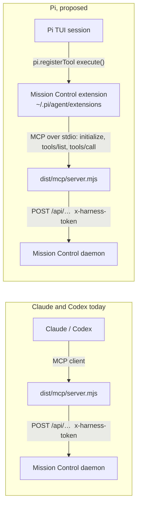
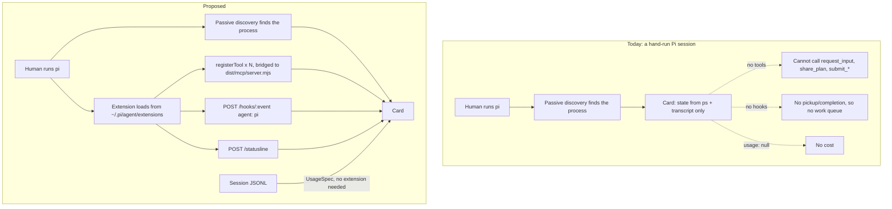

# Pi parity: a Mission Control extension installed through Setup

Pi should get, out of the box, everything Claude Code and Codex already get from Mission
Control - in **hand-run** sessions, not only dispatched ones. Passive discovery already finds a
Pi session someone starts themselves ([`harness/pi/detect.ts`](../../../src/server/harness/pi/detect.ts));
everything that discovery should lead to is missing.

The mechanism is a **Mission Control extension for Pi, installed machine-wide through Setup**,
the way "Install Claude integrations" installs Claude's hooks. That was decided explicitly and
is not reopened here: a launch-scoped `-e <path>` would cover only sessions Mission Control
dispatches, which is the half that already works.

This plan is the follow-up scheduled by
[Defect 2 of the multiplexer plan](../multiplexer-session-launch-failures/plan.md#defect-2-pi-cannot-carry-mission-mcp-tools-scheduled-as-its-own-plan).
Read that finding first; it records what was already measured and why the narrow refusal it
originally proposed was superseded.

## Decisions taken

Reviewed and settled in the dashboard on 2026-09-10.

- **Tools reach Pi by bridging `dist/mcp/server.mjs` over stdio**, not by reimplementing each
  tool natively. One implementation, new tools reach Pi for free, `verifyMissionMcpTools` keeps
  working unchanged, and no schema conversion is needed (P4). The cost accepted: one extra Node
  child per Pi session, and a dependence on a gitignored build artifact that Claude and Codex
  already have.
- **Distribution is a reconciled symlink in `~/.pi/agent/extensions/`**, not `pi install` and
  not the `extensions` array in `settings.json`. It reuses `skills/reconcile.ts` whole,
  including the isolated-home rule that exists because an isolated daemon once unlinked the
  live install's skills, and it creates a link rather than editing a file the operator owns.
  `pi install` was rejected for recording a **relative** path with no per-directory isolation
  lever (P10).
- **Staleness is reported, never repaired.** `claude-hooks.ts`'s argument stands and is
  stronger here: the daemon reporting the problem may itself be running from a pooled worktree,
  and the outage it would be free to cause is every Pi session on the machine refusing to
  start (P10). No auto-repair, and no remedy button on the row.
- **The first cut is cost only**, of the four capability groups offered: a `UsageSpec` over Pi's
  session JSONL. The extension, the capability guard, the reconciler, the environment check and
  the Setup install were **not** selected for it and are sequenced as later phases.
- **Both capability flips are taken now:** `workQueue` on the strength of `agent_settled`, and
  `multiRepoDispatch` as an empty grant - meaning Pi is offered for multi-repo tasks because
  there is no boundary to widen. The decision is the offer, not a literal empty `launchArgs`:
  the repository turned out to forbid that spelling, so the same decision is expressed as a
  `kind`/`why` variant (below). Neither flip depends on the extension shipping - see
  "What the first cut actually changes" for exactly what each one does and does not buy while
  the extension is still deferred.
- **A phased implementation plan follows**, with dependency-linked tasks.

## Executive summary

Ten measurements against the installed Pi 0.85.1 settle almost every open question, and three
of them change the shape of the work:

1. **Nothing needs converting.** Pi accepts the Mission MCP server's **raw JSON Schema** as a
   tool's `parameters` - no typebox translation - and enforces it strictly, including
   `additionalProperties: false` and nested `required`. All 15 tools registered, reached the
   provider payload with descriptions intact, and one round-tripped through `execute` and back
   to the model. Measured with **zero model tokens**.
2. **Pi's event vocabulary is richer than Codex's**, not poorer. `agent_settled` is the
   completion attribution `workQueue: null` says Pi lacks; `ui_prompt_start` is a structured
   needs-you signal Claude only has by string-matching a notification. So `workQueue: null` is
   **not** a permanent incapacity.
3. **A stale Pi extension fails in two shapes, and both are worse than Claude's.** A dangling
   symlink is **completely silent** (exit 0, nothing on stderr, no Mission Control). A bundle
   that exists but throws at load makes **every Pi session on the machine refuse to start**
   (exit 1). Claude's equivalent at least prints a stack every turn. The staleness check is
   therefore not a nicety.

Two parity gaps turn out to need **no extension at all** and can land independently: cost
tracking (Pi already writes priced usage into its own session JSONL) and standing instructions
on the terminal runtime (`pi --append-system-prompt` is repeatable, unlike Claude's).

## What Pi has today, and what each null means

`src/shared/harness-capabilities.ts` is the gap list. Each null's comment says why, and the
plan's first job is to sort them - because "permanent incapacity" and "nobody measured it" look
identical in the type and lead to opposite work.

| Slot | Line | Comment says | **Measured verdict** |
| --- | --- | --- | --- |
| `mcp: null` | [:817](../../../src/shared/harness-capabilities.ts) | "pi has no MCP client at all" | **Permanent and correct.** `pi --help` publishes no MCP flag (P1). `mcp` describes registering with a vendor's own MCP client through its CLI; Pi has neither. This null must **stay**. The extension is a different mechanism, and conflating them is how `applyMcp` ends up shelling out to a `pi mcp add` that does not exist. |
| `workQueue: null` | [:810](../../../src/shared/harness-capabilities.ts) | "authorship of the pickup is exactly the hook signal it lacks" | **Closable, and taken in the first cut.** Pi fires `input` (the pickup, with `source` distinguishing a human from an extension) and `agent_settled` ("Pi will not continue running automatically"). Both measured in one run (P5). Becomes `{ uninstrumentedWhy: … }`, which until the extension ships changes the refusal an operator reads rather than what a queue can do - and that sentence stays a statement of fact until a supported install exists to point at. |
| `permissionModes: null` | [:782](../../../src/shared/harness-capabilities.ts) | Pi's `manual`/`auto`/`readonly` vocabulary does not map onto the app's closed Claude-shaped union | **Still correct, unchanged by this work.** Out of scope: widening a shared persisted union with Pi's words is its own decision. Named here so the null is not read as an oversight. |
| `multiRepoDispatch: null` | [:836](../../../src/shared/harness-capabilities.ts) | "UNMEASURED … pi has no sandbox to widen" | **Now measured, and the comment was right about the reason.** Pi's `write` tool wrote to `/tmp/pi-probe/repoB/outside-cwd.txt` from a session whose cwd was `/tmp/pi-probe/repoA`, with no flag, no grant and no refusal (P9). There is no boundary to widen, so the grant declares that REASON rather than rendering flags: `{ kind: "no-boundary"; why; sdk: false }`, not an empty `launchArgs`. Taken in the first cut - see [the scope that was chosen](#the-scope-that-was-chosen-and-what-it-actually-changes) for why the shape matters. |
| `runtimes: ["terminal"]` | [:765](../../../src/shared/harness-capabilities.ts) | "Phase 6 adds `sdk`" with the `--mode rpc` adapter | **Unchanged.** `--mode rpc` exists and the extension works in it (`ctx.mode === "rpc"`, measured in P3), but an embedded driver is a separate project. |
| `standingInstructions.outOfBand: {}` | [:851](../../../src/shared/harness-capabilities.ts) | "Pi has no channel on any runtime: its only door is turn one" | **Wrong, and closable without the extension.** `pi --append-system-prompt` is documented as repeatable and measured as repeatable: two flags produced two appended blocks, each exactly once (P8). Claude's equivalent silently discards the first. |
| `effort.driverApplies: null` / `sessionPicker: null` | [:826](../../../src/shared/harness-capabilities.ts), [:829](../../../src/shared/harness-capabilities.ts) | no embedded driver; Shift+Tab walks seven values including `off` and `minimal` | **Both correct and out of scope.** The extension can *report* the level (`thinking_level_select`, `ctx.thinkingLevel`), which is the statusline half, not the picker half. |
| `HARNESSES.pi.hooks: null` | [index.ts:199](../../../src/server/harness/index.ts) | "pi pushes no hooks" | **Closable, and at `scope: "machine"`** - the one thing neither Claude (machine, but hooks only) nor Codex (`scope: "launch"`) manages: hand-run coverage for tools *and* state. |
| `HARNESSES.pi.usage: null` | [index.ts:198](../../../src/server/harness/index.ts) | (no comment) | **Closable without the extension.** Pi writes `usage` with a priced `cost` object onto every assistant record in its session JSONL (P7). |

## What was measured

Everything below ran against **pi 0.85.1** (`pi --version`) on this machine, with
`PI_CODING_AGENT_DIR` pointed at a throwaway directory under `/tmp` so the operator's real
`~/.pi/agent` was never written to, and `PI_OFFLINE=1`.

**No model tokens were spent.** Every round trip runs against a local
OpenAI-compatible endpoint registered through `pi.registerProvider`, which returns a
hand-written tool call and then a hand-written final message. That is stronger evidence than a
real model call, not weaker: it drives Pi's genuine tool-execution path while making the tool
call deterministic.

### P1 - Pi has no MCP client

```
$ pi --help
```

No MCP flag anywhere in the option table. The published built-in tool names are the last block
of that output:

```
Built-in Tool Names:
  read       - Read file contents
  bash       - Execute bash commands
  powershell - Execute PowerShell commands on Windows
  edit       - Edit files with find/replace
  write      - Write files (creates/overwrites)
  grep       - Search file contents (read-only, off by default)
  find       - Find files by glob pattern (read-only, off by default)
  ls         - List directory contents (read-only, off by default)
```

### P2 - the Mission MCP bundle answers a real `tools/list` over stdio

The same handshake [`verifyMissionMcpTools`](../../../src/server/mission-mcp.ts) performs, run
against the freshly built bundle:

```
$ npm run build && node /tmp/pi-probe/mcp-tools.mjs "$PWD/dist/mcp/server.mjs"
serverInfo: {"name":"mission-control","version":"0.1.0"}
tool count: 15
 - share_plan
 - request_plan_decisions
 - request_review
 - create_task
 - request_input
 - report_product_feedback
 - report_product_issue
 - report_status
 - respond_to_file_comments
 - adopt_pipeline_run
 - report_pipeline_workspace
 - complete_retro_no_change
 - submit_ensemble_result
 - submit_workflow_evidence
 - submit_scout_artifacts
```

`tools/call` round-trips through the same pipe. Pointed at a dead port so the operator's live
daemon on 7317 was never touched:

```
$ node /tmp/pi-probe/mcp-call.mjs "$PWD/dist/mcp/server.mjs"     # MISSION_PORT=7399
tools/call response: {
  "result": {
    "content": [ { "type": "text", "text": "Could not reach Mission Control: TypeError: fetch failed" } ],
    "isError": true
  }, "jsonrpc": "2.0", "id": 2 }
```

The framing, the dispatch and the result envelope all work; only the daemon was absent, by
design. Every Mission MCP tool returns exactly one text block - `src/mcp/server.ts` has a
single `textResult` helper at line 204, one `type: "text"` in the file, no `structuredContent`
and no `outputSchema` - so there is nothing in the result shape for a bridge to lose.

### P3 - an INSTALLED extension loads and registers all 15 tools from raw MCP JSON Schema

A probe extension at `<agent dir>/extensions/mission-probe.ts` - auto-discovered, no `-e` -
reads `/tmp/pi-probe/mcp-tools.json` (P2's output) and passes each `inputSchema` **verbatim** as
`parameters`:

```
$ PI_CODING_AGENT_DIR=/tmp/pi-probe/agentdir PI_OFFLINE=1 pi --mode rpc --no-session </dev/null
factory: registering 15 tools
event session_start reason=startup isIdle=true
mode=rpc hasUI=true cwd=/private/tmp/pi-probe
```

`pi.getAllTools()` at `session_start` returned 23 names - Pi's eight built-ins plus all fifteen
Mission tools - and 19 were active (Pi leaves `grep`, `find`, `ls` and `powershell` off by
default). **No collision:** the fifteen Mission names and Pi's eight built-ins are disjoint.
`ask_question`, which `pi --help` mentions in an `--exclude-tools` example, is not in
`getAllTools()` on a clean install.

`ctx.getSystemPrompt()` shows them in Pi's own `Available tools` section, one line each from
`promptSnippet`:

```
Available tools:
- read: Read file contents
- bash: Execute bash commands (ls, grep, find, etc.)
- edit: Make precise file edits …
- write: Create or overwrite files
- share_plan: Mission Control: share_plan
- request_plan_decisions: Mission Control: request_plan_decisions
…
- submit_scout_artifacts: Mission Control: submit_scout_artifacts
```

### P4 - the schemas reach the model, and Pi enforces them strictly

`before_provider_request` captured the payload actually built for the wire. 19 tools, full MCP
descriptions intact:

```
payload keys: model, messages, stream, stream_options, store, max_completion_tokens, tools
tools on the wire: 19
{"type":"function","function":{"name":"request_plan_decisions","description":"Show a plan in the
Mission Control dashboard with one or more decision points the human can resolve by selecting
options and clicking Submit, or dismiss without an answer when the decision set is stale. BLOCK
until they submit or dismiss. …","parameters":{"type":"object","properties":{"title":{"type":"string",…
```

The strictness is the finding, and it arrived as a **failed** probe first. A tool call whose
`options` entries omitted `id` was refused before `execute` ran, with the error handed back to
the model as a tool result:

```
event tool_execution_end tool=request_plan_decisions isError=true
  result={"content":[{"type":"text","text":"Validation failed for tool \"request_plan_decisions\":
    - decisions.0: must not have additional properties
    - decisions.0.options.0.id: must have required properties id
    - decisions.0.options.1.id: must have required properties id …
```

So Pi honoured `additionalProperties: false` and `required` **two levels deep inside an array
item**, from a draft-07 schema it never converted. This is deliberate on Pi's side, not luck:
`pi-ai`'s `validateToolArguments` checks `Object.getOwnPropertySymbols(tool.parameters)` for
`Symbol.for("TypeBox.Kind")` and takes a plain-JSON-Schema coercion path when the symbol is
absent
(`node_modules/@earendil-works/pi-ai/dist/utils/validation.js:280`).

The keywords the fifteen Mission schemas actually use, extracted from P2's output, are all
covered: `type`, `properties`, `required`, `items`, `enum`, `const`, `anyOf`, `default`,
`pattern`, `minLength`/`maxLength`, `minimum`/`maximum`, `minItems`/`maxItems`,
`additionalProperties`, `$schema`.

### P5 - a full tool round trip, and the lifecycle events around it

With schema-valid arguments, the same run reached `execute` and carried the result back:

```
event tool_execution_start tool=request_plan_decisions args={"title":"Probe plan",…}
execute request_plan_decisions probe-call-1 args={"title":"Probe plan","plan":"docs/plans/probe/plan.md",
  "decisions":[{"id":"d1","question":"Bridge or native?","options":[{"id":"bridge","label":"Bridge",
  "detail":"one implementation","recommended":true},{"id":"native","label":"Native",…}]}]}
event tool_execution_end tool=request_plan_decisions isError=false
  result={"content":[{"type":"text","text":"probe-ok:request_plan_decisions"}],"details":{…}}
event message_start role=toolResult
event message_end role=toolResult
```

The whole event stream from that run is the parity evidence:

```
event session_start reason=startup isIdle=true
event resources_discover reason=startup
event input text="probe" source=interactive isIdle=true
event before_agent_start prompt="probe"
event agent_start isIdle=false
event turn_start turnIndex=0
event message_start role=user / message_end role=user
event message_end role=assistant usage={"input":11,"output":22,…,"cost":{…,"total":0.000055}}
event tool_execution_start / tool_execution_end tool=request_plan_decisions
event turn_end turnIndex=0
event turn_start turnIndex=1
event message_end role=assistant usage={"input":44,"output":5,…,"cost":{…,"total":0.000054}}
event agent_end isIdle=false
event agent_settled isIdle=true
event session_shutdown reason=quit
```

`agent_settled` is what settles the `workQueue` question. Pi's own documentation is explicit
about what it means - "`agent_end` fires when that run ends, but Pi may still auto-retry,
auto-compact and retry, or continue with queued follow-up messages. Use `agent_settled` for
status integrations that need to know Pi will not continue running automatically" - and the
run confirms it: `isIdle=false` on `agent_end`, `isIdle=true` on `agent_settled`.

A 12-second tool completed with no timeout and `signal.aborted === false`, so a
`request_input` that blocks for as long as the human takes is fine:

```
slow_probe returned after 12006ms aborted=false
```

### P6 - live model, effort and context percentage are all readable

```
session_start model=probe/probe-model thinking=off contextUsage={"tokens":0,"contextWindow":128000,"percent":0}
turn_end      model=probe/probe-model thinking=off contextUsage={"tokens":2,"contextWindow":128000,"percent":0.0015625}
```

`ctx.model`, `ctx.thinkingLevel` and `ctx.getContextUsage()` cover the three fields Claude's
statusline wrapper exists to forward
([`StatusLineIngestSchema`](../../../src/shared/protocol.ts)) - with no status line to wrap and
no sidecar to record.

### P7 - cost is already on disk, priced by Pi

Every assistant record in a Pi session JSONL carries token counts *and* a cost breakdown:

```
$ node -e '…' /tmp/pi-probe/sessions/2026-09-10T02-14-21-799Z_01a08918-….jsonl
--- type=message role=assistant
   usage: {"input":11,"output":22,"cacheRead":0,"cacheWrite":0,"reasoning":0,"totalTokens":33,
           "cost":{"input":0.000011,"output":0.000044,"cacheRead":0,"cacheWrite":0,"total":0.000055}}
--- type=message role=toolResult   tool: request_plan_decisions
--- type=message role=assistant
   usage: {"input":44,"output":5,…,"totalTokens":49,"cost":{…,"total":0.000054}}
```

That is exactly the append-only local source [`UsageSpec`](../../../src/server/harness/types.ts)
reads - a path plus a byte cursor - so `HARNESSES.pi.usage` is a transcript reader, not an
export pipeline.

Two things about it were measured **after** the decisions were taken, and both narrow the
claim. See [What the first cut actually changes](#what-the-first-cut-actually-changes).

- **`--session-id` lands verbatim in the header and the filename.** Asked for
  `591ab9d6-c481-43e9-8cc6-2ce639602117`, Pi wrote
  `2026-09-10T11-37-03-987Z_591ab9d6-….jsonl` whose first line is
  `{"type":"session","version":3,"id":"591ab9d6-…","cwd":"/private/tmp/pi-probe"}`. That id is
  the `sourceId` the usage poller compares against `session.agentSessionId`, so a **dispatched**
  Pi session attributes exactly.
- **Pi does NOT hold its session file open**, so a hand-run one cannot be identified the way
  Codex's is. Driven over `--mode rpc` until `agent_settled`, with the session file confirmed
  present on disk, `lsof -a -p <pi pid> -Fn | grep jsonl` returned nothing. Codex's passive
  identity annotator ([`discovery/codex-rollouts.ts`](../../../src/server/discovery/codex-rollouts.ts))
  is built entirely on that open handle, so it has no Pi analogue - and
  [`locatePiTranscript`](../../../src/server/harness/pi/transcript.ts) already refuses a session
  with no `agentSessionId`, which the poller requires too.

### P8 - standing instructions have a terminal channel after all

```
$ pi --mode rpc --no-session \
    --append-system-prompt "MISSION-STANDING-INSTRUCTION-PROBE-A" \
    --append-system-prompt "MISSION-STANDING-INSTRUCTION-PROBE-B"
$ grep -c PROBE-A system-prompt.txt   ->  1
$ grep -c PROBE-B system-prompt.txt   ->  1
```

Both present, once each. Claude's single-valued `--append-system-prompt` is why the terminal
launch composes one value from every contributor; Pi needs no such folding.

### P9 - there is no write boundary to widen

Session cwd `/tmp/pi-probe/repoA`; the model called Pi's own `write` tool with an absolute path
in a sibling directory:

```
tool_execution_end tool=write isError=false
  result={"content":[{"type":"text","text":"Successfully wrote to /tmp/pi-probe/repoB/outside-cwd.txt"}]}
$ cat /tmp/pi-probe/repoB/outside-cwd.txt
written from repoA cwd
```

Measured in `-p` (non-interactive) mode, which is the mode a dispatch uses for one-shots and
which has no approval step. `resolveToCwd` in
`dist/core/tools/path-utils.js` resolves a relative path against cwd and passes an absolute one
straight through; there is no boundary check in `write.js` at all. Whether a *TUI* session
prompts for the write is a question about Pi's approval mode, and the answer does not vary with
the directory - so either way there is no per-directory grant to render.

### P10 - distribution and the failure taxonomy

**How Pi discovers an extension.** `discoverExtensionsInDir` in
`dist/core/extensions/loader.js:568` accepts a direct file whose name ends in `.ts` or `.js`
(`isExtensionFile`, line 527), or a subdirectory with `index.ts`/`index.js`, or a subdirectory
whose `package.json` declares `pi.extensions`. **One level, no recursion.** It handles
`entry.isSymbolicLink()` explicitly for both files and directories - which is what makes the
skills reconciler's mechanism available here.

Measured, with both a plain `.mjs` and a `.js`-named symlink in the same directory:

```
$ ls -la /tmp/pi-probe/disco/extensions/
lrwxr-xr-x  mission-control.js -> /tmp/pi-probe/built/index.mjs
-rw-r--r--  plain.mjs
$ pi --mode rpc --no-session </dev/null
loaded: built/index.mjs via file:///tmp/pi-probe/disco/extensions/mission-control.js
all=read,bash,powershell,edit,write,grep,find,ls,report_status
```

One load line, from the symlink. **`.mjs` is not discovered**; a `.js`-named symlink pointing at
a built `.mjs` is. Note `import.meta.url` is the **link** path, not the target - so the bundle
must be self-contained, which an esbuild bundle already is. The earlier finding that ".ts, .js
and .mjs all load" was measured through `-e`, which takes an explicit path and never consults
`isExtensionFile`.

The launch flags behave as hoped:

```
--tools read,report_status      -> all=read,report_status              active=["read","report_status"]
--exclude-tools report_status   -> all=read,bash,powershell,edit,write,grep,find,ls
--no-extensions                 -> (extension not loaded at all)
```

So `--tools` is Pi's `--allowed-tools`, and **a dispatch must never pass `--no-extensions`** -
it would silently take Mission Control away. Pi's current launch
([`harness/pi/launch.ts`](../../../src/server/harness/pi/launch.ts)) passes only `--session-id`
and the prompt, so nothing has to change there today.

**`pi install <local path>` records a RELATIVE path.** Given an absolute one:

```
$ PI_CODING_AGENT_DIR=/tmp/pi-probe/inst pi install /tmp/pi-probe/pkg
Installed /tmp/pi-probe/pkg
$ cat /tmp/pi-probe/inst/settings.json
{ "packages": [ "../pkg" ] }
$ pi list
User packages:
  ../pkg
    /tmp/pi-probe/pkg
```

Pi normalises the path relative to the settings file's own directory, and loads the package in
place without copying (`packages.md`: "Local paths … are added to settings without copying").
So a staleness check on this route has to resolve entries against the settings file's directory
rather than treating them as absolute - and it is editing a third-party JSON file rather than
creating a symlink.

**The failure taxonomy, measured.** This is the part that decides how the check is built.

| What is wrong | What Pi does | Blast radius |
| --- | --- | --- |
| Dangling symlink (checkout moved or deleted) | **Nothing.** exit 0, empty stderr, no Mission Control tools | Every Pi session on the machine silently loses the integration |
| Bundle exists but fails to load (parse error, module-scope throw - i.e. a half-written build) | `Error: Failed to load extension "…": …` + `Hint: Start without extensions using "pi -ne".`, **exit 1** | Every Pi session on the machine **refuses to start** |
| A handler throws at runtime | `Extension error (…): handler blew up` on stderr, session continues | That handler's work is lost; the session is fine |

```
$ ln -s /tmp/pi-probe/does-not-exist/index.mjs .../extensions/mission-control.js
$ pi -p … "hi"                              # exit=0, stdout "probe finished", stderr EMPTY

$ printf 'throw new Error("half-written bundle");\nexport default function () {}\n' > .../mission-control.js
$ pi -p … "hi"                              # exit=1
Error: Failed to load extension "…/mission-control.js": Failed to load extension: half-written bundle
Hint: Start without extensions using "pi -ne".

$ # handler throws
$ pi -p … "hi"                              # exit=0, stdout "probe finished"
Extension error (…/mission-control.js): handler blew up
```

Compare Claude's: a moved checkout makes every hook event fail with `MODULE_NOT_FOUND` and print
a stack into the transcript on **every turn**
([`environment/claude-hooks.ts`](../../../src/server/environment/claude-hooks.ts) records that
outage verbatim). Loud and misdirected. Pi's first row is silent and its second row is fatal.
Neither points at Mission Control.

### What could not be verified

- **A tool round trip driven by a real model in an interactive TUI.** P4 and P5 prove the tools
  reach the provider payload and that Pi's execution path runs them end to end, in `-p` mode
  against a controlled endpoint. What a real model *chooses* to call was not measured and
  cannot be without spending tokens. The risk this leaves is a prompting risk, not a mechanism
  risk, and it is the same risk Claude and Codex already carry.
- **Whether Pi's TUI prompts for a write outside cwd under a non-default approval mode.** P9
  measured `-p`. The conclusion it supports - that there is no *per-directory* grant either way
  - does not depend on the answer.
- **Whether `agent_settled` is sufficient for Foreman in practice.** It is the right signal by
  Pi's own definition and by the measured `isIdle` transition, but Foreman's work-cycle
  contract has only ever been driven by Claude's and Codex's vocabularies. That is
  implementation work to verify, and it is why the work queue is proposed as a later phase
  rather than a first-cut claim.

## Design

### One extension, three responsibilities

`src/pi/extension.ts` in source, `dist/pi-extension/index.js` as the built artifact, installed
into `~/.pi/agent/extensions/`. It does three separable things, and only the first needs the
MCP bundle:

1. **Tools.** Register Mission Control's tools so the model can call them.
2. **Instrumentation.** Map Pi's lifecycle events to `POST /hooks/:event`, plus the statusline
   fields to `POST /statusline`.
3. **Nothing else.** Cost and standing instructions are handled outside it (below), because
   they can be, and an installed artifact should carry as little as possible given P10's second
   row.

Every handler is wrapped so a throw cannot reach Pi. Nothing runs at module scope beyond
registration, and no background resource starts in the factory - Pi's own guidance ("Extension
factories may run in invocations that never start a session") plus P10's evidence that a
module-scope throw is fatal machine-wide.

The extension does **not** bake the port or the token. It calls
`readClientToken()` and `BASE_URL` from
[`@shared/harness-runtime.mjs`](../../../src/shared/harness-runtime.mjs) at event time, exactly
as `harness-hook.mjs` does - so the only value an install bakes is the path to the bundle, and
that single value is what the staleness check is about. This is strictly better than Claude's
OTel block, which bakes a token into `~/.claude/settings.json`.

### Tools: bridge the existing bundle over stdio

The extension spawns `dist/mcp/server.mjs` as a child, speaks MCP over its stdio, and maps each
published tool to a `pi.registerTool` whose `execute` forwards to `tools/call`.



Registration is derived from the server's own `tools/list` rather than from a hand-kept list, so
a tool added to `src/mcp/server.ts` reaches Pi with no change here, and
`verifyMissionMcpTools` keeps working unchanged because it interrogates the same bundle by the
same handshake. Three adapter details, each measured:

- `parameters` takes the MCP `inputSchema` **verbatim** (P4).
- MCP's `{ content: [{ type: "text", text }] }` maps onto Pi's `AgentToolResult.content`
  directly. Pi accepts `TextContent | ImageContent`; the Mission server emits text only.
- MCP's `isError: true` must become a **thrown** error in `execute`. Pi's contract is explicit:
  "Returning a value never sets the error flag regardless of what properties you include."

What the bridge costs, stated plainly: one extra Node process per Pi session for the life of
that session, and a hard dependence on `dist/mcp/server.mjs` being present and current. `dist/`
is gitignored and refreshed only by `npm run build`, which is the staleness the module's own
long comment already documents - so Pi inherits a failure mode Claude and Codex already have,
rather than a new one. Reimplementing the fifteen tools natively would remove both costs and
was rejected: it makes a second writer of the daemon-facing contract, which is the drift
`mission-mcp.ts` exists to prevent.

### Instrumentation: a payload mapper, at `scope: "machine"`

`postHookEvent` in [`@shared/hook-bridge.mjs`](../../../src/shared/hook-bridge.mjs) already
"knows [no] event name, a payload key or a vendor", and `HookIngestSchema` already carries an
`agent` field over `AGENT_TYPES`. So this is a `HookSpec` plus a mapper, the shape
`harness/codex/hooks.ts` is - about sixty lines - not a pipeline.

The mapping, from the events measured in P5:

| Pi event | Ingested as | State / signal |
| --- | --- | --- |
| `session_start` | `SessionStart` | `idle`, "started (reason)" |
| `input` (`source` is `interactive` or `rpc`) | `UserPromptSubmit` | `working`, prompt text; `work_started`; `promptText` |
| `tool_execution_start` | `PreToolUse` | `working`, "running `<tool>`" |
| `tool_execution_end` | `PostToolUse` | `working`; PR-URL sniff on the `bash` tool's result |
| `ui_prompt_start` | `PermissionRequest` | `awaiting_input` with the prompt's `kind` and `title` |
| `ui_prompt_end` | `PostToolUse`-equivalent | back to `working` |
| `session_before_compact` / `session_compact` | `PreCompact` / `PostCompact` | `working` |
| `agent_settled` | `Stop` | `idle`; **`turn_completed`** |
| `session_shutdown` | `SessionEnd` | `exited`, "ended (reason)" |
| `model_select`, `thinking_level_select`, `turn_end` | `POST /statusline` | model, effort, context % (P6) |

Two of these are better than what the other harnesses have. `ui_prompt_start` is structured,
where Claude's needs-you signal is a regex over a notification string that its own spec
documents as unreliable (`isIdleNudge`). And `agent_settled` is a settled-not-just-ended signal
that neither Claude's `Stop` nor Codex's `Stop` distinguishes.

`input` carries `source`, so an extension-injected message (`source === "extension"`) is
skipped rather than being reported as a human's ask - which is the discrimination
`substantivePrompt` does for Claude by inspecting scaffolding.

PR adoption needs nothing new: `pullRequestUrlsIn` and `opensPullRequest` in
[`@shared/pr-command.mjs`](../../../src/shared/pr-command.mjs) are already vendor-neutral, and
`tool_execution_end` hands over the `bash` tool's result and args.

### The two gaps that need no extension

**Cost** (`HARNESSES.pi.usage`) is a `UsageSpec` over Pi's session JSONL (P7): `read` walks
assistant records forward from a byte cursor, `estimate` values them.

Re-pricing the way Claude and Codex are priced was the obvious choice and the repository rules
it out. `MODEL_CATALOG.pi` ([`shared/model.ts`](../../../src/shared/model.ts)) carries no rates
at all - it is a display catalog of id, label, hint, provider, context window and input modes -
and Pi is multi-provider across the thirty-odd providers its `--help` lists, so a Mission
Control price table for Pi would have to track all of them. Pi's own per-message `cost` is
therefore the only viable source, which means `HarnessUsageEvent` has to carry a
vendor-reported cost for `estimate` to pass through. That is a shared-contract change and it
belongs to the phase that introduces it.

**Standing instructions** (`standingInstructions.outOfBand.terminal`) is a new
`StandingInstructionsMechanism` rendering repeated `--append-system-prompt` flags (P8). For a
**hand-run** session the extension's `before_agent_start` is the equivalent channel - it can
return a modified `systemPrompt` for the turn - which is a second delivery of the same fact and
therefore has to be gated on the launch not having already carried it. That gate is the thing
`standingInstructionsChannel` exists to be the single reading of, so the extension must ask the
daemon rather than deciding for itself.

### Installation: reconcile a symlink, the way skills already are

Decided: a symlink reconciled into `~/.pi/agent/extensions/`.
[`skills/reconcile.ts`](../../../src/server/skills/reconcile.ts) already installs Mission
Control artifacts into Pi's own home and carries the two rules that matter:

- **Symlinks, not copies.** "A symlink has no drift: the file Claude reads IS the file in the
  repo." Measured to work for Pi extensions in P10, with the one constraint that the link's
  **name** must end in `.js`.
- **The isolated-home rule.** A daemon on an explicit `MISSION_HOME` writes to
  `<home>/pi-extensions` and does not touch the machine's real directory - the fix for observed
  data loss where an isolated test daemon unlinked the live install's `mission-html-plans`.
  Reusing this is not optional: `npm test` and the E2E harness both start daemons routinely.

So the capability grows a sibling of `SkillsSpec`:

```ts
extensions: {
  dirEnvVar: "PI_EXTENSIONS_DIR",
  homeDir: [".pi", "agent", "extensions"],
  isolatedDirName: "pi-extensions",
  linkName: "mission-control.js",
}
```

`null` for Claude and Codex, which is the honest answer and the one that keeps the reconciler
from inventing a directory for a harness that has no such loader.

Two rules the installer inherits from `hooks/install.mjs` rather than reinventing:

- **Refuse a transient checkout.** `transientCheckoutRoot` in
  [`hooks/install-checks.mjs`](../../../hooks/install-checks.mjs) already refuses to bake a path
  from a pooled worktree. Given P10's second row - a load failure stops **every** Pi session on
  the machine - this refusal matters more here than it does for Claude.
- **Publish atomically.** `scripts/build-state-lock-native.mjs` already stages into a private
  directory and publishes with one atomic rename, precisely so "a daemon starting up never loads
  a half-written addon". A half-written `dist/pi-extension/index.js` is P10's fatal row, so
  `build:pi-extension` gets the same treatment.

### Staleness: report, never repair

`environment/claude-hooks.ts` argues this at length and the argument transfers without
weakening. A new append-only environment check id, `"pi-extension"`, that:

1. Resolves the extension directory the same way the reconciler does.
2. Reports a **dangling link** - P10's silent row, and the only thing that would ever tell
   anyone. The sentence has to say that Pi says nothing, because an operator's reasonable prior
   is that a broken integration announces itself.
3. Reports a **load failure** by actually loading the bundle in a child - the only check that
   sees P10's fatal row, and worth one `node --input-type=module -e 'import(...)'` because the
   symptom is every Pi session on the machine refusing to start.
4. Reports a **version drift** by comparing a build marker embedded in the artifact against
   this build's own, and by asking the bridged bundle's `tools/list` whether it still publishes
   what this build's `MISSION_MCP_TOOLS` names. That second half is
   `reportMissionMcpDrift`'s question asked on Pi's behalf.

It must not repair, for `claude-hooks.ts`'s reason restated for this case: the daemon reporting
the problem may itself be running from a pooled worktree its allocator will reclaim, so an
auto-repair is free to cause the outage it just reported - and here that outage is "no Pi
session starts", not "hooks print stacks". Decided: report only, and no one-press remedy on the
row either, so the row's remedy stays the installer command the operator runs from a durable
clone.

The row lands in Setup through `ENVIRONMENT_ROW_METADATA`
([`setup-catalog.ts`](../../../src/shared/setup-catalog.ts)), which is how
`mission-hook-script` already appears there, with `requirement: "required"` for that entry's
stated reason: an environment row exists only while its check is warning, so it cannot nag a
machine that never installed.

### Replacing the concrete-agent guard

[`dispatcher.ts:667`](../../../src/server/dispatcher.ts) currently reads:

```ts
const missionMcpRegistered =
  codexLaunch.missionMcp || askChannel.args.includes("--mcp-config");
```

Two concrete agents named in one expression, and no third arm - which is why every Pi dispatch
declaring a required Mission MCP tool fails after its worktree is cut, with a message that
misdirects toward rebuilding a bundle. The repository's own code style forbids this shape, and
the reason it survived is that there was no answer to read.

The replacement is a capability that says **how** our tools reach a harness's model, and at what
scope:

```ts
/** How Mission Control's own tools reach this harness's model. */
export interface MissionToolsSpec {
  mechanism: "mcp-client" | "installed-extension";
  /** Whether the tools reach a session this daemon did NOT launch. */
  scope: "launch" | "machine";
}
```

- `claude`, `codex`: `{ mechanism: "mcp-client", scope: "launch" }` - the registration rides
  the argv this launch built, which is what makes it verifiable from the argv.
- `pi`: `{ mechanism: "installed-extension", scope: "machine" }` - nothing rides the argv, and
  the question is instead whether the extension is installed and current.

The guard then reads the mechanism and asks the matching question - the launch builder's own
report for `mcp-client`, the environment check's for `installed-extension` - and a harness
that can carry the tools in neither way is refused **before a worktree is cut**, which is the
narrow fix Defect 2 originally proposed, arrived at as a consequence rather than as a special
case.

### The end-to-end change, before and after



## The scope that was chosen, and what it actually changes

The first-cut selection named **one** of the four capability groups offered - cost - and both
capability flips. Everything else in the design above is real work that was deliberately not
put in the first cut. That produces a first cut with an unusual property worth stating before
the phases are written, because it is the difference between a small change and a small change
that quietly promises something it does not deliver.

### First cut

1. **`HARNESSES.pi.usage`** - a `UsageSpec` over Pi's session JSONL (P7). No extension and no
   install. This is the one item that delivers a visible capability on its own - for
   **dispatched** Pi sessions. See the correction below.
2. **`workQueue`** flipped from `null` to `{ uninstrumentedWhy: … }` on the strength of
   `agent_settled` (P5).
3. **`multiRepoDispatch`** declared as an empty grant, because P9 measured that Pi has no
   write boundary to widen. The literal shape is **not** an empty `launchArgs` - see below.

#### The `multiRepoDispatch` shape, corrected after the decision

`test/multi-repo-policy.test.ts:118` asserts that any non-null `multiRepoDispatch` renders at
least one flag naming every directory, on the stated grounds that "a spec that renders no flags
would be a harness advertising a grant it does not make, which is worse than declaring null".
So `{ launchArgs: () => [], sdk: false }` fails a test that is right to fail it.

The decision is kept - Pi is offered for multi-repo tasks - and the spec becomes a discriminated
union, so Pi declares the reason instead of returning an array that reads like a bug:

```ts
export type MultiRepoDispatchSpec =
  | { kind: "flags"; launchArgs: (dirs: readonly string[]) => string[]; sdk: boolean }
  | { kind: "no-boundary"; why: string; sdk: boolean };
```

[Phase 1](phase-1-pi-cost-and-capability-flips.md) owns the union, and
[phased-plan.md's finding 3](phased-plan.md#3-the-empty-multirepodispatch-grant-contradicts-an-existing-test-invariant)
records the reasoning. Anyone implementing from this plan's summary alone should write the
union, never the empty array.

### What the first cut actually changes

Stated exactly, because two of the three items are declarations rather than mechanisms:

- **Cost appears on Pi cards - but on DISPATCHED ones only.** This corrects an earlier
  sentence in this plan, and it is the one place the measurements moved after the decisions
  were taken. The usage poller needs `session.agentSessionId`, and so does
  `locatePiTranscript`; a dispatched Pi session has one because the launch passes
  `--session-id` and Pi writes it into the transcript header verbatim (P7). A **hand-run** Pi
  session has none, and cannot be given one passively: Codex's identity annotator works by
  `lsof`-ing the rollout the process holds open, and Pi was measured **not** to hold its
  session file open at all (P7). Nothing short of the extension reporting
  `ctx.sessionManager.getSessionId()` closes that, so **hand-run cost moves to the extension
  phase**. Cost on hand-run Pi sessions is not something the first cut can buy.
- **`workQueue` changes the sentence, not yet the outcome.** Non-null means "this harness can
  hold a queue, but a session that has never reported a hook takes the per-session refusal" -
  the Codex shape. Until the extension ships, *every* Pi session is such a session, so no Pi
  session can actually hold a queue. What improves is the refusal an operator reads: "Pi doesn't
  report its work lifecycle to Mission Control yet" in place of "Foreman doesn't drive Pi
  sessions", which is a claim about the harness rather than about this build.

  **The interim sentence must be a statement of fact, not an instruction.** The first cut can
  merge on its own, and nothing installable exists until Phase 5, so a sentence telling the
  operator to install the Pi integration would point at a button that is not in the app. The
  transition is owned rather than assumed: Phases 1 and 4 keep it factual, Phase 5 makes it
  actionable because it is the first merge that provides a switch, and Phase 6 names the Setup
  row once the row exists.
- **`multiRepoDispatch` makes the dispatch modal offer Pi for multi-repo tasks,** and the
  measurement supports that: the secondary worktree really is writable (P9). The caveat to
  carry into the phase is that Pi has `permissionModes: null`, so `--tools` / `--exclude-tools`
  are the only levers on what a Pi session may do in either worktree.
- **Nothing about tools changes.** A Pi task declaring a required Mission MCP tool keeps failing
  after its worktree is cut, with the message that misdirects toward rebuilding the bundle,
  because the capability guard was not selected for the first cut. This is the status quo
  Defect 2 already documents, and it is called out here so the omission is not read as fixed.

### Sequenced after it

Each of these is a later phase, in this order, and the first three were offered for the first
cut and not selected rather than being newly deferred:

1. **`standingInstructions.outOfBand.terminal`** - repeated `--append-system-prompt` (P8).
   Independent of everything else and the cheapest remaining item.
2. **`MissionToolsSpec` and the `dispatcher.ts:667` replacement.** Removes a concrete-agent
   branch the code style forbids and moves Pi's refusal to before a worktree is cut.
3. **The extension itself** - the MCP bridge (tools) and the hook mapper (state), plus
   `build:pi-extension` with atomic publish. This is what turns item 2 of the first cut from a
   better sentence into a working queue.
4. **The reconciler's `extensions` spec,** honouring the isolated-home rule.
5. **The `"pi-extension"` environment check and its Setup row,** report-only.
6. **Setup installs it.**

### Still out of scope entirely

- **`permissionModes`.** Needs a decision about widening a persisted union with Pi's
  vocabulary.
- **`runtimes: ["sdk"]`.** The `--mode rpc` driver is its own project, already named in the
  capability's own comment.
- **Blocking-tool UX in the TUI.** `request_input` blocks for as long as the human takes (P5,
  12 s with no timeout), but what the Pi TUI *shows* while a tool blocks was not measured, and
  it is a polish question rather than a mechanism one.

## Risks

- **A half-written bundle stops every Pi session on the machine** (P10). Mitigated by atomic
  publish, by the transient-checkout refusal, and by the load-failure arm of the environment
  check. This is the single largest risk in the plan and the reason the artifact is a
  dependency-free bundle rather than a directory of modules.
- **A dangling link is silent** (P10). Only the environment check will ever surface it. If the
  check ships late, the integration can be absent for weeks with no symptom.
- **Fifteen extra tools in Pi's system prompt.** Measured: 5,973 bytes with the fifteen
  excluded, 6,873 bytes with them active - **900 bytes**, because `promptSnippet` contributes
  one line per tool and the full descriptions travel in the tool schemas rather than the
  prompt. Real but modest; `--tools` and `--exclude-tools` both work on extension tools (P10)
  if a dispatch wants a narrower set.
- **One extra child process per Pi session,** for the life of the session. Accepted with the
  bridge decision.
- **Writing into a directory the operator owns.** Same exposure `skills/reconcile.ts` already
  carries, and the same rules answer it. The symlink decision keeps this to creating and
  removing one link rather than editing the operator's `settings.json`.
- **A `workQueue` that is non-null before any Pi session can hold one.** The refusal path is
  what makes this safe, and it is the reason `uninstrumentedWhy` has to be a statement of fact
  in the pre-install window rather than an instruction.

## What this plan does not do

- It does not widen `PermissionMode` with Pi's vocabulary.
- It does not add a Pi embedded driver.
- It does not change `mcp: null` for Pi. Pi still has no MCP client; the extension is a
  different mechanism and the two must not be folded together.
- It does not write extension code. Nothing in this task touches `src/`.

## Where the decisions are recorded

The four choices this plan could not make for itself were put to the human as selectable
options in the Mission Control dashboard and answered on 2026-09-10. The adopted decisions are
at the top of this document under [Decisions taken](#decisions-taken); the alternatives that
were weighed are summarised there with the reason each was rejected, and the design sections
above are written to the adopted choice rather than to a menu.
