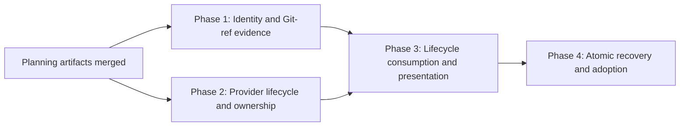

# Pipeline Attempt Recovery and Workspace Fidelity - Phased Implementation Plan

Status: Approved for scheduling

Source plan: `docs/plans/pipeline-attempt-recovery/plan.md`

## Outcome

Deliver one recovery model for Pipeline Engineer work that keeps attempt identity immutable, makes every workspace-facing surface agree, preserves read-only evidence after worktree cleanup, refuses known environment failures before authoring, and gives operators safe retry or exact-successor adoption actions.

## Incorporated operator decisions

The operator resolved all load-bearing choices on 2026-09-03:

1. Retain authoring worktrees through specification review. ai-conductor cleans them on PR merge, PR close, task cancel, or a bounded timeout. Mission Control still supplies a read-only Git-ref fallback.
2. Allow explicit adoption of one exact direct provider successor after full lineage and repository validation. Never auto-adopt and never traverse ambiguous or deeper history.
3. Create and schedule a phased implementation package.

These are requirements, not implementation-time choices.

## Investigated findings and plan corrections

- The provider creation event already includes `branch` and `planSlug` in `src/shared/pipeline.ts:390`. Phase 1 preserves them in Mission Control; Phase 2 does not re-add them.
- Current Mission Control deliberately retains structurally valid unknown v1 Engineer events in `src/server/pipelines/commissions.ts:286`. Provider-only additive event kinds can therefore land safely before Phase 3 consumes them.
- Extra fields on the existing `engineer_run_failed` event are stripped by the current known-event Zod parser. The legacy build still retains `error`, so typed optional fields are backward-compatible.
- The provider run store already owns attempt-key idempotency, exact correlation ordering, direct predecessor identity, replay, and snapshots. Phases 2 and 4 extend or consume those seams instead of adding another lineage registry.
- Mission Control already handles create response loss by inspecting correlation history in `src/server/dispatcher.ts:950`. Phase 4 extracts that behavior into a recovery service instead of duplicating it in a route.
- Engineer worktrees use `.pipeline/engineer-run.json`; current discovery recognizes only implementation `.pipeline/conduct-state.json`. Phase 1 may read the Engineer marker as corroboration, but the commission remains the durable workspace source of truth.
- Provider success currently removes the worktree immediately. The selected retention decision changes provider behavior in Phase 2, while Phase 1 remains correct before and after that change.
- The affected incident contains a failed attempt and a separate settled direct successor. Phase 4 adopts a distinct attempt and never rewrites the failed predecessor.
- Task status drift exists in both directions. Phase 3 surfaces contradiction; Phase 4 adds guarded settlement actions and write-time consistency checks.

## Sizing and phase-count rationale

Estimated production implementation: **1,400 to 2,100 gross non-test lines**.

Assumptions:

- Mission Control needs a browser-safe workspace projection, persistence validation, server resolver and capability checks, ref-backed Diff and Files adapters, event consumers, attention and progress updates, recovery routes, and UI actions.
- ai-conductor needs additive lifecycle types, snapshot reduction, readiness machinery, retention cleanup, ownership fencing, and CLI wiring.
- Tests, fixtures, generated artifacts, documentation, and mechanical formatting are excluded from the estimate.

Four phases are the minimum safe split:

- Combining Phases 1 and 2 would create one cross-repository task even though both halves are independently operable and can run concurrently. That would increase review breadth without reducing compatibility risk.
- Combining Phases 2 and 3 would force provider and consumer pull requests to move as one unit even though current Mission Control safely retains unknown events. Provider-first delivery is a lower-risk compatibility boundary.
- Combining Phases 3 and 4 would mix a broad projection/UI migration with concurrency-sensitive retry and adoption transactions. Separate merge boundaries keep each state machine reviewable and let Phase 3 establish the exact state that Phase 4 guards.
- Splitting Phase 1 into schema, Diff, Files, workflow, or credential tasks would leave dead or contradictory intermediate surfaces. They are one vertical workspace-fidelity slice.

## Dependency graph

Phases 1 and 2 may run concurrently after the planning pull request merges. Phase 3 depends directly on both. Phase 4 depends directly on Phase 3. Transitive prerequisites are not repeated.

## Phase index

| Phase | Repository scope | Direct prerequisites | Value | Detailed plan |
| --- | --- | --- | --- | --- |
| 1. Durable identity and safe Git-ref evidence | Mission Control | Planning session | Fixes wrong branch/path and preserves read-only Diff and Files after worktree loss | `phase-1-durable-identity-and-git-evidence.md` |
| 2. Complete provider lifecycle and ownership | ai-conductor, Mission Control context-only | Planning session | Adds readiness, retirement, retention, typed failure, and successor ownership evidence | `phase-2-provider-lifecycle-and-ownership.md` |
| 3. Lifecycle consumption and unified presentation | Mission Control | Phases 1 and 2 | Makes all surfaces, attention, task drift, and progress follow one provider-backed projection | `phase-3-lifecycle-consumption-and-presentation.md` |
| 4. Atomic recovery and direct-successor adoption | Mission Control | Phase 3 | Adds safe retry, exact adoption, host fencing, and explicit settlement | `phase-4-atomic-recovery-and-adoption.md` |

## Repository scope and merge behavior

### Mission Control

Phases 1, 3, and 4 each produce one Mission Control pull request. Each phase includes its own schema, persistence, server, browser, documentation, and test work so its merge leaves the repository operable.

### ai-conductor

Phase 2 produces one ai-conductor pull request. The Mission Control checkout is attached as context-only so the implementation agent can read the source plan and exact consumer contract. It must not change Mission Control. The provider change is additive: current Mission Control stores new event kinds as unknown evidence and continues to read the raw `error` on terminal failure.

No phase requires inseparable pull requests in both repositories.

## Cross-phase contracts

### Workspace identity contract owned by Phase 1

- `Session.cwd` remains process identity.
- The commission owns authoring branch and plan slug.
- The central resolver returns availability, path, branch, the attempt's durable evidence commit, provenance, and freeze state, attempt, provider revision, reason, and capabilities.
- `available` is the only state that authorizes writes, comments, shell launch, or external file open.
- `retired` and `missing` may authorize read-only Git object access only through a commit persisted on the attempt and verified inside the task repository. Later requests never follow a moved branch.
- Evidence initialization conditionally matches a null commit and an unfrozen attempt. Later advancement conditionally matches the validated predecessor and an unfrozen attempt. Handoff freezes evidence in the same serialized database transaction, so concurrent or stale writers cannot advance it afterward.
- Consumers must not bypass the resolver or silently fall back to host `cwd`.

Phases 3 and 4 may extend reasons and actions but must not change these authorization rules.

### Provider lifecycle contract owned by Phase 2

- New events extend the existing Engineer v1 event spine and carry the existing base identity and monotonic revision.
- A non-mutating readiness probe can block before reservation; `engineer_readiness_checked` records bounded machine evidence only on the exact new run before authoring.
- `engineer_worktree_retired` records exact worktree identity, cleanup reason, and the immutable attempt-specific commit SHA captured before cleanup.
- `engineer_run_failed` keeps raw `error` and adds bounded optional typed recovery fields.
- Mission Control integration ownership is opaque to ai-conductor except for equality and transfer validation.
- Readiness and ownership are independent capabilities: a current `ready` result, or an explicitly permitted `inconclusive` result, is always enforced when readiness is supported, while absent ownership disables automatic recovery.
- Current attempt-key idempotency, direct predecessor ordering, replay integrity, and keep-on-failure remain intact.
- Worktree retention ends only on merge, close, cancel, or timeout, with the immutable attempt commit and retirement recorded before removal.

Phase 3 consumes this contract. Phase 4 relies on its readiness and ownership capabilities.

### Attempt and adoption contract owned by Phase 4

- Normal attempts have origin `mission_control`; adopted direct successors have origin `provider_reconciled`.
- Retry and adoption both append immutable attempts. Neither rewrites a predecessor.
- Retry uses compare-and-swap over commission, active attempt, provider run, and provider revision.
- Creation response loss uses existing attempt-key inspection before any new call.
- Only one exact direct successor is eligible for adoption.
- Candidate owner must equal predecessor owner.
- An explicitly unowned predecessor may accept only an absent candidate owner.
- Every non-empty owner change requires recorded ownership-transfer evidence.
- Candidate durable commit and provenance must match the replayed direct-successor journal and the Phase 1 commit adapter before adoption CAS.
- Branch and PR facts validate a candidate but never settle provider lifecycle alone.
- Old managed hosts leave through `Registry.beginEviction`.

## Merge order and compatibility gates

1. Merge the planning artifacts. This releases Phases 1 and 2.
2. Merge Phases 1 and 2 in either order.
3. Start Phase 3 only after both are merged. Its new behavior remains feature-gated on the provider capability at runtime.
4. Start Phase 4 only after Phase 3 merges.
5. Enable retry only when readiness and ownership capabilities are present. Old providers retain read-only fidelity but do not receive approximate recovery guarantees.

Rollback is by feature disablement, not data deletion. Additive commission fields, event journals, attempt rows, branches, and snapshots remain readable by old behavior.

## Final verification strategy

Each phase runs its focused checks plus the repository gates in its phase file. The full delivery additionally requires:

- Mission Control: `npm run typecheck`, `npm run lint`, `npm test`, `npm run build`, `npm run smoke`, and `npm run test:e2e` with new built-dashboard coverage.
- Mission Control on macOS: Electron geometry tests when the recovery or timeline layout changes, using the repository-approved outside-sandbox path when required.
- ai-conductor: the repository's HARNESS-directed validation, focused Engineer lifecycle tests, and its full required gates.
- Mixed-version tests: old Mission Control with new provider events, new Mission Control with old provider capability, live ingest versus replay, and optional typed fields on a known event.
- Recovery fault tests: concurrent retry, create response loss, stale revisions, malformed replay, wrong predecessor, wrong repository or PR, partial host launch, and eviction.
- UI paths: active worktree, retained review worktree, retired worktree, unexpectedly missing worktree, invalid ref, readiness block, failed attempt, status drift, review-only successor, accepted adoption, and rejected adoption.

## Requirements coverage

| Source requirement | Owning phase |
| --- | --- |
| Preserve branch, plan slug, and durable attempt evidence commit | 1 |
| One resolver and authorization policy | 1 |
| Branch-ref Diff and read-only Files | 1 |
| Correct header, workflow checkout, and credential delivery | 1 |
| Provider readiness and typed failure | 2 |
| Retain through review and emit retirement | 2 |
| Prevent future unreserved owned successors | 2 |
| Consume typed lifecycle with mixed-version behavior | 3 |
| Needs-you attention, drift, and segmented progress | 3 |
| CAS retry and fresh host | 4 |
| Explicit exact direct-successor adoption | 4 |
| Task settlement and consistency guards | 4 |

Every approved requirement is owned once. Later phases consume earlier contracts without introducing a second source of truth.

## Final cross-phase audit

- Phase 1 and Phase 2 touch different repositories and have no implementation dependency. They may merge in either order.
- Phase 1's inferred `missing` state remains valid after Phase 2 introduces explicit `retired`; Phase 3 maps both into the same capability matrix and reconciles provider retirement commit evidence without changing Phase 1 authorization.
- Phase 2's additive events are safe for the current Mission Control parser, which retains unknown event kinds and ignores unknown fields on known kinds.
- Phase 3 owns presentation and derived attention but not provider mutation or attempt creation.
- Phase 4 consumes the provider and projection contracts; it does not introduce a new event channel, workspace registry, or teardown path.
- No phase relies on a later phase to repair a knowingly broken merge state.
- The final state matches the approved retention and direct-adoption decisions.
