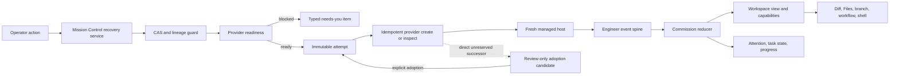

# Pipeline Attempt Recovery and Workspace Fidelity

Status: Approved for phased implementation on 2026-09-03

## Decision and outcome

Use the lifecycle-first architecture from **Pipeline Workspace and Recovery** as the governing model, then incorporate the stronger evidence, Git-ref fallback, readiness checks, UI corrections, and phased delivery from **Pipeline task fidelity**.

The combined result is deliberately stricter than either source plan:

- Mission Control retains immutable commission and attempt authority.
- ai-conductor remains the authority for Engineer worktree lifecycle, readiness, and failure evidence.
- Every workspace-facing surface uses one structured workspace projection instead of choosing independently among `cwd`, a stale path, and a provider worktree.
- A live worktree supports reads, writes, comments, file open, and shell launch. A retired worktree degrades to an exact, read-only Git commit captured for that attempt. A missing worktree with no durable commit exposes no filesystem action.
- Retry is one compare-and-swap transaction that reserves an attempt, creates or recovers the exact provider run, binds it, evicts the old host through `Registry.beginEviction`, and starts one fresh host.
- A provider-side successor is never silently accepted. Exact lineage can be reviewed and explicitly adopted as a new immutable attempt.
- Task attention and completion follow provider lifecycle facts, not SDK host idleness or repository heuristics alone.

This plan fixes two factual weaknesses in the source plans. The provider already emits `branch` and `planSlug` on `engineer_worktree_created`; Mission Control currently discards them. Also, the provider history for the inspected incident contains a distinct failed attempt followed by a distinct settled successor, not one failed attempt that later became successful.

## Why the synthesis is stronger

| Concern | Lifecycle-first plan contributes | Fidelity plan contributes | Combined decision |
| --- | --- | --- | --- |
| Authority | Immutable attempts, provider revision, explicit reconciliation | Concrete branch and PR observations | Provider events govern lifecycle; repository observations are corroboration only |
| Workspace | Structured availability and unified authorization | Branch-ref diff after removal and discovery-marker evidence | Live workspace plus read-only Git-ref fallback through one resolver |
| Failures | Provider-owned typed classification | Reproduced SSH and missing-tool failures, actionable verbs | Two-stage readiness plus typed terminal evidence and safe remedies |
| Retry | CAS, idempotency, new host, predecessor history | Existing append-attempt and re-dispatch seams | Dedicated daemon transaction using existing create, inspect, replay, and eviction machinery |
| Divergence | Explicit successor adoption | Remote branch and pull request visibility | Exact lineage adoption, with branch and PR checks as validation rather than settlement |
| UI fidelity | Attention overrides idle | Progress denominator, false Diff header, wrong-worktree workflow, credential hardening | One consistent task state and honest surface-specific behavior |
| Delivery | Strong target architecture | Concrete, independently testable phases | Four merge-safe phases with provider-first compatibility where required |

## Evidence that shapes the plan

The current implementation already has useful seams, so the plan extends them instead of adding parallel state:

- `src/shared/pipeline.ts:390` already declares `engineer_worktree_created` with `worktreePath`, `branch`, and `planSlug`.
- `src/server/pipelines/commissions.ts:362` retains only `worktreePath`, losing two identity fields.
- `src/server/registry.ts:6440` resolves a workspace path without recording availability or validating that it still exists.
- `src/server/pipelines/conductor/state.ts:539` discovers implementation worktrees through `.pipeline/conduct-state.json` but not Engineer worktrees through `.pipeline/engineer-run.json`.
- `src/web/pipelines/pipeline-run-model.ts:624` synthesizes a commission run with an unclassified halt and a denominator that includes work outside Engineer's scope.
- `src/web/lib/attention.ts:293` derives Pipeline attention from provider pipeline runs, not failed commissions.
- `src/server/dispatcher.ts:950` already recovers response-loss around idempotent provider creation by inspecting the attempt correlation.
- `src/server/pipelines/conductor/engineer.ts` already exposes `create`, `inspectCorrelation`, `replay`, and `cancel`.
- `src/server/dispatcher.ts:1135` launches the managed Engineer host from the source checkout with no provider branch identity.
- `src/server/workflows/context.ts:405` can capture workflow evidence from the host checkout instead of the commissioned workspace.
- `src/web/components/DiffViewer.tsx:157` can label an unresolved diff as uncommitted changes.
- ai-conductor `src/conductor/src/types/events.ts:207` has one append-only Engineer lifecycle event union, but no worktree-retired or readiness event and only a raw string for terminal failure.
- ai-conductor `src/conductor/src/engine/engineer/run-store.ts:203` already enforces attempt-key idempotency, same-correlation ordering, and direct predecessor identity.
- ai-conductor `skills/engineer/SKILL.md:247` removes the authoring worktree immediately after successful handoff while preserving the branch and commit.

The observed affected task also establishes that one correlation can contain two provider attempts: attempt 1 failed without handoff; attempt 2 directly succeeded and opened PR #15. Mission Control retained attempt 1 because attempt 2 was not reserved through Mission Control. A separate observed task was marked done while its commission remained authoring, proving status drift can occur in both directions.

## Invariants

1. The daemon is the only Mission Control database writer.
2. A commission is stable across attempts. An attempt is immutable after reservation.
3. Provider event revision and direct predecessor identity are monotonic and validated before projection.
4. `Session.cwd` is process identity, never task-workspace authority.
5. No route silently falls back from a missing commissioned workspace to the managed host checkout.
6. Read-only Git-ref evidence is allowed only after resolving a local ref to an immutable commit. It never authorizes writes, comments, external file open, or shell launch.
7. Repository branch and PR observations may corroborate provider state but may not rewrite it.
8. Retries use the existing provider attempt key and correlation contracts. Unknown outcomes remain unknown until inspected.
9. Old hosts leave only through `Registry.beginEviction`.
10. Browser code does not probe Git, classify stderr, or mutate provider state.
11. New event fields and types are additive. Mixed versions fail visibly or degrade to explicit legacy state.
12. Every visible UI change has Playwright coverage against the built application and fake agents.

## Proposed architecture

### 1. Persist complete attempt and workspace identity

Extend the commission projection with the branch and plan slug that already exist in the creation event, plus one structured workspace view:

```ts
type PipelineWorkspaceView = {
  authority: "provider";
  kind: "authoring" | "implementation";
  availability: "pending" | "available" | "retired" | "missing";
  path: string | null;
  branch: string | null;
  commit: string | null;
  commitProvenance: "live_validation" | "provider_retirement" | "legacy_branch_resolution" | null;
  commitFrozenAt: string | null;
  planSlug: string | null;
  attempt: number;
  providerRevision: number;
  reason: PipelineWorkspaceReason | null;
};
```

`path` records reported identity but is actionable only when availability is `available` and the daemon revalidates it at request time. `commit` is a durable attempt field, not a per-request branch resolution. Mission Control initializes it only when the stored commit and freeze marker are both null. Later advances match both the validated predecessor and an unfrozen attempt. Handoff freezes it in the same serialized database transaction, so stale validation cannot write afterward. Provider retirement evidence supplies the authoritative retained commit when available. A one-time legacy branch resolution may establish and freeze a missing attempt's commit only when none was captured, and records that weaker provenance. An available Diff or Files request uses the revalidated live root. Every retired or missing fallback request uses the stored SHA. If the object is unavailable, the workspace becomes explicit unavailable evidence rather than following a moved branch.

Add an attempt origin to the durable attempt projection:

```ts
type PipelineAttemptOrigin = "mission_control" | "provider_reconciled";
```

Legacy rows with absent or null origin decode as `origin: "mission_control"`, with nullable new identity fields and an explicit legacy workspace state. Unknown non-null origin values degrade the commission to a named unsupported state and are never coerced. Do not rename or reorder append-only event IDs.

### 2. Make ai-conductor lifecycle evidence complete

Extend the existing Engineer event spine with additive evidence:

- `engineer_readiness_checked`: tool availability, remote reachability, credential posture, status, stable reason code, and whether write authorization remains unproven.
- `engineer_worktree_retired`: exact path, branch, plan slug, reason, and the immutable attempt-specific commit SHA captured before cleanup. This is the sole metadata-only event permitted after terminal handoff: it revokes workspace authorization and advances retirement projection without changing the terminal outcome.
- `engineer_run_failed`: retain raw `error`, with optional structured `class`, `code`, `summary`, `retryable`, `remedy`, and bounded diagnostic.
- An integration-owner field on run creation, with the Mission Control commission and reserved attempt identity represented as opaque values.

Recommended retention policy: keep the authoring worktree through specification review and retire it on PR merge, PR close, task cancellation, or a bounded retention timeout. ai-conductor remains cleanup owner, captures the immutable attempt commit, and emits logical retirement before physical removal. A failed deletion remains cleanup debt and never reauthorizes the retired path. Commit-backed fallback is still required because retention is finite and worktrees can disappear unexpectedly.

For Mission Control-owned correlations, ai-conductor rejects an unreserved successor unless an explicit ownership-transfer token is supplied. This prevents recurrence while preserving a reviewed adoption path for existing divergence.

### 3. Use one server-side workspace resolver and authorization policy

Create one resolver that returns the workspace view and a capability set. All of these consumers must use it:

- Board and Console path and branch labels
- Diff base, head, and file-open target
- Files list, read, write, comment, external open, and refresh
- standards discovery
- workflow evidence capture
- shell launch

The capability matrix is:

| Availability | Diff | Files | Writes and comments | Shell and external open |
| --- | --- | --- | --- | --- |
| `available` | Worktree diff | Live tree | Allowed after path revalidation | Allowed after path revalidation |
| `retired` | Exact branch/commit diff | Read-only Git tree | Disabled | Disabled |
| `missing` with valid ref | Exact branch/commit diff | Read-only Git tree | Disabled | Disabled |
| `pending` or no valid ref | Named empty state | Named empty state | Disabled | Disabled |

The Git-ref adapter uses merge-base-aware diffing and immutable object reads such as `git ls-tree` and `git show`. It reads the attempt's stored commit under the task repository, rejects missing objects or identity conflicts, and never re-resolves a moving branch or returns a working-tree diff for an immutable-evidence request.

Engineer marker discovery is added to the existing provider state read, but discovery does not become a second workspace registry. It supplies reconciliation evidence that is reduced into the commission projection.

### 4. Add deterministic readiness at two boundaries

The two source plans each cover only part of readiness. Use both boundaries:

1. Before provider-run reservation or host launch, Mission Control asks the provider for a non-mutating environment probe. This catches provider version, missing tools, remote resolution, and plainly unavailable authentication without spending model tokens or appending to a terminal run.
2. After an exact run exists and before authoring transitions begin, the canonical Engineer launcher records a provider readiness event on that new run from the actual host posture. No authoring step is accepted until that event says ready. The exact push-level check repeats before handoff because branch write authorization cannot be proven safely by a read probe.

The provider owns classification because it owns the command and environment. Mission Control maps stable reason and remedy codes to copy and actions. Inconclusive authorization is shown as inconclusive, never as success.

The readiness response must never echo credentials or unbounded command output. The Codex caller credential moves from process arguments to a restricted file-based handoff, matching the safer Claude pattern.

### 5. Make recovery one daemon-owned, restart-safe operation

Add a commission recovery service used by a dedicated route and the existing re-dispatch path. The request includes commission ID, active attempt, provider run ID, and provider revision as compare-and-swap guards.

For a retry, the service:

1. verifies task ownership, terminal failure, retryability, no live recovery, and current provider revision;
2. runs the non-mutating provider environment probe as a pre-transaction gate and returns a blocked result without creating an attempt;
3. only after that probe succeeds, enters the compare-and-swap transaction and appends one new immutable attempt with a fresh opaque attempt key and direct predecessor;
4. calls the existing idempotent provider `create`, then `inspectCorrelation` if the response is lost;
5. binds the exact provider run before host instruction;
6. evicts the predecessor host through `Registry.beginEviction` after duplicate launch is fenced;
7. launches one fresh managed host attributed to the new attempt;
8. leaves a durable unknown outcome if creation or binding cannot be proven.

For an external successor, the service first creates a review-only candidate from `inspectCorrelation` and `replay`. Adoption is allowed only when repository, correlation, direct predecessor, monotonic attempt, event integrity, handoff identity, branch, PR repository, durable commit and provenance across candidate, replay, and the Phase 1 adapter, and absence of a competing retry all match. Owner continuity is exact: an explicitly unowned predecessor accepts only an absent candidate owner, and every non-empty owner change requires recorded transfer evidence. Adoption appends a new `provider_reconciled` attempt and replays the provider journal atomically. It never mutates attempt 1 and never fabricates a Mission Control reservation after the fact.

### 6. Derive attention, task settlement, and progress from the same projection

Commission failure, readiness block, missing workspace, status drift, and external successor candidate all create `needs you` attention even when the SDK host is idle. Host activity remains secondary diagnostic evidence.

Task lifecycle rules:

- `authoring`, `awaiting_spec_merge`, or recoverable `failed` keeps the task running with the appropriate attention state.
- explicit cancel or abandon settles the task accordingly.
- a provider handoff does not by itself mark implementation complete.
- a task cannot be written as done while its commission lacks a completion-compatible provider state. Legacy contradictions become an explicit `status_drift` item requiring reconciliation.
- repository branch or PR evidence can validate an adoption candidate but cannot settle a commission by itself.

Progress is segmented instead of using one misleading denominator. During Engineer, show the Engineer/DECIDE segment only. After handoff, show that segment complete and the implementation segment gated on specification merge. Fix unresolved Diff headers so they do not claim `uncommitted changes`, and disable manual workflows unless their evidence resolver has the same workspace authority as the visible task.

## End-to-end flow



## Merge-safe delivery plan

Estimated production change: 1,400 to 2,100 lines across Mission Control and ai-conductor, excluding tests and generated artifacts. The change is large because it closes an authority boundary across two repositories, not because the UI itself is large.

### Phase 1 - Durable identity and safe Git-ref evidence

Repository: Mission Control

- Persist `authoringBranch`, `planSlug`, attempt origin, last validated evidence commit, provenance, freeze time, and legacy-safe workspace identity.
- Add the central resolver with current-event support and exact path revalidation.
- Add merge-base-aware ref diff and read-only Git tree browsing for retired or missing worktrees.
- Correct branch labels, Diff error headers, manual workflow checkout selection, and Files capability states.
- Move Codex caller credential delivery to a restricted file.

This phase is independently useful with the current provider. It fixes the immediate missing-worktree experience without claiming that removal was observed.

Validation: reducer and old-row tests, Git-ref unit tests, route authorization tests, credential process-argument regression test, build, smoke, and Playwright for live, retired-by-observation, missing-ref, Diff, Files, and workflow behavior.

### Phase 2 - Complete provider lifecycle and ownership contract

Repository: ai-conductor

Depends on: none. It is additive and can land before its consumer.

- Add readiness, worktree retirement, typed terminal failure, and integration-owner evidence to the existing event spine and snapshots.
- Make readiness a machine gate before authoring transitions, with the exact handoff check repeated before push.
- Retain authoring worktrees through review under the bounded cleanup policy.
- Reject unreserved successors for Mission Control-owned correlations unless explicit transfer is present.
- Preserve attempt-key idempotency, correlation ordering, replay integrity, and keep-on-failure behavior.

Validation: event reducer and journal compatibility tests, CLI transition tests, remote/tool/auth readiness fixtures, retention cleanup tests, ownership-transfer tests, and the full provider gate required by that repository.

### Phase 3 - Consume lifecycle evidence and unify task presentation

Repository: Mission Control

Depends on: Phases 1 and 2.

- Feature-detect the new provider capability and reduce the additive events into `PipelineWorkspaceView` and structured failure state.
- Route every workspace consumer through the central capability policy.
- Add typed remedy and recheck actions, commission attention, status-drift attention, and segmented progress.
- Keep mixed-version providers explicit: legacy failure stays unknown, absent retirement stays inferred-missing after validation, and unsupported ownership gating disables automatic retry.

Validation: live/replay equivalence, mixed-version contract tests, attention and task-state tests, all relevant route tests, build, smoke, and Playwright across Board, Console, Line, alerts, Diff, and Files. Use Electron geometry coverage if new timeline or recovery panels affect clipping.

### Phase 4 - Atomic retry and explicit successor adoption

Repository: Mission Control

Depends on: Phase 3.

- Add the CAS recovery service and dedicated endpoints.
- Reuse provider `create`, `inspectCorrelation`, `replay`, and `cancel` rather than adding a discovery channel.
- Launch one new host per retry and retire the old host through `Registry.beginEviction`.
- Add review and adoption of an exact external successor as a `provider_reconciled` attempt.
- Add write-time task/commission consistency guards and explicit abandon/cancel settlement.

Validation: concurrent retry race, response-loss recovery, stale revision, wrong predecessor, malformed replay, PR/repository mismatch, competing retry, partial host launch, eviction path, successful adoption, rejected adoption, and task-state contradiction tests. Add Playwright coverage for every recovery verb and user-visible failure.

## Rollout and compatibility

1. Land provider Phase 2 before enabling its consumer features, but Phase 1 may land independently.
2. Keep new event fields optional in Mission Control until provider capability is present.
3. Store unknown additive provider events for replay while older consumers ignore them safely.
4. Gate retry on provider readiness and ownership capabilities. Do not approximate these guarantees for an old provider.
5. Initially log resolver decisions and adoption validation failures without credentials or raw unbounded output.
6. Roll back by disabling new recovery actions. Existing attempts, event journals, branches, and legacy projections remain readable.

## Acceptance criteria

- The same Pipeline task never displays a provider path with the managed host's unrelated branch.
- A valid live worktree supports the full authorized surface set.
- A retired worktree preserves exact read-only Diff and Files access through the attempt's durable evidence commit.
- Missing or ambiguous workspace identity produces a named state, not a Git error and not a fallback to `cwd`.
- Known readiness failures stop before model-backed authoring and name a safe remedy.
- A failed commission raises `needs you` independent of host idle state.
- Two concurrent retry requests create at most one successor attempt and one new host.
- Response loss recovers the exact provider run or records an unknown outcome without blind retry.
- Attempt 1 remains immutable after retry or adoption.
- An external successor cannot affect the active attempt until an operator adopts exact validated lineage.
- A task cannot silently be done while its commission remains authoring, or running forever after explicit abandonment.
- Engineer progress reaches 100 percent at Engineer handoff and does not count future implementation work as incomplete Engineer work.
- No pipeline caller credential appears in a process argument.
- Typecheck, lint, unit tests, build, smoke, and all applicable Playwright and Electron checks pass in each repository phase.

## Risks and mitigations

| Risk | Mitigation |
| --- | --- |
| A branch moves or validation races with handoff | Persist the attempt's evidence commit with predecessor-and-freeze CAS, freeze it atomically with handoff, and never re-resolve the branch for later fallback views |
| Retention leaks worktrees | Provider-owned terminal cleanup plus bounded timeout and explicit retirement evidence |
| Mixed versions create false confidence | Capability gates and explicit legacy/unknown states |
| Retry creates duplicate provider work | Existing attempt-key idempotency plus commission CAS and inspect-on-response-loss |
| Adoption weakens normal authority | Review-only candidate, exact direct-lineage validation, operator action, and durable reconciled origin |
| Repository observations contradict provider state | Present them as corroboration or drift; never rewrite provider events |
| Readiness probe overclaims push ability | Repeat the exact authorization-sensitive operation at handoff and label read-only checks as inconclusive |
| Files ref browsing becomes a second editor | Keep it read-only and object-addressed; all writes require an available revalidated worktree |

## What this plan does not establish

- The final retention timeout. The recommendation is lifecycle-based retention with a bounded fallback timeout, but the operational duration needs provider-owner input.
- Whether every supported Git remote can be probed without side effects. The implementation must define transport-specific checks and explicit inconclusive outcomes.
- Whether historical external successors beyond a direct child should ever be adopted. This plan intentionally supports only an exact direct successor.
- Whether existing Git objects remain available after repository cleanup or garbage collection. The UI must expose unavailable evidence and never substitute a moved branch.
- A data migration for operator state not present in the inspected tasks. Compatibility tests must cover representative older commission rows before rollout.

## Resolved operator decisions

1. Retain authoring worktrees through specification review, with merge, close, cancel, and bounded timeout cleanup. The Git-ref path preserves long-term evidence after cleanup.
2. Permit explicit adoption only for one exact direct provider successor. Deeper or ambiguous lineage remains a manual investigation.
3. Generate the detailed four-phase implementation package and schedule it in dependency order.
