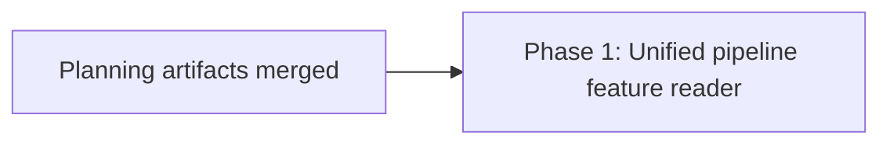

# Pipeline reader unification - Phased Implementation Plan

Status: Approved for scheduling

Source plan: `docs/plans/pipeline-reader-unification/plan.md`

## Outcome

The Pipelines tab draws ONE reader for a feature, whichever side of the specification handoff
it is on. A commission-selected feature gains the run's step ladder, gate verdicts and control
verbs; a run-selected feature gains the Engineer attempts and specification handoff. The board
session card's progress bar is unchanged.

## Incorporated operator decisions

Resolved on 2026-09-03. Requirements, not implementation-time choices.

1. **Leave the phase meter to Phase 3.** This work stays presentational and edits no progress
   derivation. No change to `pipelineRunForCommission`, `pipelinePhaseMeter`,
   `pipelineStrip` or `PipelinePhaseMeter`.
2. **The board session card draws one bar with both segments, always present.** A requirement
   handed to `pipeline-attempt-recovery` Phase 3, recorded here and in the phase file's
   downstream handoff because Phase 3 owns the segmentation that could blank it.
3. **After handoff the unified reader keeps Engineer attempts and specification handoff,
   collapsed by default.**

## Investigated findings and plan corrections

- `src/web/pipelines/PipelineRuns.tsx:239` is the either/or: `commission ? ... : run ? ... :`.
  The commission arm and the `PipelineRunView` arm are mutually exclusive today.
- `runActions`, `runConsoles`, `runVerbs`, `daemon` and `usePipelineRunDetail` are all computed
  from the *addressed* run (`PipelineRuns.tsx:70-115`). A selected commission never sets one, so
  those five values are empty for it. This is the mechanical cause of the missing verbs, not a
  styling gap.
- `commissionRun` already exists (`PipelineRuns.tsx:76`), resolved from `commission.linkedRun`
  against the `runs` array. The fix reuses it rather than adding a lookup.
- The blindness is symmetric. `commission` (`PipelineRuns.tsx:73`) is null whenever a run is
  addressed, because `openPipelineRun` clears `selectedCommissionId` and the fallback arm
  requires `selected === null`. Resolving only a run therefore fixes one direction and leaves
  the other untouched, so the phase resolves `activeCommission` as well. The reverse lookup is
  unambiguous: `idx_pipeline_commissions_run` (`src/server/db.ts:2914`) is unique on
  `(provider, repo_root, run_slug)` where the slug is non-null.
- `PipelineRunView` already takes `actions` as a `ReactNode` slot
  (`src/web/pipelines/PipelineRunView.tsx:220`), so the verbs are injected rather than mounted.
  It owns its own `<header className="pipelines-run-head">` at `:232`, which is the only part
  that duplicates a commission header above it.
- `src/web/pipelines/PipelineLadder.tsx:158` establishes the repository's disclosure idiom: a
  native `
` rather than a button plus state, with the reason recorded in-file. Decision 3
  reuses it instead of introducing a second collapse mechanism.
- The board card needs no edit. `BoardView.tsx:225` already resolves `pipelineRun` to
  `commission.linkedRun` when a commission exists and falls back to the session's own
  correlation, and passes `pipelineCommission` alongside. `SessionTile.tsx:284` gates on
  `shown("pipelinePhases") && ((session.pipeline && pipelineRun) || pipelineCommission)`.
- `openPipelineRun` (`src/web/App.tsx:1409`) already clears the commission selection, so
  selecting a run needs no new state. Only the reverse direction is missing an affordance.
- `test/pipeline-runs-view.test.ts:143` asserts `step 2 of 3` for a commission with a linked
  run. That assertion is a consequence of `pipelineRunForCommission` returning `linkedRun`
  wholesale, which decision 1 leaves to Phase 3. It stays green and untouched here.

## Sizing and phase-count rationale

Estimated production implementation: **240 to 300 gross non-test lines**, of which roughly 60
are the existing commission pane markup moving out of `PipelineRuns.tsx`.

Assumptions:

- One new reader component composing six regions; the commission pane markup relocates into it.
- `activeRun` resolution plus rerouting five derived values in `PipelineRuns.tsx`.
- One suppression prop on `PipelineRunView`.
- Two `
` disclosures and one rail affordance.
- Around 35 lines of CSS.
- Tests, fixtures and documentation excluded from the estimate.

**One phase, one task.** The estimate is above the 200-line single-task threshold, so the
default still applies and no additional phase is justified:

- This is one vertical UI slice. The reader component, the `activeRun` rerouting and the
  disclosures are the same behavior; none of them is independently useful.
- Every candidate split leaves a dead surface. A reader component that nothing mounts is
  unreachable code. `activeRun` rerouting without the composed reader changes which verbs a pane
  offers without giving that pane anywhere to draw the run it now addresses.
- There is no compatibility or migration boundary to protect. No schema, no persisted state, no
  wire contract, no generated artifact. Browser-only, behind one already-shipped tab.
- One merge boundary is the useful one, because the Playwright spec that proves the outcome has
  to drive the composed reader end to end. Split in two, neither half could carry that spec.

## Phase table

| Phase | Name | Repository | Direct prerequisites |
|---|---|---|---|
| 1 | Unified pipeline feature reader | mission-control (source repo) | planning session only |

Detailed phase file:
`docs/plans/pipeline-reader-unification/phase-1-unified-pipeline-feature-reader.md`.

## Dependency graph

## Concurrency and merge order

One phase, so no concurrency to arrange. The single task is gated on this planning session's
pull request merging, which publishes the paths its intent names.

## Relationship to pipeline-attempt-recovery

That effort is live in the backlog and its Phase 3 owns the progress semantics this plan
deliberately excludes.

| Task | Phase | Status | Overlap with this plan |
|---|---|---|---|
| `204cb4ba` | 1: Durable identity and Git-ref evidence | running | none |
| `2ec4d2ba` | 2: Provider lifecycle and ownership | running (ai-conductor) | none |
| `225bc5c3` | 3: Lifecycle consumption and presentation | backlog | owns the phase meter; see below |
| `164a3269` | 4: Atomic recovery and adoption | backlog | none |

**File sets are disjoint.** This phase edits `PipelineRuns.tsx`, `PipelineRunView.tsx`,
`styles.css` and adds one component. Phase 3's step 6 edits
`src/web/pipelines/pipeline-run-model.ts`. Neither touches the other's files, so the two can
merge in either order.

**Recommended order is this phase first**, so Phase 3 inherits one reader to verify rather than
two panes. Phase 3 is gated on two running phases, one of them in another repository, so this
work is not blocked behind that gate.

**Decision 2 is a requirement on Phase 3**, carried in this phase's downstream handoff: its
segmented model must keep the board card drawing one bar with both segments, always present.

## Cross-phase contracts

Single phase, so there are no inter-phase contracts. The two outward contracts are:

- **Owned here:** the composed reader and `activeRun` resolution in `PipelineRuns.tsx`.
- **Not owned here, must not be changed:** every progress derivation in
  `pipeline-run-model.ts`, the `PipelinePhaseMeter` component and its three call sites.

## Final verification strategy

`npm run typecheck`, `npm run lint`, `npm test`, `npm run build`, `npm run smoke`,
`npm run test:e2e`. Electron geometry coverage if the composed pane clips. The existing
board-card and console meter assertions in
`e2e/specs/conductor-planning-continuity.spec.ts` must stay green unchanged, since they are the
regression guard for decision 2's surface.
