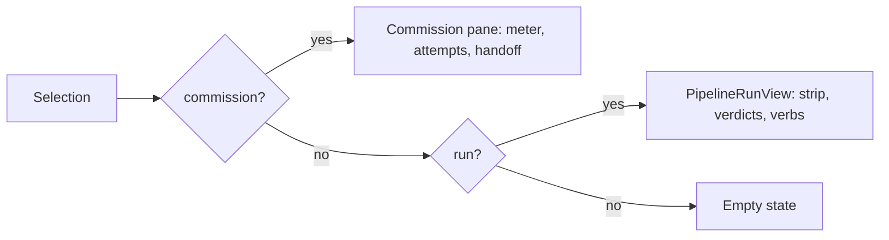
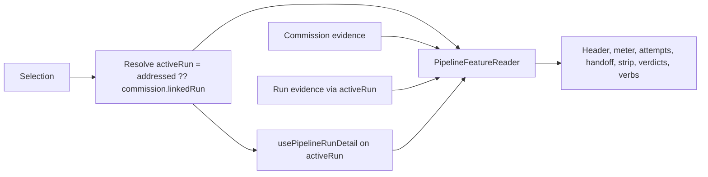

# Pipeline reader unification

Make the Pipelines tab draw ONE reader for a feature, whichever side of the specification
handoff it is on, and leave the phase meter's progress semantics to the already-approved
`pipeline-attempt-recovery` Phase 3.

Status: decisions resolved by the operator on 2026-09-03. They are requirements below, not
implementation-time choices.

## Incorporated operator decisions

1. **Leave the phase meter to Phase 3.** This plan stays presentational and edits no progress
   derivation, so it cannot conflict with `pipeline-attempt-recovery` Phase 3 step 6.
2. **The board session card draws one bar with both segments, always present.** Phase 3's
   segmented model must keep the Engineer segment complete and visible while the implementation
   segment fills beside it. The bar is never retargeted and never absent. Recorded here because
   Phase 3 owns the segmentation that could otherwise blank it.
3. **After handoff the unified reader keeps the commission's Engineer attempts and specification
   handoff, collapsed by default.**

## Why

`src/web/pipelines/PipelineRuns.tsx:239` picks one of three readers and never composes two:

```
commission ? <commission pane>   // header, meter, Engineer attempts, handoff
: run       ? <PipelineRunView>  // strip, gate verdicts, control verbs
:             <empty state>
```

The two describe **one 22-step sequence split by who owns the files**, not two sequences.
`ENGINEER_STEP_NAMES` (`src/shared/pipeline.ts:328`) is the leading prefix of the run's own
step table `AI_CONDUCTOR_STEPS` (`src/shared/pipeline.ts:1034`): `worktree`, `memory`,
`explore`, `complexity`, `prd`, `architecture_diagram`, `architecture_review`, `stories`,
`conflict_check`, `plan`, `coherence_check` appear in both. Ten step names coincide.

Three consequences an operator meets today:

- **Facts are unreachable from the side you are on.** A selected commission offers no step
  ladder, no gate verdicts and no control verbs, because `runActions`, `daemon` and
  `usePipelineRunDetail` are all computed from the *addressed* run and a selected commission
  never sets one. A selected run offers no Engineer attempts and no spec handoff.
- **There is no click-through between them.** The commission pane prints
  `commission.linkedRun.slug` as plain text (`PipelineRuns.tsx:274`), so a commission whose
  implementation run exists is a dead end.
- **The pane changes shape mid-feature.** The same work is described by different furniture
  before and after handoff, which is what makes one thing read as two.

## What this plan does NOT do

**The phase meter's progress semantics are out of scope.** They are already owned, planned
and operator-approved.

`docs/plans/pipeline-attempt-recovery/plan.md:41` names the exact defect:

> `src/web/pipelines/pipeline-run-model.ts:624` synthesizes a commission run with an
> unclassified halt and a denominator that includes work outside Engineer's scope.

`docs/plans/pipeline-attempt-recovery/phased-plan.md:179` names the resolution:

> Progress is segmented instead of using one misleading denominator. During Engineer, show
> the Engineer/DECIDE segment only. After handoff, show that segment complete and the
> implementation segment gated on specification merge.

`phase-3-lifecycle-consumption-and-presentation.md` step 6 carries it, and its exit criterion
is "Engineer progress completes at handoff without counting BUILD or SHIP steps".

That plan was approved for scheduling on 2026-09-03 and is live in the backlog as
`225bc5c3` (Phase 3), gated on `204cb4ba` (Phase 1, running) and `2ec4d2ba` (Phase 2,
running, ai-conductor). **The approved answer is to SEGMENT the two progress records.** An
earlier suggestion in this session to UNION them onto one 22-wide meter is superseded and is
not proposed here.

Per decision 1 this plan is deliberately narrow: the reader composition that no phase owns. It
touches no progress derivation, which also means it cannot conflict with Phase 3 in
`pipeline-run-model.ts`.

## Hard constraint: the board card keeps its bar

**The board session-card progress bar must survive for BOTH a commission and a run.** This is
an operator requirement on this work and on Phase 3's segmentation.

The good news is that this plan requires no change to it whatsoever. All three meter
surfaces already hand both halves to one component:

| Surface | Call site | Props today |
|---|---|---|
| Board session card | `src/web/components/layouts/SessionTile.tsx:285` | `run` = commission's linked run, else session's run; `commission` |
| Console detail | `src/web/components/layouts/ConsoleDetail.tsx:571` | `run` = commission's linked run; `commission` |
| Runs Pipelines pane | `src/web/pipelines/PipelineRuns.tsx:248` | `run` = commission's linked run; `commission` |

`BoardView.tsx:225` already resolves `pipelineRun` to `commission.linkedRun` when a
commission exists and falls back to the session's own correlation, and passes
`pipelineCommission` alongside. `SessionTile.tsx:284` gates on
`shown("pipelinePhases") && ((session.pipeline && pipelineRun) || pipelineCommission)`, so it
draws for a commission with no run and for a run with no commission.

Nothing in this plan edits `SessionTile.tsx`, `BoardView.tsx`, `ConsoleDetail.tsx`,
`PipelinePhaseMeter.tsx`, `pipelineRunForCommission` or `pipelinePhaseMeter`. The board bar
is untouched by construction, not by promise.

What this plan DOES do for it is hand Phase 3 a decided requirement, because segmentation is
where the bar could regress: a segmented model that rendered only the Engineer segment would
blank the board bar the moment implementation begins.

**Requirement for Phase 3 (decision 2):** the board card draws ONE bar carrying BOTH segments,
always present. At handoff the Engineer segment stays complete and visible and the
implementation segment fills beside it. The bar is never retargeted to implementation alone and
is never absent for a feature that has either kind of evidence. The board's axis is width, so
this stays one row rather than two stacked mini-bars.

## Design

### One reader, composed from what exists

Replace the either/or with a single `<PipelineFeatureReader>` that renders whichever regions
have evidence, in a fixed order, and never fewer than one:

1. Header. Identity comes from `activeRun` when one exists - its slug, group chip and tier -
   and from `activeCommission` otherwise. That direction matters: the run is the live work once
   it exists, and it keeps a run-addressed heading reading the run's own slug rather than
   switching to a commission's `planSlug`, which the existing specs assert.
2. Phase meter. Unchanged component, `activeRun` and `activeCommission` as its props.
3. Engineer attempts. When `activeCommission` exists. Expanded before handoff; collapsed by
   default once a run exists, per decision 3.
4. Specification handoff. When `activeCommission.handoff` exists, collapsed by default once a
   run exists. The implementation-run line becomes a button that selects the run rather than
   plain text.
5. Run strip, gate verdicts and control verbs, by mounting the existing `PipelineRunView`.
   When `activeRun` exists, whether it was addressed directly or reached through a commission.
6. Blockers and errors, from both sources, deduplicated.

Because the composed reader always owns the header, `PipelineRunView` is mounted with its own
header suppressed from this caller in every case, not only when a commission was selected.

`PipelineRunView` is otherwise reused as-is, and `showHeader` is the only prop it gains.

### Two resolved identities, so neither direction is blind to the other

The either/or is not only in the markup. `run` is the addressed run only, and `commission`
(`PipelineRuns.tsx:73`) resolves to null whenever a run is addressed, because
`openPipelineRun` clears `selectedCommissionId` and the second arm requires `selected === null`.
So each selection direction is blind to the other identity, and resolving only one of them
fixes only one direction. Resolve both:

```ts
const activeRun = addressedRun ?? commissionRun;
const activeCommission = commission ?? commissionForRun(commissions, activeRun);
```

`commissionForRun` matches `commission.linkedRun` against a run by `pipelineRunKeyOf`, which is
the same reverse lookup `pipelineCommissionForSession` already performs
(`src/web/components/layouts/types.ts:272`). It is unambiguous rather than best-effort: the
`idx_pipeline_commissions_run` unique index (`src/server/db.ts:2914`) is on
`(provider, repo_root, run_slug)` where the slug is non-null, so a run has at most one
commission.

Then route `usePipelineRunDetail`, `daemon`, `runVerbs`, `runActions` and `runConsoles` through
`activeRun`, and every commission region through `activeCommission`. Together those are the
substantive behavior change in this plan: `activeRun` is what gives a commission-selected
feature its ladder, verdicts and park / unpark / grant verbs, and `activeCommission` is what
gives a run-selected feature its Engineer attempts and specification handoff.

**The meter's progress derivation is unaffected; its caption changes on one path, deliberately.**
That distinction is the whole of decision 1's boundary, so it is worth stating exactly rather
than as "the meter is unchanged".

- **Derivation: identical.** `pipelineRunForCommission` returns `linkedRun` whenever a commission
  is linked, so passing a resolved commission alongside its own run yields exactly the run it
  yields today. No progress derivation is edited or read differently, and
  `pipeline-run-model.ts` is not touched.
- **Caption: changes for a directly addressed run that has a commission.** `PipelinePhaseMeter`
  branches its caption on the `commission` prop (`PipelinePhaseMeter.tsx:220`): with one it uses
  `pipelineCommissionLine`, which for a linked run returns `pipelineEyebrow(linkedRun)` such as
  `BUILD · Build · step 2 of 3`; without one it uses `view.caption`, the bare phase word `BUILD`.
  Today that path passes null, so it shows the phase word.

This caption change is **intended**, because it removes an inconsistency rather than creating
one. The board card (`BoardView.tsx:225`), the console detail (`ConsoleDetail.tsx:571`) and the
commission-selected path in this same pane all already pass a commission beside its linked run,
so all three already render the eyebrow. Only the directly addressed run in the Runs pane shows
the bare phase word, and after this change it stops being the odd one out. The fuller string is
also strictly more informative, and it is drawn by a component this plan does not edit.

A spec asserts the direct-run caption so the change is pinned rather than incidental.

Selection precedence is unchanged: an addressed run still wins over a commission's linked run,
so a deep link keeps naming exactly one thing. Resolving a commission from a run adds a region
to the pane; it never changes which feature is addressed.

### Rail

Unchanged grouping. Two additions:

- A commission row whose `linkedRun` is observed gets a secondary affordance opening the run
  address directly, so the rail can still address either identity.
- Selecting a run continues to clear the commission selection through the existing
  `openPipelineRun` (`src/web/App.tsx:1409`). No new state.

## Flow change

Before, the reader is an either/or over two identities:



After, one reader composes regions from whichever evidence exists:



## Sequencing against Phase 3

Recommended: land this **before** Phase 3, kept strictly presentational.

- It edits `PipelineRuns.tsx` and adds one component. Phase 3's step 6 edits
  `pipeline-run-model.ts`. Disjoint files, no conflict.
- Phase 3 then inherits one reader to verify rather than two, which shrinks its step 7.
- Phase 3 is gated on two running phases and one of them is in another repository, so this
  is not blocked behind that gate.

## Tests

Behavior changes, so per `AGENTS.md` this needs a Playwright spec.

- `e2e/specs/runs-pipelines-tab.spec.ts`: extend, and cover BOTH directions, since one
  resolution fixes only one of them:
  - a selected commission with an observed linked run shows Engineer attempts AND the run strip
    AND a control verb in one pane;
  - **selecting that same run directly shows the same regions**, which is the assertion that
    would have caught `activeCommission` being missing;
  - a run with no commission at all still renders, with no Engineer regions and the run's own
    identity in the header;
  - the handoff's implementation-run control navigates to the run address;
  - **the rail's secondary run control** on a commission row with an observed linked run opens
    that run, since it is a new control and every new control needs its own case;
  - **the direct-run meter caption** reads the eyebrow form rather than the bare phase word,
    pinning the intended caption change above.
- `e2e/specs/pipeline-controls.spec.ts`: extend. Control verbs are reachable for a
  commission-selected feature, which today they are not.
- The same spec pins decision 3: before handoff the Engineer attempts region is expanded, and
  once a linked run is observed it is collapsed but still reachable by its disclosure control.
- `e2e/specs/conductor-planning-continuity.spec.ts`: keep the existing board-card and console
  meter assertions green, unchanged. They are the regression guard for the board bar.
- `test/pipeline-runs-view.test.ts`: extend for the composed reader's region presence.
  `pipelineRunForCommission` assertions stay as they are, including the `step 2 of 3` case at
  `:143`, because this plan does not change that derivation. Phase 3 owns updating it.
- `test/pipeline-phase-meter.test.ts`: untouched.

Definition of done: `npm run typecheck`, `npm run lint`, `npm test`, `npm run build`,
`npm run smoke`, `npm run test:e2e`.

## Documentation

- `docs/pipelines.md`: describe one reader and the commission-to-run relationship. Leave the
  "Provider evidence is the source of truth" paragraph at `:34` alone; Phase 3 revises it.
- No change to `docs/ui.md` unless the rail affordance needs naming.

## Risks

- **Reader height.** Composing regions makes the pane taller and `PipelineRunView` is already
  the tallest thing on the tab. Decision 3's collapsed default bounds this, since the two
  commission regions stop contributing height once implementation is the live work. If the
  composed pane still clips, add Electron geometry coverage per `AGENTS.md` rather than only
  asserting markup.
- **Phase 3 drift.** If Phase 3 lands first, this plan's `activeRun` change still applies but
  the reader must be re-read against whatever segmented meter it introduces.
- **Double-stated halts.** A commission blocker and a run halt can describe one stop. The
  reader deduplicates; the spec should pin that it says it once.
