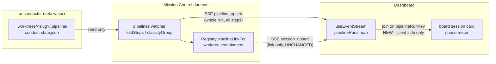

# Pipeline stages on a session card

Render an ai-conductor run's **stages** on the board session card as a compact **phase meter**,
with a per-phase hover popover carrying that phase's live status.

Design record: [`mockups.html`](mockups.html). The operator selected **Option A - phase meter**.
Options B (step barcode) and C (phase pips) are **not in scope**; they are retained in the
mockups as the design record this decision was made against.

## Adopted decisions

| Decision | Adopted |
| --- | --- |
| Treatment | **A - phase meter.** One segmented bar, proportional widths, ~11px. |
| Popover | **Extend `Tooltip` to accept a `ReactNode` label.** One primitive, not a second one. |
| Surfaces | **Board tile only.** The console rail row and detail band keep today's chip. |
| Correlations | **Externally driven workers only** - sessions carrying `Session.pipeline`. |

## The problem

A correlated session card says exactly one word about a 22-step feature. `PipelineChip`
(`src/web/components/session-bits.tsx:285`) renders `⇶ add-widgets · Build`.

So the card cannot answer the three questions an operator scanning a board actually has:

| Question | Answerable today |
| --- | --- |
| How far along is this feature? | No |
| Has anything failed, and where? | No - a halted run's card looks like a working one |
| What did this run's tier or track skip? | No |

The information exists, is already in the browser, and is drawn only on a page the operator has
to navigate to (Runs → Pipelines) or in a pane they have to open (the conversation's Workflows
tab). The card is where triage happens, and it is the one surface that says nothing.

## What ships

A **phase meter** on the board session card, below the activity ticker and above `.tile-marks`,
for a session carrying `Session.pipeline`.

- **A caption row**: `⇶ <slug>`, the current phase as one word, and `n/N` counted over the run's
  own sequential steps. The slug keeps today's click target - it opens the run in Runs.
- **An extras marker in that caption row**, present only when the run carries steps that cannot
  own a segment - a step this build cannot place, or an out-of-band step the run actually ran.
  It is the explicit home for both piles, with its own popover listing them and saying why they
  have no segment. Absent on the ordinary run, which carries neither.
- **A five-segment bar**, about 7px tall. One segment per phase in `PIPELINE_PHASES` order.
  - Segment **width** is proportional to how many steps that phase holds *in this run*, with a
    `min-width` floor so a one-step phase stays visible and hittable.
  - Segment **fill** is the fraction of that phase's steps that are finished.
  - Segment **tone** comes from `pipelinePhaseStatus`, so failure outranks running and both
    outrank arithmetic.
  - The phase the run is in carries a **ring**, so it is findable without relying on colour.
  - A phase that finished with skips is drawn **hatched** rather than solid green: "done" and
    "done, 2 skipped" must not be the same fill.
- **A hover popover per segment**: the phase name, its status label, one row per step with its
  own state glyph and tone, struck through when skipped, and a footer carrying the halt sentence
  or the skip reason when there is one.

The card gains about 11px, and the item is registry-toggleable.

## Investigated findings

Verified against this worktree, and against ai-conductor at
`/Users/jordan.mance/workspace/upstart/ai-conductor`.

### The data is already in the browser, so this costs nothing on the wire

This is the finding that makes the feature cheap, and it contradicts the obvious first guess.

`SessionPipelineLink` (`src/shared/pipeline.ts:304`) deliberately carries only
`{provider, repoRoot, slug, step}`, and says why:

> a whole `PipelineRun` on every session frame would ship 22 step states per correlated card
> per sweep to say one word on a chip.

That constraint stands, and **nothing here widens it**. It does not need to:
`useEventStream` already holds every run on the fleet in its own map, keyed by the run's own
identity (`src/web/useEventStream.ts:197`, seeded from the connect snapshot at `:281`, kept live
by `pipeline_upsert` at `:437`), and `PipelineRun.steps` (`src/shared/pipeline.ts:262`) is the
full step list. `App.tsx` already hands the board a `pipelineRunByKey` map, which is where
`SessionTile`'s existing `pipelineRunObserved` boolean comes from (`BoardView.tsx:167`).

The card therefore joins on `pipelineRunKey(provider, repoRoot, slug)` against a map it is
already being passed. No SSE change, no HTTP fetch, no server work, and the ~2kB per-run wire
budget pinned by `test/pipeline-sse.test.ts` is untouched.



The only new arrow is the last one, and it is inside the browser.

### The derivation exists and must not be duplicated

`src/web/pipelines/pipeline-run-model.ts` already folds a run into exactly what the meter needs:

- `pipelineStrip(provider, steps, gates)` → `{ phases, outOfBand, unknown }` (`:281`)
- `pipelinePhaseStatus(steps)` → tone and label per phase, with `degraded: true` when the phase
  finished but skipped something (`:318`)
- `pipelineStepStatus(state)` → per-step tone and label, for the popover rows (`:223`)
- `pipelineEyebrow(run)` → `"DECIDE · Plan · step 10 of 22"` (`:356`)

A second copy of any of these is the specific failure this plan exists to prevent. The meter is a
**new leaf rendering over an existing derivation**.

Two consequences worth stating:

- `pipelinePhaseStatus` reads only `step.state`, never a gate verdict. So the card needs **no
  gate fetch** - gate verdicts stay detail-only, exactly as `src/shared/pipeline.ts` intends.
- `pipelineStrip` returns out-of-band and unplaceable steps in **their own two piles**, and
  neither appears in any phase's `steps`. The meter draws **five phase segments only** - an
  out-of-band step has no slot in the sequence, so putting it inside a segment would claim the
  run walked past something that was never on its path, and an unknown step has no phase to be
  put in at all. Because a phase popover lists only that phase's steps, both piles need a
  location of their own or they are invisible: that is the **extras marker** above. The two
  piles also differ in the arithmetic, which the marker has to respect - `pipelineEyebrow`
  counts an unknown step in `N` (its filter drops only *known* out-of-band steps) and excludes
  an out-of-band one, so the marker reports the unknown steps as part of the total and the
  out-of-band ones as beside it.

### Extending `Tooltip` is the popover, and the reason is what it already does

The adopted decision is to give `Tooltip` a `ReactNode` label rather than add a second
primitive. Today:

```ts
export function Tooltip({ label, children }: { label: string; children: ReactElement })
```

What `Tooltip` (`src/web/components/Tooltip.tsx`) already does, and what a second primitive
would have to reimplement, is the argument for extending it: a body portal, two-stage vertical
flip (a threshold at `show`, then a real measurement in the ref callback), horizontal edge
clamping with a matching caret offset, **no wrapper DOM node** - handlers are merged onto the
child by `cloneElement`, which is what lets chips stay flex items of their row - a
disabled-trigger anchor path, auto-hide when a trigger disables itself, and a separately
rendered visually-hidden description that the trigger's `aria-describedby` points at.

Constraints the change has to respect:

- **The accessible name must stay a string.** The hidden `.tt-desc` node is what
  `aria-describedby` resolves to. A node label therefore needs a text form for that node, so the
  extended signature carries both: the rendered content and the sentence a screen reader gets.
  Rendering arbitrary JSX into the description node would put markup into an accessible name.
- **Measurement must stay in the ref callback**, not a layout effect. The existing comment is
  explicit that this is what keeps the component silent under the `renderToStaticMarkup` every
  component test in `test/` uses.
- `test/tooltip-coverage.test.ts` must stay green. It is an AST scan over every `.tsx` in
  `src/web` requiring interactive elements to route through `Tooltip` and failing on any
  surviving `title` attribute. There is no escape hatch, by design.
- Every existing `Tooltip` call site passes a string. The string arm must keep working
  unchanged; this is an additive widening, not a migration.

### The board-card registry makes this toggleable, and requires a registry entry

`src/web/lib/board-card.ts` is the single registry of optional card items, enforced by
`test/board-card-items.test.ts`. Its header states the rule:

> This registry is the list the operator gets to choose from, and every surface that draws an
> optional item reads the same list. Nothing else may hold a second copy.

The phase meter is a body region, like the existing `workflow` item, so it takes a
`DISPLAY_ITEMS` entry under `group: "card"`. The Settings checklist and
`e2e/specs/board-card-customization.spec.ts` grow a row.

It must **not** go in `.tile-marks`. The same header forbids it, and the reason applies here:
that row means "things that want your attention", and an operator must not be able to configure
themselves into missing "this session needs you". A halted run's attention signal stays where it
is; the meter is progress, not an alert.

### The step list is per repository, not a fixed 22

Mission Control's 22-step table (`src/shared/pipeline.ts:757`) is a frozen display copy of
ai-conductor's `ALL_STEPS`, and the file says it is never an authority. That tolerance is not
theoretical:

- ai-conductor builds its effective step list per repository from config
  (`buildStepRegistry(config)`), and **ai-conductor's own `.ai-conductor/config.yml` disables
  `manual_test` and inserts two custom SHIP steps**, `maintain-documentation` and
  `release-disposition`. A card observing that repository sees step names the frozen table does
  not contain.
- `pipelineStepOrder` already sorts an unknown step to `MAX_SAFE_INTEGER`, and `pipelineStrip`
  already returns unknown steps in their own pile.

Three rules follow:

1. **Segment widths are computed from `run.steps`**, never from the frozen table's length. A
   hardcoded 22, or a hardcoded 1/1/9/5/6 split, is a bug on the repository this feature was
   built to watch.
2. Counters read the run's own sequential steps, which is what `pipelineEyebrow` already does.
3. A step this build cannot place has no phase, so it cannot go in a segment. The meter must
   still account for it: the caption's `n/N` counts it, because it is a step the run really has,
   and the **extras marker** is where its name and state are readable. Counting a step in the
   total while giving it nowhere to be read is the failure this rule exists to prevent.

### Only externally driven workers draw it

The adopted scope is `Session.pipeline`, which `Registry.pipelineLinkFor` stamps only on a
session Mission Control did **not** launch, whose working directory is inside an observed run's
worktree. That is the same population that already gets `PipelineChip` and the
`pipelineDrivenSentence` composer replacement, so the meter joins an existing presentation
rather than starting a new one.

`Session.task.pipelineRun` - the managed Pipeline host - is **out of scope**. `docs/pipelines.md`
records that a managed host deliberately does not borrow the externally driven presentation, so
extending the meter there is a separate decision and not an omission. Its
`TaskPipelineRunTileFlag` is unchanged.

Because `Session.pipeline` is null on every fleet with no pipeline provider enabled, and every
consumer of it fails open, an ordinary installation draws nothing new and pays nothing.

### Prior art to match, not to re-invent

`docs/plans/workflow-card-progress/` designed the workflow stage ladder that already sits on
this tile (`.wf-tile-peek`, `.tile-workflow-disclosure`). Its plan drew a boundary worth
respecting: the vertical ladder is for the detail pane, because *height is the axis a detail
pane has*, and it was explicitly kept off the collapsed card. The phase meter is horizontal for
that reason, and it is deliberately **not** a ladder - the tile already has one, and a second
would read as the same thing twice.

## Surfaces

| File | Change |
| --- | --- |
| `src/web/pipelines/` | New leaf: the phase meter and its popover content. Imports the existing fold; adds no derivation. |
| `src/web/components/layouts/SessionTile.tsx` | Render it behind the registry gate; accept the joined `PipelineRun`. |
| `src/web/components/layouts/BoardView.tsx` | Pass the run it already looks up for `pipelineRunObserved`. |
| `src/web/lib/board-card.ts` | A `DISPLAY_ITEMS` entry under `group: "card"`. |
| `src/web/components/Tooltip.tsx` | Additive: accept a node label plus its text description. String arm unchanged. |
| `src/web/styles.css` | Meter and popover styles, in the board-tile block. Tokens only, no new hex. |
| `docs/pipelines.md` | Update "On the fleet", which documents the chip as what a correlated card carries. |

Explicit non-goals: no change to `SessionPipelineLink`, no SSE widening, no gate verdicts on the
card, no writing any engine-owned file, no second copy of the phase fold, no change to the
console rail row or detail band, and no meter on a managed Pipeline host.

## Verification

- `test/` - the fold from a `PipelineRun` to the meter's view model, over fixtures that include
  a halted run, an all-skipped S-tier run, a stale/kicked-back run, a run whose steps include
  names absent from the frozen table, and a run with a one-step phase (the `min-width` floor).
- `test/board-tile-render.test.ts` - markup shape on the tile, including that nothing renders
  when `Session.pipeline` is null.
- `test/board-card-items.test.ts` - registry parity for the new item.
- `test/tooltip-coverage.test.ts` - must stay green.
- A `Tooltip` test covering the node arm and asserting the description node still resolves to
  plain text.
- `e2e/` - **required.** A spec asserting the meter appears for a correlated session, that
  hovering a segment reveals that phase's status, and that the Settings checklist row hides it.
  `e2e/specs/conductor-loops.spec.ts` is the precedent for driving a real correlated card, and
  `e2e/specs/board-card-customization.spec.ts` for the registry row. Select by role, label or
  placeholder; never add `data-testid`; never spend model tokens.
- `npm run typecheck`, `npm run lint`, `npm test`, and `npm run test:e2e`.

## Risks

| Risk | Mitigation |
| --- | --- |
| The meter re-derives what `pipeline-run-model.ts` already computes | The new module imports the fold; a test asserts the segment tones come from `pipelinePhaseStatus`. |
| Hardcoded step counts break on a repository with custom steps | Widths from `run.steps`; a fixture with unknown step names and a non-22 total. |
| A one-step phase becomes an unhittable sliver | A `min-width` floor, pinned by a test rather than left to flex. |
| Widening `Tooltip` regresses a surface that depends on it | Additive string arm, unchanged measurement path, and the existing coverage scan as the gate. |
| Markup leaks into an accessible name | The node arm carries a separate text description; a test asserts the description node is plain text. |
| The card gets taller and the board fits fewer sessions | ~11px, and the item is registry-toggleable like `workflow`. |

## Follow-up

The operator selected **Create phased implementation plan**. The work was sized at roughly
340-455 non-test implementation lines and decomposed into a **single phase**, because the feature
is entirely browser-side and has no schema, migration, route or SSE frame to land first.

- Index: [`phased-plan.md`](phased-plan.md) (rendered: [`phased-plan.html`](phased-plan.html))
- Phase 1: [`phase-1-phase-meter-on-the-board-card.md`](phase-1-phase-meter-on-the-board-card.md)
