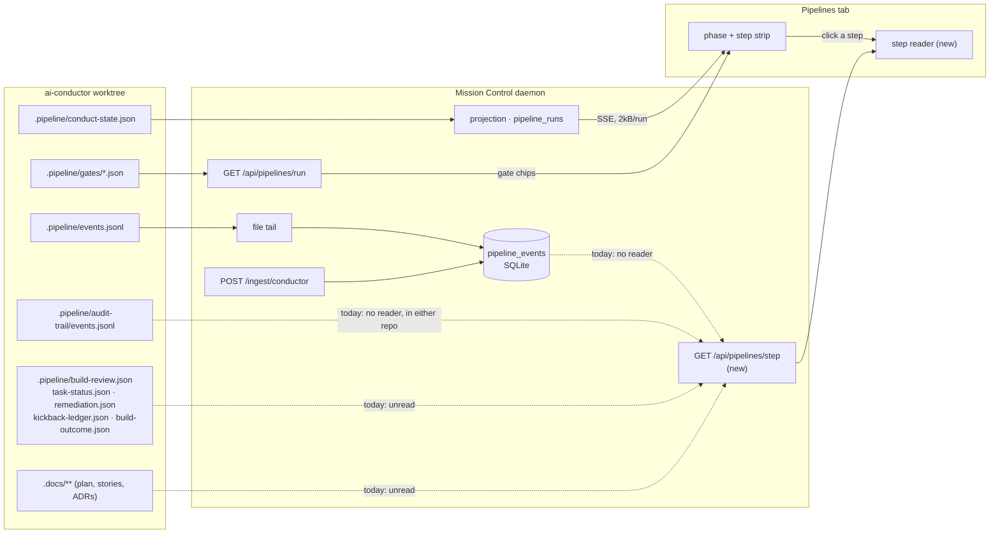

# Pipeline step drill-down: what actually happened in each phase

## The problem, stated exactly

The Pipelines tab works. It draws 24 steps across five phases, each carrying one word:
`Explore Skipped`, `Plan Done`, `Build Review Running`. That is a *status* projection, and it is
all there is. Click anything in the strip and nothing happens, because nothing is clickable.

Meanwhile, for the one run on this machine right now - `deploy-health-and-rds-connectivity`,
tier M, technical, 24 steps, 280 ledger events, halted in `build_review` - the engine has
written all of this down and Mission Control shows none of it:

| What the engine recorded | Where it is | Shown today |
|---|---|---|
| The review finding that halted the run - `out-of-plan-change`, a 90-word rationale, four `file:line` evidence locations | `.pipeline/build-review.json` | no |
| Each rubric's verdict - `scope FAIL`, `rootCause PASS`, `completeness PASS`, `tautology skipped: disabled` | same file | no |
| The engine's own prose account of a finished step - 3,573 characters for `acceptance_specs`, including a disposition table over 58 acceptance criteria | `step_completed.tail` in the event ledger | no |
| Why `build` retried, eleven times, each with its own reason, and that it escalated `sonnet/medium` → `sonnet/high` | `step_retry` in the ledger; `retry` in the audit trail | no |
| Why `test_suite` sent the run back to `build`, three times, reason quoted | `kickback.evidence`; `kickback` in the audit trail | no |
| **That a human was asked for a decision four times, and what they were asked** | `intervention` in the audit trail | no |
| **That a human cleared a halt five times, and when** | `halt_cleared` in the audit trail | no |
| Per-dispatch model, tokens, `costUsd`, `numTurns`, `durationMs` - 34 of them | `provider_attempt.tokenUsage` | one summed chip |
| 20 build tasks, each with a status and the files it touched | `.pipeline/task-status.json` | no |
| A remediation disposition with a four-clause rationale citing engine source lines | `.pipeline/remediation.json` | no |
| Narrative of six fixes, including "fixed a real bug: Alembic was building a fresh engine from a credential-less URL" | `.pipeline/build-outcome.json` `note[]` | no |
| The kickback ledger: gate, count, cumulative, `lastReason` | `.pipeline/kickback-ledger.json` | no |
| The plan, stories, ADRs, coherence mapping and conflict report DECIDE authored - 88 kB over 12 files | `.docs/**` | no |

Three of those rows are worse than merely missing.

**The build_review verdict is unreachable.** This run halted in `build_review`, and
`build_review` is one of the steps that writes no `gates/<step>.json`. The Gate verdicts section
- the tab's only evidence surface - is therefore silent about the one step that stopped the run.
The strip says `Build Review Running` and the reader below it has nothing to add.

**The event ledger is written and never read.** `pipeline_events` in
[`src/server/db.ts`](../../../src/server/db.ts) is populated by both observation paths, is
append-only, converges the file tail and the push plugin onto one row per event, and stores each
record verbatim. `pipelineEvents()` and `countPipelineEvents()` have no callers outside `db.ts`
and `test/`. No route serves them; no component reads them. It is, by the integration's own
documentation, *"the only thing this integration stores that is not re-derivable from the
engine's files"* - and nothing has ever displayed it. Which also means the visualizer plugin
currently buys an operator a faster tab and nothing else: it is the only path that can deliver
the 27 event kinds the engine never writes to disk, including `gate_verdict` itself, and there
is no surface on which any of them appear.

**The operator's own history is invisible.** `.pipeline/audit-trail/events.jsonl` carries 36
records for this run, each stamped with `origin` - the step - and `phase`: 13 `gate_pass`, 11
`retry`, 3 `kickback`, 5 `halt_cleared` and 4 `intervention`. Nothing reads it, in either
repository. The engine's own reference notes it has no TypeScript reader at all; only the
`retro` skill consults it, by prose.

## What this plan does

Three changes, no new storage, no new wire on the projection.

1. **Make the strip clickable.** `StageCard` and `ReviewerRow` in
   [`src/web/workflows/pipeline-bits.tsx`](../../../src/web/workflows/pipeline-bits.tsx) already
   take `onOpen` and `openLabel`, already render them as a real `<button>` wrapping the card's
   own title, and the workflow run monitor already uses them. `PipelineRunView` is the one
   caller that passes neither. Passing them changes no shared leaf, which is what the
   [Runs page contract](../../agent-guides/change-contracts.md#the-runs-pages-two-surfaces)
   requires: *"a new prop for one caller is a modification of the other's surface."* There is no
   new prop.

2. **Turn "Gate verdicts" into a step reader.** The section below the strip becomes where a
   selected step is read, and the strip's clicks focus it. This is the shape the workflow surface
   already has - `WorkflowRuns` clicks a stage or node in its strip and remounts the
   `Review worklist` section below with that node selected (`WorkflowRuns.tsx:2101-2163`). Same
   grammar, second surface, no new interaction idiom.

3. **Serve one step's evidence on the channel that already exists for it.** `PipelineRunDetail`
   is fetched on demand for the run somebody has open, precisely so evidence never rides the
   projection. A sibling read, `GET /api/pipelines/step`, answers for one step. The projection is
   untouched, so the 2 kB-per-run budget `test/pipeline-sse.test.ts` pins is untouched too.

The step is also addressable: `#/runs/pipeline/<repoKey>/<slug>/<step>`, built through
`pipelineRunRoute`/`pipelineRunHash` in `useWorkflowRoute.ts` as the route contract requires,
never by hand. A halted run's finding then has a link somebody can paste.

## Data flow: what gains a reader

Nothing new is written and no new producer appears. What changes is that two existing ledgers
gain their first reader, and the on-demand read widens from one file to a declared set.

The dotted edges are the whole change: four sources that exist and have no consumer become the
input to one new on-demand read, and the strip gains a click that asks for it.

## What a step reader shows

Five bands, ordered the way a person reads a step that went wrong. Every band degrades to
absent - a step with nothing recorded renders a sentence saying so, which is a real state for a
step that has not started.

**Each band is an optional field on one `PipelineStepDetail`, and that is load-bearing rather
than convenient.** Absence is already a state the reader must draw, so a band no phase has
implemented yet is indistinguishable from a band whose engine wrote nothing - which is what lets
[Decision 2](#decision-2---what-the-first-phase-covers) put bands 1 to 3 in the first phase and
bands 4 and 5 in later ones without either of them changing the contract. Every band below is
specified in full here regardless of which phase builds it.

### 1. Timeline

From `pipeline_events`, filtered to this step. Per row: the engine's own `type`, its `ts`, and
the fields that kind carries. The kinds worth naming, all observed in the live ledger:

- `step_started`, `step_completed` (`status`, `tail`), `step_failed` (`error`, `retryCount`)
- `step_retry`: `attempt`/`maxAttempts`, `reason`, `resolvedBefore`→`resolvedAfter`,
  `escalatedModel`, `escalatedEffort`
- `provider_attempt`: `provider`, `model`, and when `invoked` is true a `tokenUsage` carrying
  `input`, `output`, `cacheRead`, `cacheCreation`, `costUsd`, `numTurns`, `durationMs`
- `build_progress` (`resolved`/`total`, `tickReason`, `headMoved`, `commitCount`),
  `build_no_progress`, `build_stall` (`reason`)
- `kickback` (`from`, `to`, `evidence`, `count`), `loop_halt` (`reason`, `prUrl`)
- `parallel_started`/`parallel_completed` (`branches`), `deprecated_step` (`adr`),
  `session_policy` (`reason`), `acceptance_red` (`state`)
- `build_review_rubric_started` / `_result` (`verdict`) / `_skipped` / `_prompt` /
  `_infrastructure_failure` (`reason`), `build_review_repair_context` (`disposition`),
  `build_review_cache_hit`
- **`tier_skip` (`step`, `tier`), `config_skip`, `mode_skip` (`mode`, `reason`), `when_skip`
  (`expression`, `undefinedKey`).** All four are `persist: true` in the engine's own
  `EVENT_SINKS`, so `Skipped` can finally say *why*: tier S, track technical, disabled in
  config, or a `when:` expression that evaluated false.

An unrecognised kind still draws a row: its `type`, its `ts`, and its record. Mission Control
keeps no copy of the engine's event union - about 90 members, unversioned, TypeScript-only - and
the ledger already stores every kind verbatim for that reason. The reader inherits the same
posture, so a conductor release that adds an event kind adds a row rather than breaking a page.

### 2. Gate history and operator actions

From `.pipeline/audit-trail/events.jsonl`, whose `AuditRecord` shape is
`{ origin, phase, event, reason?, cause?, attempt?, at, … }` - `origin` **is** the step, so this
ledger needs no attribution rule at all.

It answers four questions nothing else can:

- **Every gate occurrence, not just the last one.** `gate_verdict` is `persist: false` in
  `EVENT_SINKS`, so it never reaches `events.jsonl`, and `gates/<step>.json` is overwritten on
  each check. The audit trail's `gate_pass`/`gate_fail` records are the only durable per-
  occurrence history a run has. For this run that is 13 `gate_pass` records where the gate files
  show four current verdicts.
- **Why a human was asked.** 4 × `intervention`, `cause` carrying the question verbatim -
  including *"Need user decision: `.ai-conductor/config.yml` is missing project-wide … test_suite
  verification cannot proceed"*.
- **That a human answered.** 5 × `halt_cleared` with `cause: "operator"` and a timestamp. The tab
  today shows the *current* halt and says nothing about the five a person already cleared.
- **Retries and kickbacks with their reasons**, cross-checkable against the event ledger.

### 3. Outcome

The step's own account of itself, which is the highest-value thing in the whole inventory and is
pure markdown the engine already wrote:

- `step_completed.tail`, rendered through the existing `Markdown` component. For
  `acceptance_specs` in the live run this is a disposition pass over 58 acceptance criteria with
  a summary table; for `build` it is a bulleted list of the six fixes that landed, naming a real
  bug that was found and how it was verified.
- the `step_retry` reason and escalation, when the step went round again
- the gate verdict for the step, from the `gates` array `PipelineRunDetail` already carries
- kickbacks in and out, with `evidence` quoted

### 4. Findings

Read from the engine's files at request time, per step, with a declared reader per file. Each is
versioned or parsed by a named engine symbol, so the reader has something stable to key on:

| Step | File | What is read |
|---|---|---|
| `build_review` | `.pipeline/build-review.json` (`aggregateVersion: "v1"`) | `verdict`, `coverage`, per-rubric `findings[]`: `concernKind`, `summary`, `evidenceLocations[]`, `anchor` |
| `build_review` | `.pipeline/build-review-dispositions.json` (`version: "v1"`) | accepted risk: `summary`, `rationale`, `operator`, `acceptedAt` |
| `build` | `.pipeline/task-status.json` | `plan_ref` and per-task `id`, `name`, `status`, `files[]` |
| `build` | `.pipeline/build-outcome.json` (`version: 1`) | per-lap `outcome`, `terminalOutcome`, `gate`, `rung` (`model`/`effort`), `treeBefore`→`treeAfter`, `note[]`, `category` |
| `build` | `.pipeline/audit-trail/batch-N/review.json` | the code-review evaluator's verdict and findings per batch |
| `test_suite` | `.pipeline/test-suite-evidence.json` (`version: 3`) | `outcome`, `reason`, `command`, `durationMs`, `exitCode`, bounded `stdout`/`stderr` |
| `acceptance_specs` | `.pipeline/acceptance-specs-red.json`, `acceptance-specs-dispositions.md` | RED evidence and the per-criterion dispositions |
| `remediate` | `.pipeline/remediation.json` | `dispositions[]`: `id`, `disposition`, `category`, `rationale`, `tasks[]` |
| `prd_audit` | `.pipeline/prd-audit.md` | the `FR / Verdict / Gap-class / Evidence / Accepted?` table |
| `manual_test` | `.pipeline/manual-test-results.md` | the latest `## Attempt N` region |
| `architecture_review_as_built` | `.pipeline/architecture-review-as-built.md` | the `Verdict:` line and body |
| `assess` | `.pipeline/assessment/cto-*.md` | the nine specialist reports, listed |
| any step | `.pipeline/verify-claims-<step>.md` | the assumption ledger: claims with confidence, load-bearing assumptions, operator approval status |
| any gate | `.pipeline/kickback-ledger.json` (`version: 1`) | per-gate `count`, `cumulative`, `lastReason`, `priorVerdict` |

A file whose version this build does not know is reported as *recorded, and not readable by this
build* rather than as an error or as absent. That is the same tolerance rule the step table
already runs under, applied to a second frozen contract. A file that is simply not there - and
most of these are optional, tier-dependent or skill-dependent; `verify-claims-*.md`,
`summary.json` and `fr-coverage.md` are all absent from the live run - contributes no band.

### 5. Artifacts

The files the step authored, as a list of path, size and modified time - not inlined. Resolved
from a frozen copy of ai-conductor's own `STEP_ARTIFACT_CONTRACTS`
(`src/conductor/src/engine/artifacts.ts`), which is a
`Record<StepName, readonly ArtifactPatternContract[]>` and the engine's authored source of truth
for exactly this question:

| Step | Pattern | Scope |
|---|---|---|
| `plan` | `.docs/plans/*.md` | feature, plan-stem |
| `stories` | `.docs/stories/**/*.md` | feature, normalized-stem |
| `prd` | `.docs/specs/*.md` | feature, normalized-stem |
| `conflict_check` | `.docs/conflicts/*.md` | feature |
| `coherence_check` | `.docs/coherence/*.md` | feature, plan-stem |
| `architecture_review` | `.docs/decisions/architecture-review-*.md`, `.docs/decisions/adr-*.md` | feature, repository |
| `architecture_diagram` | `.docs/architecture/*.md` | repository |
| `assess` | `.docs/decisions/technical-assessment-*.md` | repository |
| `retro` | `.docs/retros/*.md` | feature |
| `manual_test`, `prd_audit`, `architecture_review_as_built` | `.pipeline/*.md` | run |

Opened rather than inlined, because the plan alone is 25 kB and the existing file viewer
(`FileWorkspace` / `FileWindow`, reached through `readSessionFile`'s containment check) is
already the surface for reading a file in a checkout. Copying that job into the step reader
would be a second file viewer.

Two caveats, stated rather than discovered:

- **The contract is the engine's *verification* map, not an exhaustive output list.** Steps
  whose entry is empty still write things. `.docs/complexity/<slug>.md` (`Tier: S|M|L`),
  `.docs/track/<slug>.md` (`Track: product|technical`) and `.docs/intake/<plan-stem>.md`
  (`Source-Ref:`, `Owner:`) are the engineer loop's markers, each with a named parser
  (`parseComplexityTier`, `parseTrack`, `parseIntakeSourceRef`), and they belong to
  `complexity`, `explore` and intake respectively. They are worth listing under those steps
  precisely because the frozen contract does not.
- **Several patterns are repository-scoped.** An ADR list under `architecture_review` is the
  repository's ADRs, not only this feature's. The engine's contract marks the scope, so the
  reader carries the label rather than implying the feature authored all of them.

## How an event reaches a step

This is the correctness core of the feature, and a naive rule gets it wrong. In the live ledger,
217 of 280 records carry an explicit `step`. The other 63 do not, and they are not noise - they
include every `build_review_*` record and every `kickback`.

Three rules, applied in order:

1. **The record's own `step` field**, when it has one.
2. **A declared table for the kinds that carry none.** `build_review_rubric_*`,
   `build_review_repair_context` and `build_review_cache_hit` belong to `build_review`.
   `kickback` belongs to its `from` step, and is cross-listed under each step in its `to`.
3. **The step of the last step-bearing record before it**, marked *inferred* in the row.

Rule 2 exists because rule 3 alone is demonstrably wrong, and the live ledger proves it: both
`kickback` records in that run fold to `wiring_check`, because
`parallel_started {step: "wiring_check", branches: ["wiring_check", "test_suite"]}` was the last
step-bearing record before them - while the kickbacks themselves say
`from: "test_suite", to: "build"`. A linear fold cannot be right across a parallel branch, so
the kinds that matter are declared rather than inferred. Checked over the same ledger, rules 1
and 2 place all 280 records and misfile none; rule 3 is the tolerance path for a kind nobody
here has read yet, and it says so in the row rather than pretending to know.

The audit trail needs none of this. Its `origin` field is the step, by construction.

## The frozen step table gains display copy, not authority

`PipelineStepInfo` copies five fields out of the engine's `StepDefinition`: `name`, `label`,
`phase`, `outOfBand`, `deprecated`. Two more are pure display copy and answer questions a step
reader is asked immediately:

- **`enforcement`** - `structural` | `advisory` | `gating`. Whether a failure here stops the run
  is the first thing somebody wants to know about a step that failed.
- **`prerequisites`** - what the step waited on. `build_review` waits on `wiring_check` and
  `test_suite`; saying so explains the parallel branch the timeline shows.

Both stay under the same rule as the rest of that table: *a display aid, never an authority*.
Nothing refuses a step for disagreeing with it, and a copy that has fallen behind a conductor
release makes one line stale and changes no behaviour.

**Custom steps are real and must not break this.** `buildStepRegistry(config)` splices
config-declared steps into `ALL_STEPS` by an `after:` key - ai-conductor's own config adds
`maintain-documentation` and `release-disposition` to SHIP. So the step set is not 26 and cannot
be frozen as though it were. A custom step already draws under the strip's Unknown steps card;
in the reader it gets a full timeline (its events carry its name) and no artifact list, which is
correct rather than degraded - its completion artifact is declared in the operator's own config,
not in any contract this build could copy.

## Where the work lands

| Layer | File | Change |
|---|---|---|
| shared | `src/shared/pipeline.ts` | `PipelineStepDetail` and its parts; `enforcement` and `prerequisites` on `PipelineStepInfo`; a frozen `PIPELINE_STEP_ARTIFACTS` copy; the step-attribution table. `PipelineRun` and `PipelineStep` are **not** touched. |
| server | `src/server/pipelines/conductor/state.ts` | readers for the audit trail, `build-review.json`, `task-status.json`, `build-outcome.json`, `remediation.json`, `kickback-ledger.json`, `test-suite-evidence.json` and the markdown reports, plus artifact resolution. Same total, never-throwing, byte-capped posture as every reader already there. |
| server | `src/server/pipelines/conductor/index.ts` | `readConductorStepDetail`, beside `readConductorRunDetail`, finding the worktree by listing rather than path-joining - the traversal guard that is already there. |
| server | `src/server/pipelines/types.ts` | `readStepDetail` on `PipelineProvider`, so a second provider cannot compile without one. |
| server | `src/server/pipelines/index.ts` | `readPipelineStepDetail`, behind the same live consent check `readPipelineRunDetail` uses. |
| server | `src/server/db.ts` | nothing. `pipelineEvents()` already exists and already does this. |
| server | `src/server/routes.ts` | `GET /api/pipelines/step`. |
| web | `src/web/pipelines/PipelineRunView.tsx` | `onOpen`/`openLabel` on the phase card and each step row; `GateVerdicts` becomes the step reader. |
| web | `src/web/pipelines/usePipelineStepDetail.ts` | the fetch, generation-guarded, keyed on run + step + `updatedAt`, exactly as `usePipelineRunDetail` is. |
| web | `src/web/workflows/useWorkflowRoute.ts` | the optional step segment on the pipeline run hash. |
| web | `src/web/pipelines/PipelineLadder.tsx` | the session pane's step rows gain the same click, opening the run in Runs at that step. |
| web | `src/web/styles.css` | under the `pipelines-` prefix only. |
| docs | `docs/pipelines.md` | the reader, the attribution rule, and the ledger's first consumer. |
| docs | `docs/agent-guides/change-contracts.md` | the step-detail channel beside the run-detail one. |

## Tests

- `e2e/specs/pipeline-step-detail.spec.ts` - the required Playwright spec. `seedConductorRun` in
  `e2e/fixtures/conductor.ts` already writes `conduct-state.json`, `gates/`, `HALT` and
  `events.jsonl`; it gains the audit trail and the richer `.pipeline/*.json` files. The spec
  clicks a step in the strip and asserts the reader shows that step's finding, its retry reason,
  and its dispatch model - by role and label, never by `data-testid`.
- `test/pipeline-step-attribution.test.ts` - the three rules, including the parallel-branch case
  that makes rule 2 necessary.
- `test/pipeline-step-detail.test.ts` - each file reader against a fixture tree, plus an unknown
  `aggregateVersion` degrading rather than throwing, plus a custom step resolving to a timeline
  and no artifacts.
- `test/pipeline-http.test.ts` - the route: consent refused, unknown step, unknown run.
- `test/pipeline-sse.test.ts` - unchanged and must stay green. It is the proof the projection did
  not grow.
- `e2e/specs/runs-workflows-unchanged.spec.ts` - unchanged and must stay green. It is the proof
  the shared leaves were not modified.

## What this does not do

- **No new persistence.** `db.ts` states the prohibition directly: the projection is a cache of
  the engine's files, and *"a label, an annotation or an operator's own note would be lost the
  first time the projection was rebuilt, which is why none may be added."* Every band here is
  read-through.
- **No engine writes.** Mission Control reads; it mutates only by spawning `conduct-ts`.
- **No change to the ingest envelope.** `ConductorIngestEnvelopeSchema` is frozen and already
  carries the whole event verbatim. The plugin needs no new version for any of this - and this
  is the first feature that makes installing it worth anything beyond latency.
- **No change to the shared strip leaves**, and therefore no change to the workflow surface.
- **No widening of `PipelineRun`.**

## Known limits, stated rather than discovered later

- **The ledger is capped at 2000 events per run, newest kept.** A long run's earliest steps can
  lose their timeline. The live run used 280 events across 24 steps, so the cap is far from the
  common case - but a step whose events were retired says so instead of drawing an empty
  timeline.
- **Both ledgers start where they start.** `pipeline_events` begins when observation begins, and
  the engine's own `events.jsonl` begins when the *run* begins - so a feature whose DECIDE phase
  ran in an earlier session has file-derived evidence and no timeline for those steps. That is
  exactly the live run's shape: its ledger opens at `step_started acceptance_specs index 11`.
  The reader says which steps it has no timeline for rather than drawing them as empty.
- **The audit trail and the event ledger are retired with the worktree.** Both live under
  `.pipeline/`, so a torn-down worktree takes its history with it. Decision 3 below adopts
  reading on demand and accepts that cost, which is the cost today's gate files already carry;
  it also records the tailing alternative as a self-contained later phase rather than a fork.
- **Artifacts are listed, not versioned.** A file the engine has since rewritten is shown as it
  is now. There is no per-step snapshot on disk to show instead.

## Decisions

Three choices decide the component boundary and the read architecture. Each is **recorded here
with an adopted option that binds implementation**, so a phase owner has one thing to build and
not a fork to guess at.

**Provenance, stated plainly so nobody reads more into it than is there.** These are the plan
author's adopted defaults, not the operator's selections. The choices were put to the operator
twice through `request_plan_decisions`; both requests timed out with no submission, so nothing
was selected and nothing is recorded as selected. They bind implementation because a plan that
leaves them open is not executable - not because a human has ratified them. Each carries the
bounded alternative and its blast radius, so a later operator reversal is a scoped change with a
known cost rather than a redesign.

### What makes all three safe to bind now

One invariant, and it is the reason the read architecture does not depend on any of them:

> `PipelineStepDetail` is defined **once**, with every band an optional field. A band a phase
> has not implemented is *absent*, which is already a state the reader must render - a step with
> nothing recorded is an ordinary state, not an error. So adding a band later is an additive
> field on a shape that already tolerates its absence, never a change to the contract.

That is what separates the three: **one of them touches the architecture and two do not.**

### Decision 1 - reader placement

**Adopted: a section below the strip, focused by the click.** It matches the workflow runs page,
which already focuses its `Review worklist` from strip clicks (`WorkflowRuns.tsx:2101-2163`), so
the pipelines surface gains no interaction idiom of its own.

*Not an architecture decision.* The reader is a pure renderer over `PipelineStepDetail`;
placement decides only where it mounts.

| Alternative | What changes if the operator reverses this |
|---|---|
| Drawer beside the strip | `PipelineRunView.tsx`, a new drawer frame under the `pipelines-` prefix, the `styles.css` block, and the e2e spec's selectors. |
| Full overlay | The above, plus a new id in `OVERLAY_IDS` and an `Overlay` registration. |
| Inline in the strip | The above, plus a layout answer for a 3 kB markdown tail inside a card that is one of six in a horizontally scrolling frame. Rejected on that ground, not on preference. |

Untouched in every case: `PipelineStepDetail`, `usePipelineStepDetail`, the route, the server
readers, the shared types, and `test/pipeline-sse.test.ts`.

### Decision 2 - what the first phase covers

**Adopted: bands 1, 2 and 3** - Timeline, Gate history and operator actions, and Outcome. Those
read only the two ledgers that already exist and have no reader, so the first phase adds **no
new file readers at all** and still delivers `step_completed.tail`, retries with escalations,
kickback reasons, per-dispatch cost, skip reasons, interventions and halt clears.

Bands 4 (Findings) and 5 (Artifacts) are **later phases, not descoped work.** Each is a set of
independent file readers behind an optional field, so each lands on its own without touching
what shipped before it.

*Not an architecture decision.* It is phase ordering, and the invariant above is what makes it
so: a phase that does not implement band 4 leaves `findings` absent, and the reader renders that
exactly as it renders a step whose engine wrote no findings.

| Alternative | What changes if the operator reverses this |
|---|---|
| Bands 1 and 3 only | Drop the audit-trail reader from phase 1. The gate-history band goes absent; every gate occurrence and every operator action stays invisible until a later phase. |
| Also band 4 | Phase 1 additionally carries six version-tolerant file readers and their tests. Larger phase, same contract. |
| Also band 5 | The above, plus the frozen `PIPELINE_STEP_ARTIFACTS` copy and the file-viewer wiring. |

### Decision 3 - audit-trail retention

**Adopted: read on demand, like the gate files.** No new storage, no cursor column, no retention
path, no migration. It keeps the rule `db.ts` states - the projection is a cache of the engine's
files and may store nothing the engine did not write down - which is the rule the whole
read-through design rests on.

**This is the one decision that touches the architecture, and exactly one invariant of it.** The
cost is named rather than hidden: the audit trail lives under `.pipeline/`, so a worktree the
engine tears down takes its gate history, its interventions and its halt clears with it. Today's
gate files behave identically, so this loses nothing that is currently kept.

| Alternative | What changes if the operator reverses this |
|---|---|
| Tail it into `pipeline_events` | A second cursor column on `pipeline_runs` and its migration, a second retention path paired to run retirement, and a fingerprint rule for a record shape that carries no `type`. |

**Reversing it does not fork this plan, and that is the point.** The band's shape on
`PipelineStepDetail` is identical either way - `origin`, `phase`, `event`, `reason`, `cause`,
`attempt`, `at` - because that is the engine's `AuditRecord` and not a choice this plan makes.
Only *where the server reads it from* moves. So the tailing alternative is a self-contained later
phase that changes one reader and no contract, no route and no component.

### The standing rule for every phase owner

Any later change to one of these three is a change to **this file first**. A phase that
implements a different option than the one recorded above, without this section being updated to
record it, is the incompatibility this section exists to prevent.
