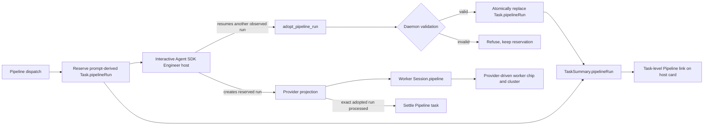

# Pipeline Task Run Adoption and Card Visibility

## Outcome

Mission Control will show the Pipeline run owned by a Pipeline task on its managed Engineer host card without making that host look provider-driven or disabling its composer. If Engineer resumes an existing run whose slug differs from the prompt-derived reservation, the host will explicitly adopt that observed run through a launch-bound Mission MCP handshake. The adopted run then becomes the task's durable completion key.

This change is contained in `ai-harness`. It does not require AI Conductor source changes because Mission Control can supply the handshake tool and the run-adoption instruction as part of the managed Engineer launch contract.

## Why one phase

The handshake, durable task binding, session projection, and card link are one lifecycle contract. Shipping only the chip would advertise the wrong prompt-derived run, while shipping only adoption would leave the operator unable to see the repaired relationship. The estimated non-test change is about 315 lines, so the smallest safe delivery is one atomic phase.

- Phase 1: [Adopt and surface the task-owned Pipeline run](phase-1-adopt-and-surface-pipeline-run.md)
- Execution summary: [phased-plan.md](phased-plan.md)

## Confirmed current state

- Managed Pipeline dispatch persists a prompt-derived `Task.pipelineRun` before the Agent SDK Engineer host starts. `src/server/dispatcher.ts`, `src/server/pipelines/index.ts`
- The Agent SDK host is directly bound through `Task.sessionId`, but intentionally has `Session.pipeline = null`. That keeps the host interactive and prevents process-owned Pipeline copy from appearing on it. `src/server/dispatcher.ts`, `src/shared/types.ts`
- Provider worker sessions receive `Session.pipeline` from process, worktree, and projection evidence. The current `PipelineChip` correctly describes those sessions as externally driven and non-interactive. `src/server/registry.ts`, `src/web/components/session-bits.tsx`
- `TaskSummary` omits `pipelineRun`, so the directly bound Engineer host card cannot show the task-owned run even though the task row has it. `src/shared/types.ts`, `src/server/registry.ts`
- `TaskManager.bindPipelineTask` accepts an initial strong terminal-resource join, but refuses every mismatch after prebinding. An Engineer host that resumes an existing run therefore leaves the task bound to a run that may never exist. `src/server/tasks.ts`
- Provider completion settles only the exact `Task.pipelineRun` key. Processing the resumed run cannot settle a task still bound to the prompt-derived slug. `src/server/tasks.ts`
- The current Board and Console surfaces are `SessionTile`, `RailRow`, and `ConsoleDetail`; the older `SessionCard` surface no longer exists on `main`. `src/web/components/layouts/`

## Product and architecture decisions

1. Keep two ownership concepts separate:
   - `Session.pipeline` means an external provider is driving this process.
   - `TaskSummary.pipelineRun` means this task owns or plans to own this provider run.
2. Never stamp the Agent SDK Engineer host with `Session.pipeline`. Its composer and ordinary session controls remain available.
3. Add a separate task-level Pipeline affordance on Board tile, rail row, and Console detail. Its copy says the task continues in or plans a run. It must not reuse the worker chip's "this agent reads no input" semantics.
4. Add a launch-bound `adopt_pipeline_run` Mission MCP tool for managed Pipeline hosts. The agent supplies only the actual observed slug. Mission Control derives the task, repository, provider, and calling session from daemon-issued launch context.
5. The adoption write is a guarded compare-and-swap:
   - the caller is the live SDK host bound to the active Pipeline task;
   - the target slug exists in the provider projection for the task repository and provider;
   - no other active Pipeline task owns the target;
   - the current reservation is either the same target or is absent from the provider projection;
   - replaying the same adoption is idempotent.
6. Do not infer adoption from prompt text, task title, transcript prose, PR URLs, or "the only run in the repository." Those are hints, not ownership proof.
7. Reuse the same guarded adoption primitive for the existing Terminal path only when the daemon has the current strong terminal-home plus projected-worktree proof. This preserves Terminal recovery without weakening the prebound mismatch guard.
8. Provider projection remains the only completion authority. Adoption changes the exact key it watches; it does not let the host or MCP tool mark the task done.
9. A stale MCP bundle is a dispatch failure for managed Pipeline tasks. The dispatcher must verify that the registered bundle publishes the required adoption tool before it starts the host.

## Target data flow



The two visual paths are deliberately parallel. The host card reads task ownership from `TaskSummary`; the worker card reads process ownership from `Session.pipeline`.

## Implementation surfaces

| Surface | Planned change |
| --- | --- |
| `src/shared/types.ts` | Add nullable `pipelineRun` to `TaskSummary` with task-ownership semantics. |
| `src/shared/protocol.ts` | Define the launch-attributed MCP adoption request. The tool input exposes only `slug`; task and repository identity are bridge-added. |
| `src/server/mission-mcp.ts` | Register the tool name, make it required for Pipeline managed hosts, and preserve source-versus-bundle drift checks. |
| `src/mcp/server.ts` | Register `adopt_pipeline_run`, read the daemon-issued launch task identity from environment, and forward caller evidence plus slug. |
| `src/server/dispatcher.ts` | Inject scoped task identity into the managed host's MCP descriptor, verify the adoption tool exists, and append hidden run-adoption instructions while preserving the human-visible intent. |
| `src/server/routes.ts` | Authenticate and attribute the MCP request, then delegate to the task lifecycle owner. |
| `src/server/tasks.ts` | Add the guarded adoption primitive, reuse it for strong Terminal mismatch evidence, persist the link, refresh projections, and immediately reconcile an already-processed target. |
| `src/server/registry.ts` | Project `Task.pipelineRun` through `TaskSummary` without changing `Session.pipeline`. |
| `src/web/components/session-bits.tsx` | Add task-owned Pipeline link variants with copy distinct from the provider-driven worker chip. |
| `src/web/components/layouts/SessionTile.tsx` | Render the task-level mark on the Board tile. |
| `src/web/components/layouts/RailRow.tsx` | Render a compact task-level run mark in the rail. |
| `src/web/components/layouts/ConsoleDetail.tsx` and `types.ts` | Render the task-level chip and accept the base `PipelineRunLink` navigation type. |
| `docs/pipelines.md` | Document planned versus adopted task links, the managed adoption handshake, and unchanged worker ownership semantics. |

## Failure behavior

- Missing or stale adoption tool: fail the managed dispatch before host launch with a rebuild/action message.
- Unknown target slug: return a conflict and leave the reservation untouched.
- Target owned by another active task: return a conflict naming the collision without exposing a reassignment path.
- Current reserved run already exists: refuse replacement. A live reservation cannot be silently abandoned.
- Caller not the task's live managed host: return forbidden.
- Persistence failure: return failure, keep the old durable binding, and allow a safe retry.
- Target already processed: adopt idempotently and immediately run the ordinary provider settlement path.

## Verification

Implementation begins by reproducing the end-user failure in the built dashboard using the fake Agent SDK and fake Conductor fixtures. The regression must prove:

- A managed Pipeline task's Engineer host card shows its task-owned run while remaining interactive.
- The task-level chip has different accessible copy from a provider-driven worker chip.
- A host can adopt an existing halted run with a different slug through the launch-bound tool.
- After adoption, every host surface links to the existing run, not the prompt-derived reservation.
- The worker still clusters and renders from `Session.pipeline`; the host does not join that cluster.
- Processing the adopted run settles the task and surfaces the provider outcome.
- Unknown, live-reservation, cross-task, cross-repository, stale-session, and replay cases follow the failure rules above.

Focused tests should cover the schema, bundle registry, dispatcher prompt and scoped MCP environment, route attribution, compare-and-swap rules, TaskSummary projection, and markup semantics. Browser coverage belongs in `e2e/specs/conductor-loops.spec.ts` and must drive the built app. Visually inspect desktop and narrow Board/Console layouts.

Run focused tests first, then:

```sh
npm run typecheck
npm run lint
npm test
npm run build
npm run smoke
npx playwright test e2e/specs/conductor-loops.spec.ts
```

## Acceptance criteria

- The interactive Agent SDK Engineer host displays the Pipeline run owned by its task.
- The host remains messageable because `Session.pipeline` stays null.
- Resuming an existing observed run replaces the prompt-derived reservation only through the authenticated guarded handshake.
- A completed adopted run settles the Pipeline task through the existing provider projection.
- Provider worker sessions retain their current Pipeline chip, clustering, and no-input semantics.
- No title, transcript, PR, or singleton-run heuristic can rebind a task.
- Terminal recovery may rebind only through the existing strong terminal-resource and projected-worktree proof.
- The built browser journey and focused lifecycle tests cover both success and refusal paths.
- Documentation matches the shipped behavior.

## Out of scope

- Modifying AI Conductor skills or daemon behavior.
- Changing Conductor's downstream model, provider, effort, or supervision.
- Making Pipeline tasks multi-repository.
- Adding manual run selection to Dispatch.
- Letting operators reassign a live reservation from the dashboard.
- Changing Pipeline cancellation, Foreman automation, or provider completion rules.
- Replacing the existing worker `PipelineChip` semantics.

## Estimated size

| Area | Non-test LOC |
| --- | ---: |
| Shared task and MCP contracts | 45 |
| Mission MCP tool and launch attribution | 70 |
| Guarded adoption and dispatcher integration | 105 |
| TaskSummary projection and three UI surfaces | 75 |
| Documentation | 20 |
| **Estimated total** | **315** |

Test code is expected to add roughly 280 to 380 lines across lifecycle, MCP, rendering, and Playwright coverage.
